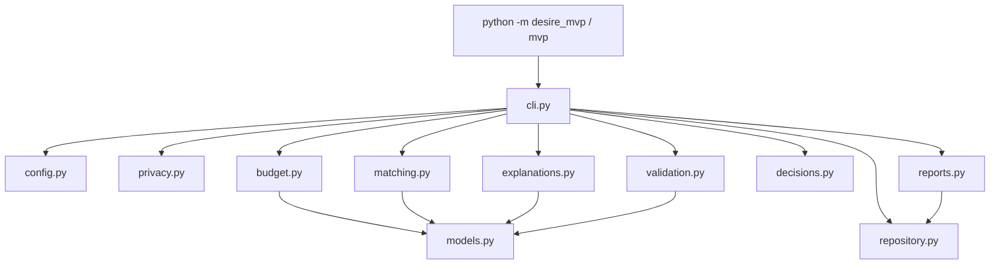
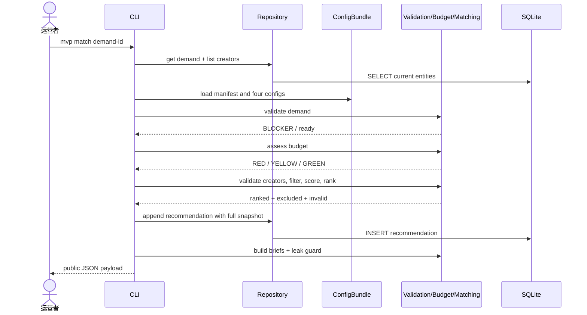

# 当前 MVP 架构

> 状态：本页描述仓库中已经实现的 `mvp/`，不包含目标平台能力。

## 运行模型

MVP 是一个单进程 Python 3.9+ 命令行应用。一次命令完成参数解析、加载配置、读取或写入 SQLite、输出 JSON/Markdown，然后退出。没有常驻服务、网络端口、后台任务或多用户并发控制。



## 模块职责

| 模块 | 稳定边界 | 主要入口 |
| --- | --- | --- |
| `cli.py` | 用例编排、参数与面向运营者的错误 | `build_parser`, `cmd_*`, `main` |
| `config.py` | manifest 驱动的规则加载和版本一致性 | `load_config`, `ConfigBundle.rule_version` |
| `validation.py` | 需求、创作者、结果的结构与业务门槛 | `validate_demand`, `validate_creator`, `validate_outcome` |
| `budget.py` | 预算基线、风险缓冲和健康度 | `assess_budget` |
| `matching.py` | 硬过滤、六个分项、确定性排序 | `filter_candidate`, `score_candidate`, `rank_candidates` |
| `explanations.py` | 将得分证据变成可分享说明 | `explain_candidate`, `brief_to_markdown` |
| `privacy.py` | 身份字段拦截与私密值泄漏防护 | `find_prohibited_identity_fields`, `assert_external_output_safe` |
| `decisions.py` | 邀请、反馈、最终选择和原因约束 | `validate_decision`, `is_override` |
| `repository.py` | SQLite schema、当前资料与追加证据 | `Repository` |
| `reports.py` | 批次聚合及 Markdown/CSV 输出 | `build_pilot_report`, `report_to_*` |
| `models.py` | 进程内不可变结果数据类 | `ValidationResult`, `BudgetAssessment`, `MatchScore`, `MatchBrief` |

模块没有隐藏的依赖注入容器。计算函数接收普通字典与显式配置，便于用固定样例做确定性测试。

## 命令编排

### 导入

`cmd_import` 读取 JSON 对象或数组，递归查找 `name/email/phone/wechat/address` 等身份键；发现任何一个便拒绝整个命令。通过后按 `(kind, id)` 更新 `entities` 当前资料。

### 匹配



门槛失败时，不会写入推荐。推荐落库发生在生成对外说明之前；若说明泄漏保护随后失败，数据库仍保留该推荐快照，但 CLI 返回错误。这个行为保留内部证据，却意味着运营者不得把失败输出视为可分享材料。

### 解释与决定

`explain` 始终读取某需求最新的推荐快照，而不是当前 `entities`。这样更新创作者资料后仍能解释当时的分数。`decision` 同样绑定推荐 ID，并拒绝任何不在合格排序中的邀请或选择。

### 结果与报告

`outcome` 先验证完整性，再按 `project_id` 写入或更新；退出访谈可以补齐结果。`report` 读取某一 `pilot_id` 的推荐、决定和结果，使用每个需求的最新记录汇总指标，再输出 Markdown 和扁平 CSV。

## 存储语义

| 表 | 写入模型 | 用途 |
| --- | --- | --- |
| `entities` | 按 `(kind, entity_id)` upsert | 当前需求与创作者档案 |
| `recommendations` | 只追加 | 规则版本、完整输入、预算、过滤与排序证据 |
| `decisions` | 只追加 | 实际邀请、反馈、选择和人工原因 |
| `outcomes` | 按 `project_id` upsert | 项目完成、退出或失败结果 |

每次数据库连接开启外键检查。推荐到决定存在外键，但当前没有数据库级联删除策略；执行参与者删除请求时必须同时处理 JSON 快照，而不只删除 `entities`。

## 配置加载

`manifest.json` 固定 taxonomy、matching、budget 和 reason codes 的文件名与声明版本。`.yaml` 文件使用 JSON 语法，这是 YAML 1.2 的子集，可由标准库 `json` 解析，从而保持零运行时依赖。加载时任一文件缺失、格式错误或版本与 manifest 不一致都会中止命令。

复合规则版本按以下顺序拼接：

```text
taxonomy-v1+matching-v1+budget-v1+reason-codes-v1
```

## 错误与退出码

- 成功：退出码 `0`；
- 资料校验未就绪：`validate` 输出结构化结果后退出 `1`；
- CLI、配置、决定、键查找或值错误：向标准错误输出中文说明并退出 `2`；
- 未捕获的编程错误：保留 Python traceback，供开发者修复。

调用者不能只解析文字判断成功，应检查退出码。脚本化使用时，业务结果优先选择 JSON 输出。

## 当前限制

- SQLite 适合单运营者，不提供多进程写入编排、账户授权或远程访问；
- 输入使用手写 JSON，没有正式 JSON Schema 或迁移版本；
- `entities` 更新不保存历史版本，只有推荐快照保留当时输入；
- 泄漏检测依赖字段名和私密值字符串，无法识别所有语义性身份泄漏；
- 预算基线是发起人假设，尚未由真实市场数据校准；
- 排序使用精确标签，不支持同义词、自然语言或跨领域迁移能力；
- 外部协议、资金与交付状态不能自动核实；
- 没有平台级认证、审计导出、加密密钥管理、可观测性或灾备自动化。

这些限制是首轮范围选择，不应被静默“修补”为复杂平台。是否产品化应由[演进路线](/development/roadmap.md)中的证据门槛决定。
