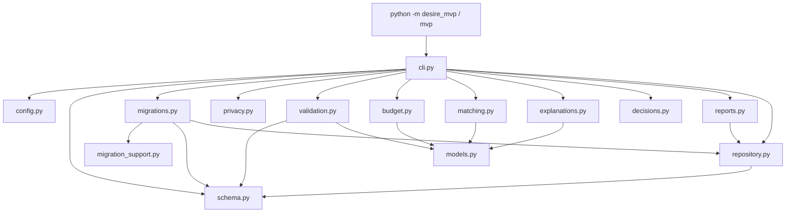
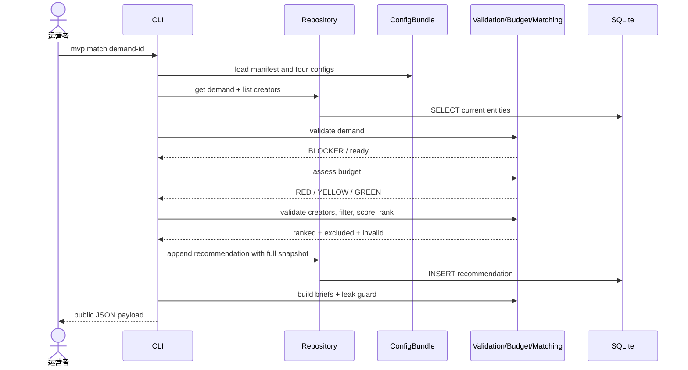

# 当前 MVP 架构

> 状态：本页描述仓库中已经实现的 `mvp/`，不包含目标平台能力。

## 运行模型

MVP 是一个单进程 Python 3.9+ 命令行应用。一次命令完成参数解析、加载配置、读取或写入 SQLite、输出 JSON/Markdown，然后退出。没有常驻服务、网络端口、后台任务或多用户并发控制。



## 模块职责

| 模块 | 稳定边界 | 主要入口 |
| --- | --- | --- |
| `cli.py` | 用例编排、参数与面向运营者的错误 | `build_parser`, `cmd_*`, `main` |
| `config.py` | manifest 驱动的规则加载和版本一致性 | `load_config`, `ConfigBundle.rule_version` |
| `schema.py` | 公开 v1 JSON Schema 的运行时镜像、严格版本、固定跨字段与受控引用 contract | `validate_schema_version`, `validate_payload_contract` |
| `migration_support.py` | 数据库/资料版本、冻结 legacy DDL、migration descriptor 与历史 append-once 触发器 | `frozen_legacy_variant`, `MIGRATION_DESCRIPTORS`, `MIGRATION_HISTORY_TRIGGER_DEFINITIONS` |
| `migrations.py` | v0→v1 纯转换、迁移计划、锁、单事务 apply、备份和隔离恢复 | `migrate_record_v0_to_v1`, `MigrationRunner`, `SqliteBackupService` |
| `validation.py` | 需求、创作者、结果的结构与业务门槛 | `validate_demand`, `validate_creator`, `validate_outcome` |
| `budget.py` | 预算基线、风险缓冲和健康度 | `assess_budget` |
| `matching.py` | 硬过滤、六个分项、确定性排序 | `filter_candidate`, `score_candidate`, `rank_candidates` |
| `explanations.py` | 将得分证据变成可分享说明 | `explain_candidate`, `brief_to_markdown` |
| `privacy.py` | 身份字段拦截与私密值泄漏防护 | `find_prohibited_identity_fields`, `assert_external_output_safe` |
| `decisions.py` | 邀请、反馈、最终选择和原因约束 | `validate_decision`, `is_override` |
| `repository.py` | SQLite schema、当前资料与追加证据 | `Repository` |
| `reports.py` | 批次聚合及 Markdown/CSV 输出 | `build_pilot_report`, `report_to_*` |
| `models.py` | 进程内不可变结果数据类 | `ValidationResult`, `BudgetAssessment`, `MatchScore`, `MatchBrief` |

模块没有隐藏的依赖注入容器。计算函数接收普通字典与显式配置，便于用固定样例做确定性测试。

## 命令编排

### 导入

`cmd_import` 读取 JSON 对象或数组，先对整批递归查找 `name/email/phone/wechat/address` 等身份键，并执行静态 v1 contract、ConfigBundle 动态词表/业务语义和重复 ID 检查；发现任何问题便拒绝整个命令且零写入。未知属性的用户键名固定脱敏为 `<unknown-field>`。通过后 Repository 再执行静态 contract，并在一个事务中按 `(kind, id)` 更新 `entities` 当前资料。决策权和资金承诺仍属于后续 `validate` 的匹配就绪门槛。

### Schema 与迁移

新 demand、creator、outcome 必须显式携带 `schema_version: 1`；机器契约发布在 `mvp/schemas/`，`schema.py` 在普通 validator、Repository 当前读写和迁移目标上执行关闭对象、required、unique/min-items、type/range/enum、日期、ID、受控外部引用与固定跨字段不变量。Outcome 的 `safety_events` 只保存 `{event_ref, severity}` 最小投影。ConfigBundle 继续负责会变化的 taxonomy、预算键和 reason code。

Repository 写入从 payload 派生 SQLite 行元数据；current 读取反向核对 entity kind/id/pilot 与 outcome project/pilot/demand/creator IDs。legacy preflight 也在转换前核对，漂移时返回 `LEGACY_ROW_METADATA_MISMATCH`，不会猜测行或 JSON 哪一侧正确。

空库由 `init` 在一个事务内直接 bootstrap 当前 v3；只有与冻结参考库完整 `sqlite_master` 对象一致的 legacy 才可迁移。current 受管 table 定义与参考 `SCHEMA` 精确比较，非内建 index/trigger 集合也必须完全相等；未知吞写/删除 trigger 一律失败。`status` 与 plan 各自在单一只读事务中完成状态、结构、receipt/业务摘要判断；plan 和 resolution 都是关闭强类型文档，摘要与语义会重算。

apply 使用独占锁；外部备份先在私有 staging 完成 SQLite 校验，再经始终保有的最终 O_EXCL descriptor 流式复制并 `fsync` 文件与目录，不会按路径重开写入或误删替换 inode。随后执行三步单事务 migration、推荐历史不变断言与 commit 后只读 receipt/目标指纹确认。切换后 registry/run/audit 由受管触发器变成 append-once；receipt 保存切换事实但不冻结可变业务 live fingerprint，因此合法 v1 写入后原 plan 仍可被 status 认定为 applied。current dry-run/apply 都返回 `no_changes` 且零写入；详细契约见 [Schema 与存储迁移](/architecture/schema-and-storage-migrations.md)。

### 匹配



门槛失败时，不会写入推荐。推荐落库发生在生成对外说明之前；若说明泄漏保护随后失败，数据库仍保留该推荐快照，但 CLI 返回错误。这个行为保留内部证据，却意味着运营者不得把失败输出视为可分享材料。

### 解释与决定

`explain` 始终读取某需求最新的推荐快照，而不是当前 `entities`。这样更新创作者资料后仍能解释当时的分数。`decision` 同样绑定推荐 ID，并拒绝任何不在合格排序中的邀请或选择。

### 结果与报告

`outcome` 先验证完整性，再按 `project_id` 写入或更新；退出访谈可以补齐结果。`report` 读取某一 `pilot_id` 的推荐、决定和结果，使用每个需求的最新记录汇总指标，再输出 Markdown 和扁平 CSV。

## 存储语义

| 表 | 写入模型 | 用途 |
| --- | --- | --- |
| `entities` | 按 `(kind, entity_id)` upsert | 当前需求与创作者档案 |
| `recommendations` | 只追加 | 规则版本、完整输入、预算、过滤与排序证据 |
| `decisions` | 只追加 | 实际邀请、反馈、选择和人工原因 |
| `outcomes` | 按 `project_id` upsert | 项目完成、退出或失败结果 |
| `schema_migrations` | bootstrap/cutover 内追加，current 后触发器封闭 | 连续 SQLite 版本、descriptor checksum 与 plan 链接 |
| `migration_runs` | cutover 内恰好一行，随后禁止增改删 | 源/目标切换指纹、resolution 摘要与备份证明 |
| `payload_migration_audit` | cutover 内随父 receipt 追加，随后禁止增改删 | 转换前后摘要、固定 change/reason code 与外部引用 |
| `recommendation_snapshot_manifests` | 与推荐同事务追加 | 快照格式版本及 input/result/budget 三列 SHA-256 |

`entities` 与 `outcomes` 同时保存 `payload_schema_version = 1` 并核对 JSON 根版本和行身份；推荐快照根级也显式为 v1。每次数据库连接开启外键检查。受管触发器拒绝推荐/manifest 的更新删除，以及迁移历史的 cutover 后补写、修改或删除；Repository 核对受管 table 定义、精确 index/trigger 集合和 registry/receipt chain，未知 trigger 不被当作安全扩展。推荐到决定存在外键，但当前没有数据库级联删除策略；执行参与者删除请求时必须同时处理 JSON 快照，而不只删除 `entities`。

## 配置加载

`manifest.json` 固定 taxonomy、matching、budget 和 reason codes 的文件名与声明版本。`.yaml` 文件使用 JSON 语法，这是 YAML 1.2 的子集，可由标准库 `json` 解析，从而保持零运行时依赖。加载时任一文件缺失、格式错误或版本与 manifest 不一致都会中止命令。

复合规则版本按以下顺序拼接：

```text
taxonomy-v1+matching-v2+budget-v1+reason-codes-v1
```

## 错误与退出码

- 成功：退出码 `0`；
- 资料校验未就绪：`validate` 输出结构化结果后退出 `1`；
- CLI、配置、决定、键查找或值错误：向标准错误输出中文说明并退出 `2`；
- 迁移 commit 结果或提交后目标状态无法判定：稳定输出 `MIGRATION_RECOVERY_REQUIRED` 并退出 `3`，禁止自动重试；
- 未捕获的编程错误：保留 Python traceback，供开发者修复。

调用者不能只解析文字判断成功，应检查退出码。脚本化使用时，业务结果优先选择 JSON 输出。

## 当前限制

- SQLite 适合单运营者，不提供多进程写入编排、账户授权或远程访问；
- 已发布 demand/creator/outcome v1 JSON Schema，并实现 frozen v0→v1 与 SQLite v0→v3 迁移；尚无通用 JSON Schema 引擎、任意版本图或 PostgreSQL migration；
- `entities` 更新不保存历史版本，只有推荐快照保留当时输入；
- 泄漏检测依赖字段名和私密值字符串，无法识别所有语义性身份泄漏；
- 预算基线是发起人假设，尚未由真实市场数据校准；
- 排序使用精确标签，不支持同义词、自然语言或跨领域迁移能力；
- 外部协议、资金与交付状态不能自动核实；
- 没有平台级认证、审计导出、加密密钥管理、可观测性或灾备自动化。

这些限制是首轮范围选择，不应被静默“修补”为复杂平台。是否产品化应由[演进路线](/development/roadmap.md)中的证据门槛决定。
