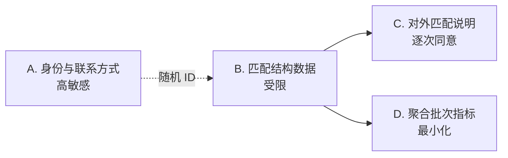

# 数据、安全与隐私

> 本页是工程设计，不构成法律意见。处理真实参与者资料前，必须根据实际地区确认隐私、合同、税务、支付和争议义务。

## 数据分层

| 层 | 示例 | 存储 | 默认可见者 |
| --- | --- | --- | --- |
| A 身份与交易材料 | 姓名、邮箱、电话、合同、付款凭据、原始证据 | 独立加密外部工具 | 发起人和依法必须知道的人 |
| B 匿名匹配数据 | 兴趣、标签、容量、私密底线、边界、风险 | 本地 SQLite | 发起人；程序按用例读取 |
| C 对外说明 | 项目摘要、推荐理由、待确认问题 | 经检查的 Markdown/JSON | 经双方逐次同意的接收者 |
| D 聚合研究数据 | 漏斗、集中度、完成率、耗时 | 报告目录 | 项目团队；对外发布前再审查 |

随机 ID 映射只存在 A 层。B 层中的 `funding_evidence_ref` 和 `evidence_ref` 只应是不可公开解析的受控引用，不是原文件、URL 密钥或联系人线索。

## 当前数据库

SQLite 文件默认位于 `mvp/local-data/mvp.sqlite3`，包含四张表：

- `entities`：当前创作者和需求 JSON；
- `recommendations`：完整输入快照、预算和匹配结果；
- `decisions`：邀请、反馈、选择和原因；
- `outcomes`：项目结果 JSON。

风险最高的字段包括创作者私密报酬底线、明确边界、利益冲突、需求风险和快照中的历史资料。即使没有姓名，这些组合也可能在小群体中重新识别个人，因此不能把“匿名 ID”误称为不可识别数据。

## 防护控制

### 代码内控制

- 导入器递归拒绝常见身份键，包括嵌套对象和数组；
- 需求与创作者校验要求同意版本、风险和数据规则；
- 高敏或受限数据需要处理计划，允许 AI 时还需模型数据规则；
- 候选说明不读取私密金额，并执行值级泄漏防护；
- 推荐保存规则与输入快照，决定绑定推荐，减少事后篡改；
- Git 忽略 `local-data` 运行文件，示例数据明确为虚构。

### 运营控制

- 全盘加密、强口令、自动锁屏和专用设备账户；
- 身份存储、匹配数据和项目材料使用不同目录/工具与访问权限；
- 对外发送前进行双人或清单复核；
- 每次新披露确认具体字段和接收者，不用一次同意覆盖所有未来用途；
- 项目结束按承诺期限删除或聚合数据；
- 安全事件立即停止扩散、保全必要事实、通知受影响者并记录处置。

## 威胁模型

| 威胁 | 例子 | 当前缓解 | 剩余风险 / 后续措施 |
| --- | --- | --- | --- |
| 身份资料误入仓库 | JSON 中含邮箱或微信 | 字段名递归拦截、Git 忽略 | 自由文本仍可能泄漏；需人工审查和 DLP |
| 私密底线泄漏 | 候选说明带出金额 | 函数不读取 + 值级扫描 | 相同数字误报/变形文本漏报；目标平台用字段级 DTO |
| 本机丢失 | SQLite 被复制 | 设备和目录加密 | 当前应用不做数据库层加密；需受管密钥与远程撤销 |
| 越权披露 | 把候选卡发给未同意的人 | 分别确认披露、发送清单 | 依赖运营纪律；目标平台需 ABAC 与审计 |
| 历史篡改 | 改资料后否认原输入 | 推荐快照只追加 | 本机管理员仍可改库；需签名审计或不可变日志 |
| 配置操纵 | 为某候选临时改权重 | 版本文件、manifest、批次冻结 | 缺少发布审批；目标平台需双人审核与生效窗口 |
| 恶意输入 | 巨大 JSON、异常类型 | 基础类型校验、无网络执行 | 没有大小限制/正式 schema；导入前需配额和 schema |
| 依赖/CDN 风险 | 文档脚本被替换 | Docsify 版本固定 | CDN URL未做 SRI；文档无敏感数据，仍可后续自托管资产 |

## 数据保留与删除

同意材料应说明各层数据的用途、保存期、更正、导出和删除方式。执行删除请求时必须搜索：

1. 身份映射与联系人存储；
2. 当前 `entities`；
3. 所有 `recommendations.input_snapshot_json`；
4. `decisions` 中的邀请和反馈；
5. `outcomes`、报告、导出文件与备份；
6. 外部沟通、签署、支付和文件系统。

当前 schema 没有自动级联删除，也没有匿名化迁移。真实运行应使用经审核的删除脚本或逐项清单，并记录完成日期和无法删除的法定义务。备份需要在下一个轮换周期内同步过期。

## 备份与恢复

- 备份 A 层和 B 层时使用不同加密介质或不同密钥；
- SQLite 备份在应用不写入时执行，恢复后运行 `PRAGMA integrity_check` 和关键命令冒烟测试；
- 至少保留一个离线或不同故障域副本；
- 恢复演练验证的不只是文件存在，还包括密钥、配置版本、推荐快照和报告可读取；
- 记录恢复点目标与恢复时间目标；首轮可以人工，但必须可测量。

## 目标平台安全边界

目标平台需要在进入开发前定义：

- OIDC/WebAuthn 登录、组织与角色关系、会话撤销；
- 基于资源、角色、项目关系和字段可见性的授权策略；
- 静态加密、传输加密、密钥轮换和秘密管理；
- 操作审计与安全审计分离，关键事件防篡改；
- 上传文件恶意内容扫描、内容类型校验和短期签名 URL；
- 支付供应商 webhook 验签、幂等和对账；
- 速率限制、滥用检测、申诉和人工安全队列；
- 数据主体访问/更正/删除工作流与备份过期策略；
- 供应链锁定、依赖扫描、部署签名和安全响应责任。

平台不应自行持有客户资金，除非具备明确许可与合规能力。优先集成持牌支付服务商，把平台状态建模为外部资金事实的可审计镜像。
