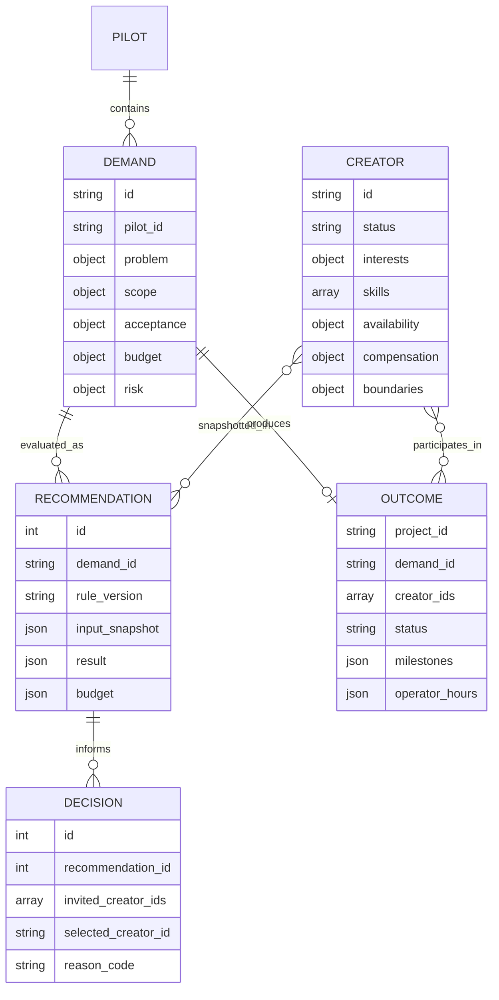
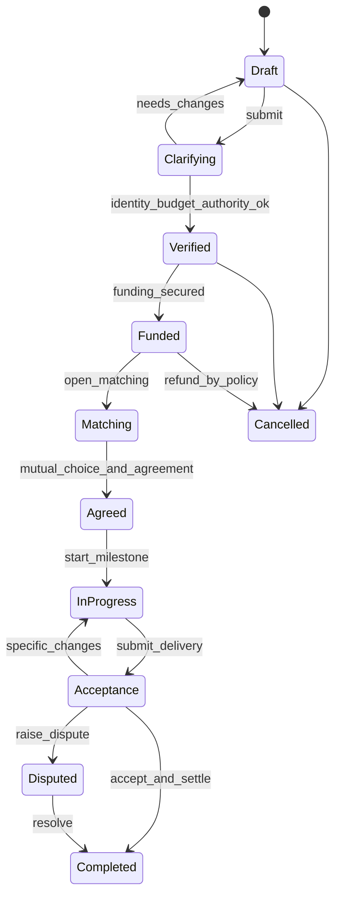

# 领域模型与状态

## 建模原则

1. 需求、创作者、推荐、决定和结果是不同事实，不能用一张“匹配表”混在一起。
2. 当前资料允许纠正；影响过决定的输入必须以快照保留。
3. 身份信息与匹配资料使用不同存储和权限域，通过随机 ID 关联。
4. 规则版本是业务事实的一部分，不能只记录应用版本。
5. “算法推荐”“实际邀请”“双方选择”“项目成功”是四个不同事件。

## 当前实体关系

`PILOT` 当前不是单独的数据表；它是需求、推荐、决定和结果上的关联 ID。目标平台中应成为有开始时间、规则集、地区和状态的正式聚合根。

## Demand 聚合

需求至少表达以下子对象：

- `problem`：背景、领域、目标用户、期望结果；
- `scope`：可验收交付物和明确非范围；
- `acceptance`：标准、负责人、响应期限；
- `skills` / `matching`：必需与可选技能、问题类型、领域和任务标签；
- `schedule`：开始、截止、预计天数、周投入和持续周数；
- `budget` / `payment`：范围、币种、直接成本和里程碑计划；
- `risk` / `ai`：不确定性、紧急度、依赖、数据敏感度和模型规则；
- `collaboration` / `location`：语言、工作方式、反馈节奏和地域限制；
- 进入门槛：参与同意版本、决策权确认、资金承诺与受控证据引用。

当前 `status` 由运营者输入，仅作为资料字段；校验器真正依赖的是明确布尔门槛和必填内容。

### 目标需求状态机

只有 `Funded` 可主动邀请创作者。未来实现必须把转换命令、前置条件、操作者和审计事件放在一起，不能让客户端任意写 `status`。

## Creator 聚合

创作者档案不是简历，而是一个带可见性边界的匹配投影：

- `interests`：问题类型、领域、任务和 0～4 意愿强度；
- `skills[]`：标签、0～4 熟练度、证据类型、0～4 可信度和受控引用；
- `availability`：可开始日、每周容量、持续周期、时区；
- `collaboration`：语言、异步/同步方式、反馈频率、团队偏好；
- `compensation`：私密项目底线与币种；
- `boundaries`：禁止领域/任务和可接受数据敏感度；
- `conflicts`：存在利益冲突的组织随机 ID；
- `ai`：允许、依赖、人工复核和禁止情形。

目标平台需要为每个字段增加 `visibility = public | match_only | private`，并记录来源、确认时间和过期时间。当前 MVP 通过整个数据层隔离和输出保护近似实现这一点。

## 推荐与决定的不变量

- 推荐必须引用一个完整复合规则版本；
- 推荐输入必须包含需求和当时参与计算的全部创作者，而不只包含前三名；
- 被硬过滤者不能出现在排序、邀请或最终选择中；
- 最终选择如果存在，必须属于实际邀请列表；
- 候选反馈只能来自被邀请者，同一候选最多一条；
- `OTHER` 原因必须有补充事实说明；
- 后续资料更新不得改变旧推荐的解释。

## Outcome 状态

当前允许 `completed | exited | failed`：

- `completed` 必须存在真实付款；
- `exited` 或 `failed` 必须记录首要失败原因；
- 所有状态都必须记录创作者、里程碑、运营耗时、安全事件和再次使用意愿；
- 项目结果可在退出访谈后补齐，因此以 `project_id` 更新。

长期平台应把 `Project`、`AgreementVersion`、`Milestone`、`Delivery`、`Acceptance`、`ScopeChange`、`PaymentReference` 和 `Dispute` 拆为独立实体；`Outcome` 变为这些事实的分析投影，而不再由人工一次录入。

## ID、时间与版本

- 参与者和业务对象使用不可推测的随机 ID，不使用姓名或邮箱；
- 当前 SQLite 自增 ID 只用于推荐和决定的本地顺序；
- 数据库时间使用 UTC ISO 8601，去除微秒；
- 业务日期输入使用 `YYYY-MM-DD`；
- 规则配置采用不可变版本文件，历史文件不覆盖；
- 目标平台应统一采用 UUIDv7/ULID 一类可全局生成的 ID、UTC 时间戳和乐观并发版本号。
