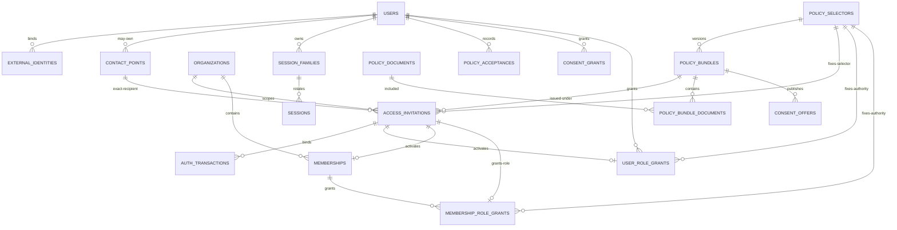

# IAM PostgreSQL 18 首个持久化切片实现设计

> 状态：migration catalog、review pin、v0–v16实际SQL、psycopg `MigrationSession`、PostgreSQL 18 migration runner、RLS/FK/trigger/direct-SQL、Outbox delivery repository/durable consumer inbox、IAM read models，以及`AcceptAccessInvitation`、`AcceptCurrentPolicies`、`GrantConsent` production PostgreSQL 18 repository/Unit of Work均已完成RED→GREEN。`0015`只增加Creator Profile消费的exact SELF authority与受Profile绑定的matcher eligibility capability；`0016`只增加Demand消费的owner/reviewer exact authority，两个Context的schema/ledger/compatibility都仍完全独立。后两个SELF命令的exact authority/current、old-source acceptance、ConsentGrant expiry/reuse/conflict、retained receipt metadata、COMMIT_SENT recovery与privacy证据见[独立页](/architecture/iam-policy-consent-postgresql.md)。`PublishPolicyBundle`与其他lifecycle command的生产PostgreSQL repository/Unit of Work、真实broker厂商adapter和端到端装配仍未全部实现；Memory或本地broker fake GREEN不扩大这些边界。
>
> 实现范围：`PublishPolicyBundle` 的最小发布底座，以及 `AcceptAccessInvitation` 从已成功 OIDC Session 到 receipt、授权事实、审计、outbox 和 Session rotation 的首个 PostgreSQL 纵切片。`AcceptCurrentPolicies`/`GrantConsent` 的SELF writer固定锁序、receipt response、pool/commit边界与v14证据由[独立设计页](/architecture/iam-policy-consent-postgresql.md)拥有；HTTP composition/E2E仍不在数据库GREEN边界内。
>
> 权威上游：[身份、租户、政策同意与会话设计](/architecture/identity-tenancy-consent.md)、[ADR-0002：组织租户根与角色作用域](/decisions/0002-tenant-root-and-role-scopes.md)、[ADR-0004：IAM onboarding、持久化与 PostgreSQL 执行协议](/decisions/0004-iam-onboarding-persistence-and-postgres.md)，以及仓库机器契约 `platform/contracts/api/iam-v1.openapi.yaml`、`platform/contracts/events/iam-v1.schema.json`。若本文与机器契约冲突，先修订并评审设计与契约，不在 migration 中静默选择第三种语义。

## 1. 目标、完成定义与非目标

本文把 `REQ-DB-IAM-001` 从概念设计收敛到可直接编写 migration 和语义 RED 测试的粒度。首个持久化切片完成时必须同时证明：

1. PostgreSQL 18 当前 security minor 与 psycopg 3 是唯一受支持组合；
2. 在线角色不是表 owner、没有 `BYPASSRLS`，所有 IAM 受限表都启用 `ENABLE ROW LEVEL SECURITY` 与 `FORCE ROW LEVEL SECURITY`；raw cookie 只能经 exact `SESSION_AUTHENTICATE` scope 解析为 Session/actor，不能先伪造 SELF context；
3. `PublishPolicyBundle` 是初始及升级政策唯一 ACTIVE 入口，migration、fixture 和 seed SQL 不能直接激活政策；
4. `AcceptAccessInvitation` 在一个 READ COMMITTED 事务中最多接受一次，并原子写入 receipt、角色或 Membership、政策/consent 事实、Invitation 终态、Session successor、audit 和 outbox；
5. exact Invitation、contact、Session、AuthTransaction 和 If-Match version 的绑定既由应用验证，也由可表达的外键、唯一约束和 RLS scope 收紧；
6. `/v1/me` 的跨 Organization 摘要只经 OpenAPI `x-iam-database-access.ME_SELF_SUMMARY` 指定的 `iam_api.read_me_self_summary()`；
7. 公开政策读取只能访问 exact ACTIVE immutable bundle，政策发布只能操作 exact selector + new bundle + current predecessor；
8. migration runner 具有固定 advisory lock、不可变 checksum、逐文件事务和只前进恢复协议；应用启动只校验兼容版本；
9. COMMIT 前的有限重试与 COMMIT 已发送后的 outcome unknown 在 adapter 中不可混淆。

本切片不包含真实 OIDC provider、前端、自动邀请投递、legacy evidence 导入、账号恢复、通用运营查询、outbox 外部 broker adapter 或 destructive down migration。`ConsentWithdrawal` 表在首批结构中安装，以便 active ConsentGrant 唯一性和后续撤回无需破坏性改表；撤回 handler 不属于本切片 GREEN。

## 2. 固定技术基线与命名

| 项目 | 固定值 |
| --- | --- |
| PostgreSQL | major 18；本地、CI、生产使用同一受支持 security minor |
| Python driver | psycopg 3；禁止 psycopg2 compatibility path |
| 默认隔离级别 | `READ COMMITTED`，逐命令显式 `BEGIN ISOLATION LEVEL READ COMMITTED` |
| ID | 应用 IdSource 生成不可推测 UUIDv7，数据库列类型 `uuid`，测试可注入固定 UUIDv7 |
| 时间 | `timestamptz`，只接受/输出 UTC；业务时间来自数据库事务时钟或注入后作为一个命令常量 |
| 聚合版本 | `bigint NOT NULL CHECK (aggregate_version >= 1)` |
| 密文/摘要 | `bytea`；SHA-256/HMAC-SHA-256 均检查 `octet_length(...) = 32` |
| 业务状态 | `text` + 命名 `CHECK`；不使用难以滚动升级的 PostgreSQL enum |
| schema | `iam`、`iam_api`、`infra`、`audit` |
| SQL 参数 | 只用 psycopg bind parameters；标识符只能从仓库内关闭 allowlist 组合 |
| 时限比较 | `deadline <= transaction_timestamp()` 即到期，等号不再允许 |

约束、索引和 policy 使用稳定前缀：`pk_`、`fk_`、`uq_`、`ux_`、`ck_`、`ix_`、`trg_`、`rls_`。所有标识符必须小于 PostgreSQL 63-byte 上限。下文中的列和约束是规范定义；实现不得以 ORM 自动生成名称替代。除非列定义显式标出 `NULL`，下文列出的每一列都必须是 `NOT NULL`；`PK` 隐含 `NOT NULL`，但 PostgreSQL catalog test 仍按实际 `attnotnull` 验证。不得依赖 PostgreSQL unique、CHECK 或复合 FK 对 NULL 的三值逻辑替代必填 shape。

## 3. 数据库角色、owner 与权限边界

### 3.1 角色清单

| 角色 | LOGIN | owner / membership | 允许用途 |
| --- | --- | --- | --- |
| `schema_owner` | 否 | 四个 schema、表、序列、普通函数和 policy 的 owner | 仅 migration `SET ROLE` 与恢复；`NOSUPERUSER NOCREATEDB NOCREATEROLE NOINHERIT NOBYPASSRLS` |
| `iam_migration_runner` | 部署身份 | `NOINHERIT` 成员，可显式 `SET ROLE schema_owner` | 执行仓库登记 migration；不作为应用连接 |
| `iam_app` | 在线身份 | 不是任何 owner 角色成员 | 本人读写、exact public policy read、执行 self-summary |
| `iam_session_authenticator` | 在线身份 | 不是任何 owner 角色成员 | 只把服务端计算的 exact cookie-handle digest解析为最小 Session/Family authentication facts，并处理已撤销 handle replay；使用独立 pool |
| `iam_onboarding` | 在线协议身份 | 不是 owner 角色成员 | 固定 `INSPECT/BEGIN/COMPLETE/ACCEPT` statements |
| `iam_system` | 内部 job 身份 | 不是 owner 角色成员 | exact target SYSTEM 命令与 `POLICY_PUBLISH` |
| `iam_self_summary_reader` | 否 | 只拥有 self-summary 函数；不拥有表 | 函数内最小列读取；`NOBYPASSRLS` |
| `iam_outbox_worker` | 受控 worker 身份 | 不是 owner | 后续按固定 lease statement 读取事件安全 envelope；不能读 IAM/Audit 正文 |
| `iam_key_policy_operator` | 否 | 不是 owner；只由独立部署身份临时 `SET ROLE` | 在停写、审计的 key-rotation ceremony 中更新 receipt key ID policy；永不取得或保存 key bytes |
| `audit_reader` | 默认 NOLOGIN | 不是 owner | 经审批读取脱敏 audit projection，不读 A 层 |
| `break_glass` | 默认 NOLOGIN、无凭据 | 不是在线角色 | 临时签发、工单、时限和独立审计；不进入连接池配置 |

环境 provisioner 创建 LOGIN 和 NOLOGIN 角色；migration runner 不创建、修改或轮换登录凭据。`0000` migration 首先验证每个角色的 `rolsuper=false`、`rolbypassrls=false`、预期 `rolinherit`/`rolcanlogin`，不满足即失败。生产不得把托管数据库 superuser 注入应用、worker 或测试连接。

### 3.2 owner 与默认权限

- `schema_owner` 拥有 `iam`、`iam_api`、`infra`、`audit` 及其对象；在线角色均不是 owner。
- provisioner 仅为离线 ownership transfer 允许 `schema_owner SET ROLE iam_self_summary_reader`；反向 membership不存在，所有在线角色都不能 SET ROLE 两者。函数转移后 reader仍不拥有 schema或表。
- `REVOKE CREATE ON SCHEMA public FROM PUBLIC`；四个业务 schema 对 `PUBLIC` 撤销全部权限。
- 对 `schema_owner` 在四个 schema 的 default privileges 先 `REVOKE ALL ... FROM PUBLIC`，再按列、表、函数显式授权。
- `iam_app` 不取得 `iam.organizations` 的直接 `SELECT`；它只能执行 `iam_api.read_me_self_summary()` 或进入另有明确作用域的 Organization repository。
- `iam_session_authenticator` 只取得 Session/Family authentication allowlist、第11.3节两条固定 statements及 replay撤销所需的最小安全 audit INSERT；它没有 User、Organization、Membership、Policy、receipt、audit SELECT或 outbox权限，也不能 SET ROLE其他 runtime身份。
- `iam_key_policy_operator` 只对 `infra.iam_receipt_key_policy` singleton有 SELECT/UPDATE，不能 INSERT/DELETE、读取 receipt或 SET ROLE runtime/owner；key bytes始终只在外部 KMS/secret provider。
- `iam_onboarding` 对联系人只获得 protocol 所需 digest/key 列，不获得列表查询，也不取得通用 locator 解密出口。
- `audit.audit_events` 对在线角色只有 `INSERT`；没有 `UPDATE/DELETE/SELECT`。`infra.outbox_events` 的业务 envelope 列在插入后不可变，worker 只可修改 lease/delivery 列。
- 所有受限表都执行 `ALTER TABLE ... ENABLE ROW LEVEL SECURITY` 与 `ALTER TABLE ... FORCE ROW LEVEL SECURITY`；测试查询 `pg_class.relrowsecurity/relforcerowsecurity` 作为门禁。

## 4. 字段分层、加密与摘要域

| 层 | 数据 | 存储规则 |
| --- | --- | --- |
| 永不入库 | raw `access_invitation_token`、raw Session handle、raw CSRF token、OIDC code/token/raw subject、raw Idempotency-Key | 只存在于最短请求作用域；入口先 redact，不能进入异常、SQL 参数日志、receipt、audit 或 outbox |
| AEAD 密文 | contact locator、PKCE verifier；未来 provider 受限 reference | `ciphertext bytea + encryption_key_id varchar(64) + encryption_algorithm`；首版 algorithm 关闭为 `AES_256_GCM_V1`，nonce/tag 包含在版本化 envelope 内；密钥只在外部 KMS/secret provider |
| keyed digest | contact binding、provider subject、Session handle、OIDC state/nonce、browser binding、Idempotency-Key、receipt payload | 每个用途独立 HMAC key domain 与 `*_key_id`；禁止复用 key 或把 digest 当公开 identifier |
| 随机持久 nonce | Invitation `token_nonce`、Session `csrf_salt` | nonce 本身不是 bearer，但仍按 A 层处理；不进普通 DTO、audit、outbox 或日志 |
| unkeyed content hash | immutable policy body、release manifest、ConsentOffer canonical facts | SHA-256，仅用于公开/不可变内容完整性；绝不用于邮箱、subject、token 等低熵秘密 |
| 安全业务事实 | UUID、状态、role/purpose code、公开 Organization 名、政策正文 | 按 RLS/字段 allowlist 读取；“非秘密”不等于可跨主体列举 |

Contact binding 的不可变 tuple 是 `(contact_type, binding_digest, binding_digest_key_id)`。它只有非唯一受限索引，绝不建立 UNIQUE，也不能用于自动账号合并。`iam.access_invitations` 只保存 `recipient_contact_id`；不复制 tuple。Invitation token 由 exact Invitation ID、持久 nonce、key version 和 expiry 确定性认证，数据库永不保存完整 token。

## 5. 首批 migration 单元

唯一 migration 根目录固定为 `platform/src/desire_platform/identity_access/adapters/postgres/migrations/`；下表路径以及同目录的 `manifest.json` 均为计划中的受检入库文件，不声称它们已经创建。runner 不搜索其他目录，也不从文件名扫描生成执行序列。

| 顺序 | 计划文件 | 单事务职责 |
| --- | --- | --- |
| `0000` | `0000_expand__schemas_and_ledger.sql` | 验证角色属性；建立四个 schema、ledger、default privilege 基线 |
| `0001` | `0001_expand__policy_publication.sql` | selector、document、bundle、bundle-document、ConsentOffer/category 与发布约束 |
| `0002` | `0002_expand__identity_tenancy_invitation.sql` | User、ExternalIdentity、ContactPoint、Organization、Invitation 与 Membership/role 表；Invitation 固定 selector digest并建立 issued bundle复合 FK |
| `0003` | `0003_expand__auth_session_evidence.sql` | AuthTransaction、SessionFamily、Session、PolicyAcceptance、ConsentGrant/category/Withdrawal；补循环复合 FK |
| `0004` | `0004_expand__receipt_audit_outbox.sql` | receipt、receipt key-policy metadata、audit、outbox、append-only/transport-only trigger |
| `0005` | `0005_expand__iam_force_rls.sql` | grants、`SESSION_AUTHENTICATE` 与其他 operation-scoped FORCE RLS、safe preview projection |
| `0006` | `0006_expand__me_self_summary.sql` | `iam_api.read_me_self_summary()`、函数 owner、列权限、执行权限 |
| `0007` | `0007_contract__verify_iam_v1.sql` | 安装 schema-contract metadata/compatibility view并精确验证 owner/RLS/constraint/function 属性；不删除兼容结构 |
| `0008` | `0008_expand__outbox_delivery_and_consumer_inbox.sql` | Outbox lease/fencing/retry/dead-letter与durable consumer inbox的最小持久化面 |
| `0009` | `0009_expand__accept_policy_graph_lock.sql` | Accept exact policy graph的窄`SECURITY DEFINER`锁定接口与内部exact lock policies |
| `0010` | `0010_contract__consent_grant_trigger_dispatch.sql` | forward-only修复ConsentGrant/category deferred trigger的relation-specific `NEW` dispatch |
| `0011` | `0011_expand__policy_acceptance_reuse_rls.sql` | prior exact PolicyAcceptance在健康current requirement下的窄SELECT RLS |
| `0012` | `0012_expand__iam_read_models.sql` | IAM生产read-model functions、最小ACL/RLS与关闭projection语义 |
| `0013` | `0013_expand__consent_grant_accept_expiry_rls.sql` | 拆分ConsentGrant ACCEPT SELECT/INSERT，并只为prior ACTIVE-but-expired exact authority开放窄CAS UPDATE |

`migrations/manifest.json` 顶层只能是一个 JSON array；每个元素是关闭对象，且按此顺序恰含 `component`、`version`、`phase`、`name`、`path`、`sha256` 六个成员。当前受检catalog有且只有 version `0..13` 十四项，按 integer version严格递增；`component` 固定为 `iam`，`phase` 必须等于表中该项的 `expand | contract`，`name` 是文件名双下划线后的 stem且匹配 `[a-z0-9_]+`，`path` 是同目录单一 basename，并必须逐字等于四位十进制 version、下划线、phase、双下划线、name和 `.sql` 的组合。拒绝路径分隔符、`.`/`..` path segment、百分号编码、绝对路径、重复 key、未知 key或 symlink target。

manifest 采用唯一 restricted-canonical bytes：整个 array 单行、对象成员顺序固定为上列顺序、冒号/逗号旁无空白、version使用最短十进制 JSON integer、所有字符串为满足上述字段 pattern 的未转义 ASCII、`sha256` 恰为64位 lowercase hex、文件末尾恰一个 LF；编码必须是 UTF-8、无 BOM、无 CR、无额外尾随 byte。即首项 shape 固定为 `[{"component":"iam","version":0,"phase":"expand","name":"schemas_and_ledger","path":"0000_expand__schemas_and_ledger.sql","sha256":"<64 lowercase hex>"},...`。每项 `sha256` 是对应 SQL **实际受检入库 raw bytes**（UTF-8、无 BOM、无 NUL、仅 LF、末尾恰一个 LF）的 SHA-256 lowercase hex；runner 必须先验证 manifest canonical bytes和每项 SQL digest，再打开数据库，不能对 JSON或SQL重序列化/换行归一化后计算。`migration_manifest_sha256` 则直接 SHA-256 整个 `manifest.json` 实际 bytes（包含最终 LF），不拼接条目 digest或目录名。

当前已实现两个无数据库子切片。`platform/src/desire_platform/identity_access/adapters/postgres/migrations/catalog.py` 是只读 artifact catalog validator；于 `platform/` 目录执行 `PYTHONPATH=src python3 -m unittest tests.storage.postgres.test_migration_catalog`，2026-08-08 得到 `Ran 9 tests ... OK`，证明关闭的 v0..v7 layout、manifest唯一 bytes、SQL raw bytes、无 symlink/path escape与逐项 SHA-256。`migrations/runner.py` 是依赖关闭 `MigrationSession` port的 scripted protocol；初始10项语义 RED中9项因 scaffold失败，补入 COMMIT unknown后ledger缺失重执行与 unlock断链discard 两项 RED后，当前 `PYTHONPATH=src python3 -m unittest tests.storage.postgres.test_migration_runner` 得到 `Ran 12 tests ... OK`。后者证明固定锁、preflight ledger drift、逐文件事务、0007 hash参数/ledger原子性、COMMIT unknown exact恢复/缺失重执行/corrupt拒绝，以及 unlock/discard控制流；同目录全套 `PYTHONPATH=src python3 -m unittest discover -s tests` 为 `Ran 109 tests ... OK`。这些测试使用内存/临时 scripted doubles，不表示本目录实际 `manifest.json`/SQL、psycopg driver、数据库 ledger/lock/transaction、0007 view或真实 PostgreSQL已经实现。

新库可连续执行全部文件；已有库严格按版本前进。首批表尚无旧应用消费者，因此不需要 destructive backfill。未来数据迁移必须新增 `migrate` 文件，不得改写已登记 SQL。

## 6. AcceptAccessInvitation 最小关系模型



### 6.1 Identity 与 recipient 前置事实

#### `iam.users`

| 列 | 类型与空值 | 约束/用途 |
| --- | --- | --- |
| `id` | `uuid NOT NULL` | PK，应用生成 UUIDv7 |
| `status` | `text NOT NULL` | `PENDING_ENROLLMENT | ACTIVE | SUSPENDED | CLOSED` |
| `display_handle` | `varchar(80) NOT NULL` | `^[A-Za-z0-9][A-Za-z0-9_-]{1,79}$`，不是身份材料 |
| `aggregate_version` | `bigint NOT NULL` | `>= 1`；Accept CAS 后递增一次 |
| `created_at` / `updated_at` | `timestamptz NOT NULL` | `updated_at >= created_at` |

PK 为 `pk_users(id)`；增加 `uq_users_id_version(id, aggregate_version)` 供 exact-version 引用和检查。Accept 只允许 `PENDING_ENROLLMENT → ACTIVE` 或既有 `ACTIVE → ACTIVE`，SUSPENDED/CLOSED fail closed。

#### `iam.external_identities`

| 列 | 类型与空值 | 约束/用途 |
| --- | --- | --- |
| `id` | `uuid NOT NULL` | PK |
| `user_id` | `uuid NOT NULL` | FK users，`ON DELETE RESTRICT` |
| `issuer` | `varchar(2048) NOT NULL` | 规范 issuer URL，不写 token |
| `subject_digest` | `bytea NOT NULL` | keyed 32-byte HMAC |
| `subject_digest_key_id` | `varchar(64) NOT NULL` | provider-subject 专用 key domain |
| `verified_at` | `timestamptz NOT NULL` | provider 验证时间 |
| `status` | `text NOT NULL` | `ACTIVE | REVOKED` |
| `created_at` | `timestamptz NOT NULL` | server time |

`uq_external_identity_issuer_subject(issuer, subject_digest)` 防止一个 provider subject 绑定两个 User；首切片另有 `ux_external_identity_active_user(user_id) WHERE status='ACTIVE'`，每 User 最多一个 active external identity。Accept 不修改该表，只验证 callback 已完成的 User/Session 前置事实。

#### `iam.contact_points`

| 列 | 类型与空值 | 约束/用途 |
| --- | --- | --- |
| `id` | `uuid NOT NULL` | PK |
| `user_id` | `uuid NULL` | FK users；邀请阶段可为空，成功绑定后可设置 |
| `contact_type` | `text NOT NULL` | 首版 `EMAIL | PHONE` |
| `locator_ciphertext` | `bytea NULL` | 终态/保留期后可加密销毁 |
| `locator_encryption_key_id` | `varchar(64) NULL` | 与 ciphertext 同空/同非空 |
| `locator_encryption_algorithm` | `text NULL` | ciphertext 存在时固定 `AES_256_GCM_V1` |
| `binding_digest` | `bytea NOT NULL` | 32-byte HMAC，发布后不可修改 |
| `binding_digest_key_id` | `varchar(64) NOT NULL` | contact-binding 专用 key domain |
| `verified_at` | `timestamptz NULL` | exact row 被 provider 验证的时间 |
| `retention_until` | `timestamptz NULL` | locator 清除上限 |
| `created_at` / `updated_at` | `timestamptz NOT NULL` | server time |

`ix_contact_binding_lookup(contact_type, binding_digest_key_id, binding_digest)` 必须是非唯一索引。在线角色不得更新 `contact_type/binding_digest/key_id`；`trg_contact_binding_immutable` 对任何非 owner 更新也拒绝 tuple 变化。不得创建这三个字段的全局唯一约束。

### 6.2 Organization、Membership 与角色

#### `iam.organizations`

| 列 | 类型与空值 | 约束/用途 |
| --- | --- | --- |
| `id` | `uuid NOT NULL` | PK |
| `organization_type` | `text NOT NULL` | `BUSINESS | NONPROFIT | COMMUNITY | CREATOR_TEAM` |
| `public_name` | `varchar(160) NOT NULL` | invitation preview 唯一可匿名公开的 Organization 字段 |
| `jurisdiction` | `varchar(32) NOT NULL` | `^[A-Z0-9_-]{2,32}$` |
| `status` | `text NOT NULL` | `PENDING_ADMIN | ACTIVE | SUSPENDED | CLOSED` |
| `client_reference_namespace` | `varchar(64) NOT NULL` | bootstrap namespace |
| `client_reference` | `varchar(128) NOT NULL` | 受控幂等外部引用，不是 legacy ID 自动映射 |
| `aggregate_version` | `bigint NOT NULL` | `>= 1` |
| `created_at` / `updated_at` | `timestamptz NOT NULL` | server time |

`uq_organization_client_ref(namespace, client_reference)`；`uq_organizations_id_version(id, aggregate_version)`。初始 ORG_ADMIN Accept 可把 `PENDING_ADMIN → ACTIVE`；其他邀请要求 Organization 已 ACTIVE。

#### `iam.memberships`

| 列 | 类型与空值 | 约束/用途 |
| --- | --- | --- |
| `id` | `uuid NOT NULL` | PK |
| `organization_id` | `uuid NOT NULL` | FK organizations，`ON DELETE RESTRICT` |
| `user_id` | `uuid NOT NULL` | FK users，`ON DELETE RESTRICT` |
| `status` | `text NOT NULL` | `ACTIVE | SUSPENDED | REVOKED` |
| `source_invitation_id` | `uuid NOT NULL` | exact organization invitation；FK access_invitations 延后添加 |
| `aggregate_version` | `bigint NOT NULL` | `>= 1` |
| `created_at` / `updated_at` | `timestamptz NOT NULL` | server time |

约束：`uq_membership_org_user(organization_id,user_id)`、`uq_membership_org_id(organization_id,id)`、`uq_membership_org_id_user(organization_id,id,user_id)`、`uq_membership_source_invitation(source_invitation_id)`。不允许 PENDING Membership；Invitation 表达 pending。

#### `iam.user_role_grants`

| 列 | 类型与空值 | 约束/用途 |
| --- | --- | --- |
| `id` | `uuid NOT NULL` | PK |
| `user_id` | `uuid NOT NULL` | FK users |
| `role_code` | `text NOT NULL` | 首版常量 `CREATOR` |
| `source_invitation_id` | `uuid NOT NULL` | FK access_invitations，且唯一 |
| `policy_selector_digest` | `bytea NOT NULL` | 32-byte FK policy_selectors；从 source Invitation逐字复制的授权门事实 |
| `granted_by_kind` / `granted_by_id` | `text NOT NULL` / `uuid NOT NULL` | `USER | SYSTEM` 与 actor ID |
| `granted_at` | `timestamptz NOT NULL` | server time |
| `revoked_at` / `revocation_reason_code` | `timestamptz NULL` / `varchar(64) NULL` | 同空或同非空 |
| `aggregate_version` | `bigint NOT NULL` | `>=1`；授予时为1，后续撤销CAS递增 |

`ux_user_role_active(user_id,role_code) WHERE revoked_at IS NULL` 与 `uq_user_role_source_invitation(source_invitation_id)`；复合 FK `(source_invitation_id,policy_selector_digest,role_code)` → access invitations `(id,policy_selector_digest,target_role)`，并以直接 FK `policy_selector_digest` → policy selectors，保证 CREATOR grant只能继承其 source Invitation的CREATOR selector；历史不级联删除。创建后 User/source Invitation/selector/role/grantor/time不可改，后续只允许CAS填写 revocation字段并递增版本。

#### `iam.membership_role_grants`

| 列 | 类型与空值 | 约束/用途 |
| --- | --- | --- |
| `id` | `uuid NOT NULL` | PK |
| `organization_id` / `membership_id` / `user_id` | `uuid NOT NULL` | 复合 FK `(organization_id,membership_id,user_id)` → memberships |
| `role_code` | `text NOT NULL` | `ORG_ADMIN | DEMAND_OWNER` |
| `source_invitation_id` | `uuid NOT NULL` | FK access_invitations，且唯一 |
| `policy_selector_digest` | `bytea NOT NULL` | 32-byte FK policy_selectors；从 source Invitation逐字复制 |
| `granted_by_kind` / `granted_by_id` | `text NOT NULL` / `uuid NOT NULL` | actor |
| `granted_at` | `timestamptz NOT NULL` | server time |
| `revoked_at` / `revocation_reason_code` | `timestamptz NULL` / `varchar(64) NULL` | 同空或同非空 |
| `aggregate_version` | `bigint NOT NULL` | `>=1`；为事件 envelope 提供稳定版本 |

`uq_membership_role_org_id(organization_id,id)`、`ux_membership_role_active(membership_id,role_code) WHERE revoked_at IS NULL`、`uq_membership_role_source_invitation(source_invitation_id)`。除 Membership复合 FK及 selector直接 FK 外，`(source_invitation_id,policy_selector_digest,organization_id,role_code)` 复合 FK → access invitations `(id,policy_selector_digest,organization_id,target_role)`，防止把合法 role row接到另一 selector、Organization或target role的 Invitation。创建后 Organization/Membership/User/source Invitation/selector/role/grantor/time不可改，后续只允许CAS填写 revocation字段并递增版本。

### 6.3 AccessInvitation

#### `iam.access_invitations`

| 列 | 类型与空值 | 约束/用途 |
| --- | --- | --- |
| `id` | `uuid NOT NULL` | PK |
| `purpose` | `text NOT NULL` | `CREATOR_ENROLLMENT | ORGANIZATION_MEMBERSHIP` |
| `organization_id` | `uuid NULL` | FK organizations |
| `target_scope` | `text NOT NULL` | `USER | ORGANIZATION` |
| `target_role` | `text NOT NULL` | `CREATOR | ORG_ADMIN | DEMAND_OWNER` |
| `is_initial_admin` | `boolean NOT NULL DEFAULT false` | 只适用于 ORG_ADMIN organization invitation |
| `recipient_contact_id` | `uuid NOT NULL` | exact FK contact_points；不复制 digest |
| `masked_recipient_label` | `varchar(80) NOT NULL` | issue时从 locator生成的不可逆显示 mask；不能还原或包含完整 locator |
| `policy_selector_digest` | `bytea NOT NULL` | 32-byte FK policy_selectors；issue时从发布 selector直接保存，后续 `/me`/preview/admin/accept均读取该存储事实，禁止 presentation 重算 |
| `issued_policy_bundle_id` | `uuid NOT NULL` | 与 selector组成复合 FK指向 policy_bundles；只用于发行证据，accept 仍沿相同 selector解析 current bundle |
| `status` | `text NOT NULL` | `ISSUED | ACCEPTED | REVOKED | EXPIRED` |
| `expires_at` | `timestamptz NOT NULL` | `expires_at > created_at`，等号已过期 |
| `issuer_kind` / `issuer_user_id` | `text NOT NULL` / `uuid NULL` | SYSTEM 时 user 为空；USER 时非空 FK users |
| `token_nonce` | `bytea NOT NULL` | 32-byte 随机 nonce，不是完整 token |
| `token_key_id` | `varchar(64) NOT NULL` | invitation-token 专用 key |
| `accepted_by_user_id` | `uuid NULL` | ACCEPTED 时必填 FK users |
| `terminal_at` | `timestamptz NULL` | terminal status 时必填 |
| `terminal_reason_code` | `varchar(64) NULL` | REVOKED/EXPIRED 可填稳定 code，不写自由文本 |
| `aggregate_version` | `bigint NOT NULL` | `>= 1`；If-Match 绑定该值 |
| `created_at` / `updated_at` | `timestamptz NOT NULL` | server time |

必须建立以下命名约束：

- `ck_invitation_target_shape`：
  - CREATOR_ENROLLMENT ⇒ `organization_id IS NULL AND target_scope='USER' AND target_role='CREATOR' AND is_initial_admin=false`；
  - ORGANIZATION_MEMBERSHIP ⇒ `organization_id IS NOT NULL AND target_scope='ORGANIZATION' AND target_role IN ('ORG_ADMIN','DEMAND_OWNER')`；
- `ck_invitation_initial_admin`：`is_initial_admin=true` ⇒ `purpose='ORGANIZATION_MEMBERSHIP' AND target_role='ORG_ADMIN' AND issuer_kind='SYSTEM'`；
- `ck_invitation_issuer_shape`：SYSTEM 与 `issuer_user_id IS NULL` 同时成立，USER 与非空同时成立；
- `ck_invitation_terminal_shape`：ISSUED 时 accepted/terminal 为空；ACCEPTED 时 accepted User 与 terminal_at 非空；REVOKED/EXPIRED 时 accepted User 为空且 terminal_at 非空；
- `uq_invitation_id_nonce(id,token_nonce)`、`uq_invitation_id_contact(id,recipient_contact_id)`、`uq_invitation_id_selector(id,policy_selector_digest)`、`uq_invitation_id_target_role(id,target_role)`、`uq_invitation_id_org(id,organization_id)`、`uq_invitation_id_org_role(id,organization_id,target_role)`、`uq_invitation_id_selector_role(id,policy_selector_digest,target_role)`、`uq_invitation_id_selector_org_role(id,policy_selector_digest,organization_id,target_role)`；这些复合键只服务 exact child FK；Invitation version 是认证时冻结的历史值，不以 FK 指向随后会递增的当前 aggregate version；
- `fk_invitation_issued_bundle_selector(issued_policy_bundle_id,policy_selector_digest)` → policy bundles `(id,selector_digest)`；issue statement还逐字段验证 selector 的 access purpose/scope/target role 与 Invitation shape，Organization invitation 的 selector jurisdiction必须等于 locked Organization jurisdiction；creator selector使用版本化平台默认 jurisdiction/locale。locale fallback由 Publish/Issue policy配置解析一次，选中的 digest随后不可改；
- `ux_invitation_open_initial_admin(organization_id) WHERE is_initial_admin AND status='ISSUED'`；
- `ix_invitation_expiry(status,expires_at)` 供显式 expiry job，不把读取时自动 UPDATE 隐藏在 query 中。

purpose/scope/role/organization/contact、`policy_selector_digest` 与 issued bundle 在创建后由 `trg_invitation_binding_immutable` 拒绝变化。Membership 的 `(source_invitation_id,organization_id)` 使用 `uq_invitation_id_org` 作为复合 FK。合法状态转换仍通过 CAS `WHERE id=%s AND aggregate_version=%s AND status='ISSUED'`。

## 7. Policy publish selector 与 immutable artifacts

### 7.1 `iam.policy_selectors`

| 列 | 类型与空值 | 约束/用途 |
| --- | --- | --- |
| `selector_digest` | `bytea NOT NULL` | 32-byte PK；GUC 使用其 64 位小写 hex |
| `canonicalization_version` | `varchar(64) NOT NULL` | 首版常量 `policy-selector-json-v1` |
| `access_purpose` | `text NOT NULL` | `CREATOR_ENROLLMENT | ORGANIZATION_MEMBERSHIP` |
| `scope_type` | `text NOT NULL` | `USER_ROLE | ORGANIZATION_ROLE` |
| `target_role` | `text NOT NULL` | contract role code |
| `jurisdiction` | `varchar(32) NOT NULL` | contract code |
| `locale` | `varchar(35) NOT NULL` | BCP-47 受控格式 |
| `current_bundle_id` | `uuid NULL` | FK policy_bundles，在建表末尾 DEFERRABLE 添加 |
| `aggregate_version` | `bigint NOT NULL` | 发布时递增 |
| `created_at` / `updated_at` | `timestamptz NOT NULL` | server time |

`uq_policy_selector_facts(access_purpose,scope_type,target_role,jurisdiction,locale)` 防止同一 facts 映射多个 digest；shape CHECK 强制 CREATOR purpose/scope/role 与 Organization purpose/scope/role 的合法组合。`selector_digest` 是 `policy-selector-json-v1` 关闭对象的 SHA-256：key顺序恰为 `access_purpose,scope_type,target_role,jurisdiction,locale`，字符串逐项 NFC，JSON冒号/逗号旁无空白，以 UTF-8编码；对象不含 canonicalization version或任何第六字段。Publish adapter计算，数据库保存 canonicalization version并做32-byte形状检查，集成测试从列事实独立复算；DTO和 presentation只能读取该列，绝不重新选择 facts或计算 digest。selector 是 publish 的稳定锁根：不存在时只可由 exact `POLICY_PUBLISH` scope 插入，随后立刻 `FOR UPDATE`。

### 7.2 `iam.policy_documents`

列为：`id uuid PK`、`kind text`、`locale varchar(35)`、`semantic_version varchar(64)`、`canonical_body text`、`content_sha256 bytea(32)`、`legal_effect text`、`jurisdiction varchar(32)`、`status text`、`effective_at timestamptz NULL`、`superseded_by_document_id uuid NULL`、`publication_command_id uuid NOT NULL`、`created_at/updated_at timestamptz`。

约束：

- kind 与 OpenAPI 精确一致，为 `TERMS | PRIVACY_NOTICE | COMMUNITY_TRANSACTION_COVENANT | CONSENT_TEXT`；legal effect 为 `NOTICE_ACKNOWLEDGEMENT | CONTRACT_ACCEPTANCE | CONSENT_TEXT`；
- status 为 `DRAFT | ACTIVE | SUPERSEDED | RETIRED`；
- `uq_policy_document_version(kind,locale,semantic_version,jurisdiction)`；
- `uq_policy_document_id_hash(id,content_sha256)` 供 acceptance/offer 精确复合 FK；
- DRAFT 的 effective/successor均空；ACTIVE 的 effective_at非空且 successor空；SUPERSEDED 的 effective与successor均非空；RETIRED 不要求 successor，但不能再回到 ACTIVE；self successor不能等于自身；
- `content_sha256 = sha256(canonical UTF-8 body)` 由发布 adapter 计算并由集成测试复算；数据库不使用隐式编码转换重写 body；
- `trg_policy_document_immutable` 在离开 DRAFT 后拒绝 body/hash/kind/locale/version/legal_effect/jurisdiction/publication_command 变化；历史无 DELETE/CASCADE。

### 7.3 `iam.policy_bundles`

列为：`id uuid PK`、`selector_digest bytea(32) FK`、`status text`、`effective_at timestamptz NULL`、`effective_until timestamptz NULL`、`superseded_by_bundle_id uuid NULL`、`release_manifest_sha256 bytea(32)`、`release_signature bytea`、`release_signing_key_id varchar(64)`、`publication_command_id uuid NOT NULL`、`aggregate_version bigint`、`created_at/updated_at timestamptz`。

约束与首版时间语义：

- status 为 `DRAFT | ACTIVE | SUPERSEDED | RETIRED`；
- `uq_policy_bundle_id_selector(id,selector_digest)`；
- `ux_policy_bundle_active_selector(selector_digest) WHERE status='ACTIVE'`；
- ACTIVE 必须 `effective_at IS NOT NULL AND effective_until IS NULL AND superseded_by_bundle_id IS NULL`；SUPERSEDED 必须三个时间/后继字段完整且 `effective_until > effective_at`；
- 首版 `PublishPolicyBundle` 只允许 `effective_at <= transaction_timestamp()` 的立即发布；未来 artifact 保持 DRAFT，到达生效时再调用同一命令，因此 `PUBLIC_POLICY_READ` 不会把未来 DRAFT 当 current；
- publish 先锁 selector，更新旧 ACTIVE 为 SUPERSEDED，再激活新 bundle并更新 `current_bundle_id`；partial unique 是最后一道并发约束；
- bundle 的 selector、manifest、signature、publication command 及 artifact 集合在激活后不可变，只有 ACTIVE → SUPERSEDED/RETIRED 的关闭状态转换可更新时间与后继。

### 7.4 Bundle documents 与 ConsentOffer

`iam.policy_bundle_documents`：

- 列：`bundle_id uuid`、`document_id uuid`、`position smallint`、`required boolean`；
- PK `(bundle_id,document_id)`，`UNIQUE(bundle_id,position)`，position 在 1–50；
- FK bundle/document 均 `ON DELETE RESTRICT`；激活后 trigger 拒绝 INSERT/UPDATE/DELETE；
- Publish validator 要求 document ACTIVE、jurisdiction/locale compatible，且至少一个 required document。

`iam.consent_offers`：

| 列 | 类型与空值 | 约束/用途 |
| --- | --- | --- |
| `id` | `uuid NOT NULL` | PK |
| `bundle_id` | `uuid NOT NULL` | FK policy_bundles |
| `offer_version` | `bigint NOT NULL` | `>=1`，与 event `consent_offer_version` 一致 |
| `purpose` | `text NOT NULL` | `PILOT_RESEARCH | AI_ASSISTED_PROCESSING | DISCLOSE_PROFILE_FIELDS_TO_PARTY` |
| `scope_type` | `text NOT NULL` | `PLATFORM_PARTICIPATION | ORGANIZATION | PROJECT | RECIPIENT_DISCLOSURE` |
| `scope_derivation` | `text NOT NULL` | 首版 `PLATFORM_PARTICIPATION_NULL_SCOPE` |
| `recipient_ref` | `varchar(128) NOT NULL` | 内部版本化 opaque ref，禁止 DTO 暴露 |
| `recipient_label` | `varchar(160) NOT NULL` | 经发布审核的安全公开 label |
| `document_id` / `document_content_sha256` | `uuid NOT NULL` / `bytea(32) NOT NULL` | exact CONSENT_TEXT document；NULL不能绕过两个复合 FK |
| `expiry_rule` | `text NOT NULL` | OpenAPI 两个关闭值之一 |
| `expiry_days` | `smallint NULL` | 365-day rule 时恰为 365；fixed rule 时为空 |
| `not_after` | `timestamptz NOT NULL` | hard cap |
| `optional` | `boolean NOT NULL` | 必须 true |
| `canonical_offer_sha256` | `bytea NOT NULL` | 32-byte unkeyed canonical facts hash |
| `publication_command_id` | `uuid NOT NULL` | exact publish command |
| `created_at` | `timestamptz NOT NULL` | server time |

`uq_consent_offer_id_version(id,offer_version)`、`uq_consent_offer_bundle_id(bundle_id,id)`、复合 FK `(bundle_id,document_id)` → bundle documents 与 `(document_id,hash)` → policy documents。Publish validator 要求 supporting document 的 legal effect 为 CONSENT_TEXT。

`iam.consent_offer_data_categories(offer_id uuid, category text, position smallint)` 使用 PK `(offer_id,category)` 与 UNIQUE `(offer_id,position)`；category 只允许事件 schema 的 `PROFILE | MATCHING | RESEARCH | AI_INPUT | CONTACT | PROJECT`。规范 hash 按 position 排序后覆盖 offer ID/version、bundle、purpose、scope derivation、categories、内部 recipient ref、公开 label、document/hash、expiry rule/not_after 和 optional。

初始 `PILOT_RESEARCH` offer 必须由生产 Publish 命令验证为：`PLATFORM_PARTICIPATION_NULL_SCOPE`、`PROFILE/MATCHING/RESEARCH`、365-day capped rule、hard `not_after`、optional=true。migration 和 fixture 不直接 INSERT ACTIVE artifact。

## 8. AuthTransaction 与 Session family

### 8.1 `iam.auth_transactions`

列为：

- 主体/状态：`id uuid PK`、`status text`、`purpose text`、`attempt smallint`、`protocol_version bigint`；
- browser：`browser_binding_digest bytea(32)`、`browser_binding_key_id varchar(64)`；
- optional initiating context：`initiating_session_id uuid NULL`、`initiating_user_id uuid NULL`、`expected_user_id uuid NULL`；
- exact onboarding：`invitation_id uuid NULL`、`invitation_version bigint NULL`、`expected_contact_point_id uuid NULL`；
- OIDC protocol：`state_digest bytea(32)`、`state_digest_key_id varchar(64)`、`nonce_digest bytea(32)`、`nonce_digest_key_id varchar(64)`、`pkce_verifier_ciphertext bytea`、`pkce_encryption_key_id varchar(64)`、`pkce_encryption_algorithm text`（固定 `AES_256_GCM_V1`）、`redirect_uri varchar(2048)`；
- 结果/时间：`provider_error_class text NULL`、`deadline timestamptz`、`succeeded_at timestamptz NULL`、`created_at/updated_at timestamptz`。

约束：status 为 `PENDING | EXCHANGING | SUCCEEDED | RESULT_UNKNOWN | FAILED`；purpose 为 `LOGIN | ENROLLMENT | STEP_UP`；`UNIQUE(state_digest)`；attempt >= 0；deadline > created_at。

purpose shape：

- anonymous LOGIN：initiating/expected/invitation/contact 全空；
- Session LOGIN：initiating_session/user 与 expected User 全部非空且 initiating User = expected User，invitation/contact 全空；
- ENROLLMENT：initiating Session/User/expected User 全空，invitation/version/contact 全非空；
- STEP_UP：initiating Session/User/expected User 与 invitation/version/contact 全非空，initiating User = expected User。

复合 FK `(invitation_id,expected_contact_point_id)` → `access_invitations(id,recipient_contact_id)` 固化 exact row/contact；`invitation_version >= 1` 保存认证开始时的不可变历史值，并由 Accept 在 Invitation 行锁内与 If-Match 及更新前 aggregate version 精确比较。它故意不 FK 到可变的当前 aggregate version，否则 Accept 自身递增版本会破坏历史证据。`UNIQUE(id,invitation_id,expected_contact_point_id)` 支持 Session 复合 FK。状态 CAS 只允许设计中的 PENDING→EXCHANGING→terminal 路径；RESULT_UNKNOWN 不自动 exchange 第二次。

### 8.2 `iam.session_families`

列为：`id uuid PK`、`user_id uuid FK`、`status text`、`current_generation bigint`、`revoked_at timestamptz NULL`、`revocation_reason_code varchar(64) NULL`、`aggregate_version bigint`、`created_at/updated_at timestamptz`。增加 `uq_session_family_id_user(id,user_id)`。

ACTIVE ⇒ revocation 字段为空；REVOKED ⇒ revocation字段非空。`current_generation >= 1`，family 是所有 rotation/replay 的第一锁根。

### 8.3 `iam.sessions`

| 列组 | 完整列 |
| --- | --- |
| identity | `id uuid PK`、`user_id uuid NOT NULL`、`family_id uuid NOT NULL`、`generation bigint NOT NULL`、`predecessor_session_id uuid NULL` |
| handle | `handle_digest bytea(32) NOT NULL`、`handle_digest_key_id varchar(64) NOT NULL` |
| CSRF | `csrf_salt bytea NOT NULL`、`csrf_key_id varchar(64) NOT NULL`、`csrf_digest bytea(32) NOT NULL`；salt固定32-byte CSPRNG |
| onboarding | `verified_contact_point_id uuid NULL`、`verified_at timestamptz NULL`、`verified_for_invitation_id uuid NULL`、`auth_transaction_id uuid NULL` |
| auth context | `auth_time timestamptz NOT NULL`、`acr_code varchar(128) NOT NULL`、`amr_codes text[] NOT NULL` |
| lifetime | `created_at`、`last_activity_at`、`idle_expires_at`、`absolute_expires_at`、`updated_at`，均 `timestamptz NOT NULL` |
| safe presentation | `device_label varchar(80) NOT NULL`；只允许关闭的粗粒度 label（例如 `Browser`、`Mobile browser`），不保存完整 User-Agent、IP或指纹 |
| state | `status text NOT NULL`、`rotation_reason text NOT NULL`、`revoked_at timestamptz NULL`、`revocation_reason_code varchar(64) NULL`、`aggregate_version bigint NOT NULL` |

约束与 FK：

- `FK(family_id,user_id)` → session_families；`generation >= 1`；
- `uq_session_family_generation(family_id,generation)`；
- `uq_session_predecessor(predecessor_session_id)`，NULL 不冲突；
- `uq_session_handle_digest(handle_digest_key_id,handle_digest)`；
- `ux_session_one_active_family(family_id) WHERE status='ACTIVE'`；
- `uq_session_id_family(id,family_id)` 与复合 FK `(predecessor_session_id,family_id)` → sessions `(id,family_id)`，阻止跨 family predecessor；另有 `predecessor_session_id <> id`；
- `uq_session_id_auth_transaction(id,auth_transaction_id)` 供 PolicyAcceptance/ConsentGrant把 evidence绑定到同一 predecessor Session/transaction；Accept successor的 NULL不会被 evidence引用；
- status 与 OpenAPI 完全一致，为 `ACTIVE | REVOKED | EXPIRED`；ACTIVE 的 revoked 字段为空，REVOKED/EXPIRED 具有相应时间与 code；rotation 通过 predecessor link 与 reason 表达，不新增 wire contract之外的 ROTATED 状态；
- `created_at <= last_activity_at < idle_expires_at <= absolute_expires_at`；
- `octet_length(csrf_salt)=32`，`cardinality(amr_codes)` 在1–16且数组内无 NULL/重复；`device_label` 必须属于版本化 allowlist而不是 caller字符串；
- invitation binding 三列 `verified_contact_point_id/verified_at/verified_for_invitation_id` 要么全空，要么全非空；binding非空时 `auth_transaction_id` 必须非空；
- nullable FK `auth_transaction_id` → auth_transactions；当 invitation binding 非空时，复合 FK `(auth_transaction_id,verified_for_invitation_id,verified_contact_point_id)` → auth_transactions `(id,invitation_id,expected_contact_point_id)`；普通 LOGIN 可保留其 LOGIN transaction，Accept successor必须把 invitation-bound transaction reference清为 NULL；
- 复合 FK `(verified_for_invitation_id,verified_contact_point_id)` → access_invitations `(id,recipient_contact_id)`；
- `status='ACTIVE' AND rotation_reason='INVITATION_ACCEPT'` 的 successor 必须清除全部 invitation binding和 `auth_transaction_id`；被轮换 predecessor 保留其原始 creation reason，并用 revocation reason 表达被 Accept 取代。STEP_UP/ENROLLMENT callback 创建的 ACTIVE Session 必须保留 exact binding。

CSRF raw token 按 ADR-0004 从请求 raw handle、`csrf_salt`、Session ID、generation、`csrf_key_id` 确定性派生，再恒定时间比较 `csrf_digest`。数据库不保存 raw handle 或 raw CSRF。旧 predecessor handle 重放锁 family并通过第11.3节固定 statement撤销整条 family，不提供 grace window。OpenAPI `SessionDto.expires_at` 唯一映射为 `least(idle_expires_at,absolute_expires_at)`；Accept successor保留 predecessor 的 `auth_time/acr_code/amr_codes`、`absolute_expires_at` 和受控 `device_label`，设置 `created_at=last_activity_at=server_now`、`idle_expires_at=min(server_now + 30 minutes,absolute_expires_at)`、`aggregate_version=1`，不得借 rotation 延长认证强度或 absolute lifetime。

## 9. PolicyAcceptance 与 ConsentGrant

### 9.1 `iam.policy_acceptances`

列为：`id uuid PK`、`user_id uuid FK`、`document_id uuid`、`content_sha256 bytea(32)`、`bundle_id uuid`、`accepted_at timestamptz`、`session_id uuid FK`、`auth_transaction_id uuid FK`、`auth_time timestamptz`、`acr_code varchar(128)`、`amr_codes text[]`、`source_action text`、`command_id uuid`、`correlation_id uuid`、`aggregate_version bigint NOT NULL CHECK (aggregate_version=1)`、`created_at timestamptz`。依据第2节默认规则，这些未标 `NULL` 的证据列全部 `NOT NULL`。

约束：`uq_policy_acceptance_user_document_hash(user_id,document_id,content_sha256)`；复合 FK `(document_id,content_sha256)` → policy documents，`(bundle_id,document_id)` → bundle documents，`(session_id,auth_transaction_id)` → sessions `(id,auth_transaction_id)`；source action 为 `ACCESS_INVITATION_ACCEPT | POLICY_ACCEPT`。表是 append-only：应用无 UPDATE/DELETE，owner 更新也由 trigger 拒绝。复用既有 acceptance 时不再发第二条 `PolicyAccepted` event，但仍验证它属于 exact immutable document/hash。

既有 `rls_policy_acceptance_accept` 的command-ID限制适用于本命令新插入的row，不能用于prior exact evidence复用。forward-only `0011_expand__policy_acceptance_reuse_rls.sql` 只增加独立SELECT policy：必须同时满足transaction-local `AUTH_PROTOCOL/ACCEPT`、`user_id=app.actor_user_id`；`app.policy_bundle_id`必须是`app.policy_selector_digest`的current exact bundle，该bundle必须仍为ACTIVE且满足`effective_at <= transaction_timestamp() < effective_until`的exclusive时间窗（无上界时允许NULL），并包含同一个`required=true` document/hash，document为ACTIVE、非CONSENT_TEXT acceptance legal effect。PolicyAcceptance identity固定为`(user,document,hash)`，因此source bundle可以是已经SUPERSEDED的旧bundle，不能错误要求`row.bundle_id=current`。prior row的source provenance已由不可变row、`fk_policy_acceptance_bundle_document(bundle_id,document_id)`与`fk_policy_acceptance_document_hash(document_id,content_sha256)`两个复合外键闭环保证；在online SELECT policy中再穿透旧bundle的RLS不会增加语义安全，反而会错误拒绝合法的SUPERSEDED source，因此不增SECURITY DEFINER helper、不扩大旧membership可见性。owner破坏FK或immutable trigger属于startup/catalog integrity故障，必须阻止writer而不能作为扩权理由。policy不授UPDATE/DELETE、不放宽INSERT WITH CHECK，也不能列举别的User、current optional/CONSENT_TEXT membership、不健康current bundle或不同hash。adapter按document ID稳定排序读取，exact row复用且不消耗新acceptance/event ID；同document存在非exact事实则`POLICY_BUNDLE_CHANGED`并整事务回滚。

### 9.2 `iam.consent_grants` 与 categories

`iam.consent_grants` 列为：

- ID/owner：`id uuid PK`、`user_id uuid FK`、`consent_offer_id uuid`、`consent_offer_version bigint`、`policy_bundle_id uuid`；
- derived authorization：`purpose text`、`scope_type text`、`scope_id uuid NULL`、`recipient_ref varchar(128)`、`recipient_label varchar(160)`、`document_id uuid`、`document_content_sha256 bytea(32)`；
- evidence/time：`granted_at timestamptz`、`expires_at timestamptz`、`session_id uuid`、`auth_transaction_id uuid`、`auth_time timestamptz`、`acr_code varchar(128)`、`amr_codes text[]`、`command_id uuid`、`correlation_id uuid`；
- lifecycle：`status text`、`withdrawn_at timestamptz NULL`、`aggregate_version bigint`、`created_at/updated_at timestamptz`。

复合 FK `(consent_offer_id,consent_offer_version)` → offers、`(policy_bundle_id,consent_offer_id)` → offers、`(document_id,hash)` → policy documents、`(session_id,auth_transaction_id)` → sessions `(id,auth_transaction_id)`；Session/AuthTransaction/auth strength均取自接受命令锁定的 predecessor Session并作为不可变证据。status 与 OpenAPI 为 `ACTIVE | WITHDRAWN | EXPIRED`：ACTIVE/EXPIRED 的 withdrawn_at 为空，WITHDRAWN 时非空；`expires_at > granted_at` 且 handler 从 offer 计算 `min(granted_at + 365 days, not_after)` 或 exact fixed not_after。授权读取即使 expiry job尚未投影 EXPIRED也必须以 server time判定失效。

ACTIVE authority 的唯一业务键固定为 `(user_id,purpose,scope_type,scope_id NULLS NOT DISTINCT)`，DDL只有下列一种：

```sql
CREATE UNIQUE INDEX ux_consent_grant_active_authority
ON iam.consent_grants (user_id, purpose, scope_type, scope_id) NULLS NOT DISTINCT
WHERE status = 'ACTIVE';
```

同一个 User不能因两个不同 offer得到重叠 authority。selected offers先按 `(purpose,scope_type,scope_id NULLS FIRST,offer_id)` 稳定排序，每个 authority只使用下列协议：

1. 用 `scope_id IS NOT DISTINCT FROM %s` 对完整 authority key执行 `SELECT ... WHERE status='ACTIVE' FOR UPDATE`；若 row的 `expires_at <= server_now`，在`CONSENT_GRANT_EXPIRE` logical checkpoint后执行exact CAS：`WHERE id=? AND user_id=? AND status='ACTIVE' AND aggregate_version=? AND expires_at=? AND expires_at <= transaction_timestamp()`，只把`status` 改为`EXPIRED`、`aggregate_version+1`、`updated_at=server_now`，保留`withdrawn_at=NULL`、原command/correlation、offer、authority、document与全部Session evidence。受影响行必须恰为1，否则重读同一authority；已无ACTIVE row才继续insert，出现新ACTIVE row则按第2步复用/冲突裁决；
2. 仍有效的 row只有在 offer/version/bundle、有序 categories、recipient/document/hash全部相同，且 existing `expires_at` 恰等于按其自身 `granted_at` 与 immutable offer rule/hard `not_after` 重算的值时才复用；不发第二个 `ConsentGranted`，也绝不按本次 server_now延长期限。任一事实不同立即返回 `INVALID_STATE_TRANSITION`；
3. 当前无有效 row时执行 `INSERT ... ON CONFLICT (user_id,purpose,scope_type,scope_id) WHERE status='ACTIVE' DO NOTHING RETURNING id`。返回 ID的 transaction才插入 categories并发事件；返回零行时必须再次按完整 authority key `SELECT ... FOR UPDATE`，PostgreSQL已等待竞争 expire/insert结束，此时若恰一条 ACTIVE row则按第2步裁决，若零行则重试一次同一受检insert；不得无界循环；
4. 禁止以普通 INSERT捕获 unique violation后继续 SELECT，也不使用不同 offer覆盖、延长或 UPDATE现有 ACTIVE row。竞争 transaction回滚时本次 INSERT取得 authority；竞争 transaction提交时只走 exact复用或冲突。

该协议与 `NULLS NOT DISTINCT` unique index共同覆盖同 offer、不同 offer及 NULL scope并发；任一冲突使包括 receipt在内的整个 Accept transaction回滚。

forward-only `0013_expand__consent_grant_accept_expiry_rls.sql` 把原`FOR ALL`拆成独立SELECT/INSERT/UPDATE policies，不放宽DELETE：`session_user/current_user` 仍是真实`iam_onboarding`连接，transaction-local scope必须是`AUTH_PROTOCOL/ACCEPT`且row owner等于actor。PostgreSQL的`SELECT ... FOR UPDATE`同时要求UPDATE `USING`可见，因此UPDATE `USING`必须允许锁定健康current authority下的ACTIVE row（含尚未过期、可精确复用的row）；这不等于允许改写。真正UPDATE的`WITH CHECK`与固定CAS必须同时要求old `ACTIVE`、`expires_at <= transaction_timestamp()`且new `EXPIRED`，未过期row的UPDATE因new-row RLS失败。policy还要求`app.policy_selector_digest/app.policy_bundle_id`指向健康ACTIVE/effective current bundle，该bundle中存在与row同purpose/scope的immutable ConsentOffer，且NULL scope只对`PLATFORM_PARTICIPATION_NULL_SCOPE`开放。`trg_consent_grant_state`继续逐字阻止改写old command/evidence/authority/offer与非`aggregate_version+1`的迁移；因此RLS不依赖caller伪造old command ID，也不新增SECURITY DEFINER函数。direct tests覆盖exact positive、未过期/伪actor/错current authority/`WITHDRAWN`负例，以及两个online connection对同ID/version/deadline CAS至多一个成功。

物化EXPIRED不新增机器契约中不存在的`ConsentExpired`事件；同一Accept随后从current offer新建authority时恰发一条新`ConsentGranted`，旧grant保留为EXPIRED历史且无第二条“过期”event。在expire checkpoint、新grant、categories、Invitation/Session/audit/outbox/receipt任一后续写点失败时，旧grant的ACTIVE→EXPIRED也必须一同回滚。

`iam.consent_grant_data_categories(grant_id uuid,category text,position smallint)` 使用与 offer categories 相同约束。Accept 使用单条 `INSERT ... SELECT` 从 locked immutable offer categories 派生，禁止使用客户端数组。

### 9.3 `iam.consent_withdrawals`

列为 `id uuid PK`、`consent_grant_id uuid`、`user_id uuid`、`withdrawn_at timestamptz`、`reason_code varchar(64)`、`command_id uuid`、`correlation_id uuid`、`created_at timestamptz`；`UNIQUE(consent_grant_id)`，grants 先提供 `uq_consent_grant_id_user(id,user_id)`，再以复合 FK `(consent_grant_id,user_id)` → grants。未来 Withdraw 命令在同事务追加本表并把 grant projection 更新为 WITHDRAWN；历史 withdrawal 本身 append-only。

### 9.4 跨行 deferred constraint triggers

普通 FK/unique/CHECK 不能完整表达的关系使用仓库内固定、`DEFERRABLE INITIALLY DEFERRED` constraint trigger；它们由 `schema_owner` 拥有、`SECURITY INVOKER`，不成为 API entrypoint：

- `trg_activation_matches_accepted_invitation`：commit 时要求 source Invitation 为 ACCEPTED、`accepted_by_user_id` 等于 grant/Membership User；两类RoleGrant的 `policy_selector_digest` 与 source Invitation逐字相等，organization activation 的 Organization/target role也精确相等；
- `trg_role_grant_binding_immutable`：两类RoleGrant创建后拒绝改变 User/Membership/Organization/source Invitation/policy selector/role/grantor/granted_at，只允许合法 revocation CAS；
- `trg_consent_grant_matches_offer`：grant 的 bundle/version/purpose/scope derivation/recipient/document/hash/expiry 与 immutable offer逐字段相等，grant categories 的有序集合与 offer相等；
- `trg_evidence_matches_session_auth`：PolicyAcceptance/ConsentGrant 的 User、auth_time、acr、去重排序后的 amr与复合 FK指向的 predecessor Session逐字段相等，不能把另一 Session的认证强度拼接到 evidence；
- `trg_session_family_consistent`：family `current_generation` 等于唯一 ACTIVE Session generation；successor generation 恰为 predecessor + 1，且 predecessor属于同 family；
- `trg_policy_publication_consistent`：selector current pointer、唯一 ACTIVE bundle、document legal effect/bundle membership与 publication command全部一致。Offer canonical hash由应用的版本化 canonicalizer计算，集成测试从数据库 facts独立复算；数据库负责其32-byte形状与 artifact不可变性，不另造第二套 JSON canonicalizer。

每个 trigger 都有 direct-SQL负测和 transaction末尾正测。trigger 抛出稳定 constraint name/SQLSTATE供 adapter分类，但 HTTP message不回显 row值。在线角色没有 `DISABLE TRIGGER` 或 `session_replication_role` 权限。

`trg_consent_grant_matches_offer` 同时挂在 `iam.consent_grants` 与 `iam.consent_grant_data_categories`，两张表的 transition row shape 不同。共同 trigger function 不得以 SQL/PLpgSQL `CASE` 同时引用 `NEW.id` 与 `NEW.grant_id`：PostgreSQL 会解析当前 relation 不存在的 record field，使合法 grant 在 deferred commit 阶段以 `42703` 失败。forward-only `0010_contract__consent_grant_trigger_dispatch.sql` 只 `CREATE OR REPLACE` 该函数，并先按关闭的 `TG_TABLE_NAME` 以 `IF/ELSIF` 分支选择 `NEW.id` 或 `NEW.grant_id`；未知 relation 固定以 `23514`/`trg_consent_grant_matches_offer` fail closed。函数继续调用同一个 `iam.assert_consent_grant_matches_offer(uuid)`，不改变offer逐字段、完整有序category集合、deferred transaction边界或在线role权限。direct-SQL正例必须在同一事务插入grant及全部categories后成功commit；受控管理fixture对offer/version/bundle/purpose/scope/recipient/document/hash/expiry/category任一事实制造不一致时，commit仍须以该稳定constraint的`23514`失败并完整rollback。

## 10. Receipt、audit 与 outbox

### 10.1 `infra.command_receipts`

| 列 | 类型与空值 | 约束/用途 |
| --- | --- | --- |
| `id` | `uuid NOT NULL` | PK/command_id |
| `principal_kind` / `principal_id` | `text NOT NULL` / `uuid NOT NULL` | `USER | SYSTEM` |
| `command_name` / `command_version` | `varchar(96) NOT NULL` / `integer NOT NULL` | 首版 Accept version 1 |
| `idempotency_key_digest` / `idempotency_key_digest_key_id` | `bytea NOT NULL` / `varchar(64) NOT NULL` | 32-byte HMAC；raw key 不落库 |
| `payload_hash` / `payload_hash_key_id` | `bytea NOT NULL` / `varchar(64) NOT NULL` | 32-byte restricted canonical payload HMAC |
| `canonicalization_version` | `varchar(64) NOT NULL` | 首版恰为 `restricted-canonical-json-v1`；参与 canonical bytes且决定重放时使用的 canonicalizer |
| `target_kind` / `target_id` | `varchar(64) NOT NULL` / `uuid NOT NULL` | hash 输入的可审计副本 |
| `http_method` / `canonical_path` | `varchar(16) NOT NULL` / `varchar(512) NOT NULL` | hash 输入；path 不含 token/query secret |
| `if_match_version` | `bigint NULL` | Accept 必填 |
| `status` | `text NOT NULL` | transaction 内 `IN_PROGRESS`，持久成功只能 `COMPLETED` |
| `response_schema_version` | `integer NULL` | COMPLETED 必填 |
| `safe_response_body` | `jsonb NULL` | 关闭的安全 DTO；不含 Cookie/CSRF/token/contact |
| `reconstruction_metadata` | `jsonb NULL` | Accept 必须 NULL；Issue Invitation 才可保存无秘密重建 metadata |
| `created_at` / `retain_until` | `timestamptz NOT NULL` | `retain_until > created_at` |
| `completed_at` | `timestamptz NULL` | COMPLETED 必填且 `created_at <= completed_at < retain_until` |

Accept 的 `restricted-canonical-json-v1` payload投影是关闭对象，字段恰为 `body,canonicalization_version,command_name,command_version,http_method,if_match_version,path,target_id,target_kind`。其中 body恰含 `consent_grants,policy_acceptances,policy_bundle_id`；两种 choice元素也分别使用 OpenAPI关闭字段，不接受未知属性。HTTP/schema validator先显式填充协议默认值，所有字符串 NFC，整数使用 JSON最短十进制且拒绝 boolean冒充integer及任何浮点，object按 RFC 8785 JCS key排序，array保持 OpenAPI解析后的原顺序且不得另排序，再编码 UTF-8。`canonicalization_version` 的值本身也在投影内；method固定 `POST`，path固定为 `/v1/access-invitations/{canonical-lowercase-uuid}/accept`，target kind固定 `AccessInvitation`。Cookie、CSRF、trace与header原文不进入投影；未来命令若有 A层 body字段，必须先替换为其独立 key domain digest。最终 `payload_hash = HMAC-SHA-256(payload_hash_key_id对应key, canonical_bytes)`；`idempotency_key_digest = HMAC-SHA-256(idempotency_key_digest_key_id对应key, JCS-UTF8({"idempotency_key": NFC(raw_key)}))`，两者在数据库均保存32 raw bytes而不是hex文本。不存在 adapter自选 JSON encoder、字段别名、array排序或 unkeyed SHA-256 path。

唯一键严格为 `uq_command_receipt_identity(principal_kind,principal_id,command_name,command_version,idempotency_key_digest)`；target/path/If-Match/body 只进入 payload hash，不进入唯一身份。`safe_response_body` 对 Accept 必须符合 OpenAPI `AccessInvitationAcceptanceDto`，cookie/CSRF 不属于 receipt body。CHECK 约束 IN_PROGRESS 与 COMPLETED 的 nullable shape；deferred constraint trigger `trg_receipt_completed_at_commit` 在每个 INSERT/UPDATE事件的 deferred执行时按 receipt PK重新 SELECT当前 row，而不判断事件最初的 `NEW` snapshot，并要求当前 status恰为 COMPLETED及其完成 shape成立。因此同一事务的 IN_PROGRESS→COMPLETED合法，commit 时仍为 IN_PROGRESS则整个 transaction回滚，不存在可见 pending receipt。

RLS receipt replay 只允许 exact principal + command/version + digest key ID + digest 的固定 statement，不允许按 target 或 principal 列举。不同 payload hash 返回 `IDEMPOTENCY_KEY_REUSED`；相同 hash 返回 safe body。

Receipt claim 只有一种合法 SQL 协议：

1. 入口以 raw key 对第 10.1.1 节全部 retained idempotency key IDs 计算候选 digest；按 key ID排序执行 exact candidate lookup。零行继续，一行按该 row保存的 canonicalization/payload key重算 hash；多于一行使实例 unhealthy、停止 writer并以机器契约已有的503 `SERVICE_UNAVAILABLE` fail closed；
2. 新执行只使用数据库 key policy声明的单一 active idempotency key计算 digest，执行 `INSERT ... ON CONFLICT DO NOTHING RETURNING id`。PostgreSQL会在相同 active digest的未提交 unique row上等待：首事务回滚时本事务完成 insert，首事务提交时返回零行；禁止先触发 unique violation再在 aborted transaction里 SELECT；
3. insert未返回时，以完整五元 identity执行 `SELECT ... FOR UPDATE`。它必须恰有一条 COMPLETED row；same hash立即结束当前 transaction并在 Invitation/onboarding guard和第二次 Session rotation之前重放 safe body，different hash返回409。若 row shape不是 COMPLETED则视为数据库不变量破坏，不把它映射成成功；
4. insert成功的当前 transaction才拥有 IN_PROGRESS receipt并继续锁业务 rows；完成时在同一 transaction写 COMPLETED。preflight read与正式 claim之间即使另一 worker提交，第3步仍保证 completed replay，不再次消费 Invitation。

### 10.1.1 Receipt key policy 与轮换

`infra.iam_receipt_key_policy` 是单行非秘密 verification metadata：`singleton_key boolean PK CHECK(singleton_key)`、`policy_version bigint`、`active_idempotency_key_id varchar(64)`、`active_payload_hash_key_id varchar(64)`、`active_canonicalization_version varchar(64)`、`retained_idempotency_key_ids varchar(64)[]`、`retained_payload_hash_key_ids varchar(64)[]`、`retained_canonicalization_versions varchar(64)[]`、`updated_at timestamptz`。三个 active值必须分别存在于无 NULL/重复的 retained数组中；首版 active canonicalizer恰为 `restricted-canonical-json-v1`，表不保存 key bytes。runtime roles只有 SELECT；`iam_key_policy_operator` 只能 UPDATE这一行。

`0004` 在创建表后插入唯一初始 row：`singleton_key=true,policy_version=1`，active idempotency key ID=`iam-receipt-idempotency-hmac-2026-01`，active payload key ID=`iam-receipt-payload-hmac-2026-01`，active canonicalizer=`restricted-canonical-json-v1`，三个 retained数组分别只含对应 active值，`updated_at=transaction_timestamp()`。两个 key ID故意不同，KMS/secret provider必须提供两个独立 key domains；值是受检非秘密 logical ID，SQL不含 key bytes。部署若未先 provision这两个 material，migration可以完成但所有 writer在监听前按本节启动守卫失败。

`trg_receipt_key_policy_retention` 要求 policy version恰递增1，并拒绝移除任何仍被 `retain_until > transaction_timestamp()` receipt引用的 digest key、payload key或 canonicalization version；receipt分别建立 `(idempotency_key_digest_key_id,retain_until)`、`(payload_hash_key_id,retain_until)`、`(canonicalization_version,retain_until)` 非唯一索引供这三个检查。该 trigger function是此表唯一例外的 `SECURITY DEFINER`：owner=`schema_owner`、固定 `search_path=pg_catalog,infra`、无 dynamic SQL，只执行三个 `EXISTS`并返回统一 constraint error；receipt表为离线 `schema_owner` 配置专用 `rls_receipt_schema_owner_maintenance TO schema_owner USING (true)`，任何 runtime/operator都不是该角色成员。operator仍无 receipt SELECT，错误不回显 key ID、receipt ID或计数。`PUBLIC`/runtime无函数 EXECUTE且只能通过 singleton UPDATE触发，不能靠 runbook或直接函数调用绕过 live-row保护。

新 receipt逐字使用 singleton的三个 active值；找到旧 receipt后必须用该 row保存的 `payload_hash_key_id` 和 `canonicalization_version` 重算，绝不先用当前 payload key/canonicalizer比较。进程在监听前证明 keyring拥有 policy列出的全部 retained keys且本 build支持全部 retained canonicalization versions；trigger保证每条 live receipt的三个保存值都仍在这些 retained集合中，因此 runtime无需也无权启动时列举 receipt。缺任一项即启动失败。retained值只有在数据库证明对应 receipt全部超过保留期并清理后才可移除。

轮换严格采用：先把新 key material及新 canonicalizer实现作为 retained verify-only部署到所有节点并验证 readiness；停止/排空所有 writer；由独立部署身份 `SET ROLE iam_key_policy_operator` 在一次 transaction中更新所需 active值、retained集合并把 singleton policy version加1；重启并验证所有 writer读取同一 policy version后恢复流量。未轮换的 active值在该次更新中保持原值；禁止滚动期间混用两个 active idempotency key或 canonicalizer epoch。旧 raw key重放通过 retained candidate lookup找到旧 digest；payload key/canonicalizer按 receipt row选择。紧急 key compromise若无法继续验证旧 HMAC，系统 fail closed并进入安全事件处置，不伪造 idempotency结果。

### 10.2 `audit.audit_events`

列为：`event_id uuid PK`、`occurred_at timestamptz`、`actor_kind text`、`actor_id uuid`、`original_actor_id uuid NULL`、`action_code varchar(96)`、`target_kind varchar(64)`、`target_id uuid`、`organization_id uuid NULL`、`before_status/after_status varchar(64) NULL`、`before_version/after_version bigint NULL`、`role_code/purpose_code/reason_code/auth_strength_code varchar(128) NULL`、`result_code varchar(64)`、`command_id/correlation_id/causation_id/trace_id uuid`、`safe_attributes jsonb NOT NULL DEFAULT '{}'`。

表 append-only，无自由文本 reason、IP、User-Agent、contact、digest、token 或 consent evidence。`safe_attributes` 必须是 object，并经关闭应用 schema 与 sentinel 泄漏测试；不能把“可扩展 JSON”当绕过列 allowlist 的入口。

### 10.3 `infra.outbox_events`

事件 envelope 列与机器 schema一一对应：`event_id uuid PK`、`event_type varchar(96)`、`schema_version integer`、`occurred_at timestamptz`、`aggregate_type varchar(64)`、`aggregate_id uuid`、`aggregate_version bigint`、`actor_kind text`、`actor_id uuid`、`original_actor_id uuid NULL`、`correlation_id/causation_id/trace_id uuid`、`organization_id uuid NULL`、`payload jsonb`。传输列为 `delivery_status text`、`attempt_count integer`、`available_at timestamptz`、`lease_owner varchar(128) NULL`、`lease_until/published_at timestamptz NULL`、`last_error_code varchar(64) NULL`、`created_at timestamptz`。

约束：schema_version 首版常量 1；delivery status 为 `PENDING | LEASED | PUBLISHED | DEAD`；`attempt_count >= 0`；`uq_outbox_command_event(causation_id,event_type,aggregate_type,aggregate_id)` 保证同一 command不重复追加同一 aggregate event，但允许聚合在后续合法 command/version再次产生同 event type；repository 在 insert 前先把结构列与 payload组装成完整 event object，并通过仓库 `platform/contracts/events/iam-v1.schema.json` Draft 2020-12 校验。首切片所有业务事件的 `causation_id` 恰为 receipt/command ID，RLS以 `causation_id = app.command_id` 校验，不另设或引用不存在的 outbox `command_id` 列。`trg_outbox_envelope_immutable` 允许 worker 只更新传输列，禁止改写已提交 envelope/payload。

Accept 根据实际变化插入以下事件，不制造机器 schema 中不存在的 `SessionCreated`：

- 总是：对应 creator/organization shape 的 `AccessInvitationAccepted`；
- PENDING User：`UserActivated`；creator 路径：`UserRoleGranted`；organization 路径：`MembershipActivated`、`MembershipRoleGranted`，initial admin 另有 `OrganizationActivated`；
- 每个新 acceptance：`PolicyAccepted`；某一角色/作用域 requirement 在本 command 中从 unsatisfied变为 satisfied时：恰一个 `PolicyRequirementsSatisfied`；每个新 optional authorization：`ConsentGranted`。复用既有 acceptance/consent不重复发事件；
- predecessor 被撤销时可发 contract 已定义的 `SessionRevoked`，不在 payload 放 handle、contact 或 auth claim。

`PolicyRequirementsSatisfied` 的机器 aggregate为 User。Accept只激活该 Invitation携带的单一 role/scope selector，所以一个 Accept command至多产生一条该事件，payload中的 `policy_bundle_id` 恰为该 selector的 locked current bundle。若 Accept激活 PENDING User，User只递增一次且 `UserActivated`/requirements事件共享该新 version；既有 ACTIVE User出现该新 satisfied requirement时也把 User authorization-gate aggregate version递增一次。`uq_outbox_command_event` 因而精确拒绝同一 command重复追加该事件，同时不把后续 invitation的新 command误判成重复。

业务事实、COMPLETED receipt、audit 和全部 outbox rows 在一个事务中提交。发送由独立delivery transaction lease；forward-only `0008` 与生产PostgreSQL adapters现已证明fixed SQL、online role/RLS、fencing、retry/dead-letter和durable consumer inbox核心语义。具体业务consumer projection、真实broker厂商adapter、socket级COMMIT断链与端到端部署仍需后续证据。完整边界见[跨平台 Outbox delivery worker 设计](/architecture/outbox-delivery.md)第13–15节；v0–v7 raw bytes未被修改。

## 11. RLS transaction-local scope

### 11.1 固定上下文

repository 只能在显式事务内以参数化 `set_config(name,value,true)` 设置下列 transaction-local GUC；第三个参数必须为 `true`：

```text
app.actor_user_id
app.scope_kind
app.operation
app.organization_id
app.target_user_id
app.target_invitation_id
app.policy_bundle_id
app.policy_selector_digest
app.session_id
app.session_family_id
app.session_handle_digest_key_id
app.session_handle_digest
app.auth_transaction_id
app.command_id
app.auth_strength
app.command_name
app.command_version
app.idempotency_key_digest
app.idempotency_key_digest_key_id
app.actor_membership_id
app.actor_membership_version
app.actor_organization_role
```

`scope_kind` 只允许 `SESSION_AUTHENTICATE | SELF | ORGANIZATION | INVITATION | AUTH_PROTOCOL | PUBLIC_POLICY_READ | POLICY_PUBLISH | SYSTEM`。UUID 设置保存 canonical lower-case文本；digest GUC 保存 64 位 lower-case hex；未使用字段不设置而不是写 sentinel。policy 取值统一用 `NULLIF(current_setting('app.x', true),'')` 后再 cast，缺失、格式错误、未知 operation 或不完整 scope 默认拒绝并使事务失败。

HTTP body/header 不能直接映射 GUC。唯一协议例外是 server先对 cookie raw handle做关闭格式/长度校验，再以 retained Session-handle HMAC key计算 digest；只有 digest/key ID而非 raw cookie进入 `SESSION_AUTHENTICATE` GUC。其他 scope 来源固定为：该入口验证出的 ACTIVE Session、事务内已锁定的 resource、exact path ID、已解析 immutable bundle，或受认证 SYSTEM job manifest。客户端给出的 organization/user/contact 字段不是 scope source。

### 11.2 scope 与表访问矩阵

| Scope | database role | 最小关系 |
| --- | --- | --- |
| SESSION_AUTHENTICATE | `iam_session_authenticator` | 只按 exact `handle_digest_key_id + handle_digest`读取一个 Session及其 family allowlist；`RESOLVE_COOKIE/REVOKE_REPLAYED_FAMILY` 之外全拒绝，不接受 actor/user/session ID作为 lookup输入 |
| SELF | `iam_app` | row `user_id = app.actor_user_id`；receipt 还需 command/version/digest key ID/digest exact；普通 SELF 无 organizations 表 SELECT |
| ORGANIZATION | `iam_app` | row `organization_id = app.organization_id`；actor Membership ID/version/role context 必须完整；应用从已锁定 ACTIVE Membership/role派生该 context，RLS 再阻止缺 context或跨 organization row |
| INVITATION | `iam_onboarding` | exact `row.id = app.target_invitation_id`；INSPECT 只读 safe columns |
| AUTH_PROTOCOL | `iam_onboarding` | operation 为 BEGIN/COMPLETE/ACCEPT，row 必须与 exact invitation/session/auth transaction GUC 相等；ACCEPT 还校验 Session invitation/contact 对 |
| PUBLIC_POLICY_READ | `iam_app` | exact bundle ID、ACTIVE、已生效；documents/offers 必须经该 bundle 关联；无 selector list/evidence read |
| POLICY_PUBLISH | `iam_system` | exact selector digest + new bundle ID + command ID；只允许 new artifact 与同 selector current predecessor |
| SYSTEM | `iam_system` | 枚举 operation + command ID + exact target user/org/invitation；没有空 target/global select |

RLS 是应用授权之外的 row boundary，不替代 role、MFA、policy、hold 或字段 DTO 校验。ORGANIZATION scope 中 Membership/role status 由进入事务前和锁后 authorization policy 复核；三个 actor Membership context 值只能来自被该 transaction锁定并复核的 row，不能来自请求。数据库 role 没有“任意 organization”查询 statement，scope 缺失时所有行不可见。`iam_app/iam_onboarding` 在 Session已解析后使用 `app.session_id + actor`，但没有 handle-digest lookup权限；`iam_session_authenticator` 只有 handle lookup/replay撤销权限，不能把结果扩张成业务 SELF/ORGANIZATION权限。

`audit.audit_events` 与 `infra.outbox_events` 对业务角色只有 INSERT policy：audit `command_id` 与 outbox `causation_id` 都必须等于 `app.command_id`，actor/organization也必须与当前 exact context一致，SYSTEM/null Organization shape也必须符合事件契约；业务角色没有 SELECT/UPDATE/DELETE。`iam_outbox_worker` 的未来 delivery policy只可 lease PENDING/到期 LEASED row并更新传输列，不能改 envelope，也不能连接 IAM identity表。该 worker GREEN 留在 outbox delivery切片；本切片只证明原子 insert与角色隔离。

### 11.3 `SESSION_AUTHENTICATE` cookie 解析入口

cookie的 `RESOLVE_COOKIE` 解析不使用 SECURITY DEFINER。middleware先在进程内对 raw `__Host-ds_session` 做关闭格式与长度校验，再按 key ID固定顺序以所有 retained Session-handle keys计算候选 HMAC。每个候选只进入一个短 READ COMMITTED transaction：设置 `scope_kind='SESSION_AUTHENTICATE'`、`operation='RESOLVE_COOKIE'`、exact digest/key ID，执行 IAM 0024 登记 SQL `resolve_cookie_session_v2`。statement不接受 actor、User、Family或Session ID参数，SELECT allowlist为 v1 Session/Family事实加 exact关联 User的status；User policy同样只通过该digest/key对应的持久Session放行，不能信任caller提供的User ID。

Sessions RLS predicate必须等于 GUC中的 digest/key；Family policy只允许 `EXISTS` 同一 exact可见 Session，不能以 caller给出的 family ID放行。零候选统一认证失败；多候选或同 digest出现多行使实例 unhealthy并返回统一 `SERVICE_UNAVAILABLE`。找到 row 后：

- Session与Family均 ACTIVE、`session.generation=family.current_generation` 且 `transaction_timestamp() < idle_expires_at`、`transaction_timestamp() < absolute_expires_at` 时，middleware才接受 actor；不安全方法随后用 raw handle + row salt/key重建 CSRF并恒定时间比较 digest；
- deadline等号、Session EXPIRED或Family已 REVOKED统一返回 `SESSION_EXPIRED`/认证失效，不把 User、family或终态细节暴露给 caller；
- exact matched Session 已 REVOKED代表旧 handle replay。repository在新的短写transaction从该 row派生并设置 `app.actor_user_id/app.session_id/app.session_family_id`与exact digest/key，为这次协议动作生成 opaque marker/audit/outbox IDs，切换 operation为 `REVOKE_REPLAYED_FAMILY`，调用0024固定程序锁 exact family，CAS撤销该 family及唯一 ACTIVE current Session，并原子写append-only marker、SYSTEM audit与`SessionRevoked` outbox；程序与RLS都要求存在 digest/key匹配的 exact revoked Session，caller不能直接给 actor/family ID。重复/并发执行及COMMIT确认丢失用同一marker单调收敛，不重复事件；
- raw handle在 CSRF比较后立即从请求作用域清除，永不进入 GUC、SQL参数日志、异常、audit或metric label。

replay扩张只允许一个固定布尔校验器 `iam.replayed_session_matches_family(candidate_family_id)` 作为 SECURITY DEFINER例外；它不返回 row、Session ID或Family ID。函数 owner=`schema_owner`，固定 `search_path=pg_catalog,iam`，`STABLE`、`PARALLEL RESTRICTED`、无 dynamic SQL，且 `PUBLIC` 无 EXECUTE、只有 `iam_session_authenticator` 可调用。由于 `iam.sessions` 强制 FORCE RLS，owner也只能经专用 owner policy读取 `app.session_id` 指定、状态为 REVOKED、digest/key与 GUC逐字节相等的那一行；函数再将该持久 row 的 `family_id` 与唯一入参比较。authenticator的 replay SELECT/UPDATE policy必须调用此校验器，不能只凭 caller设置的 family/session/digest GUC扩大可见性。

`iam_session_authenticator` 使用独立 pool；事务结束后按第14.3节 reset。业务 handler取得已验证 facts后在另一 runtime role/transaction设置 SELF/AUTH_PROTOCOL context，不能在 authenticator connection上继续业务 SQL。

### 11.4 exact Invitation/Accept policy

ACCEPT 使用 `iam_onboarding` 且必须同时设置 `operation='ACCEPT'`、actor、target User/Invitation、Session、AuthTransaction、command ID。关键 policy predicate 等价于：

```sql
invitation.id = app.target_invitation_id
AND session.id = app.session_id
AND session.user_id = app.actor_user_id
AND session.status = 'ACTIVE'
AND family.id = session.family_id
AND family.status = 'ACTIVE'
AND family.current_generation = session.generation
AND transaction_timestamp() < session.idle_expires_at
AND transaction_timestamp() < session.absolute_expires_at
AND session.verified_for_invitation_id = invitation.id
AND session.verified_contact_point_id = invitation.recipient_contact_id
AND session.auth_transaction_id = app.auth_transaction_id
AND auth_transaction.id = app.auth_transaction_id
AND auth_transaction.status = 'SUCCEEDED'
AND auth_transaction.invitation_id = invitation.id
AND auth_transaction.expected_contact_point_id = invitation.recipient_contact_id
```

predicate 中的关系也由第 6/8 节复合 FK 固化。deadline使用 exclusive比较，等号拒绝；middleware正例不能替代此数据库复核。Accept 对 users/role/evidence/session/outbox 的 policy 只允许 target User 与 exact command；不能借 onboarding role 列举其他 User、Organization、Invitation 或 contact。

为了在 COMMIT 前生成并持久化 OpenAPI `AccessInvitationAcceptanceDto`，`iam_onboarding` 在 `operation='ACCEPT'` 下可读取一个 `security_invoker=true` 的固定 `iam_api.acceptance_me_snapshot` projection。它不接受 caller主体参数，只使用 exact actor/target/session context；RLS 只放行该 User自己的 User/Membership、经这些 Membership关联的 Organization allowlist、本人 roles/policy requirements和已写入的新事实。

其中 `AccessInvitationAdminDto` 的来源固定为：ID/purpose/organization/role/mask/initial-admin/status/expires/created来自 locked Invitation的 CAS 后 row；`required_policy_bundle_id` 只能来自 `invitation.policy_selector_digest → locked policy_selectors.current_bundle_id`，并要求该 bundle ACTIVE/effective，绝不能回填 `issued_policy_bundle_id`；`aggregate_version` 是 CAS 后 Invitation version，`entity_tag`只由该值生成。current selector缺失或冲突时整个 Accept以 `POLICY_CONFIGURATION_UNAVAILABLE` 回滚，不生成 nullable/旧 bundle DTO。recipient显示值来自 issue时已保存的不可逆 `masked_recipient_label`，Accept transaction不调用KMS解密 contact。

该 view没有 SECURITY DEFINER、无 raw contact/session evidence列，不能按任意 User/Organization ID查询。receipt replay直接返回已保存 safe body，不重新运行 projection。匿名 preview同样从 Invitation存储的 selector取 current required bundle；没有 current ACTIVE/effective bundle时返回503，不把 issued bundle冒充当前要求。

匿名 Organization preview 使用 `security_invoker=true` 的固定 view，只投影 `public_name`，并依赖 exact INVITATION policy；不创建第二个 SECURITY DEFINER 函数。

### 11.5 `PUBLIC_POLICY_READ`

OpenAPI `x-iam-database-access.PUBLIC_POLICY_READ` 是规范 profile：database role 为 `iam_app`，scope key 只有 `policy_bundle_id`，`global_scope=false`。RLS 要求：

`PUBLIC_POLICY_READ` 是应用事务 profile，不是 PostgreSQL 伪角色 `PUBLIC`。匿名 HTTP 请求仍以 `iam_app` 连接，在单个事务中设置且只设置 exact `app.policy_bundle_id`；SQL `PUBLIC` 对 `iam/iam_api/infra/audit` 始终没有 schema USAGE、relation privilege 或 function EXECUTE。不得创建名为 public reader 的 LOGIN 角色，也不得把匿名 HTTP 语义实现为数据库公共授权。

- bundle `id = app.policy_bundle_id`、status ACTIVE、`effective_at <= transaction_timestamp()`、`effective_until IS NULL OR transaction_timestamp() < effective_until`；
- document 必须经 `policy_bundle_documents.bundle_id = exact bundle`，且自身 ACTIVE；
- ConsentOffer 必须属于 exact bundle；safe projection不含 `recipient_ref/publication_command_id`；
- 禁止 selector list、DRAFT/未来/其他 bundle、PolicyAcceptance、ConsentGrant 和内部 evidence；
- HTTP response 使用 exact strong ETag 与 `public, max-age=31536000, immutable`，ID 变化而不是原地改内容。

documents、bundle-document membership、ConsentOffer 与 offer categories 的可见性必须传递依赖“同一 exact bundle row 本身在本 profile 下可见”；只比较 child `bundle_id = app.policy_bundle_id` 不足以授权。因此，即使 DRAFT、未来或已到期 bundle 已经关联 ACTIVE document/offer，两个公开 view 也必须都返回零行；不允许用“bundle 表零行，child view 有行”的分裂结果替代 fail closed。

### 11.6 `POLICY_PUBLISH`

OpenAPI profile 固定 `iam_system`、`scope_keys=[selector_digest,policy_bundle_id]`、`global_scope=false`。publish transaction 只允许：

1. 插入/锁定 `selector_digest = app.policy_selector_digest` 的 selector；
2. 创建 `id = app.policy_bundle_id AND publication_command_id = app.command_id` 的 new bundle及其 exact artifacts；
3. 读取/更新 selector 当前指向的唯一 predecessor，使其 SUPERSEDED；predecessor 必须同 selector，不能由调用方另传任意 ID；
4. 更新 selector current pointer 到 new bundle；
5. 写 exact command receipt/audit/outbox。

PolicyDocument 只有 `publication_command_id=app.command_id` 的新 row或 manifest 中已存在的 immutable exact hash可读；bundle documents/offers 必须属于 new bundle。任何 migration、fixture、repository raw INSERT 或 selector-wide list 均无 ACTIVE 权限。初始 release artifact 与 E2E 也调用此命令。

## 12. Hardened SELF summary 函数

### 12.1 User、Membership 与 Organization allowlist

机器契约中的唯一名称是 `iam_api.read_me_self_summary()`。它不接受参数，返回一行 User 基础信息及零到多行本人 Membership/Organization summary，供 application 组装 OpenAPI `MeDto`；字段严格限于：

- User：`user_id,status,display_handle,aggregate_version`；
- Membership：`membership_id,status,aggregate_version` 与本人 active role codes；
- Organization：`organization_id,public_name,type,status,aggregate_version`，与 OpenAPI `organization_field_allowlist` 完全一致。

政策 requirement 使用第12.2节唯一固定 SELF query；Session summary使用独立 SELF repository。不向本函数追加 ExternalIdentity、contact、recipient ref、session digest、auth evidence 或内部 reason。

函数安全属性固定为：

```text
schema/name       iam_api.read_me_self_summary()
language          SQL
security          SECURITY DEFINER
volatility        STABLE
parallel          RESTRICTED
owner             iam_self_summary_reader (NOLOGIN, NOBYPASSRLS, not table owner)
search_path       pg_catalog, iam, pg_temp
dynamic SQL       none; every relation is schema-qualified
arguments         none
PUBLIC EXECUTE    revoked
grantee           iam_app only
```

函数第一层 CTE 必须要求 `scope_kind='SELF'`、`operation='ME_SELF_SUMMARY'`，并验证 exact `app.session_id` 是 actor 的未过期 ACTIVE Session；随后只 join `membership.user_id = actor_user_id`。`iam_self_summary_reader` 仅取得返回 allowlist 和验证 predicate 所需的列级 SELECT，且仍受 FORCE RLS。Organization 对该角色的 policy 只在存在 actor 自己的可见 Membership 时放行；Membership 的 reader policy 是简单 `user_id=actor`，避免自递归 policy。

状态投影同样 fail closed：User 只有 `PENDING_ENROLLMENT | ACTIVE` 可产生基础行，`SUSPENDED | CLOSED` 即使仍留有未过期 Session 也必须零行；Membership summary 只包含 `membership.status='ACTIVE'` 且关联 `organization.status='ACTIVE'` 的项，`SUSPENDED | REVOKED` Membership 和 `SUSPENDED | CLOSED | PENDING_ADMIN` Organization 整项省略。actor 本人仍应在没有可见 Membership 时得到一行 User 基础信息与 NULL membership/organization 列；role codes 只来自该 ACTIVE Membership 的 `revoked_at IS NULL` grants。这一过滤必须同时出现在函数 join 与 reader RLS 的可达性证据中，不能只在 application 组装 DTO 时删除。

函数 body 全限定 `iam.users`、`iam.sessions`、`iam.memberships`、`iam.membership_role_grants`、`iam.organizations`。不使用 `EXECUTE`、字符串 SQL、caller identifier、临时表、扩展函数或 caller-controlled search_path。`REVOKE CREATE ON SCHEMA iam_api FROM PUBLIC`，`iam_app` 只有 USAGE + EXECUTE，没有 ALTER/CREATE。

伪造 actor 而保持原 Session ID必须得到零行；跨 User Membership、任意 Organization ID、恶意 `search_path` 与 `iam_app` 直接 SELECT organizations 均失败。该函数降低误用面，但不宣称抵御在线数据库凭据完全失陷；凭据失陷由连接身份轮换、网络隔离和 incident response 处理。

### 12.2 `MeDto.policy_requirements` 唯一固定 query

机器字段由登记 SQL `read_me_policy_requirements_v1` 生成；它是 `SECURITY INVOKER` 普通 query，不新增函数或 caller参数。repository只在已验证 Session的 SELF transaction设置 `operation='ME_POLICY_REQUIREMENTS'`、actor与 exact Session ID。第一组 CTE只能产生当前有效 authority sources：

1. `user_role_grants.user_id=actor` 且 `revoked_at IS NULL`，直接携带 grant的 `policy_selector_digest`，并 join其 `source_invitation_id`复核复合 FK事实；
2. `memberships.user_id=actor AND memberships.status='ACTIVE'`，Organization也 ACTIVE，并 join同 Membership未撤销的 `membership_role_grants`；selector直接取 grant列，再 join各自 source Invitation复核；
3. User本身必须 ACTIVE；SUSPENDED/CLOSED/PENDING均不产生业务 policy requirement。

每个 requirement的输出 selector只从 `user_role_grants.policy_selector_digest` 或 `membership_role_grants.policy_selector_digest` 读取，`purpose`只从该 digest join到的 `policy_selectors.access_purpose`读取；Invitation列只用于数据库已保证的 source一致性复核，不作为 presentation fallback，也不按 purpose/role/jurisdiction/locale重新 hash。query同时验证 selector facts与 invitation/role/scope shape一致；User role产生 `scope_type=USER_ROLE, scope_id=NULL`，Membership role产生 `scope_type=ORGANIZATION_ROLE, scope_id=membership.organization_id`，`role`逐项返回真实 `role_code`。同一 selector/role/scope只产生一项，按 `(selector_digest,role,scope_type,scope_id)` 稳定排序。

随后只沿 selector 的 `current_bundle_id` 读取 current ACTIVE/effective bundle及 required bundle documents，并以 `(actor,document_id,content_sha256)` exact PolicyAcceptance做差集：有 current bundle且 missing集合为空时 `satisfied=true`；没有 current/effective bundle时返回 `required_policy_bundle_id=null,satisfied=false,missing_document_ids=[]`，业务授权另以 `POLICY_CONFIGURATION_UNAVAILABLE` fail closed；其他情况返回 current bundle ID和排序后的 missing IDs。OpenAPI中的 `selector_digest` 是数据库列的小写hex、`role`显式存在，presentation只做 bytea→hex和强类型序列化。

SELF RLS只允许 policy selector满足“存在上述 actor active RoleGrant且其 grant selector与 source Invitation复合一致”；bundle只允许该 selector的 current bundle，bundle documents/documents只允许经该 current bundle关联，acceptance只允许 actor本人。为了执行 source复核，`iam_app` 对 Invitation仅获得 `id,purpose,organization_id,target_scope,target_role,policy_selector_digest,status,accepted_by_user_id` 列权限，SELF policy还要求 `status='ACCEPTED' AND accepted_by_user_id=actor` 且该 ID被 actor可见的 active RoleGrant引用；不开放 recipient/mask/issuer/token/issued bundle或 Invitation列表。它不能 list无 authority source的 selector、历史/未来/DRAFT bundle或其他 User evidence。`read_me_policy_requirements_v1` 与直接 SQL正负测试必须证明 revoked role、SUSPENDED/REVOKED Membership、SUSPENDED Organization、跨 User source invitation、grant/invitation selector错配、伪造 role/scope和 presentation重算 digest都不能扩大结果。

## 13. READ COMMITTED 锁序与 Accept 原子事务

### 13.1 事务外步骤

1. middleware 先经第11.3节验证 Origin/CSRF/ACTIVE current Session并解析 actor，再以该 actor/session的固定 SELF read确认 User ACTIVE；
2. 规范化关闭 request；以全部 retained receipt digest keys做 candidate lookup。若已有 receipt，按它保存的 canonicalization/payload key重算 hash：same hash立即重放 safe body，different hash返回409；零行时才用 active IDs准备新 receipt hash；
3. receipt 不存在时，以只读 exact onboarding statement验证 Invitation仍 ISSUED/未到期、Session/AuthTransaction/contact/path/If-Match绑定和 User/Organization/既有 authority前置状态；终态或不可披露状态在调用 hold前返回稳定公共错误；
4. 在数据库事务外调用 `SafetyHoldDecisionPort.evaluate(actor_id,action,target_type,target_id,target_version,organization_id,policy_version)`。这里 `policy_version` 是部署的 safety-hold policy配置版本，不是 IAM PolicyBundle version。query固定 action=`AcceptAccessInvitation`、target type=`AccessInvitation`，其他值来自第3步服务端事实；
5. 端口必须返回不可变 rich result：`decision`、原样 action/target type/ID/version/organization/policy version、UTC `evaluated_at` 和 exclusive `valid_until`。调用方逐字段精确比较，只接受已知 enum且 `evaluated_at <= server_now < valid_until`；未来 evaluated_at、deadline等号、任一错绑定、非UTC/无效时间或未知 decision全部映射503 `SAFETY_DECISION_UNAVAILABLE`。只有端口定义的 timeout/transport/provider unavailable异常可窄映射该503；`RuntimeError`等编程错误、取消/退出信号原样传播并保持零写；
6. 有效 BLOCK返回403 `SAFETY_HOLD_BLOCKED`，有效 UNAVAILABLE返回503；只有有效 ALLOW进入可重试数据库 transaction。hold/provider/network调用绝不在 UoW、持锁区或数据库 retry closure内。

事务锁到 Invitation 后若 `aggregate_version != decision.target_version`，立即回滚并释放全部锁；外部重新读取新版本、重新 evaluate一次，再重新执行 exact If-Match/状态守卫，因此该请求稳定返回412或终态错误，旧 ALLOW从不用于新版本写入。若仅因 decision TTL不足以覆盖下一次数据库 retry，先退出 retry closure并在外部刷新；单个 HTTP请求总 hold evaluate上限为4（与最多4次数据库尝试一致），仍无法得到可覆盖尝试的有效 ALLOW则返回503，不能无限外调。

### 13.2 全局锁序

所有 Accept worker 必须按下列顺序；不存在的可选 row跳过但不得逆序补锁：

1. 按第10.1节唯一 claim协议插入 receipt IN_PROGRESS；未取得所有权时锁 exact completed receipt并在任何业务 guard前 replay/conflict；
2. `session_families` by family ID；
3. 当前 `sessions` by Session ID；
4. `access_invitations` by Invitation ID；AuthTransaction 是成功后的不可变证据，只做 exact read；
5. `users` by actor/accepted User ID；
6. organization invitation 时锁 `organizations`；
7. existing `memberships`，再按 UUID byte order 锁相关 Membership rows；
8. active admin `membership_role_grants` 按 `(membership_id,id)` 排序；
9. `policy_selectors` by selector digest；
10. current `policy_bundles`、required documents、selected ConsentOffers 按 UUID byte order；
11. existing PolicyAcceptances按 document ID、ConsentGrants按第9.2节 authority tuple排序并锁定；
12. 完成 insert/update；audit/outbox 仅 insert，不另取逆序业务锁。

锁后重新验证 receipt hash/canonicalization/key IDs、Session/family ACTIVE/current generation及两个 exclusive deadlines、Invitation status/version/deadline、exact contact/AuthTransaction、User/Organization 状态、rich hold全部绑定与 `server_now < valid_until`、存储的 selector/current policy bundle、文档 hash与 offer。If-Match 不一致在任何业务写前返回 412；只有锁定的 selector/current bundle自身健康、ACTIVE且在生效窗口内，但客户端candidate与current ID不同时才返回409 `POLICY_BUNDLE_CHANGED`。`iam.lock_accept_policy_graph_v1` 以SQLSTATE `55000`与登记constraint `ck_accept_policy_lock_selector | ck_accept_policy_lock_bundle` 报告缺失current pointer、selector/bundle错绑、inactive/future/expired current；adapter只窄捕获这两个精确诊断并映射503 `POLICY_CONFIGURATION_UNAVAILABLE`，其他psycopg/编程错误原样传播。所有这些退出都回滚IN_PROGRESS receipt，不产生部分 acceptance。target version或hold TTL drift按第13.1节退出 transaction后处理，不在锁内调用 provider。

### 13.3 写入顺序

1. 复用 exact PolicyAcceptance和仍有效的 exact ACTIVE ConsentGrant；只插入缺少的 PolicyAcceptance，并按第9.2节先收口过期 authority再从 selected immutable offers插入缺少的 ConsentGrant/categories；
2. creator：插入唯一 UserRoleGrant；organization：插入 Membership 与恰一个 MembershipRoleGrant；两类 grant的 `policy_selector_digest` 都从 locked Invitation逐字复制并受复合 FK保护，initial admin 时激活 Organization；
3. 必要时激活 PENDING User；若本 command使新 role/scope requirement从未满足变为满足，User authorization-gate version也变化；同一 command对 User aggregate最多递增一次。Invitation CAS 到 ACCEPTED，所有其他变化的 aggregate version各递增一次；
4. 当前 Session 改 REVOKED（reason=`ROTATED_BY_INVITATION_ACCEPT`），family generation/version +1；按第8.3节插入清除 invitation binding/auth transaction、保留 auth strength/absolute lifetime/device label且使用新 handle/salt/key的唯一 ACTIVE successor；
5. 插入最小 audit 与符合机器 schema 的 outbox rows；
6. 从 CAS后 Invitation/current selector和第12节固定投影生成 contract-valid `AccessInvitationAcceptanceDto`，再把 receipt从 IN_PROGRESS更新为 COMPLETED；
7. 发送 COMMIT；成功返回后才构造 `Set-Cookie`/CSRF response，secret 不写 receipt。

任一写点异常回滚后，receipt、业务事实、Session rotation、audit、outbox 全部不存在。两个主体、两个 worker、同 User 不同 key 或 revoke/expire 并发最终最多一个 ACCEPTED 与一个 activation source。

## 14. psycopg 3 transaction 与 pool hygiene

### 14.1 Unit of Work 状态机

UoW 不依赖隐藏 commit 的通用 context manager，显式维护：

```text
NEW → BEGUN → WRITING → COMMIT_SENT → COMMITTED
                    ↘ ROLLED_BACK
COMMIT_SENT + any exception → OUTCOME_UNKNOWN
```

连接以 autocommit 模式 checkout，UoW 显式发送 `BEGIN ISOLATION LEVEL READ COMMITTED`；事务配置的第一条固定为 `SET LOCAL TIME ZONE 'UTC'`，随后才设置 `lock_timeout`、`statement_timeout`、`idle_in_transaction_session_timeout` 及全部 scope GUC，并开始读取任何 `timestamptz`。时区不是请求、部署或连接池可配置输入；这样即使服务器或复用会话处于非 UTC 时区，驱动解码出的事务时间与全部投影仍保持 offset-zero UTC。COMMIT 调用前立即、保守地把状态置为 COMMIT_SENT。自该点起任何超时、EOF、OperationalError 或驱动异常都映射 `COMMAND_OUTCOME_UNKNOWN`，server 不查询猜测、不在同一请求重执行。该 physical connection立即标记 permanently tainted并 close/discard：不得发送 ROLLBACK、RESET、状态探测或归还 pool，即使驱动稍后声称 IDLE。客户端只能用同一 Idempotency-Key在新连接重试。

psycopg 自动 prepared statement、pipeline 或连接池不得隐藏 COMMIT 边界；首个切片的业务 transaction 不使用 pipeline。provider exchange、SafetyHold、KMS 解密和 outbox发送都不在事务内。

### 14.2 有限 pre-COMMIT retry

只有完整 rollback 已确认、COMMIT 尚未发送、没有外部副作用且错误 SQLSTATE 为 `40001 | 40P01 | 55P03` 时才重试。同一 command/idempotency/payload/ID/time/hold decision context 最多 `retry_count=3`（初次之外，故总尝试不超过 4），使用有上限 jitter；测试注入固定 jitter/clock。

每次 retry 使用新 transaction 与重新设置的 SET LOCAL context，重新按固定锁序读取事实；不得重用失败 transaction 的 cursor/row。hold decision TTL 若不足以覆盖下一次尝试，先退出 retry closure，在事务外重新 evaluate，再开启新的有限循环；不能在持锁时外调。

非 allowlist SQLSTATE、constraint 业务冲突、statement timeout、认证失败和程序错误不自动重试。`55P03` 只来自有界 lock timeout/NOWAIT 策略，不通过无限等待掩盖争用。

### 14.3 pool checkout/reset

使用 psycopg pool 的 configure/check/reset callbacks：

- checkout 必须验证 transaction status IDLE、`current_user` 为预期 runtime role、server major=18；否则丢弃连接；
- 每个业务调用只通过 UoW；仅 `COMMIT_SENT` 之前且 rollback成功得到服务器确认的异常路径才可归还。`OUTCOME_UNKNOWN` 路径按第14.1节直接 discard，绝不进入 reset callback；
- reset 在无 transaction 时执行 `RESET ROLE`、`RESET ALL`、`CLOSE ALL`、`DISCARD TEMP`，并检查所有 `app.*` setting 为 NULL/空；失败则关闭而非复用；
- transaction-local GUC 在 COMMIT/ROLLBACK 自动清除，reset 是第二道连接池卫生，不用 session-level SET；
- runtime role 无 `SET ROLE schema_owner/iam_system/iam_onboarding/iam_session_authenticator` membership；`iam_app`、`iam_onboarding`、`iam_system`、`iam_session_authenticator` 使用不同 pool；
- pool 指标不使用 User/Organization/Invitation ID label，SQL 日志关闭 bind value，异常 formatter 清除 query params。

### 14.4 Accept production adapter 的职责边界

`AcceptAccessInvitation` 的 Memory handler 继续作为应用语义 oracle；生产 PostgreSQL adapter 不得复制一套较宽松的业务规则，也不能把 `MemoryUnitOfWork.tables/put()` 映射成通用表名写入器。production 组合根必须把同一关闭 command、actor、rich hold 结果、版本化 receipt 摘要和预生成随机事实收敛为 `AcceptAccessInvitationDatabaseRequest`，再交给专用 repository/Unit of Work。边界固定为：

- HTTP/application 层拥有关闭 JSON、If-Match、Idempotency-Key canonicalization、retained key material、SafetyHold 外调、raw successor handle/CSRF 及安全响应 cookie；raw key、cookie、CSRF、contact locator、provider subject和 capability 永不进入 database request；
- PostgreSQL adapter 拥有 active/retained receipt exact lookup、同 key claim、显式 READ COMMITTED transaction、`iam_onboarding` role确认、transaction-local scope、固定 SQL、锁后事实复核、数据库时钟、全部持久写、COMMIT 边界和 physical connection disposition；
- adapter 只接收已经预分配且 retry 间不变的 UUID、successor handle digest/key ID、CSRF salt/digest/key ID和关闭 choice；它不能生成或返回 raw Session secret；
- adapter 从 locked PolicyDocument/ConsentOffer/Session/Invitation派生 evidence、authorization、recipient、expiry、event与 safe receipt body；客户端 choice或 application plan不能直接携带 role、scope、category、recipient、expiry、accepted User、Organization状态或 event payload覆盖数据库事实；
- adapter返回值只有 `replayed`、contract-valid safe body与已提交 successor Session ID。raw cookie/CSRF仍由 application在明确 `COMMITTED` 后把预生成 secret与该 successor ID配对；replay和 outcome recovery都不返回 successor secret。

公开 production surface 固定在 `desire_platform.identity_access.adapters.postgres.accept_access_invitation`。它必须提供关闭 immutable request/value、`AcceptConnectionSource`、`AcceptFaultInjector`、`AcceptUnitOfWorkState`、完整逻辑写 checkpoint清单，以及 `PsycopgAcceptAccessInvitationUnitOfWorkFactory.execute()`；不存在接收任意 relation/SQL/GUC name、任意 runtime role或测试模式的入口。未实现行为必须统一 default-deny 为 `IAM_POSTGRES_ACCEPT_BEHAVIOR_NOT_AVAILABLE`，不能回退 Memory store或 owner连接。

### 14.5 transaction、role 与 SET LOCAL 协议

每次新执行从 `AcceptConnectionSource.checkout()`取得 physical connection；source必须连接为 `iam_onboarding`，adapter在任何业务查询前逐字验证 `current_user='iam_onboarding'`、`session_user='iam_onboarding'`、transaction status IDLE和server major 18。禁止 `SET ROLE`，禁止由 connection string、request或测试参数选择 `schema_owner`。验证失败立即discard；`schema_owner`、migration/admin连接只允许 fixture/migration，不可成为正例。

随后唯一开始序列为：

1. `BEGIN ISOLATION LEVEL READ COMMITTED`；
2. `SET LOCAL lock_timeout`、`statement_timeout`、`idle_in_transaction_session_timeout`，值只能来自部署关闭配置且有上下界；
3. 仅以参数化 `SELECT pg_catalog.set_config(%s,%s,true)` 设置第11.1节 ACCEPT所需 exact GUC；固定值至少包含 `scope_kind=AUTH_PROTOCOL`、`operation=ACCEPT`、actor/target User、Invitation、Session、Family、AuthTransaction、Organization（适用时）、selector digest、bundle、command、command name/version、idempotency digest/key ID；未使用 Organization不设置；
4. 回读 `current_setting(...,true)` 的关闭摘要并验证无缺项、无额外 session-level值，然后才执行 receipt claim。

request中的 Organization、selector与bundle来自事务外exact preflight，只作为缩小RLS可见集的候选，不是授权事实。adapter锁 Invitation后必须逐字验证三者，错配零写；不得先扩大scope再从可见多行中选择。所有 statement 名与结果列关闭并版本化，首版使用 `accept_*_v1`；SQL只能在模块常量中以 bind parameters执行，不能由对象名拼接或调用通用 mapper。

### 14.6 receipt claim、replay 与锁后计划

receipt candidate lookup在短只读事务中按 retained idempotency key ID稳定排序，使用 exact `(principal_kind,principal_id,command_name,command_version,key_id,digest)`；零行才进入写UoW，一行由application按row保存的canonicalizer/payload key重算，超过一行停止writer。正式写UoW仍必须重新claim，不能把preflight零行当锁：

```sql
INSERT INTO infra.command_receipts (..., status)
VALUES (..., 'IN_PROGRESS')
ON CONFLICT DO NOTHING
RETURNING id
```

返回ID的transaction获得所有权；零行立即以完整五元identity和key ID执行 `SELECT ... FOR UPDATE`，只接受恰一条COMPLETED。same hash在任何Invitation/Session/hold guard前返回safe body并结束当前transaction；different hash回滚并返回`IDEMPOTENCY_KEY_REUSED`。不存在“看到IN_PROGRESS后返回COMMAND_IN_PROGRESS”的production分支：合法竞争者由unique index等待首事务commit/rollback，commit后读COMPLETED，rollback后取得insert。receipt ID、所有业务/事件ID、transaction time、successor digest/salt在pre-COMMIT retry间保持不变。

取得claim后按第13.2节锁序执行关闭 repository 方法。每个锁查询必须恰为零/一行或显式排序集合；unexpected duplicate、missing current pointer、corrupt deferred事实均映射`SERVICE_UNAVAILABLE`而不是猜测。locked plan须分别产生creator与organization两个关闭shape：creator只能有一个CREATOR UserRoleGrant且Organization/Membership ID全部为空；organization只能有一个Membership与一个目标MembershipRoleGrant，initial-admin才允许PENDING_ADMIN→ACTIVE。两种shape共享政策/consent、Invitation、Session rotation、audit/outbox和receipt完成逻辑，不能用nullable role数组合并。

Invitation 转为ACCEPTED后、撤销predecessor Session之前，adapter必须在同一事务执行静态 `SET CONSTRAINTS iam.trg_activation_matches_accepted_invitation, iam.trg_evidence_matches_session_auth, iam.trg_consent_grant_matches_offer IMMEDIATE`。这使新增Role/Membership/evidence在仍满足AUTH_PROTOCOL RLS的ACTIVE predecessor下完成deferred复核；随后不再写这些关系，才允许Session rotation。不能把这些trigger改成owner/definer绕过RLS，也不能等到predecessor已REVOKED的COMMIT尾部才首次执行；后者会让正确authority因trigger的SECURITY INVOKER读不到Invitation/Session而错误回滚。

`iam_onboarding` 对政策发布表只有 SELECT；PostgreSQL 的 `SELECT ... FOR SHARE/UPDATE` 仍要求 relation UPDATE 权限，因此 production adapter 不得把 direct SELECT 当成第13.2节的锁，也不得为求绿授予政策表 UPDATE。forward-only `0009_expand__accept_policy_graph_lock.sql` 必须提供唯一窄接口 `iam.lock_accept_policy_graph_v1(uuid,bytea,uuid)`：参数依次为已锁 Invitation ID、其 stored selector digest及客户端提交的candidate bundle ID。函数返回一行关闭字段：selector purpose/scope/role、current bundle ID/status/effective window、按position排序的全部bundle document facts，以及按offer ID和category position排序的ConsentOffer facts。每个document必须带required/position/status/kind/legal effect/hash；每个offer必须带canonical offer hash及支撑document的status/kind/legal effect，使adapter能区分真实空/小graph与inactive/corrupt parent并fail closed。digest只以小写hex进入返回JSON，不返回canonical body、recipient locator、publication command/signature或任意Session事实；这些内部校验字段不得复制到response、receipt、audit或event。

该函数固定为 `SECURITY DEFINER`、`VOLATILE`、`PARALLEL UNSAFE`、owner=`schema_owner`、`search_path=pg_catalog,iam`、无动态SQL；PUBLIC全部撤销且只有`iam_onboarding`获得exact signature EXECUTE。函数首先要求`session_user='iam_onboarding'`，并逐字核对transaction-local `scope_kind=AUTH_PROTOCOL`、`operation=ACCEPT`、target Invitation、selector、bundle与三个参数；错一项以固定constraint/code拒绝且不锁其他行。随后内部按 Invitation → PolicySelector → current PolicyBundle → bundle membership/document UUID顺序 → ConsentOffer UUID顺序 → category position顺序取row lock，验证Invitation stored selector、selector current pointer、bundle selector/status/effective window和parent/child闭包后才返回facts。锁bundle父行用于阻止并发新增document/offer造成phantom；adapter不能在函数返回后补取未锁政策行。

由于所有policy relation均为FORCE RLS，`SELECT ... FOR UPDATE`还会要求UPDATE command policy；`0009`因此只增加七条供该definer取得row lock的`schema_owner FOR ALL` policy。每条policy的USING/隐含WITH CHECK同时要求`session_user='iam_onboarding'`和上述exact ACCEPT GUC，relation predicate只能收缩到target Invitation、selector或bundle传递闭包。该policy不向在线role授予relation UPDATE/owner/BYPASS，静态函数body也没有UPDATE政策图的statement；schema_owner登录会话、`SET ROLE iam_onboarding`或错误scope仍不能获得行。catalog测试逐字验证函数owner/security/volatility/parallel/search_path/ACL和新增policy；真实PG direct-SQL正例证明函数持锁时并发publish row update命中有界`55P03`，负例覆盖PUBLIC/admin调用、缺/伪造GUC、错Invitation/selector/bundle和在线role direct `FOR SHARE`仍42501。adapter必须只消费该函数返回的locked plan；没有函数或返回零/多行均fail closed，不能降级为无锁读取。

### 14.7 逻辑写 checkpoint 与原子回滚

production adapter在每个逻辑写statement之前调用一次 `AcceptFaultInjector.before_write(checkpoint)`；production默认实现为空操作，测试实现只能抛错或在receipt claim处建立barrier，不能改参数、跳过SQL或提交。关闭checkpoint按实际变化取子集且顺序固定：

```text
command_receipt.claim
policy_acceptance.insert[*]
consent_grant.expire[*]
consent_grant.insert[*]
consent_grant_category.insert[*]
user.activate-or-gate-version
user_role_grant.insert | membership.insert
membership_role_grant.insert
organization.activate
access_invitation.accept
session.predecessor.revoke
session_family.rotate
session.successor.insert
audit_event.insert
outbox_event.insert[*]
command_receipt.complete
```

数组项按第13节稳定顺序编号，但checkpoint公共名称不含User、document、offer、Organization或其他高基数/秘密值。fault发生在COMMIT发送前时adapter必须在同一physical connection显式ROLLBACK并确认IDLE；只有确认rollback的connection可reset/release。测试对creator/admin各自每个实际checkpoint拍摄目标User/Invitation/Organization/role/Membership/evidence/Session family/receipt/audit/outbox的before/after snapshot，必须逐项相等且无可见IN_PROGRESS receipt。测试不能只断言抛异常。

### 14.8 COMMIT_SENT、discard 与 same-key恢复

adapter在向驱动调用显式`COMMIT`前原子把UoW状态从`WRITING`置为`COMMIT_SENT`。自此任何`BaseException`中的驱动/连接/timeout类故障都只能产生`AcceptCommandOutcomeUnknownError(code='COMMAND_OUTCOME_UNKNOWN')`；不能检查`connection.info.transaction_status`来降级为rollback，也不能在该request中SELECT receipt。connection source必须收到且只收到`discard(physical_connection)`：不调用ROLLBACK、RESET、reset callback或release。

真实PG18 fault test使用包装真实psycopg connection的ack-loss transport：底层server实际处理COMMIT后，wrapper立即关闭该physical connection并向adapter抛OperationalError，因而调用方不知道结果但数据库拥有真实裁决。测试必须证明trace为`BEGIN ... COMMIT_SENT → discard`且没有后续SQL；随后同一request只能从`checkout()`取得不同backend/physical connection，按同key claim协议读取COMPLETED receipt并返回`replayed=true`、`successor_session_id=NULL`。若server未提交，new connection才可重新取得claim并执行；两种结果均不能由旧connection猜测。该deterministic boundary fault是业务UoW证据，不以migration runner的scripted COMMIT unknown替代。

### 14.9 pool disposition、隐私与测试可观测面

`AcceptConnectionSource`只有`checkout/release/discard`三种动作。`release`前adapter确认COMMITTED或已确认ROLLED_BACK且connection IDLE，并执行第14.3节reset；任一reset/role/GUC检查失败转discard。测试source记录backend PID、physical object identity、transaction commands和disposition，但不得记录bind值。并发和unknown-commit恢复必须断言独立backend/physical identity，而不只比较两个Python cursor。

database request与所有异常`repr/str`必须redact digest bytes、CSRF salt、safe body和任何未来A层值；允许输出的诊断只有稳定code、statement/checkpoint名、SQLSTATE/constraint/policy名和UoW state。真实PG测试把显眼raw Idempotency-Key、Session handle、CSRF、contact、subject与consent sentinel只保留在测试进程，向adapter仅传其digest/opaque UUID，再递归扫描receipt、audit、outbox、IAM text/json/bytea投影和exception/trace，任何raw sentinel命中均失败。`log_statement=all`、bind logging或把request `repr`写入失败消息均不是合法测试工具。

## 15. Migration ledger 与 runner

### 15.1 ledger

`infra.schema_migrations` 列为：

| 列 | 类型/约束 |
| --- | --- |
| `component` | `varchar(64)`，首版常量 `iam` |
| `version` | `integer >= 0` |
| `phase` | `expand | migrate | contract` |
| `name` | `varchar(160)` |
| `checksum_sha256` | `bytea(32)`，仓库文件 UTF-8/LF 原始 bytes 的 SHA-256 |
| `applied_at` | `timestamptz` |
| `duration_ms` | `integer >= 0` |
| `runner_version` | `varchar(64)` |
| `applied_by_session_role` | `varchar(128)`，记录原始 deployment session user |
| `applied_as_role` | `varchar(128)`，首版常量 `schema_owner` |
| `postgres_server_version_num` | `integer`，必须属于 major 18 |

PK `(component,version)`，另有 `UNIQUE(component,name)`。已应用文件 checksum、name、phase 或版本任一漂移即硬失败；不能“更新 ledger 接受新 checksum”。

Migration 目录必须由 `.gitattributes` 固定 `text eol=lf`；第5节的 manifest/SQL validator还要拒绝 BOM、CRLF、NUL、非 UTF-8和缺失或重复终止 LF。runner对即将执行的 SQL raw bytes计算 checksum，要求它与 `manifest.json` 对应项 `sha256` 及已存在 ledger `checksum_sha256` 三者相等；任一漂移都在执行 SQL 前硬失败，避免不同 checkout silently执行不同 SQL。

### 15.2 advisory lock 与逐文件事务

runner 只接受第5节固定路径的 `migrations/manifest.json`，先按 restricted-canonical规则读取并验证实际 bytes，再按 array顺序读取 SQL basename；不 glob、不目录扫描、不跟随 symlink。runner 使用 session-level `pg_advisory_lock(1229016369,1)`；常量 `1229016369` 是 `0x49414D31`（`IAM1`），第二 key 是 migration protocol version。流程固定：

1. 以 `iam_migration_runner` 连接，获取全局 lock；
2. `SET ROLE schema_owner`，验证 server major/role attributes；
3. 首次数据库只允许执行仓库 `0000` 创建 ledger并在同一事务写入自身记录；若发现其他 IAM 对象而 ledger 不存在则停止人工检查；
4. manifest必须已按 integer version连续排序；拒绝 gap、duplicate、未知已应用版本、关闭字段/命名不符，以及 manifest、SQL、ledger 三方 checksum不一致；
5. 每个文件单独 `BEGIN`，设置本地超时，执行一个完整 SQL 文件，执行该文件 assertions，将 manifest中六个字段映射得到的 ledger row写在同一 transaction，再 COMMIT；`0007` 另按第15.3节在同一事务参数化写入 contract row；
6. COMMIT成功获确认后在事务外重新读取该 version ledger，必须逐字段等于 expected record才前进；
7. COMMIT已发送但 acknowledgment丢失时，原 session永久taint并 `close(discard=true)`，不 rollback、不显式 unlock、不复用；连接丢失由 PostgreSQL释放其 session lock。新连接重新取得同一 advisory lock并校验完整连续 prefix：exact version已在 prefix中则记 recovered且不重执行；prefix恰止于该 version之前则只说明原子 transaction未留下ledger，允许在新锁下从该 version重执行；version存在但任一字段/checksum漂移、gap/unknown或 prefix倒退则硬失败且不执行下一文件；
8. 正常完成或非连接异常时 finally显式释放 advisory lock并关闭可复用 deployment session；任何 connection-lost path只discard，不向已失联session发送 unlock。

首切片 migration 小且事务化，不使用 `CREATE INDEX CONCURRENTLY`。未来确需非事务操作必须新增 ADR/runner phase，不得在首版加入“忽略逐文件事务”开关。runner 不接受 URL、stdin、环境任意 SQL、用户路径或 manifest之外的文件。

上述 pure protocol已由 `platform/src/desire_platform/identity_access/adapters/postgres/migrations/runner.py` 与12项 scripted测试实现；固定 constants、exact skip/drift、per-file rollback、0007 bind parameters、三种 unknown-commit裁决及 unlock断链discard已 GREEN。`MigrationSession` 的 psycopg实现、真实 advisory lock/role/transaction status、SQL执行、ledger introspection、catalog assertions和0007 final compatibility-view read仍必须在 PostgreSQL 18取得本节测试矩阵的 RED→GREEN后才算实现。

### 15.3 应用启动校验

`0007_contract__verify_iam_v1.sql` 创建只由 `schema_owner` 写的 `infra.iam_schema_contracts`：`component varchar(64) PK`、`schema_head_version integer`、`min_app_compatible_version integer`、`max_app_compatible_version integer`、`api_contract_sha256 bytea(32)`、`event_contract_sha256 bytea(32)`、`migration_manifest_sha256 bytea(32)`、`combined_contract_sha256 bytea(32)`、`generated_at timestamptz`。`ck_iam_schema_contract_version_range` 要求 `0 <= min_app_compatible_version <= schema_head_version <= max_app_compatible_version`，四个 hash各自强制32 bytes。首版恰一行 component=`iam`、head/min/max=`7`。runner在执行0007前对仓库 OpenAPI与event schema的实际受检入库 raw bytes计算 SHA-256，并直接对第5节 canonical `manifest.json` 实际 bytes计算 `migration_manifest_sha256`；combined hash固定为 domain-separated `SHA-256(UTF8("iam-v1-contract") || 0x00 || api_hash_32_bytes || event_hash_32_bytes || migration_manifest_hash_32_bytes)`，不存在实现自选拼接、hex文本或规范化后再 hash。

为消除 `0007 SQL checksum → manifest hash → 0007 SQL` 的自引用，SQL文件绝不内嵌这四个 hash。固定 runner在同一 `0007` transaction中先执行受检SQL以创建表/view并完成catalog assertions，再用 bind parameters插入上述唯一 contract row，随后插入 `0007` ledger row；COMMIT前最后从 compatibility view回读并断言恰一行、current=head=7且 combined逐byte相等。动态值只有 runner从三份实际文件bytes得到的 hashes、固定 head/min/max和同一事务的 `transaction_timestamp()`。任一参数、manifest entry、SQL digest、catalog或final view assertion不符时整个0007事务回滚。未来 head变化必须追加新的 `contract` migration，由该次runner事务更新唯一 row；不得改写0007、旧manifest entry或旧ledger row。

同一文件创建 `security_barrier=true` view `infra.iam_schema_compatibility`，列关闭为 `component,current_schema_version,schema_head_version,min_app_compatible_version,max_app_compatible_version,combined_contract_sha256`；首列固定 `iam`，current只来自 ledger中该 component的 `max(version)`，其余来自唯一 contract row。view不返回单文件 hash、migration name、applied user、时长或数据库细节。`iam_app/iam_onboarding/iam_system/iam_session_authenticator` 只有该 view SELECT，无底表权限。

进程在 bind/listen 前用固定无参数 SELECT读取该 view恰一行。它要求 component=`iam`、`current_schema_version=schema_head_version`、current落在该 build的编译期 DB min/max、该 build的 contract head落在数据库 min/max、combined与编译期32-byte constant逐byte相等，再校验 PostgreSQL major及第10.1.1节 receipt key policy/keyring/canonicalizer可用性；首版所有 version constant均为7。零/多行、NULL、版本过低/过高、checksum不符、key policy不闭合或 server major非18均以 `SCHEMA_VERSION_INCOMPATIBLE` 在监听前退出，不提供降级 writer。

应用启动绝不获取 migration lock、SET ROLE owner、CREATE/ALTER 对象或自动执行 SQL 文件。health endpoint 不暴露精确 migration历史或数据库版本给匿名调用方。

## 16. 可执行 PostgreSQL 测试矩阵

所有测试必须连接真实 PostgreSQL 18；SQLite/mock 只可做 application RED，不作为下列 DB 证据。RED 必须因为待实现语义缺失而失败，不能因 Docker 不可用、缺 psycopg、SQL syntax、ImportError 或坏 fixture 失败。

第5/15节的 artifact catalog 9/9与 scripted runner 12/12是先行 unit证据，不属于下表真实数据库证据；下列 migration/runner行仍必须用 psycopg连接 PostgreSQL 18逐项取得 GREEN，不能以 scripted trace替代 server lock、rollback、ledger或断链事实。

| TEST ID | 层 | 可执行断言 |
| --- | --- | --- |
| `TEST-DB-MIG-IAM-002.C01` | runner | 两个 runner barrier 同时启动，只有一个持 lock执行，另一等待后 exact skip；无重复 ledger |
| `TEST-DB-MIG-IAM-002.C02` | runner | 修改已应用 SQL一个 raw byte、修改对应 manifest `sha256`或只修改manifest raw byte分别重跑；SQL/entry/ledger drift在执行前硬失败且 schema/ledger不变 |
| `TEST-DB-MIG-IAM-002.C03` | runner | 每个文件中点注入 SQL 错误，整个文件与 ledger row回滚；前一文件保持提交；0007 contract row或ledger insert注错时两者与DDL同事务回滚 |
| `TEST-DB-MIG-IAM-002.C04` | runner/startup | 拒绝 manifest BOM/CRLF/多空白/缺或双终止LF、乱序/gap/duplicate、未知/缺字段、非canonical key顺序、路径穿越/symlink、文件名shape或SQL raw checksum不符；clean 0007 metadata/view hash逐byte等于repo实际文件，证明manifest hash包含最终LF且无0007自引用；app只读 compatibility view；旧/新/缺失版本、contract/key-policy不闭合时监听前失败，不能 CREATE/ALTER/迁移 |
| `TEST-DB-MIG-IAM-002.C05` | pg_catalog | server major=18；所有规范必填列的 `attnotnull`及nullable shape CHECK精确；含 session authenticator/key operator在内的角色属性/成员关系/列权限精确；在线角色非 owner、无 super/BYPASS；所有受限表 FORCE RLS，policy/trigger/function属性精确 |
| `TEST-DB-IAM-RECEIPT-001.C01` | receipt | 五元 unique、两个 key ID与 canonicalization version必填；独立 fixture逐byte验证关闭投影/JCS/NFC/default/array原序、拒绝浮点与 keyed 32-byte hash；相同 key/hash重放同 safe body、相同 key不同 hash 409；raw key不存在于任一列/log |
| `TEST-DB-IAM-RECEIPT-001.C02` | concurrency | `ON CONFLICT DO NOTHING RETURNING` 双连接 barrier：第二等待；首事务 rollback后第二取得 claim，commit后第二在 guard前 same-hash replay/different-hash conflict；无 aborted transaction SELECT |
| `TEST-DB-IAM-RECEIPT-001.C03` | fault | COMMIT 前 40001/40P01/55P03 有界重试不超过配置；其他错误零 retry |
| `TEST-DB-IAM-RECEIPT-001.C04` | fault/pool | COMMIT send 后断链只返回 COMMAND_OUTCOME_UNKNOWN；server不执行第二次；physical connection未收到 ROLLBACK/RESET且被discard，same-key后续只在新连接由receipt判定 |
| `TEST-DB-IAM-RECEIPT-001.C05` | key rotation | 旧/new receipt分别按row key重算；retained candidate找到旧digest；混合 active epoch启动失败；仍有live receipt时不能移除key/canonicalizer |
| `TEST-DB-IAM-004.C01` | transaction | creator accept 精确写 User ACTIVE、CREATOR grant、acceptances/optional consent、Invitation ACCEPTED、rotation、receipt/audit/outbox |
| `TEST-DB-IAM-004.C02` | transaction | organization accept 精确写 Membership+单 role；initial admin 同事务 Organization ACTIVE |
| `TEST-DB-IAM-004.C03` | fault | 每个写 checkpoint 抛错后对全部表做 snapshot，零部分事实且无 IN_PROGRESS receipt |
| `TEST-DB-IAM-004.C04` | concurrency | 两主体/worker barrier 接受同 Invitation，最多一个成功、一个 activation source、无重复事件 |
| `TEST-DB-IAM-004.C05` | boundary | deadline等号、stale If-Match、revoked、wrong contact/invitation/AuthTransaction、SUSPENDED User均零写 |
| `TEST-AUTH-ONBOARDING-001.DB01` | FK/RLS | AuthTransaction exact Invitation/contact复合 FK与冻结 version CAS；普通 LOGIN/其他 Invitation Session无法 Accept |
| `TEST-DB-SESSION-001.C01` | constraints | family/generation、predecessor、partial active unique分别拒绝双 successor/双 ACTIVE/跨 family predecessor |
| `TEST-DB-SESSION-001.C02` | rotation | Accept successor清除 onboarding/auth transaction，保留auth_time/acr/amr/absolute deadline/device label，生成32-byte新salt；DTO expiry取两个deadline较早者；旧handle/CSRF失效且replay撤销family，无grace |
| `TEST-DB-SESSION-001.C03` | recovery | Accept commit成功但 cookie丢失；新 LOGIN Session same key在 onboarding guard前只重放 safe body，不重建 cookie/CSRF |
| `TEST-DB-TENANT-002.C01` | RLS | 同角色跨 org direct/select/join/update/pagination cursor 均不可见/不可写；复合 FK拒绝跨 org child |
| `TEST-DB-RLS-IAM-001.C00` | session auth | exact digest/key可解析最小 Session/Family；wrong/missing key、任意 session/family ID、过期/非current generation均不认证；revoked exact handle只能撤销其自身 family；authenticator不能读其他 IAM表 |
| `TEST-DB-RLS-IAM-001.C01` | SELF | actor只能读自身 allowlist/receipt exact；普通 SELF直接 SELECT organizations permission denied |
| `TEST-DB-RLS-IAM-001.C02` | function | self-summary返回本人多组织 allowlist；伪造 actor、跨 User、恶意 search_path、无/错 Session均零行或拒绝 |
| `TEST-DB-RLS-IAM-001.C03` | protocol | INVITATION/AUTH_PROTOCOL 每种 operation正例；缺 scope、unknown operation、wrong exact ID/contact/session均拒绝 |
| `TEST-DB-RLS-IAM-001.C04` | public policy | exact ACTIVE/effective bundle可读；list、其他 ID、DRAFT、未来、evidence与内部 recipient_ref不可读 |
| `TEST-DB-RLS-IAM-001.C05` | publish | exact selector/new bundle/current predecessor可写；任意 selector/bundle/document、global read、migration direct ACTIVE均拒绝 |
| `TEST-DB-RLS-IAM-001.C06` | me policy | 两类RoleGrant必存selector并与source Invitation复合一致；fixed SELF query只沿active grant列返回stored digest、显式role/current bundle/missing docs；selector错配、revoked/suspended/cross-user source与presentation重算均不能扩张 |
| `TEST-API-IAM-ETAG-001.DB01` | projection | AdminDto全部 required字段来自CAS后Invitation；required bundle只取stored selector的locked current ACTIVE/effective bundle，aggregate version/entity tag同源；issued/current不同时返回current，缺current时503零写；preview遵守同一bundle规则 |
| `TEST-APP-POLICY-001.DB01` | publish | initial与升级均走 command；selector锁+partial unique保证一个 ACTIVE，事件符合 Published/Superseded schema |
| `TEST-APP-HOLD-IAM-001.DB01` | hold/UoW | rich result每个错绑定、未来/等号/过期、未知decision与定义的unavailable均503；BLOCK 403；编程异常不伪装；provider调用始终在UoW外，锁后version drift外部fresh evaluate后412且零写 |
| `TEST-UNIT-CONSENT-003.DB01` | derivation | client不能提交 scope/category/recipient/expiry；grant/categories/auth evidence逐字段等于 immutable offer/predecessor Session并受 hard not_after |
| `TEST-UNIT-CONSENT-003.DB02` | concurrency | NULL/non-NULL scope的active authority business unique；双连接barrier验证过期row CAS、`ON CONFLICT DO NOTHING RETURNING`的竞争commit/rollback、零返回后的exact锁读；exact active grant复用且无第二事件，不同offer同authority冲突且零部分写，无aborted-transaction SELECT |
| `TEST-EVENT-AUDIT-IAM-001.C01` | schema/atomicity | 每个 outbox envelope通过 IAM v1 schema；token/contact/subject/session secret sentinel在 audit/outbox/receipt均不存在 |
| `TEST-DB-POOL-IAM-001` | pool | 前事务设置全套含 SESSION_AUTHENTICATE的GUC后commit/confirmed rollback；下一actor checkout看不到任何前值；dirty connection与OUTCOME_UNKNOWN connection均被丢弃 |

约束负测应直接以在线 role 执行 SQL，而不是 table owner；否则 RLS证明无效。并发测试使用两个或更多真实连接与 barrier，不用串行调用后比较结果。

真实 SQL 语义测试的 oracle 固定如下：fixture 可以由测试专用管理连接在受控 transaction 内建立已经通过全部 CHECK/FK/deferred trigger 的合法事实，但每个授权正反例必须重新以目标在线 role 连接执行。负例的合法结果只有 SQLSTATE `42501`、零行或零 affected-row，不得把 syntax/cast/ImportError、aborted transaction 或空 fixture 当作授权证据。25 张 FORCE RLS 表需同时检查 catalog flag 和无 scope 直连 `SELECT/UPDATE/DELETE`；唯一读例外是第 10.1.1 节明确授予 runtime 的 `infra.iam_receipt_key_policy` singleton allowlist，其 UPDATE/DELETE 仍必须拒绝。竞争测试在 barrier 后让两个 READ COMMITTED transaction 同时执行同一 claim/CAS/unique path，最终以 committed rows 和两个独立 outcome 证明“至多一个”；不依赖 sleep、同一 connection 或仅检查约束名存在。

`TEST-EVENT-AUDIT-IAM-001.C02` 的 broker lease、发送前后崩溃、重复/乱序消费和死信属于后续 outbox delivery切片，不是本页 PostgreSQL首切片门禁；本切片只保留 C01的本地 outbox原子性/schema/immutable/权限证据。后续实现 worker时必须恢复 C02为必跑测试，不能引用本页 C01冒充 delivery GREEN。

## 17. 本地与 CI 的 PostgreSQL 18 策略

### 17.1 本地

- `postgres18_harness.py` 优先接受显式 `DESIRE_IAM_TEST_POSTGRES_DSN`；外部模式还必须设置 `DESIRE_IAM_TEST_POSTGRES_EPHEMERAL=1`，先验证 server major恰为18且不存在同名 IAM测试角色，再创建独立随机 database和测试角色。teardown只删除它创建的 database/roles，绝不停止外部 server。
- 未提供 DSN 时，harness从 `DESIRE_POSTGRES18_BIN`、受检常见安装路径或 `PATH`发现 `postgres/initdb/pg_ctl`，并实际执行 `postgres --version`确认18.x；找不到时测试明确失败，不 skip。
- 本机自启模式只在 `/private/tmp/desire-pg18-integration-*` 建临时 cluster/socket/log，固定测试端口但设置 `listen_addresses=''`、host auth reject和0700 Unix socket；不启动或修改 brew service。每次 suite结束均 `pg_ctl -m fast -w stop`并删除整个临时目录，异常路径也执行同一 cleanup。
- 两种模式都只使用 synthetic fixture和随机 database；每次迁移由正式 `MigrationRunner + PsycopgMigrationSession` 执行 v0–v7，不复用开发个人 schema或 owner连接作为在线授权正例。

### 17.2 CI

- 必跑 job 使用官方 `postgres:18.4-alpine` 的受检 immutable digest，向同一 harness传入 ephemeral admin DSN；基础设施不可用、major不等于18或角色污染均使 job失败，不 skip。
- 首先 clean DB 跑 migration与catalog assertions；再跑 application/并发/fault/RLS；最后从新 clean DB重跑 migration，证明无 fixture side door。
- CI 日志禁止 `log_statement=all` 与 bind values；失败报告只列 TEST ID、SQLSTATE、constraint/policy名称，不打印 secret参数。
- security minor由自动依赖 PR更新 image tag+digest；合并前在新 minor跑完整矩阵。生产升级不得落后已修复 security minor，且先通过同一 restore/migration suite。
- 并发 job使用固定 CPU/超时和可控 barrier，不能靠 sleep 证明竞态；至少保留 deadlock/lock timeout诊断的脱敏 PostgreSQL日志。

## 18. RED → GREEN 实施顺序

1. **Catalog + scripted runner GREEN / psycopg PostgreSQL RED**：artifact catalog已有9/9、pure runner protocol已有12/12证据；下一步提交实际 manifest/SQL与默认拒绝的 psycopg `MigrationSession`，先让 C01–C05 的真实 advisory lock、role/ledger drift、逐文件事务、COMMIT断链、0007 contract/view/startup取得语义 RED，再最小实现数据库 adapter。不得把 scripted GREEN冒充 migration、PostgreSQL或startup GREEN。
2. **Schema constraints RED**：写 invitation-selector shape、两类RoleGrant selector/source复合 FK、contact非唯一、tenant复合 FK、session family/predecessor、consent active authority、policy selector partial unique、receipt/key-policy shape 的 direct-SQL负测；再实现 `0001–0004`。
3. **RLS RED**：以真实 `iam_session_authenticator/iam_app/iam_onboarding/iam_system` 写 cookie exact resolve/replay、SELF、exact protocol、public policy、publish 与跨租户测试；再实现 `0005`，不能先授宽表权限求正例通过。
4. **Self-summary RED**：先证明 `iam_app` 直读 organizations失败、函数尚不能返回安全多组织摘要、fixed policy-requirements query尚不能读取stored selector；再实现 `0006` 与函数/query/RLS/catalog测试。
5. **Publish RED**：先写初始/升级、同 selector并发、migration/fixture direct ACTIVE拒绝；再实现 Publish repository/UoW，生成 contract-valid outbox。
6. **Accept repository RED**：复用已 green application handler contract，连接真实数据库，先做 creator/organization happy path 与每写点 rollback；再实现最小 repositories。
7. **Concurrency/receipt RED**：加入合法 claim双 worker、同/异 hash、key rotation、COMMIT unknown connection taint、retry上限；再实现显式 commit boundary，不以 handler重复调用冒充 recovery。
8. **Session/privacy/local-event RED**：补 cookie authenticate、family replay、successor auth/device/deadline、cookie-loss receipt replay、全路径 sentinel 与本地 outbox事件 schema；broker delivery保持后续切片。完成后才运行整个 IAM suite并更新上游追踪状态。

每个阶段只在 RED 命令语法、依赖、fixture都有效且失败原因明确后进入 GREEN。不能先建宽松 owner连接、`BYPASSRLS` 或 seed ACTIVE policy，再用后续测试“收紧”。

### 18.1 2026-08-08 已取得的真实 PostgreSQL 18 GREEN

本轮先以可导入、合法 fixture和目标在线角色取得8个语义 RED，再最小修复 SQL并删除测试专用 trigger-disable/临时 GRANT。`PYTHONPATH=src:tests .venv/bin/python -m unittest storage.postgres.test_iam_schema_rls_semantics_red -v` 在 PostgreSQL 18.4 得到 `Ran 18 tests ... OK`：公开 child view依赖 exact ACTIVE/effective parent；self-summary列权限与 User/Membership/Organization状态关闭；伪造 ACCEPT/replay GUC均零行而 exact revoked handle仅可达自身 family；Family deferred trigger不再读取错误 record字段；Invitation/receipt/Session successor三个双连接竞争均至多一个成功；25表 FORCE RLS、immutable trigger、复合 FK/partial unique/deferred约束负例同时保持 GREEN。

原有 storage 门禁保持 `38/38 OK`，其中真实 runner仍证明 clean v0–v7、exact rerun、双 runner advisory lock、SQL失败整文件回滚和 ledger drift；application `100/100`、authentication `22/22`、authorization `10/10`、OpenAPI/event contracts `22/22`也通过。v3/v5/v6/v7按实际 raw bytes重算 entry digest，canonical manifest raw SHA-256与 review pin均为 `b9609b8a6455906e29a6a70aa5582d9e69b95695a088f2be8af622af0727130d`；构建 wheel后逐项验证包内 manifest和四个变更 SQL与仓库 digest一致。文档导航校验当前为32页通过。

该阶段 GREEN 当时仍不证明业务 command的真实 PostgreSQL Unit of Work：Accept/Publish/receipt/session rotation尚未由生产 repository在同一数据库 transaction内完成整条写链与逐 checkpoint rollback。COMMIT_SENT后真实 socket断链、physical connection discard与新连接 same-key恢复当时只有 scripted runner/adapter和 application double证据，尚缺业务 UoW连接上的真实故障注入；第18.3节记录了后续的Accept GREEN。真实broker delivery E2E、socket级COMMIT断链和跨请求pool reset仍是后续门禁；受检`0008`、生产PostgreSQL adapter和durable inbox核心已GREEN，但不能因此写成真实厂商broker或部署装配已完成。

### 18.2 Accept production UoW 的有效语义 RED

2026-08-08 在旧 storage 56/56 与 Memory Accept 49/49 保持 GREEN 的前提下，先补齐第14.4–14.9节production psycopg业务边界，再新增关闭 immutable database request、connection disposition/fault/checkpoint ports和统一default-deny `PsycopgAcceptAccessInvitationUnitOfWorkFactory.execute()`；未写任何SQL GREEN、未改Memory handler语义、未加入test-mode分支或owner fallback。真实测试文件为 `platform/tests/storage/postgres/test_accept_access_invitation_uow_red.py`，它对每个test method都先在临时PostgreSQL 18执行受检v0–v7 migration，再提交通过全部CHECK/FK/deferred trigger的creator/admin policy、Invitation、AuthTransaction、contact、User和Session graph。

执行：

```bash
cd platform
PYTHONPYCACHEPREFIX=/private/tmp/desire-accept-red-pyc PYTHONPATH=src:tests \
  .venv/bin/python -m unittest \
  storage.postgres.test_accept_access_invitation_uow_red -q
```

得到退出状态1、`Ran 7 tests`、`49 failures`、`0 errors`。测试helper仅窄捕获精确类型 `AcceptPostgresBehaviorNotAvailable` 且核对稳定 sentinel；编程错误与 psycopg 错误不会被转换成预期结果。49个语义差异全部来自 `IAM_POSTGRES_ACCEPT_BEHAVIOR_NOT_AVAILABLE` 与目标事实不相等：creator/admin完整happy 2项；两个shape的每个实际逻辑写statement/数组ordinal rollback snapshot 42项；same-key双真实连接claim 1项；same-key different payload在业务guard前冲突1项；server实际COMMIT后的ack-loss、旧physical connection discard及新连接恢复1项；`iam_onboarding` online role/FORCE RLS/no-owner 1项；raw Idempotency/Session/CSRF/contact/subject/consent sentinel 1项。没有migration、fixture、SQL syntax、ImportError、依赖、skip或异步harness错误；两套policy与全部42个独立graph都在调用default-deny入口前成功commit，online role无context查询为零行。

同轮回归命令精确得到既有PostgreSQL storage `56/56 OK` 与Memory Accept `49/49 OK`。因此本证据只把 `TEST-DB-IAM-004.C01–C03`、`TEST-DB-IAM-RECEIPT-001.C01/C02/C04`、`TEST-DB-RLS-IAM-001.C03` 和 `TEST-EVENT-AUDIT-IAM-001.C01` 的production UoW行为标为有效RED；migration/schema/RLS既有GREEN保持不变，COMMIT ack-loss、claim、业务写与恢复在最小SQL实现前不得标为GREEN。

### 18.3 Accept production UoW RED → GREEN

production adapter保持同一关闭request/handler语义，实现真实psycopg 3 `READ COMMITTED` transaction、`iam_onboarding` SET LOCAL/RLS、固定锁序、receipt claim/replay、业务事实、Session rotation、audit/outbox、显式COMMIT boundary与pool disposition。未增owner/BYPASS、test-mode分支或Memory fallback。forward-only `0009`锁定current policy graph，`0010`修复deferred consent trigger的relation dispatch，`0011`在不穿透旧source bundle RLS的前提下允许复用identity=`(user,document,hash)`的prior PolicyAcceptance，`0013`只为合法prior ACTIVE-but-expired authority增加CAS收口；该阶段v13 manifest/review pin为`636debd237b547ba13432ba147e9cf806e41cb4f28dbb23157d236e4fb4814a8`。

2026-08-08的真实PostgreSQL 18证据分组为：

- `test_accept_access_invitation_uow_red` 18/18：creator、initial admin、ACTIVE User + ACTIVE Organization普通invitation的完整事实；42个原有logical-write/ordinal rollback checkpoints；same-key双连接claim、different-payload冲突、最多3次retry+初始尝试、COMMIT acknowledgement loss后discard/新连接replay；closed receipt body损坏拒绝；secret sentinel。其中expiry两项额外证明old ACTIVE→EXPIRED后new ACTIVE重授权、expire前/后故障整回滚、窄RLS正负面与双连接CAS至多一成功。
- 同一模块证明exact PolicyAcceptance/ACTIVE ConsentGrant复用不发第二事event，different active authority冲突整事务回滚；issued v1/current v2可在客户刷新后接受，旧source PolicyAcceptance也可满足current中同一immutable document requirement。
- committed outbox rows被重建为完整envelope，逐条通过正式IAM v1 event schema validator与exact `Counter`；`PolicyAccepted`、`ConsentGranted`、activation类events没有添加machine schema禁止的字段。
- `test_accept_policy_graph_lock_red` 11/11；证明窄function ACL、current row locks、online role不能直接取policy row lock、prior acceptance RLS只在健康current required exact document/hash/legal下可见，伪actor、optional、wrong hash/legal、inactive/future current均拒绝。健康current与stale candidate映射`POLICY_BUNDLE_CHANGED`，current pointer/ACTIVE/effective损坏映射`POLICY_CONFIGURATION_UNAVAILABLE`。
- adapter从完整offer facts与ordered categories用唯一`consent-offer-json-v1` canonicalizer独立复算hash并constant-compare；受控损坏的stored canonical hash以503 fail closed。`test_consent_grant_deferred_trigger_red` 2/2证明完整grant+categories同事务commit与十类不一致的23514 rollback。
- Invitation转ACCEPTED后、Session rotation前的静态`SET CONSTRAINTS ... IMMEDIATE`已有两项专用证据：wrong evidence在predecessor仍ACTIVE时被boundary拒绝并全回滚；boundary后再写protected evidence会在该statement立即23514，不能通过late write逃逸。
- Memory Accept七个application模块保持49/49 GREEN，证明未改动既有handler领域语义。该阶段v13完整PostgreSQL storage discovery为108/108 GREEN；后续汇总结果仍以当次catalog head的实际discovery输出为准，不再硬编码历史head或旧的56/68计数。

2026-08-26 的部署时区回归进一步把复用连接的 session `TimeZone` 显式设为 `Asia/Shanghai`：事务外 `transaction_timestamp()` 保持 `+08:00`，而首次提交与 same-key receipt replay 两个事务都观察到 `current_setting('TimeZone')='UTC'` 且所有时间为 `+00:00`。对应真实 PostgreSQL 18 文件 24/24、Platform 全量 1909/1909 通过；这证明边界来自每个事务的固定 UTC 配置，而不是测试进程或服务器全局时区。

### 18.4 Policy acceptance / Consent SELF UoW RED → GREEN

forward-only `0014_expand__policy_consent_self_uow.sql`在v13之后增加exact `iam_app`锁图、写权限/RLS、ConsentGrant deferred validator的actor-referenced历史offer可见性，以及两个命令专属的关闭receipt response metadata；v0–v13 bytes保持不变。最终v14 SQL SHA-256为`79e6642f7f8200787cae7d7f73252b7fe732feb931604d65e3464cd2cf55481d`，canonical manifest/review pin为`1b8093c4d70fa1c26ac98904b61bebe438a3fb09c2d418a4f8505fe359a66884`。

真实PostgreSQL 18目标为18/18 GREEN，覆盖Organization Accept、creator Grant、跨bundle old-source acceptance、ACTIVE exact reuse/expiry/conflict、双连接same/different key、stale/current race、全部实际write checkpoint rollback、COMMIT ack-loss、retained key、persisted response metadata drift、pool/RLS与secret sentinel。稳定storage在明确排除独立Creator Profile刻意RED后为126/126；该Profile模块的34个default-deny semantic failures/0 errors单列，不计作本切片回归。详细命令、fixture contract correction和transport非目标见[SELF UoW证据页](/architecture/iam-policy-consent-postgresql.md)。

### 18.5 Creator Profile IAM capability 0015 RED → GREEN

`0015_expand__creator_profile_authority.sql`在v14之后只增加`iam_api.lock_creator_profile_self_v1`、内部`is_creator_match_eligible_v1`、所需schema-owner RLS与Profile audit/outbox窄INSERT policy；v0–v14 bytes保持不变。Profile表、Profile ledger与Profile compatibility没有进入IAM catalog。最终0015 raw SHA-256为`50df44d9aafaaaab4148e1883c2f579108a40eb145781b5e045d4dd93021373a`，IAM canonical manifest raw SHA-256/review pin为`ebbdeef26c7b620750e7f9e6a064c91a520cfd83561911ed624cd57e67209b4f`。

direct-SQL补充门禁先得到5方法中的4个semantic failure、0 error/skip，再取得5/5 GREEN：exact actor/session/ACTIVE User/CREATOR grant/current requirement不存在时SELF lock零行；authority存在但expected marker错误时只返回`authority_marker_sha256=NULL, marker_matches=false`，不披露computed marker；PolicyAcceptance按exact`user+current required document_id/content_sha256`复用旧source bundle，并要求current PolicyDocument为ACTIVE、已生效且legal effect关闭在notice/contract；`profile_matcher`没有IAM eligibility函数的直接USAGE/EXECUTE，只有`profile_schema_owner`能从Profile中同时验证持久MatchRun/workload/candidate Profile/真实owner/digest/时效后调用。

Creator Profile真实PG13/13与该IAM capability5/5共同GREEN；排除独立Demand intentional PG RED的当前稳定storage为144/144。第18.4节head14/126是当时policy切片的历史证据，未被改写；当前head15汇总不反向声称Profile schema属于IAM或HTTP/composition已完成。

### 18.6 Demand authority capability 0016 RED → GREEN

`0016_expand__demand_authority.sql`在v15之后只增加`iam_api.lock_demand_owner_authority_v1(uuid,uuid,uuid,text,uuid,bytea)`、`iam_api.lock_demand_reviewer_session_v1(uuid,uuid,uuid,uuid,uuid,text,bytea)`与它们所需的schema-owner RLS；v0–v15 bytes保持不变，Demand schema、ledger与compatibility没有进入IAM catalog。最终0016 raw SHA-256为`5bf115a9fddc55f3b2cc14bb88c6125f45a00303c75c6f21a96b3e88be868ba8`，IAM canonical manifest raw SHA-256/review pin为`8b114475a807add466a5ddd6789880641b45dcbaa2aadb0ae4aae7e1ddee2268`。owner锁序为Family → Session → User → Organization → Membership → DEMAND_OWNER grant → source Invitation → stored selector/current required policy；reviewer只锁Family → Session → User，organization/Demand/assignment只绑定marker，不把organization membership冒充为review权限。

direct-SQL在未登记0016的动态head15上先得到`15 methods / 15 semantic failures / 0 errors / 0 skips`，精确失败原因是两个关闭capability缺失，不是fixture/catalog/server错误。capability首次转绿后，Demand migration runner又依次暴露compatibility读取与`iam_api`签名解析两项窄ACL缺口；新增第16个direct方法分别得到`1 failure / 0 errors / 0 skips`，最终只授runner两个schema `USAGE`与compatibility单表`SELECT`，同时断言其无函数`EXECUTE`和`iam.*`读取权。最终16/16使用独立owner/reviewer User与Session证明四个owner、四个reviewer operation的target/marker绑定、cross actor/org/target/GUC、PUBLIC/online ACL、ACTIVE状态与exclusive deadline、grant revocation、old-source acceptance复用与current legal/hash均fail closed；marker mismatch返回零行，不披露computed marker。纳入该门禁后，排除Demand与Taxonomy各自推进的intentional PostgreSQL RED，当前真实PG18稳定storage为160/160。Demand业务schema/UoW仍必须按其独立设计取得GREEN后才能宣称完成。

### 18.7 IAM42 Organization public-name correction

forward-only `0042_expand__organization_public_name_management.sql` 只把 Organization 的 `public_name` 更正加入既有 ORG_ADMIN 原子命令边界。`iam.organization_public_name_is_canonical_v1(text)` 与 `iam.organizations` CHECK 共同要求非空、NFC、精确 trim、1..160 个 Unicode code point，并拒绝 Unicode category `Cc` 与 `Cf`；application/HTTP 还会在进入 adapter 前按同一契约校验。数据库不会自动 trim/normalize，避免客户端所见命令与持久 bytes 不同。

公开 ABI 恰为 `iam_api.execute_organization_admin_v3`：它保留 v2 的 50 个参数，仅在末尾增加 `exact_public_name text`。既有五个 ORG_ADMIN 命令必须以 `NULL` 调 v3，v3 在安全扫描六命令 retained receipt candidates 后再委托 v2；只有 `UpdateOrganizationPublicName` 进入新的窄分支。`iam_app` 只有 v3 exact signature 的 `EXECUTE`，v2 权限已撤销，PUBLIC 和其他 online role 不得直调。

新分支锁定 exact Organization 及其排序 Membership/MembershipRoleGrant 集合，再锁 actor Session、Family 和 User；然后由数据库重新证明 ACTIVE Organization、ACTIVE User/Session/Family/current generation、same-org ACTIVE Membership 与未撤销 `ORG_ADMIN`。recent MFA 由 application 以严格小于 10 分钟先行检查，其余权威不接受 body/GUC 自报。Demand Owner、跨组织管理员、暂停/撤销关系、陈旧 generation 或非 ACTIVE Organization 都 fail closed。

receipt 层同时使用 `uq_org_admin_raw_idempotency_key_v1` 当前-key partial unique index 和六命令 retained-key candidate scan，因此一枚 raw key 不能在发/撤邀请、三个 Membership lifecycle 与更名之间重用。exact completed receipt 先于 stale/同名检查返回原 safe response；非 replay 的同名请求为 `INVALID_STATE_TRANSITION`，stale version 返回 `PRECONDITION_FAILED` 及 typed current Organization ETag。成功在同一 READ COMMITTED 事务中更新 `public_name/updated_at/aggregate_version`、完成 receipt、追加 audit 和 outbox，不存在 Memory/owner fallback。

audit 只保留受控 reason code、前后版本与 actor/trace facts，`safe_attributes={}`；`OrganizationPublicNameChanged` payload 恰为 `{organization_id}`。二者都不包含旧名称或新名称。completed receipt 的 contract-valid `OrganizationSummaryDto` 会包含新名称以支持 exact replay，但不保存旧名称或 reconstruction metadata。

`iam_api.read_invitation_preview_v1` 继续用 exact Invitation 实时 join `iam.organizations.public_name`，没有名称快照或邀请修订写入。所以更名提交后同一 token 的匿名 inspect 立即显示新名，Invitation ID/version/ETag/token binding/policy binding 不变，响应仍 `no-store`。

INTERNAL_SANDBOX bootstrap v6 继续委托已审核的 v5 graph 验证，但在同一事务内以只对 bootstrap role/schema owner 可达的瞬时 compatibility context 代入历史默认名。返回前必须恢复每个合法 custom public name；`APPLY`/`VERIFY` 不得把人工更正误报为 drift，也不得覆盖它。

## 19. 回滚、故障恢复与运维验证

### 19.1 migration 故障

- SQL/verification 在 COMMIT 前失败：该文件和 ledger row全部回滚，修正新 migration文件或未应用文件后重跑。
- migration COMMIT 后 runner断链：重新获取 advisory lock；若 exact version/checksum ledger存在则视为已完成并继续，不重复执行。
- 已应用 checksum漂移：停止部署，恢复仓库原 bytes或发布更高版本 forward-fix；禁止改 ledger。
- 逻辑缺陷已提交但未写业务数据：新增 forward contract/fix migration；应用 release只回滚到声明兼容该 schema的版本。
- 已造成数据破坏：停止 writer、保留审计证据，按批准的 snapshot/PITR恢复到新 database，重放已验证 migrations/outbox；不执行未经演练的 down SQL。

### 19.2 command 故障

- pre-COMMIT明确 rollback：同 key可安全重新执行；唯一约束与锁后复核仍生效。
- COMMIT_SENT 后异常：返回 `COMMAND_OUTCOME_UNKNOWN`，server不自动 retry并永久discard该 physical connection。客户端 same key在新连接重试；COMPLETED receipt则重放 safe body，不存在才按完整 onboarding guard重新执行。
- Accept commit成功但 Set-Cookie丢失：旧 predecessor无宽限且 family被撤销；User普通 OIDC LOGIN后用 same key重放 safe receipt body。receipt永不重建 successor handle/CSRF。
- 外部 broker不可用：不影响本切片本地 outbox insert；Accept事务内绝不同步发布网络消息。worker retry/dead-letter语义只有后续 delivery切片通过 C02 后才能宣称已实现。

### 19.3 backup/restore 后强制检查

恢复完成、开放 writer 前依次验证：migration head/contract checksum、receipt key policy与全部 live receipt key/canonicalizer可用、owner与 `NOBYPASSRLS`、FORCE RLS/policies、selector唯一 ACTIVE、Invitation终态唯一、ExternalIdentity唯一、Session family单 ACTIVE、receipt/audit/outbox连续性与所有 immutable policy hash。

恢复旧备份不得复活已撤销 Session/Invitation：先应用 revocation watermark或轮换 Session handle、CSRF、Invitation token验证 key；确认旧 key不可再验证后才开放流量。备份密钥与在线数据库密钥处于不同故障域，恢复演练不能使用真实联系人或 provider token。

## 20. 实现门禁

进入 PostgreSQL GREEN 前，评审者应逐项确认：

- [ ] migration 文件严格对应第 5 节，ledger/checksum/lock协议无旁路；
- [ ] 所有在线角色非 owner、无 super/BYPASS，`iam_session_authenticator` 与其他 runtime DSN/pool彼此分离，key operator离线且无 key bytes；
- [ ] 第 6–10 节每个关键列、FK、CHECK、unique/partial unique均有catalog或负测；
- [ ] RLS context全部 SET LOCAL；exact cookie digest入口无法伪造 actor/family；pool reset与OUTCOME_UNKNOWN discard测试证明无跨请求残留；
- [ ] `iam_api.read_me_self_summary()` 名称与 OpenAPI profile精确一致，函数只有一个、安全属性与字段 allowlist精确；`read_me_policy_requirements_v1`只返回active authority的stored selector/显式role；
- [ ] PUBLIC_POLICY_READ/POLICY_PUBLISH exact scope正负矩阵通过，无 global/seed/migration ACTIVE path；
- [ ] Accept 锁序、rich hold逐字段/TTL/drift边界、pre-COMMIT retry与post-COMMIT connection taint均有 fault injection证据；
- [ ] receipt canonicalization/key rotation/合法claim/replay、AdminDto current bundle/version、Session successor与Consent authority unique均有真实DB证据；
- [ ] receipt safe body、audit 与本地 outbox经过 secret sentinel和 IAM event schema校验；delivery C02未被误标 GREEN；
- [ ] Docker/CI使用同一 PostgreSQL 18 security-minor image lock，CI不允许 skip；
- [ ] 上游设计的相关 TEST/追踪状态只在真实证据后从 planned/red改为 green，不因本文存在而提前声明实现。
