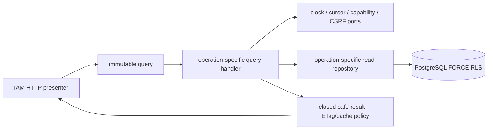

# IAM read model 与 application query 边界

> 状态：IAM-01 九个公开读取 operation 的权威补充设计；Memory application与真实PostgreSQL 18 fixed SQL/RLS repository均已GREEN，HTTP presenter接线、生产composition和E2E尚未完成。
>
> 适用 operation：`getSessionBootstrap`、`inspectAccessInvitation`、`getPolicyBundle`、`getMe`、`listMyConsentGrants`、`listMySessions`、`getOrganizationSummary`、`listOrganizationAccessInvitations`、`listOrganizationMemberships`

本文把[身份、租户、政策同意与会话](/architecture/identity-tenancy-consent.md)、[IAM HTTP transport](/architecture/iam-http-transport.md)、[IAM PostgreSQL 18 实现](/architecture/iam-postgresql-implementation.md)和 `platform/contracts/api/iam-v1.openapi.yaml` 已有的字段、RLS 与缓存约束收口成可实现的 application query 协议。它不新增写命令、状态、角色、HTTP route、PostgreSQL migration 或 outbox 事件。

## 1. 要求、完成定义与边界

| ID | 要求 |
| --- | --- |
| `REQ-READ-IAM-001` | 九个读取只能从 owning IAM 的当前持久事实构建关闭 DTO；repository row、ORM object、Session 角色快照或请求自报值不能直接成为响应。 |
| `REQ-READ-IAM-002` | SELF、exact invitation、exact public bundle 与 same-organization authority 分别使用关闭 scope；跨主体、跨组织和不可披露资源不得因列表、join、cursor 或错误细节被枚举。 |
| `REQ-READ-IAM-003` | role、Membership、Organization、Invitation、Session、Consent 与 policy 的相邻状态按本文过滤；orphan、错引用、重复唯一事实、hash/pointer 漂移一律 fail closed。 |
| `REQ-READ-IAM-004` | 四个列表使用受认证、限时、绑定 actor/operation/organization/query shape 的 keyset cursor、稳定顺序与 `limit + 1`；不用 offset、`COUNT(*)` 或 N+1。 |
| `REQ-READ-IAM-005` | 强 ETag 只来自对应 aggregate version；公开 immutable policy 可共享缓存，其余成功和全部错误 `no-store`。当前 v1 明确不支持 `If-None-Match`/304。 |
| `REQ-READ-IAM-006` | 所有查询在只读、无行锁、无隐式状态写的 bounded transaction 中执行；statement budget、UTC transaction time 与 operation-scoped RLS 可验证。 |
| `REQ-READ-IAM-007` | capability、cookie/handle、CSRF material、contact、recipient ref、provider/acceptance evidence、cursor 与异常正文不进入普通 DTO、日志、trace 或指标。 |

`TEST-APP-IAM-READ-001` 是 application/Memory 语义证据。GREEN 至少要求九个成功投影、非披露与相邻状态、policy/current/hash、pagination/cursor、ETag/cache、持久事实损坏、query budget/zero-lock 和 secret sentinel 全部通过。真实fixed SQL/FORCE RLS另由 `TEST-DB-IAM-READ-001` 证明；两层GREEN都不替代正式HTTP presenter或E2E。

本切片不实现 Session 认证本身、capability token codec、CSRF cryptography、政策发布、lifecycle 写命令、session idle touch、过期物化、审计写入或分析 read replica。HTTP kernel 在进入本边界前已经完成关闭 path/query/header/cookie 解析和 required/anonymous Session 矩阵；application 仍重新验证所有授权相关持久事实，不能把 middleware 成功当作长期 authority snapshot。

## 2. 分层与不可变 port



依赖方向固定如下：

1. presenter 只把已规范化的 path ID、`limit/cursor`、认证出的 `actor_user_id/session_id`，以及两个明确敏感入口的 raw carrier 构造成 frozen query；不得把整个 HTTP request 传入 handler。
2. handler 调用按 operation 命名的窄 repository 方法。禁止 `get(table, id)`、任意 filter mapping、caller SQL、动态 include 或把 database row 直接返回 presentation。
3. repository 在一个 `READ ONLY, READ COMMITTED` transaction 中设置 server-derived `SET LOCAL` scope，执行登记 SQL，并返回 frozen fact snapshot、同一 transaction timestamp 与实际 statement count。snapshot 的敏感事实 `repr=False`。
4. handler 独立验证 snapshot 的 actor/scope、状态、引用、顺序、版本、UTC 与 hash；只构造 OpenAPI 关闭字段。未知 fact、缺 fact 或违反本文不变量不能以空值、过滤或 fallback 掩盖。
5. result 只含 immutable safe JSON、可选强 ETag和关闭 cache policy。presentation 负责 JSON/headers，不重新查询、不重新排序、不补 policy selector。

生产 scaffold 使用九个显式 handler，并提供 operation-specific repository protocol、`ReadModelCursorCodec`、`SessionBootstrapCsrfPort` 与现有 `AccessInvitationCapabilityPort` seam。raw invitation token、raw Session handle 和 opaque cursor 在 query/value 的 `repr` 中隐藏；safe response body本身也不进入普通 repr。

## 3. 共同 actor、时间与错误顺序

认证读取的 actor 恰为：

```text
ReadActor
  actor_user_id
  current_session_id
```

它只证明 HTTP 层刚解析过一个 Session，不证明 User、SessionFamily、Session、Membership、role 或 Organization 在数据库 read transaction 中仍有效。每个认证 query 必须在同一 snapshot 中复核：User 与 Session ID/user绑定、Session/Family `ACTIVE`、current generation、aware UTC 时间，以及 `transaction_time < idle_expires_at`、`transaction_time < absolute_expires_at`。deadline 等号已失效。`getMe` 允许 User 为 `PENDING_ENROLLMENT | ACTIVE`；Organization 管理读取只允许 ACTIVE User。其他 User 状态不产生可用 DTO。

顺序固定为：关闭输入已经由 transport验证 → capability/cursor/key material preflight（适用时）→ exact scoped repository read → actor/relationship/status验证 → corruption/hash/reference验证 → stable projection。application 不因读取成功写 AuditEvent、receipt、outbox、last-seen、Session activity或过期状态；安全拒绝只可经独立无秘密 telemetry port记录关闭分类。

外部错误关闭如下：

| 情况 | 稳定错误 |
| --- | --- |
| 缺失/失效认证 Session | `AUTHENTICATION_REQUIRED`；明确达到 Session deadline可为 `SESSION_EXPIRED` |
| inspect token无效、Invitation缺失/终态/过期/错绑定 | `ACCESS_INVITATION_UNAVAILABLE` |
| 资源缺失、跨主体/跨组织、无披露关系或无 required ORG_ADMIN | `RESOURCE_NOT_FOUND` |
| cursor格式、签名、operation/actor/org/query-shape错绑或过期 | `INVALID_REQUEST` |
| selector/current pointer、policy artifact/hash/offer/document/source-grant损坏 | `POLICY_CONFIGURATION_UNAVAILABLE` |
| 其他持久事实 shape、UTC、唯一性、scope 或依赖损坏 | `SERVICE_UNAVAILABLE` |
| storage/key/cursor/capability/CSRF provider明确定义 unavailable | 窄映射 `SERVICE_UNAVAILABLE` |

repository 返回一条不属于所请求 actor/organization 的 row 不是可静默过滤的普通竞态，而是 RLS/adapter 不变量损坏：整个结果 `SERVICE_UNAVAILABLE`，不得返回部分页。只有经过 scope 验证后的“不存在/无关系”才使用非披露 404。编程错误和取消信号不被宽捕获伪装成合法空页。

## 4. 九个 operation 的权威语义

| operation | authority 与权威来源 | 状态/排序 | 输出与 cache |
| --- | --- | --- | --- |
| `getSessionBootstrap` | exact current Session、Family、User；CSRF 只由 retained key + raw handle + 持久 salt/session/generation/digest 经独立 port重建 | Session/Family ACTIVE/current且未到两个deadline；User PENDING或ACTIVE | `SessionBootstrapDto`；无 ETag；`no-store` |
| `inspectAccessInvitation` | capability verifier给出 exact ID/nonce/key/format/expiry，再由 INVITATION scope读取 Invitation、可选 Organization公开名及其 stored selector current | Invitation恰 ISSUED且未过期；creator无Organization，initial-admin只允许PENDING_ADMIN，普通组织邀请只允许ACTIVE Organization | `AccessInvitationPreviewDto` + Invitation ETag；`no-store`；零写/零receipt |
| `getPolicyBundle` | exact path bundle、其 selector/current、ordered bundle documents、offers/categories | bundle与documents均ACTIVE/effective；selector current恰指向它；documents按position，offers按`(purpose,id)`，categories按position | `PolicyBundleDto` + bundle ETag；`public, max-age=31536000, immutable` |
| `getMe` | hardened SELF summary + active authority grants + exact source Invitation + stored selector/current/documents +本人 acceptances | User PENDING时只有基础 DTO；ACTIVE时只投影 ACTIVE Membership + ACTIVE Organization和未撤销 grants；稳定按Organization/Membership、role和requirement key排序 | `MeDto` + User ETag；`no-store` |
| `listMyConsentGrants` | SELF ConsentGrant、categories、Withdrawal；owner只取 actor | 返回全部受保留 `ACTIVE/WITHDRAWN/EXPIRED`；到期但尚标ACTIVE在读取时投影EXPIRED且不写库；`(granted_at DESC,id DESC)` | `ConsentGrantPageDto`；每项 grant ETag；`no-store` |
| `listMySessions` | SELF Session/Family；current ID来自actor，不由客户端指定 | 返回保留期内 ACTIVE/REVOKED/EXPIRED；到期ACTIVE只投影EXPIRED；`expires_at=min(idle,absolute)`；`(created_at DESC,id DESC)` | `SessionPageDto`；无item ETag（机器 DTO未发布）；`no-store` |
| `getOrganizationSummary` | path Organization + actor exact ACTIVE Membership和至少一个未撤销合法组织role | User/Organization/Membership均ACTIVE；ORG_ADMIN或DEMAND_OWNER均可读summary | `OrganizationSummaryDto` + Organization ETag；`no-store` |
| `listOrganizationAccessInvitations` | same-org ACTIVE Membership +未撤销ORG_ADMIN；Invitation直接保存的org/selector/mask | 返回该组织保留的四种状态；到期ISSUED投影EXPIRED；每项current bundle沿stored selector解析；`(created_at DESC,id DESC)` | `AccessInvitationPageDto`；每项 Invitation ETag；`no-store` |
| `listOrganizationMemberships` | same-org ACTIVE Membership +未撤销ORG_ADMIN；target Membership、User稳定handle与source-bound role facts | 返回该组织 ACTIVE/SUSPENDED/REVOKED；ACTIVE/SUSPENDED使用未撤销角色，REVOKED返回终结前的历史role label；`(created_at DESC,id DESC)` | `MembershipPageDto`；每项 Membership ETag；`no-store` |

same-org `DEMAND_OWNER` 可以读取 Organization summary，因为它是 ACTIVE member；它不能读取两个管理列表。缺 ORG_ADMIN、跨组织、inactive actor relationship 与不存在 Organization 在两个管理列表统一 404，不借 403 暴露“组织存在但你只是普通成员”。

## 5. 关闭事实与 corruption 判定

### 5.1 Session 与 Consent

- 所有持久时间必须是 offset 0 的 aware UTC，并满足 `created_at <= last_activity_at < idle_expires_at <= absolute_expires_at`；transaction time同样为UTC。
- current Session恰等于 query actor的 Session ID、User和Family；一个 page不允许重复 Session ID或重复 stable sort key。Session DTO不得含 family ID、generation、digest/key/salt、auth_time/acr/amr、IP、User-Agent或onboarding binding。
- ConsentGrant 的 owner、offer/version、bundle、purpose/scope、ordered unique categories、recipient/document/hash与时间 shape必须完整。`WITHDRAWN` 要求恰一条同ownerWithdrawal与合法时间；`ACTIVE/EXPIRED`不得伪造 withdrawn字段。internal `recipient_ref`和认证 evidence仅用于一致性验证，绝不投影。

### 5.2 Invitation、Organization 与 Membership

- Invitation 的 purpose/org/scope/role/initial-admin shape、capability nonce/key/format/expiry、aggregate version 与 stored selector必须一致。inspect绝不投影 mask/contact/issuer/token facts；admin list只允许已存不可逆 mask。
- ACTIVE/PENDING_ADMIN Organization 的合法 invitation组合按主设计复核；SUSPENDED/CLOSED Organization不产生匿名 preview或管理读取。
- `/me` 只显示 ACTIVE Membership + ACTIVE Organization。管理 Membership page为审计/管理透明度显示三种 retained状态；REVOKED row仍必须有 exact source Invitation和恰一个历史 IAM-01 role fact，不能以空roles满足 OpenAPI。
- 任一 Membership/role 的 User、Organization、source Invitation、selector或target role错配是服务端损坏，不因目标 row不可见而拼装跨租户 DTO。

### 5.3 Policy/current/hash

每个需要政策的读取都使用持久 selector digest，不按 role、locale、jurisdiction、`Accept-Language`、最新时间或 issued bundle重算/猜测：

1. selector canonicalization版本、facts和独立复算digest必须一致；
2. `current_bundle_id`非空，且指向同selector唯一 ACTIVE/effective bundle；
3. bundle/document/offer关联、document position与required集合唯一；document immutable identity `(kind, locale, jurisdiction, semantic_version)` 在release内唯一；
4. 从 canonical UTF-8 body独立复算 `content_sha256`；
5. 从全部内部 `consent-offer-json-v1` facts、ordered categories和supporting `CONSENT_TEXT` document独立复算 `canonical_offer_sha256`；
6. `/me` 的每个 active grant必须有 exact ACCEPTED source Invitation，且 grant selector/role/scope逐字段一致；satisfied只由 actor对 current required document ID/hash的append-only acceptance决定。

任一步失败为 `POLICY_CONFIGURATION_UNAVAILABLE`，不回退到 issued、latest、旧ACTIVE、空bundle或“unsatisfied但可继续”。合法未接受文档则不是 corruption：requirement返回 `satisfied=false` 与按bundle position稳定排列的 `missing_document_ids`。

## 6. Pagination 与 cursor

四个 list operation 使用 `iam-read-cursor-v1`，raw cursor为敏感载体且 `repr=False`。codec只接受受支持的 retained keyed HMAC/AEAD版本；关闭 claims 恰为：

```text
version, key_id, operation_id, actor_user_id, organization_id?,
page_limit, query_shape_digest, snapshot_at,
after_created_at, after_id, issued_at, expires_at
```

- 首页默认 `limit=25`，范围1..100；repository读取 `limit + 1`，返回至多limit项并只在确有下一项时编码cursor。
- `snapshot_at`来自首个read-only数据库transaction time；后续页固定 `created_at <= snapshot_at`，再按 `(created_at,id) < (after_created_at,after_id)` 取下一页。ID比较使用数据库UUID byte order，cursor保存canonical UUID，不由application做locale/text排序。
- cursor绑定 exact operation、actor、organization（适用时）、limit与版本化query-shape digest；跨主体、跨组织、跨operation、改变limit、篡改、unknown key/version、未来issued time或 `server_now >= expires_at` 均为 `INVALID_REQUEST`。首版TTL为15分钟exclusive。
- rows必须严格按 `(created_at DESC,id DESC)`、ID唯一且全部位于snapshot/keyset窗口。乱序、重复、超出scope或repository返回超过`limit + 1`是 `SERVICE_UNAVAILABLE`。
- 不执行 offset、`COUNT(*)`、共享“总数”缓存或逐row child query。并发新row在第一页snapshot之后不可插入当前遍历；合法状态更新可能使后页row不再可见，但不能导致跨scope回填。

## 7. ETag、If-None-Match 与缓存

强 ETag固定为 `"v<aggregate_version>"`，version必须是正整数。handler不从JSON bytes、updated_at、hash或客户端header猜测：Invitation/ConsentGrant/Membership逐项取自身version，`getMe`取User，Organization summary取Organization，PolicyBundle取bundle。

当前 OpenAPI v1没有登记 `If-None-Match` parameter或304 response；HTTP关闭header grammar也因此不接受该carrier。本设计明确选择 **v1不做条件读取**：application query不接收If-None-Match、不返回not-modified，ETag仅作为immutable完整性/后续If-Match来源。未来若加入304，必须先同步OpenAPI、HTTP kernel/presenter和RED，并规定private 304仍`no-store`、public policy 304仍携带immutable cache policy；不得在application层先做隐藏支持。

只有 exact ACTIVE immutable `getPolicyBundle` 成功可共享缓存。Session bootstrap、inspect、`/me`、两个SELF列表、三个Organization读取及全部错误均`Cache-Control: no-store`；private ETag不授权shared cache。缓存key不能替代actor/organization/current authority验证。

## 8. PostgreSQL profile、查询预算与锁

本 application设计不修改现有 migration。真实adapter进入GREEN前必须以forward migration/登记SQL补齐下列operation profile和真实RLS证据；当前宽泛 `SELF/ORGANIZATION` relation grants本身不证明查询安全。

| operation | scope/role | statement上限 | 必需固定读取 |
| --- | --- | ---: | --- |
| session bootstrap | SELF / `iam_app`，exact actor+session | 1 | Session + Family + User关闭join |
| inspect | INVITATION / `iam_onboarding`，exact capability ID | 1 | safe preview + stored selector current |
| public policy | PUBLIC_POLICY_READ / `iam_app`，exact bundle | 3 | bundle/selector；ordered documents；offers+categories bulk |
| me | SELF / `iam_app`，exact actor+session | 2 | hardened self summary；active grant/current requirement bulk query |
| consent page | SELF / `iam_app` | 2 | `limit+1` grants；categories/withdrawals bulk |
| session page | SELF / `iam_app` | 1 | `limit+1` Session+Family projection |
| organization summary | ORGANIZATION / `iam_app` | 1 | actor relationship + exact Organization |
| organization invitation page | ORGANIZATION / `iam_app`，ORG_ADMIN | 2 | actor authority；`limit+1` rows+current selectors bulk |
| organization membership page | ORGANIZATION / `iam_app`，ORG_ADMIN | 2 | actor authority；`limit+1` members+users+roles bulk |

上限不含进程内 capability/cursor/CSRF cryptography。每个query transaction必须 `READ ONLY, READ COMMITTED`，禁止 `SELECT FOR UPDATE`、advisory lock、temporary table、dynamic SQL、DDL、receipt/audit/outbox或过期物化。SQL timeout、row/result byte上限与statement count进入测试；正文policy bundle总响应仍受HTTP 200 KiB/document及整体response budget的后续presenter门禁。

`iam_api.read_me_self_summary()`仍是 `/me` Organization allowlist的唯一 SECURITY DEFINER入口；其他八项不新增SECURITY DEFINER。Organization admin query必须由transaction内 exact actor Membership/role事实设置scope，客户端 path只指定target Organization，不能直接成为authority。真实测试必须用非owner、无BYPASSRLS在线role，并覆盖direct/join/pagination/cursor跨租户负例。

## 9. 隐私、观测与故障

允许的 read telemetry恰为：operation ID、稳定outcome code、公开/认证布尔、粗粒度row-count/latency bucket、cursor present布尔和server trace ID。不得接收 query/snapshot/result/exception object。以下值禁止进入普通response（显式CSRF字段除外）、repr、log、trace、metric或error：

- raw Session handle、cookie、handle/CSRF digest、salt/key、Session family/onboarding/auth evidence；
- invitation capability、nonce/key、recipient contact/mask（inspect）、issuer内部凭据；
- contact/subject digest、locator、internal consent recipient ref、Withdrawal reason/evidence；
- raw cursor、cursor claims/key、SQL/bind values、policy release manifest/signature/approval；
- exception `repr/args`、arbitrary repository field或policy canonical input。

`getSessionBootstrap.csrf_token` 是OpenAPI明确的敏感 no-store响应字段：它可进入关闭body，但response/query dataclass的repr必须隐藏，且不能进入telemetry。policy正文是公开C层内容，仍不得因异常把整个body写入log。

storage/cursor/capability/CSRF provider在调用前明确unavailable时，handler窄映射并保持零写；query transaction不涉及COMMIT outcome unknown。客户端disconnect/timeout由HTTP读操作取消协议处理，不授权application重试或返回未验证partial page。

## 10. TDD 顺序与发布门禁

1. **Design → semantic RED（已完成）**：先发布本文、immutable query/port与default-deny handlers；独立测试import成功，结构/privacy护栏可通过，所有业务差异稳定来自 `IAM_READ_MODEL_BEHAVIOR_NOT_AVAILABLE`。
2. **Application GREEN（已完成）**：只用strict Memory repository/cursor/capability/CSRF/clock doubles，实现九个投影、错误与预算；不修改HTTP router、命令handler或PostgreSQL artifact求绿。
3. **PostgreSQL RED→GREEN**：新增forward migration/固定statements与operation-specific FORCE RLS；用真实PostgreSQL 18证明scope、query count/no-lock、hash/orphan和cursor并发。
4. **Presentation RED→GREEN**：显式九个presenter映射safe result到现有OpenAPI。若需要公开503响应声明，先同步机器契约；v1仍不接受If-None-Match，除非先完成第7节的契约变更。
5. **E2E**：真实ASGI server下验证cache/ETag、分页、跨租户、Session rotation后的读取与secret telemetry；private read不得进入shared cache。

不得通过以下方式转绿：把default-deny当合法503、过滤corrupt row后返回partial result、按latest policy猜current、信任Session role snapshot、让cursor不绑定actor/org、动态降低statement count断言、返回raw repository mapping，或删除secret sentinel。

## 11. 与现有设计的关系

- [身份、租户、政策同意与会话](/architecture/identity-tenancy-consent.md)拥有状态、角色、字段allowlist、错误与policy/consent语义；本文只关闭读取执行协议。
- [IAM HTTP transport](/architecture/iam-http-transport.md)拥有byte/header/cookie/query解析、认证前置和HTTP序列化；本文不修改route registry。
- [IAM PostgreSQL 18 实现](/architecture/iam-postgresql-implementation.md)拥有schema、role、RLS与fixed SQL；本文明确后续read query migration的新增义务，不改已有artifact。
- [IAM 权限、Consent 与 Session 生命周期](/architecture/iam-authority-lifecycle.md)拥有六个写命令；read handler永不调用SafetyHold或复用command receipt。
- [目标平台架构](/architecture/target-platform.md)要求按recipient生成DTO；本页是IAM-01第一个可执行read-model实例。

## 12. 当前可执行证据

2026-08-08 的 contract-first 步骤先取得 `Ran 2 tests`、`9 failures`、`0 errors`：九个读取逐一缺少持久事实损坏的 503。只补 OpenAPI 的单一 `503 -> ServiceUnavailable` 后，新 contract `2/2` 与既有 contract `22/22` 均通过；机器契约仍明确没有 `If-None-Match` parameter或304。

application semantic 命令为：

```bash
cd platform
uv run python -m unittest -v tests.read_models.test_iam_read_models_red
```

初始结果是有效 RED：退出状态 `1`，`Ran 9 tests`、`82 failures`、`0 errors`。82个差异分别覆盖success 9、scope/non-disclosure 6、adjacent状态9、policy corruption 9、pagination/cursor 13、ETag/cache 9、bounded read/corrupt fact 18和secret-safe成功结果9；结构不可变、detached snapshot和敏感carrier隐藏已经通过。失败统一为default-deny `IAM_READ_MODEL_BEHAVIOR_NOT_AVAILABLE`，没有ImportError、依赖或fixture错误。

随后保持测试、fixture、OpenAPI、HTTP router、IAM命令、PostgreSQL artifact与Outbox不变，在application边界实现九个关闭DTO、同snapshot actor/tenant/status校验、selector/current/document/offer独立hash、cursor/keyset、UTC/statement budget、强ETag/cache和无秘密telemetry。相同命令结果为 `Ran 9 tests in 0.044s`、全部 `OK`；既有contract与read contract合跑`24/24`。非storage既有回归`228/228`，并行Outbox PostgreSQL v8收口后的storage`68/68`，既有基线为`296/296`；再加本切片read semantic 9项与新增contract 2项，当时受控集合为`307/307`。

后续 `TEST-DB-IAM-READ-001` 在真实PostgreSQL 18取得`9/9 OK`：九个fixed-query program、shared cursor digest、`READ ONLY`/UTC scope、FORCE RLS与伪Organization、status/orphan/hash损坏、四种keyset分页、同PID pool scope reset和secret sentinel均通过；完整storage当轮`106/106 OK`。权威SQL、migration digest与最新回归见[IAM read model PostgreSQL实现](/architecture/iam-read-model-postgresql.md)。因此本页现在同时标记Memory与PostgreSQL repository GREEN；正式presenter、production composition和浏览器E2E仍planned。
