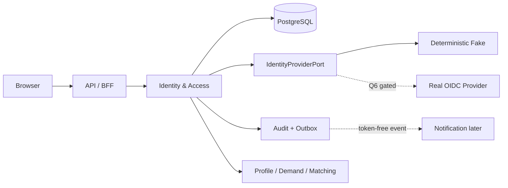
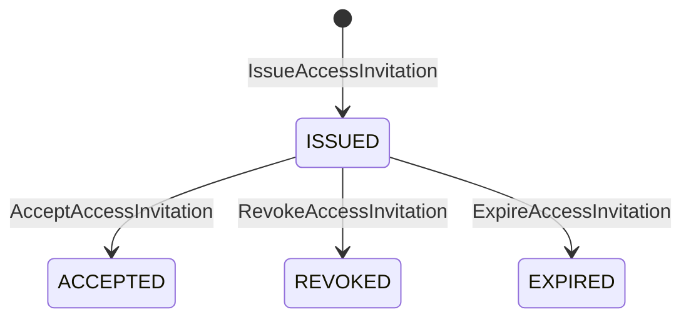

# 身份、租户、政策同意与会话设计

> 状态：目标平台 IAM-01 权威设计，Q0 设计就绪；领域/授权、Memory application、OIDC协议编排、HTTP/ASGI协议内核，以及 migration/真实PostgreSQL 18/RLS/`AcceptAccessInvitation`/`AcceptCurrentPolicies`/`GrantConsent`/九个read model/Outbox persistence 已按各自设计页取得分层GREEN。当前IAM catalog为v0–v16；0015只提供Creator Profile exact SELF/matcher capability，0016只提供Demand owner/reviewer exact authority，均不把消费Context的schema并入IAM。其他lifecycle生产repository、正式HTTP presenters、server/composition、真实identity provider/broker与跨层E2E仍未完成。当前仍没有对外启用的完整成功路径，也未启用真实供应商；真实身份资料和真实登录继续受 [ADR-0001](/decisions/0001-platform-scope-and-delivery.md) 的启用门槛控制。

## 1. 目标与权威边界

IAM-01 是[目标平台首个垂直切片](/architecture/platform-domain-model.md#20-首个垂直切片)的最小前置切片：

> 内部引导 Organization → 受邀者经 fake OIDC 认证 → 查看并接受精确版本政策、单独选择可撤回 consent → 接受 AccessInvitation → 激活账户角色或组织 Membership → 通过 `/v1/me` 观察当前授权 → 撤销立即生效。

该结果可由真实角色发起，跨过 API、领域、PostgreSQL、授权、审计和 outbox 边界，并有清晰人工降级，因此是垂直切片；“先建通用 User 表”或“先搭登录页面”不算完成。

本文是以下事项的权威来源：

- Identity & Access Context 的术语、聚合、命令、状态和事件；
- Organization 租户边界、角色作用域和授权矩阵；
- OIDC provider port、确定性 fake、BFF Session 和协议例外；
- PolicyAcceptance、ConsentGrant、撤回和政策升级语义；
- PostgreSQL 表、唯一约束、复合外键、RLS 和字段分层；
- API、错误、隐私、幂等、并发、故障与 TDD 验收。

发生冲突时：本页的 IAM 细节落实[目标平台领域模型](/architecture/platform-domain-model.md)的全局规则；租户与角色作用域以 [ADR-0002](/decisions/0002-tenant-root-and-role-scopes.md)为准；认证、Session 与协议例外以 [ADR-0003](/decisions/0003-oidc-bff-session-and-protocol-exceptions.md)为准；onboarding 绑定、单角色邀请、ConsentOffer、receipt、Session family 与 PostgreSQL 执行协议以 [ADR-0004](/decisions/0004-iam-onboarding-persistence-and-postgres.md)为准。本文不得改变其他 Context 的聚合状态。

## 2. 范围与显式非目标

### 2.1 本切片实现

- 内部 `BootstrapOrganization`，创建真实 Organization 和首个 ORG_ADMIN AccessInvitation；
- `CREATOR_ENROLLMENT` 与 `ORGANIZATION_MEMBERSHIP` 两种受邀入口；
- OIDC Authorization Code + PKCE 端口、严格 fake 和受限 BFF Session；
- User、ExternalIdentity、Organization、Membership、账户/组织角色；
- 不可变 PolicyDocument/PolicyBundle、append-only PolicyAcceptance；
- 按用途、范围、数据类别和接收者表达的 ConsentGrant/ConsentWithdrawal；
- 邀请接受、政策升级、Membership 暂停/恢复/撤销、Session 撤销；
- `/v1/me`、政策读取、邀请管理和当前 Session 的安全 DTO；
- PostgreSQL 真实事务、唯一约束、RLS、审计、outbox 和命令收据；
- 内部 PolicyBundle 发布命令、SafetyHoldDecisionPort 严格 fake 与生产/fake 配置硬守卫；
- fake provider、手工安全发送邀请链接和真实能力关闭开关。

### 2.2 本切片不实现

- 公开注册、开放组织创建、社交登录列表或发现型加入入口；
- 本地密码、密码恢复、跨 provider 自动账号合并或身份绑定管理 UI；
- 真实 OIDC/WebAuthn、KYC/AML、身份证件保存或身份供应商生产适配器；
- CreatorProfile、Demand、Matching Invitation、Project、Payment 或 Trust 案件；
- 邮件/短信自动发送邀请、通用通知偏好或营销消息；
- 每次候选资料披露的 UI；本页只定义后续可引用的 purpose-scoped consent 事实；
- 用户数据权利工作流的完整编排、法律保留裁定或跨境数据路由；
- 平台运营角色的自助授予、break-glass UI 或通用权限编辑器。

上述identity linking、provider丢失后的恢复与账户关闭不是永久省略，而是由[独立后续设计](/architecture/iam-identity-linking-recovery-and-closure.md)拥有；数据权利、法律保留与清除由[Data Rights设计](/architecture/data-rights-retention-and-erasure.md)拥有。两者机器契约与安全门禁完成前保持default-deny，不能塞回首个IAM-01 invitation切片。

真实 provider 未启用时，邀请链接由有权操作者在现有受控外部渠道人工传递。这个人工路径是正式降级，不允许测试代码把真实联系人写入普通日志或 fixture。

## 3. 稳定要求标识

| REQ | 要求 |
| --- | --- |
| `REQ-IAM-001` | 新 User 只能经有效 AccessInvitation 进入；公开注册始终关闭 |
| `REQ-IAM-002` | BootstrapOrganization 原子创建 Organization 与首个 ORG_ADMIN 邀请，不通过直接改库造管理员 |
| `REQ-IAM-003` | 接受邀请原子写入 User/角色或 Membership、政策事实、邀请终态、审计和 outbox；并发最多一次成功 |
| `REQ-IAM-004` | 每个不使用通用 Idempotency-Key/If-Match 的协议入口都有枚举的等价防重放控制 |
| `REQ-IAM-005` | 每个 AccessInvitation 恰好一个目标角色；命令收据、capability 重建和 commit-unknown 有唯一协议 |
| `REQ-AUTH-001` | OIDC fake 与 adapter 统一验证 code + PKCE、state、nonce、issuer、audience、redirect 和时间窗 |
| `REQ-AUTH-002` | AccessInvitation 绑定已验证接收者；平台不以邮箱自动合并或恢复账户 |
| `REQ-AUTH-003` | AuthTransaction 与 Session 服务端绑定 browser、purpose、expected User、Invitation 和 verified contact；accept 不再次接收 token |
| `REQ-SESSION-001` | 浏览器使用可撤销 BFF Session、cookie/CSRF/Origin/CORS 防护，并在认证或提权后轮换 |
| `REQ-SESSION-002` | logout、Session family 重放、User 暂停和 Membership 暂停具有即时且不同的影响范围 |
| `REQ-TENANT-001` | Organization 是组织资源租户根；直接、关联、分页和写入均不能跨租户 |
| `REQ-TENANT-002` | 角色按账户、组织、项目/案件和平台职责分域；ORG_ADMIN 不得授予域外角色 |
| `REQ-TENANT-003` | 请求显式解析资源 Organization，不使用具有授权意义的 session active tenant |
| `REQ-CONSENT-001` | 必需政策接受绑定不可变文档 ID、版本和内容哈希；政策升级后旧接受不能继续授权新写入 |
| `REQ-CONSENT-002` | 可撤回 consent 与政策确认分离；拒绝或撤回只影响声明的 purpose/scope，不伪造历史删除 |
| `REQ-CONSENT-003` | ConsentGrant 的 purpose/categories/recipient/document/expiry 只从不可变 ConsentOffer 派生 |
| `REQ-POLICY-IAM-001` | PolicyBundle 通过内部生产命令按 exact selector 原子发布/替代；Invitation 与 role grant 固化 selector digest，current 只接受同 selector 的 ACTIVE/effective bundle，测试与运行使用同一路径 |
| `REQ-POLICY-CMD-001` | 独立接受政策/授予Consent必须引用`/me`的一条exact stored authority与其current bundle；不得在多个grant中任取，客户端不得自由声明Consent scope |
| `REQ-HOLD-IAM-001` | 授权增加/恢复命令经版本化 SafetyHoldDecisionPort fail closed；安全降权动作不被 hold 阻止 |
| `REQ-DB-IAM-001` | IAM 使用 PostgreSQL 18/current security minor、psycopg 3、READ COMMITTED + 固定行锁/约束、有限安全重试、operation-scoped FORCE RLS 与 checksummed migration runner |
| `REQ-PRIVACY-IAM-001` | token、联系人、provider subject、Session secret 和 consent evidence 不进入普通 DTO、日志、trace、outbox 或通知 |
| `REQ-AUDIT-IAM-001` | 每个成功业务命令与拒绝的高风险尝试都有最小、可关联且不含秘密的审计证据 |
| `REQ-OUTBOX-001` | 已提交的安全事件按受控 schema 至少一次投递；worker lease/fencing、故障重试与消费者 event_id inbox 不伪造 exactly-once |
| `REQ-MIG-IAM-001` | 当前 MVP `consent_version` 与匿名 ID 只能成为待核对 legacy evidence/external ref，不能激活平台授权 |
| `REQ-API-IAM-001` | API 具有版本化 schema、字段允许列表、稳定错误代码、大小限制和不可枚举语义 |
| `REQ-HTTP-IAM-001` | OpenAPI operation 经关闭 parser、Session/Origin/CSRF 与稳定错误边界可达；ASGI 断线/超时不扩大重试或秘密暴露面 |
| `REQ-READ-IAM-001` | 九个公开读取只从 owning IAM 当前持久事实构建关闭 recipient DTO，不直接序列化 repository row 或 Session authority snapshot |
| `REQ-READ-IAM-002` | SELF、invitation、public policy与organization读取使用exact scope并保持跨主体/租户/列表非披露 |
| `REQ-READ-IAM-003` | 相邻状态、orphan、错引用、current pointer与hash drift按关闭规则过滤或fail closed，不返回partial projection |
| `REQ-READ-IAM-004` | 四个列表使用actor/org/query绑定的限时keyset cursor、stable ordering与`limit + 1`，不用offset/N+1 |
| `REQ-READ-IAM-005` | strong ETag只取aggregate version；仅exact immutable policy可共享缓存，v1不支持If-None-Match/304 |
| `REQ-READ-IAM-006` | query使用只读无锁bounded transaction和固定statement budget，读取不隐式写last-seen/expiry/audit/outbox |
| `REQ-READ-IAM-007` | token/cookie/cursor/contact/internal recipient与security evidence不进入普通DTO、repr或观测面 |
| `REQ-ENABLE-IAM-001` | fake 通过只证明隔离环境能力；真实身份、联系人和 provider 默认关闭并需 Q6 审批 |
| `REQ-CONFIG-IAM-001` | production/real-data 模式拒绝 fake issuer，fake 与 real provider 不允许隐式 fallback |

ID 一经评审不得重用；取消项保留并指向替代要求。

## 4. 术语

| 术语 | 规范含义 | 不是 |
| --- | --- | --- |
| User | 平台内可被授权、暂停和审计的全局主体 | 邮箱、OIDC token、自然人 KYC 结论 |
| Actor | 一次命令中解析出的 User 或受认证 SYSTEM，带原始 actor、认证强度和作用域 | 客户端自报的 user_id/role |
| ExternalIdentity | `(issuer, subject)` 与 User 的受控绑定 | 公开登录名或自动账号合并依据 |
| IdentityVerification | 法律/KYC 或组织代表验证的独立状态 | OIDC 登录成功 |
| Organization | 真实组织拥有资源的租户根 | 为每个个人 User 自动创建的技术容器 |
| Membership | User 与一个 Organization 的状态化关系 | 已发送但尚未接受的邀请 |
| UserRoleGrant | 账户级角色授予；首切片只允许 CREATOR，并固化授权来源的 policy selector digest | 组织或项目权限，或由展示层按角色重算的政策选择器 |
| MembershipRoleGrant | 一个 Membership 下的组织角色授予，并固化授权来源的 policy selector digest | 跨组织角色，或只靠当前 Organization/role 临时推导的政策要求 |
| AccessInvitation | 加入平台或 Organization 的一次性、限时、可撤销授权 | Matching Context 的业务 `Invitation` |
| PolicyDocument | 不可变、可阅读、带版本/内容哈希和法律效果标签的政策文本 | 一个布尔 consent |
| PolicySelector | 对 access purpose、scope type、target role、jurisdiction、locale 的关闭、版本化 canonical facts 取 digest 后形成的稳定政策选择根 | 按请求语言、当前角色或 `created_at` 临时拼出的查询条件 |
| PolicyBundle | 一个 exact PolicySelector 在确定生效窗口要求的一组不可变 PolicyDocument | 可原地修改的“当前条款”数组 |
| ConsentOffer | PolicyBundle 发布的不可变可选授权提议，冻结 purpose、scope 规则、data categories、recipient、文档和 expiry policy | 客户端可自由组合的 consent JSON |
| PolicyAcceptance | User 在确定认证上下文中确认看到并接受/确认一份精确文档的 append-only 事实 | 可撤回的可选数据处理 consent |
| ConsentGrant | User 对具体 purpose、scope、数据类别、接收者和期限作出的肯定授权 | 覆盖所有未来用途的一次同意 |
| ConsentWithdrawal | 对一个 ConsentGrant 的 append-only 撤回事实 | 删除历史协议、付款或审计的指令 |
| AuthTransaction | OIDC 开始到 callback 的短期、一次性协议状态 | 已登录 Session |
| SessionFamily | 一条登录/step-up/提权轮换链，强制单一 ACTIVE successor | 可并行产生多个有效 refresh 分支的标签 |
| Session | BFF 维护的可撤销浏览器登录状态，并保存一次性 onboarding/contact 引用 | 角色、Membership 或政策事实来源 |

## 5. Context 边界与数据流



IAM 拥有 User、Organization、Membership、角色、AccessInvitation、政策/同意、认证绑定和 Session。下游 Context 只能读取授权决策或订阅最小事件，禁止：

- 直接更新 IAM 表；
- 用 CreatorProfile、Demand 或 Project 状态恢复被暂停的 User/Membership；
- 把 OIDC claim 当成业务角色；
- 在事件中复制联系人、token、provider subject 或 consent 原文；
- 让通知投递结果决定邀请是否已创建或接受。

IAM 接收身份供应商的验证结果，但不把登录等同于 IdentityVerification。Trust 后续可通过事件请求 User 暂停；首切片只提供内部端口和可测试状态，不实现案件流程。

## 6. 角色作用域与授权矩阵

### 6.1 作用域

角色作用域遵循 [ADR-0002](/decisions/0002-tenant-root-and-role-scopes.md)：

| Scope | 首切片角色 | 授予入口 | 必需关系 |
| --- | --- | --- | --- |
| USER | `CREATOR` | SYSTEM 发出的 `CREATOR_ENROLLMENT` AccessInvitation | actor 就是该 User |
| ORGANIZATION | `ORG_ADMIN`、`DEMAND_OWNER` | Bootstrap 或同组织 ORG_ADMIN 发出的 `ORGANIZATION_MEMBERSHIP` AccessInvitation | ACTIVE Membership |
| PROJECT/CASE | 后续角色 | Deferred | 明确 assignment，角色本身不足 |
| PLATFORM | `SYSTEM` 与后续运营职责 | 受控部署/职责分离，无公开 API | 任务身份、工单、原因或分配 |

`CREATOR` 不要求虚构 Organization。User 可以同时是 CREATOR、多个 Organization 的 DEMAND_OWNER，并在其中一个 Organization 是 ORG_ADMIN；每个命令仍只使用所需的最小作用域。

### 6.2 首切片命令矩阵

| Actor / relationship | 动作 | 允许 | 附加守卫 |
| --- | --- | --- | --- |
| 内部 SYSTEM | Bootstrap Organization | 是 | feature flag、唯一 client_reference、受控调用身份 |
| 内部 SYSTEM | 发出 CREATOR_ENROLLMENT | 是 | 角色只能是 CREATOR；受认证且 operation-scoped 的近期受控 workload credential；无 User Session fallback |
| 本组织 ORG_ADMIN | 发出组织成员邀请 | 是 | Organization、issuer User/Membership/ORG_ADMIN grant 与 exact Session 全部 ACTIVE；只用 Session 持久化 auth facts判定近期 MFA；target_role 恰为 ORG_ADMIN 或 DEMAND_OWNER |
| 另一组织 ORG_ADMIN | 管理本组织之外邀请/Membership | 否 | 对外按不可披露资源处理 |
| 未认证且持有 token | inspect AccessInvitation | 仅安全预览 | 限速、无状态变更、不得显示 recipient |
| 已认证预期接收者 | 接受 AccessInvitation | 是 | 每次先完成 exact Invitation OIDC；Session exact invitation/contact ID、期限、政策、If-Match、无现存冲突角色/关系 |
| 已认证非接收者 | 接受 AccessInvitation | 否 | 统一 `ACCESS_INVITATION_UNAVAILABLE`，内部审计具体原因 |
| User | 读取 `/v1/me`、接受政策、管理自己的 consent/Session | 是 | 只访问自己的允许字段 |
| ORG_ADMIN | 暂停/恢复/撤销本组织 Membership | 是 | 近期 MFA、原因；不得移除最后一个 ACTIVE ORG_ADMIN |
| ORG_ADMIN | 暂停 User 或授予平台/账户角色 | 否 | 没有公开入口 |
| SYSTEM/TRUST 内部端口 | 暂停 User | 有条件 | 标准原因、case/ticket、职责分离在 Trust 切片补齐 |

每个允许项的测试必须同时覆盖：同角色无资源关系、相邻状态、错误作用域、字段脱敏和 hold/政策失效。未列出的组合默认拒绝。

### 6.3 字段允许列表

- `MeDto`：user_id、User status、User aggregate_version 与强 ETag、显示用稳定 handle、`policy_requirements[]`、本人 UserRole、本人 Membership 的 organization_id/公开名称/status/组织角色及各 Membership aggregate_version/强 ETag；每个 policy requirement 分别携带 exact selector digest、purpose、显式 role、scope type/ID、satisfied、required bundle 与 missing document IDs，不把多角色/多组织主体压成一个“当前 bundle”。selector digest 必须来自对应 ACTIVE `UserRoleGrant` 或 `MembershipRoleGrant` 保存的不可变列；application 沿该 digest 读取 selector 的 current ACTIVE/effective bundle，presentation 只能投影读取结果，不能依据 role、Organization、locale 或 jurisdiction 重新选择 facts 或计算 digest。Session 由独立 `/auth/session` 与 `/me/sessions` DTO 提供。本 DTO 不含 ExternalIdentity subject、recipient digest、内部风险原因或 consent evidence 元数据。
- `AccessInvitationPreviewDto`：invitation_id、purpose、单一 target_role 标签、expires_at、required_policy_bundle_id、aggregate_version、Invitation 自身的强 `entity_tag`，以及可选的 `organization: OrganizationInvitationPreviewDto`；不含 recipient、issuer 内部身份、token nonce 或审计原因。`OrganizationInvitationPreviewDto` 只含 `public_name`，不复用带 organization_id、status、version 或 ETag 的 `OrganizationSummaryDto`。
- `AccessInvitationAdminDto`：上述安全字段、状态、created_at、masked recipient label、接受时重新解析的 `required_policy_bundle_id`、aggregate_version 与同版本强 ETag；不返回可逆联系人、token 或被接受者 ExternalIdentity。`required_policy_bundle_id` 是当前 selector 结果，不把仅供审计的 issued bundle 冒充当前要求。
- `SessionDto`：session_id、created_at、last_activity_at、expires_at、当前/其他设备布尔值、粗粒度设备标签；不含 cookie digest、CSRF secret、完整 IP 或 User-Agent。
- `PolicyBundleDto`：公开文档正文、document_id、kind、version、locale、content_sha256、legal_effect，以及当前 bundle 的关闭 `ConsentOfferDto`；不含其他用户接受事实或服务端派生的 controller 内部资料。
- `ConsentOfferDto`：offer ID、purpose、公开 scope/category 标签、需确认的 document ID/hash、稳定 `recipient_label`、关闭的 expiry rule、必需 `not_after`、optional 与 `canonical_offer_sha256`。内部 version 参与哈希但不另作可修改客户端字段；哈希覆盖服务端将派生的完整 canonical facts，内部 `recipient_ref` 可参与服务端 canonical 输入但绝不作为响应字段暴露，客户端只能看到经发布审核的 `recipient_label`。
- `ConsentGrantDto`：grant ID、purpose、公开 scope/category/recipient label、document ID/hash、granted/expires/withdrawn 状态、aggregate_version 与逐项强 ETag；不返回内部 recipient ref、Session/auth evidence 或撤回说明正文。

### 6.4 Safety hold 判定

首切片定义版本化 `SafetyHoldDecisionPort.evaluate(actor_id, action, target_type, target_id, target_version, organization_id?, policy_version)`，并提供可注入的严格 fake。返回不可变 `SafetyHoldDecisionResult`：`decision=ALLOW | BLOCK | UNAVAILABLE`、原样绑定的 action/target type/ID/version/organization/policy version，以及 provider 产生的 `evaluated_at`、exclusive `valid_until`。调用方必须逐字段恒定语义比较，且只在 `evaluated_at <= server_now < valid_until` 时使用；deadline 等号、错 target/version/policy、未来 evaluated_at、未知 decision 都按 UNAVAILABLE fail closed。端口定义的 `SafetyHoldUnavailableError` 被窄映射为 `SAFETY_DECISION_UNAVAILABLE`，编程错误和取消信号不得被宽捕获伪装。

只有 IAM 权限增加或恢复动作 `IssueAccessInvitation`、`AcceptAccessInvitation`、`ResumeMembership` 调用该端口并 fail closed：`BLOCK` 映射 403 `SAFETY_HOLD_BLOCKED`，`UNAVAILABLE` 或上述无效/过期结果映射 503 `SAFETY_DECISION_UNAVAILABLE`，不能用“Trust 尚未实现”默认为 ALLOW。数据库锁后必须确认目标仍是同一 aggregate version；若已变化，旧 ALLOW 不可复用，退出事务并在外部重新 evaluate，不能持锁调用 provider。

Issue 的 target 不是 Organization 或一条宽泛“邀请策略”。receipt preflight 未命中后，handler 必须先从受控 ID source 预分配最终 `AccessInvitation.id`，以 prospective `aggregate_version=1` 调用 hold；action/type/ID/version分别固定为 `IssueAccessInvitation/AccessInvitation/<预分配 ID>/1`。ID冲突、或 hold 前计划依赖的 Session/family、Organization、Membership/role、creator-enrollment policy、locale fallback policy、selector/current任一在锁后漂移时，该 ALLOW 立即作废，退出事务后对同一 prospective ID和新权威快照重新 evaluate；不能改用新 ID而复用旧决定。

`SuspendMembership`、`RevokeMembership`、`RevokeAccessInvitation`、logout、`RevokeSession` 与 `WithdrawConsent` 是安全降权或隐私动作，明确不被 hold 阻断；即使调用方意外传入 BLOCK/UNAVAILABLE，纯授权策略也忽略该决定并继续检查原有同组织、MFA、状态和 last-admin 守卫。`GET /me`、政策读取/接受和 `GrantConsent` 同样为此端口的 N/A。若 policy/consent 调用后直接解锁受 hold 保护的业务，消费方仍必须独立查询 hold；IAM 不把 acceptance/consent 当成 hold bypass。

## 7. 聚合与不变量

| 聚合根/事实 | 拥有内容 | 核心不变量 |
| --- | --- | --- |
| User | status、aggregate_version、稳定显示 handle、当前授权门摘要 | 一个 User 可有多个作用域；状态只由命令转换；SUSPENDED 阻止全部业务授权 |
| Organization | type、公开名称、jurisdiction、status、aggregate_version | 表示真实组织；组织资源必须同一 organization_id；首个 ORG_ADMIN 接受前保持 PENDING_ADMIN，不能开展业务 |
| AccessInvitation | purpose、canonical recipient_contact_id、Organization、单一 target_scope/target_role、exact policy_selector_digest、issued_policy_bundle_id、期限、status、issuer、token nonce/key、aggregate_version | 不是 Matching Invitation；不复制 contact digest；目标、角色、selector 与 issued bundle 创建后不可改；issued bundle 只作发行证据，接受按存储 selector 解析 current；一次接受；token不承载角色/selector事实，旧 key/format可按保留策略确定性重建 |
| Membership | organization_id、user_id、status、aggregate_version | `(organization_id,user_id)` 唯一；创建即 ACTIVE；邀请和 Membership 不重复表达 PENDING |
| PolicySelector | canonicalization version、access purpose、scope type、target role、jurisdiction、locale、selector digest、current bundle pointer、aggregate version | 同一关闭 facts 只对应一个 digest；digest 与 facts 发布后不可改；current pointer 只能由 PublishPolicyBundle 推进 |
| PolicyBundle | selector digest、不可变文档集合、status、effective window | 已激活 bundle 不原地改；每个 selector/时刻最多一个 ACTIVE/effective bundle；current 不能按最新 created_at 猜测 |
| PolicyAcceptance | user、document、内容哈希、认证上下文、accepted_at | 只追加；时间由服务器产生；同 User/Document 至多一条有效事实 |
| ConsentGrant | purpose、scope、data categories、recipient、document、期限、aggregate_version | purpose/scope 创建后不可扩大；可撤回；新用途必须新 grant |
| SessionFamily / Session | 单一 rotation generation、predecessor、verified contact、一次性 onboarding binding、auth context、期限和状态 | 每 family 最多一个 ACTIVE successor；cookie/CSRF raw secret 不入库；角色不缓存为事实 |

ExternalIdentity、AuthTransaction、role grant 和 ConsentWithdrawal 是 IAM 内受约束事实；它们不作为客户端可任意改写的通用 JSON。

## 8. 状态机与转换

### 8.1 User

状态：`PENDING_ENROLLMENT`、`ACTIVE`、`SUSPENDED`、`CLOSED`。

| 转换 | 命令 | 守卫 | 事件 | 并发 |
| --- | --- | --- | --- | --- |
| 无 → PENDING_ENROLLMENT | `CompleteOidcAuthentication` | 新 subject；AuthTransaction 绑定可用邀请；recipient binding 一致 | `UserEnrollmentStarted` | 协议 consume + ExternalIdentity 唯一约束 |
| PENDING_ENROLLMENT → ACTIVE | `AcceptAccessInvitation` | 邀请和必需政策有效；角色/关系无冲突 | `UserActivated` | C2 |
| PENDING_ENROLLMENT → CLOSED | `ExpirePendingEnrollment` | 最后一个关联邀请已终态或不可用满 7 天；同事务撤销 Session 并清理无保留依据的 identity/contact secret | `PendingEnrollmentExpired`、`SessionsRevoked` | C5 + IAM 内 C2 |
| ACTIVE → SUSPENDED | `SuspendUser` | 受控 SYSTEM/TRUST actor、原因和 ticket；同事务撤销全部 Session | `UserSuspended`、`SessionsRevoked` | C2 |
| SUSPENDED → ACTIVE | `ResumeUser` | 原限制已解除、独立复核适用 | `UserResumed` | C1 |
| ACTIVE/SUSPENDED → CLOSED | `CloseUser` | 数据权利/合同保留计划已确定；无旁路恢复 | `UserClosed` | C2；首切片 API Deferred |

PENDING_ENROLLMENT 只能访问邀请、政策、隐私和 logout 端点。未知主体未携带有效邀请时不创建 User。

### 8.2 Organization

状态：`PENDING_ADMIN`、`ACTIVE`、`SUSPENDED`、`CLOSED`。Organization type 是 `BUSINESS | NONPROFIT | COMMUNITY | CREATOR_TEAM`；不存在仅为技术统一创建的 PERSONAL type。

| 转换 | 命令 | 守卫 | 事件 | 并发 |
| --- | --- | --- | --- | --- |
| 无 → PENDING_ADMIN | `BootstrapOrganization` | 内部 SYSTEM、唯一 client_reference、feature flag；同事务发出首个 ORG_ADMIN 邀请 | `OrganizationBootstrapped`、`AccessInvitationIssued` | C2；create 无 If-Match 例外 |
| PENDING_ADMIN → ACTIVE | `AcceptAccessInvitation` | 接受该 Organization 当前 ISSUED 的初始 ORG_ADMIN 邀请 | `OrganizationActivated` | IAM 内 C2，与 Membership/Invitation 同事务 |
| ACTIVE → SUSPENDED | `SuspendOrganization` | 受控平台职责、reason/ticket；不改写 Membership | `OrganizationSuspended` | C1；外部 API Deferred |
| SUSPENDED → ACTIVE | `ResumeOrganization` | 限制解除和复核；至少一个 ACTIVE ORG_ADMIN | `OrganizationResumed` | C1；外部 API Deferred |
| PENDING_ADMIN/ACTIVE/SUSPENDED → CLOSED | `CloseOrganization` | 无未决交易；保留/导出计划完成 | `OrganizationClosed` | C2；Deferred |

Organization PENDING_ADMIN 时只有 SYSTEM 可以重新发出/撤销初始 ORG_ADMIN 邀请；同一时刻最多一个 `is_initial_admin=true` 的 ISSUED 邀请，不能创建 Demand 或普通成员邀请。Organization SUSPENDED 时，其 Membership 仍保留历史状态，但所有组织业务授权失败。

### 8.3 AccessInvitation

状态：`ISSUED`、`ACCEPTED`、`REVOKED`、`EXPIRED`。



三个终态不可恢复或互换。`expires_at <= server_now` 时接受守卫立即失败，即使定时 worker 尚未物化 EXPIRED；`ExpireAccessInvitation` 使用 C5 将事实收口。

`purpose` 是封闭枚举：

- `CREATOR_ENROLLMENT`：organization_id 必须为空，target_scope/target_role 恰为 USER/CREATOR，issuer 只能是受控 SYSTEM；
- `ORGANIZATION_MEMBERSHIP`：organization_id 必须存在，target_scope 恰为 ORGANIZATION，target_role 恰为 ORG_ADMIN 或 DEMAND_OWNER，issuer 为同组织 ORG_ADMIN 或 Bootstrap SYSTEM。

target_role、purpose、organization_id、canonical recipient_contact_id 和 issued policy bundle 创建后不可修改。`is_initial_admin=true` 必须恰为 ORG_ADMIN。需要更正时撤销旧邀请并新建；一个邀请不授予多个角色。

issuer 边界是关闭的：USER 只能为其 ACTIVE Organization 发普通 organization invitation，且 application 在事务内锁定并复核 exact ACTIVE Session/family、User、Membership 和未撤销 ORG_ADMIN grant；recent MFA 只由该 Session 持久化 `auth_time/acr/amr` 计算，deadline为 10 分钟 exclusive，context/body自报值无授权意义。SYSTEM 只可用受认证、operation-scoped workload credential发 creator invitation，或为 PENDING_ADMIN Organization发 `ORG_ADMIN` initial invitation；后者由服务端推导 `is_initial_admin=true`。SYSTEM不能为 ACTIVE Organization代发普通邀请，USER不能发 creator/initial-admin。PENDING_ADMIN 至多一个开放 initial-admin；重发必须先以 CAS终结 exact旧邀请，或由 Bootstrap/reissue 编排在同一事务完成替换。

### 8.4 Membership

状态：`ACTIVE`、`SUSPENDED`、`REVOKED`。

| 转换 | 命令 | 守卫 | 事件 | 并发 |
| --- | --- | --- | --- | --- |
| 无 → ACTIVE | `AcceptAccessInvitation` | Organization ACTIVE；或 PENDING_ADMIN 且这是唯一初始 ORG_ADMIN 邀请；无现存 Membership；角色合法 | `MembershipActivated`、`MembershipRoleGranted` | C2 + 唯一约束 |
| ACTIVE → SUSPENDED | `SuspendMembership` | 同组织 ORG_ADMIN、近期 MFA、原因；不留下零个 active admin | `MembershipSuspended` | C2 |
| SUSPENDED → ACTIVE | `ResumeMembership` | Organization ACTIVE、角色仍合法、近期 MFA | `MembershipResumed` | C1 |
| ACTIVE/SUSPENDED → REVOKED | `RevokeMembership` | 同组织 ORG_ADMIN、原因；不撤销最后 active admin；终态 | `MembershipRevoked`、`MembershipRolesRevoked` | C2 |

REVOKED Membership 不通过新邀请复活；恢复关系需要后续显式 `ReinstateMembership` 设计，防止邀请绕过历史处分。

### 8.5 PolicyDocument、PolicyBundle 与证据

PolicyDocument 状态：`DRAFT → ACTIVE → SUPERSEDED | RETIRED`。PolicyBundle 状态相同。激活与替代只能由内部生产命令 `PublishPolicyBundle` 完成，需要不可变内容哈希和 effective_at；首切片不开放运营 UI，部署时的初始 signed release artifact 也必须调用同一命令，migration/fixture 不得直接制造 ACTIVE 状态。

signed artifact 使用机器契约已有的 `iam-policy-release-v1`。其 canonical bytes必须完整包含 selector facts/digest、exact predecessor/effective window、按 position 的 documents/required IDs，以及 **每个 ConsentOffer 的全部服务端授权事实和 `canonical_offer_sha256`**；不得把 offers写成空数组、只签 ID/hash列表或在验签前静默 NFC/trim/换行修复。每个 offer按 `consent-offer-json-v1` 从 offer ID/version、bundle、purpose、scope type/derivation、有序 categories、内部 recipient ref、公开 label、supporting document ID/hash、expiry rule/days/not_after与 optional独立复算 hash，再纳入 release manifest。任一事实或顺序变化必须改变 manifest digest并使旧签名失败。

release verifier 在事务外执行且 fail closed：先从 canonical bytes独立复算 manifest SHA-256，再要求 signature algorithm/key ID精确匹配不可变 `IAM_POLICY_RELEASE` trust record及其算法、用途、schema/scope、有效窗和状态；production首版仅接受批准的 Ed25519 key，synthetic test key不得在 real-data模式出现。新 publish还必须取得精确绑定 `(manifest_sha256, signing_key_id)` 的 ACTIVE legal approval credential；缺失、拒绝、过期、撤销或错绑定为 `POLICY_RELEASE_INVALID`，provider/key material不可用为 `SERVICE_UNAVAILABLE`。credential ID/审批主体只进最小安全审计，不把审批正文放进 bundle/event。

publisher credential与release signer分离验证：`PolicyPublisherContext`只能由认证层从版本化allowlist中的受控SYSTEM workload credential构造，必须带exact `POLICY_PUBLISH` operation、command ID、selector digest和bundle ID；artifact/body自报system/original actor无效。应用先复核credential purpose/有效窗/状态，数据库再以`iam_system` exact GUC/RLS约束statement；合法签名本身不授予调用者发布权限。

签名成功不能替代领域合法性：publisher仍须验证 selector shape/digest、document ID/version/body hash/locale/jurisdiction/kind/legal-effect、required集合、offer/document binding及 artifact占用。首版 ACTIVE release要求 aware UTC `effective_at <= transaction_timestamp()` 且 `effective_until=NULL`；replacement还要求 `effective_at > predecessor.effective_at`，并以该值作为 predecessor 的 exclusive `effective_until`。selector无 current时 predecessor必须NULL；有 current时 signed predecessor必须恰为同 selector唯一 ACTIVE/current pointer。stale predecessor/CAS竞争返回 `PRECONDITION_FAILED`；持久 pointer/digest/status错配或多 ACTIVE candidate返回 `POLICY_CONFIGURATION_UNAVAILABLE`，均不得留下第二个 current或部分 artifact。

PolicyAcceptance 只追加，无状态回退。若文档发布纠错，创建新文档版本和 bundle，旧接受保持历史事实但不能满足新 requirement。

ConsentGrant 状态：`ACTIVE → WITHDRAWN | EXPIRED`。Withdrawal 只追加；期限守卫不依赖 worker，物化过期使用 C5。

### 8.6 Session

状态：`ACTIVE → REVOKED | EXPIRED`。轮换创建新 ACTIVE Session 并把旧 Session 标记 REVOKED，使用同一 family_id 和 rotation 原因。终态 handle 永不恢复。

- logout/revoke 是单调安全命令，重复返回终态；
- idle 与 absolute deadline 任一到达即视为 EXPIRED；
- Membership 暂停不全局撤销 Session，但后续该 Organization 授权立即失败；
- User 暂停、账号恢复、旧 handle 重放或安全事件撤销整个 Session family；
- Organization 暂停不改 Session，授权按 Organization 当前状态失败。

## 9. 命令、事务与事件

| 命令 | Actor / target | 关键守卫与原子结果 | 事件 | 并发/幂等 |
| --- | --- | --- | --- | --- |
| `BootstrapOrganization` | 内部 SYSTEM / client_reference | 创建 PENDING_ADMIN Organization 与初始 ORG_ADMIN AccessInvitation；无直接 Membership | `OrganizationBootstrapped`、`AccessInvitationIssued` | C2；内部 command_id + client_reference 唯一 |
| `BeginOidcAuthorization` | 匿名浏览器或可选当前 Session / AuthTransaction | 只接受统一字段 `access_invitation_token`；无 token 为 LOGIN，有 token + 无 Session 为 ENROLLMENT，有 token + ACTIVE Session 为 STEP_UP 并冻结 expected_user_id；邀请路径冻结 exact invitation ID/version/contact；生成 state/nonce/PKCE/browser binding | 安全审计，不发业务 outbox | ADR-0003 协议例外 |
| `CompleteOidcAuthentication` | OIDC callback / AuthTransaction | compare-and-consume；verified claim 精确匹配 expected contact 的不可变 tuple；获取/创建 User、ExternalIdentity，建立普通或 exact-invitation 受限 Session；SUSPENDED/CLOSED 不建可用 Session | `UserEnrollmentStarted` 可选；安全审计 | state/code/ExternalIdentity 唯一 |
| `IssueAccessInvitation` | 受控 SYSTEM 或本组织 ORG_ADMIN / 预分配 AccessInvitation v1 | 单一 target_role、recipient contact、期限；USER只认并锁后复核 exact ACTIVE Session/recent MFA/Membership/ORG_ADMIN grant，SYSTEM只走 creator或PENDING_ADMIN initial-admin关闭路径；hold绑定预分配 invitation ID/v1；从权威 jurisdiction/locale policy解析并锁 exact selector/current，把 digest与issued bundle固化 | `AccessInvitationIssued` | C2；通用 keyed receipt；组织邀请需 If-Match；固定 issuer/Session/Organization/Membership/role/selector锁序 |
| `RevokeAccessInvitation` | issuer/本组织 ORG_ADMIN / AccessInvitation | 仅 ISSUED；原因；终态 | `AccessInvitationRevoked` | C1；Idempotency-Key + If-Match |
| `ExpireAccessInvitation` | SYSTEM / AccessInvitation | server_now 到期限且仍 ISSUED | `AccessInvitationExpired` | C5 |
| `ExpirePendingEnrollment` | SYSTEM / User | 无可用关联邀请满 7 天；撤销 Session，清理无保留依据的 A 层 secret | `PendingEnrollmentExpired`、`SessionsRevoked` | C5 + C2 |
| `AcceptAccessInvitation` | 已认证接收者 / AccessInvitation | Session 的 verified_for_invitation_id 必须与 path ID 精确相等、verified_contact_point_id 必须与 invitation.recipient_contact_id 精确相等，AuthTransaction invitation version 必须匹配 If-Match；再沿 invitation 保存的 exact selector digest 解析 current ACTIVE/effective bundle，检查状态、期限、User/Organization 状态和单一角色唯一；客户端提交旧 bundle 时 409 返回 current ID，提交 current 时可继续而不要求等于 issued bundle；原子接受政策、把 selector digest 固化到新 role grant、创建授权并轮换/清除 invitation binding；初始 admin 同时激活 Organization | `PolicyAccepted`、`UserActivated` 可选、`UserRoleGranted` 或 `MembershipActivated/RoleGranted`、`OrganizationActivated` 可选、`AccessInvitationAccepted` | C2；Idempotency-Key + If-Match + 行锁/唯一约束 |
| `AcceptCurrentPolicies` | User / User | 请求用 exact `(selector_digest,scope_type,scope_id)` 引用选择 `/me` 的一条stored authority，并提交其 current bundle与关闭document affirmation；不得从多个grant任取 | `PolicyAccepted`、`PolicyRequirementsSatisfied` 可选 | C2 + C7；Idempotency-Key + User If-Match；完整协议见[独立命令设计](/architecture/iam-policy-consent-commands.md) |
| `GrantConsent` | User / User | 同一exact requirement引用 + current bundle选择offer；客户端只确认 offer ID + document ID/hash + affirmed；scope/categories/recipient/expiry 全部从当前不可变 ConsentOffer 派生，IAM-01只支持generic `PLATFORM_PARTICIPATION/null` | `ConsentGranted` | C2 + C7；Idempotency-Key + User If-Match；完整协议见[独立命令设计](/architecture/iam-policy-consent-commands.md) |
| `WithdrawConsent` | User / ConsentGrant | actor 是主体；终态未撤回；不删除历史 | `ConsentWithdrawn` | C1 + C7；ConsentGrant If-Match |
| `PublishPolicyBundle` | 受控 SYSTEM / policy selector | 完整 `iam-policy-release-v1`（含全部 ConsentOffer facts/hash）、受信 signing key和exact legal approval credential；领域合法性与立即生效窗口；固定锁 selector，原子激活新 bundle/替代exact current | `PolicyBundlePublished`、`PolicyBundleSuperseded` 可选 | READ COMMITTED + 行锁/排他约束 + C2/C7；内部 command_id仍走通用 keyed receipt，不以manifest SHA冒充payload HMAC |
| `Suspend/Resume/RevokeMembership` | 本组织 ORG_ADMIN / Membership | 同组织、近期 MFA、原因、last-admin guard | 对应 Membership/Role 事件 | C2；双重并发锁 Organization + Membership |
| `RevokeSession` | User 或安全 SYSTEM / Session | 自己的 Session 或受控安全动作；单调终态 | `SessionRevoked` | Idempotency-Key；不要求 If-Match |
| `Suspend/ResumeUser` | 受控 SYSTEM/TRUST / User | reason/ticket；暂停同事务撤销 Session family | `UserSuspended/Resumed`、`SessionsRevoked` | C2；公开 API Deferred |

每个业务命令在一个本地事务写聚合、命令收据、AuditEvent 和 outbox。一个相关命令产生的多个事件有独立 event_id，共享 correlation_id、causation_id 和 original_actor_id。安全拒绝在独立最小安全审计通道记录结果代码，不保存原始 token、联系人或 provider subject。

事件 envelope 必须包含：event_id、event_type、schema_version、occurred_at、aggregate_type/id/version、actor_id 或 system identity、correlation_id、causation_id、organization_id（适用时）和最小 payload。每次 insert 前必须以仓库 IAM v1 event schema验证关闭 payload，不能只断言 event type。`PolicyBundlePublished/Superseded` 只使用机器 schema已有的 bundle/document/offer opaque IDs、状态和时间，不带 canonical正文、完整 manifest、signature、legal approval正文、内部 recipient ref或 offer授权事实；`AccessInvitationIssued` 只使用机器 schema的 invitation binding、状态与 expiry，不带 locator/mask、contact/binding digest、issuer内部凭据、nonce、token key/format、token/link、Session/MFA或receipt facts。AuditEvent与receipt也分别通过关闭 allowlist/safe-response schema；未知字段和任一 secret sentinel使整个业务事务回滚。

## 10. HTTP API 契约

所有路径位于 `/v1`，HTTPS JSON，正文对象关闭未知字段。API 实现前必须发布 OpenAPI 与请求/响应 JSON Schema；本文只固定业务契约。所有邀请 capability 的 wire field 统一命名 `access_invitation_token`，不得出现含糊的 `access_token`、`token` 或 `join_url` 替代字段；OpenAPI 中该字段及任何 token-bearing URL、OIDC `authorization_url` 都必须标记 `x-sensitive: true`、`x-log-policy: redact`，框架日志、trace、指标和错误回显在入口处清除其值。

### 10.1 匿名与认证协议入口

| Endpoint | 语义 | Headers / 响应控制 |
| --- | --- | --- |
| `POST /auth/oidc/authorizations` | 创建 AuthTransaction，Cookie 可选；无 `access_invitation_token` 为普通 LOGIN，有 token + 无 ACTIVE Session 为 ENROLLMENT，有 token + ACTIVE Session 为 STEP_UP 并绑定 current/expected User | 不要求 Idempotency-Key/If-Match；`Cache-Control: no-store`；返回敏感 `authorization_url`；return_to 只允许登记路径；发起浏览器被绑定 |
| `GET /auth/oidc/callback` | provider callback；消费 code/state，轮换/建立 BFF Session | 协议例外；成功后 303 到登记路径；错误统一且不枚举账号 |
| `GET /auth/session` | 返回当前 Session 的 no-store bootstrap DTO 与 masked synchronizer CSRF token | 仅同源；不返回 cookie、digest、role 或 Organization 快照 |
| `POST /access-invitations/inspect` | `access_invitation_token`-in-body 的零写安全预览 | 不要求幂等/版本；限速；`Cache-Control: no-store`；返回 Invitation ETag |
| `GET /policy-bundles/{id}` | 读取公开、不可变政策正文与哈希 | 不返回任何接受事实；可按不可变 hash 缓存，认证页仍 no-store |

`inspect` 虽使用 POST，但只为避免 secret 出现在 URL；不得写 last_seen、分析事件、cookie 或命令收据。安全指标只能使用粗粒度结果与限速 bucket，不能记录 token 或 recipient digest。

### 10.2 已认证 User

| Endpoint | 命令/读取 | 必需控制 |
| --- | --- | --- |
| `POST /access-invitations/{id}/accept` | `AcceptAccessInvitation` | `Idempotency-Key`、Invitation `If-Match`、CSRF；当前 Session 必须由该 exact invitation 的 ENROLLMENT/STEP_UP AuthTransaction 建立，并同时匹配 exact contact ID；body 含 bundle ID、逐份 document ID/hash/affirmation 和分离的 ConsentOffer choices，不含 token |
| `GET /me` | `MeDto` | 当前 Session；PENDING 用户也可读取受限 DTO；响应提供 User 强 ETag，Membership 项携带各自强 ETag |
| `POST /me/policy-acceptances` | `AcceptCurrentPolicies` | `Idempotency-Key`、User `If-Match`、CSRF、exact requirement reference与其current bundle |
| `GET /me/consents` | 本人的安全 ConsentGrant 列表 | 当前 Session；稳定分页；每项返回 `ConsentGrantDto` 和自己的强 ETag，使重新登录或刷新后仍能重新取得 withdraw 所需 `If-Match`；不返回内部 recipient/evidence |
| `POST /me/consents` | `GrantConsent` | `Idempotency-Key`、User `If-Match`、CSRF；exact requirement reference + current bundle + 单一offer affirmation；无客户端consent scope字段 |
| `POST /me/consents/{id}/withdraw` | `WithdrawConsent` | `Idempotency-Key`、ConsentGrant `If-Match`、CSRF；重复返回相同终态 |
| `GET /me/sessions` | Session 安全列表 | 只返回 `SessionDto` |
| `DELETE /me/sessions/{id}` | `RevokeSession` | `Idempotency-Key`、CSRF；不要求 If-Match，重复为成功终态 |

### 10.3 Organization 管理

| Endpoint | 命令 | 必需控制 |
| --- | --- | --- |
| `GET /organizations/{id}` | 安全 Organization summary | 本组织 ACTIVE member；返回 aggregate_version 和 Organization 强 ETag，作为创建组织子资源的 If-Match 来源 |
| `POST /organizations/{id}/access-invitations` | `IssueAccessInvitation` | 本组织 ORG_ADMIN、近期 MFA、`Idempotency-Key`、Organization `If-Match`、CSRF；单一 target_role；recipient 直接进入高信任边界 |
| `GET /organizations/{id}/access-invitations` | 安全管理投影 | 本组织 ORG_ADMIN；稳定分页；只返回 AccessInvitationAdminDto，recipient 仅 masked label |
| `POST /access-invitations/{id}/revoke` | `RevokeAccessInvitation` | 本组织关系、`Idempotency-Key`、Invitation `If-Match`、CSRF、原因代码 |
| `GET /organizations/{id}/memberships` | 安全成员投影 | 本组织 ORG_ADMIN；稳定分页；不返回 ExternalIdentity/contact/consent evidence |
| `POST /memberships/{id}/suspend` | `SuspendMembership` | 本组织 ORG_ADMIN、近期 MFA、`Idempotency-Key`、Membership `If-Match`、原因 |
| `POST /memberships/{id}/resume` | `ResumeMembership` | 同上；Organization 必须 ACTIVE |
| `POST /memberships/{id}/revoke` | `RevokeMembership` | 同上；last-admin guard |

Organization bootstrap、Creator enrollment、User/Organization 全局暂停不暴露普通公网 API，由受认证内部应用命令调用。内部调用仍需 command_id、actor/system identity、原因和 correlation ID。

### 10.4 邀请接受请求

概念请求如下；最终字段名以 OpenAPI 为准：

```json
{
  "policy_bundle_id": "pb_example",
  "policy_acceptances": [
    {
      "document_id": "policy_example",
      "content_sha256": "<64-hex>",
      "affirmed": true
    }
  ],
  "consent_grants": [
    {
      "consent_offer_id": "consent_offer_example",
      "document_id": "consent_text_example",
      "content_sha256": "<64-hex>",
      "affirmed": true
    }
  ]
}
```

服务端拒绝客户端声称的角色、organization_id、recipient、purpose、scope、selector、locale、jurisdiction、data categories、expiry 或 User ID；这些值只从 AccessInvitation、它保存的 PolicySelector、ConsentOffer 和当前 Session 解析。Consent choice 的 document ID/hash 不是自由选择，而是对当前 offer 支撑文本的精确确认。Session 必须保存与 path 相等的 `verified_for_invitation_id`，其 `verified_contact_point_id` 还必须与 invitation.recipient_contact_id 精确相等；相同 digest 的另一 contact row 或另一 invitation binding 不能复用。缺少可选 consent 不得被默认成 true。服务端沿 Invitation 保存的 selector digest 解析 current；客户端 bundle 已落后时整个命令以 `POLICY_BUNDLE_CHANGED` 失败，返回新的公开 bundle ID，不留下部分接受。客户端刷新后提交该 current bundle 即可继续，不因它不同于 `issued_policy_bundle_id` 而拒绝。

### 10.5 创建邀请响应

成功创建返回 201、AccessInvitation 安全 DTO、ETag、`access_invitation_token` 和敏感 `join_fragment_url`，并设置 `Cache-Control: no-store`。capability 不存在读取端点；同 actor、同 Idempotency-Key、同 payload 的重放通过 ADR-0003 的确定性 capability 重建同一响应。不同 actor 或新 key 不能取回旧 capability。

通知切片以后只能消费不含 token 的 `AccessInvitationIssued`；自动投递若需要重建 link，必须通过 IAM 的受控 delivery command 获取，不得把 token 放进通用 outbox。

## 11. OIDC provider port、fake 与 BFF Session

### 11.1 IdentityProviderPort

领域层不读取 provider SDK 对象。adapter 只返回验证完成的值对象：

```text
AuthenticatedSubject
  issuer
  subject_digest
  subject_digest_key_id
  verified_recipient_binding_tuple   # type + blind digest + digest key ID；不是 raw email/phone
  auth_time
  acr
  amr[]
  token_issued_at
  token_expires_at
  provider_session_ref?       # 受控、不可进入普通 DTO
```

端口至少提供：

```text
preflight(expected_issuer, expected_audience, redirect_uri)
begin(auth_transaction_id, redirect_uri, code_challenge, state, nonce)
exchange(code, state, redirect_uri, code_verifier, expected_nonce,
         expected_issuer, expected_audience)
classify_error(provider_error)
```

`exchange` 成功前 adapter 必须完成签名、issuer、audience、authorized party（适用时）、nonce、auth_time 和 token 时间窗校验。领域层只接收结果或稳定错误分类：`RETRYABLE`、`REJECTED`、`RESULT_UNKNOWN`、`MANUAL_REVIEW`、`MISCONFIGURED`。

端口的 `begin` 只返回关闭的 `ProviderAuthorization`：敏感 `authorization_url`、exact issuer/audience/redirect URI、`code_challenge_method=S256`。`exchange` 不返回 raw subject、ID/access/refresh token、raw verified locator 或 provider 错误正文；`subject_digest_key_id` 与 recipient tuple 的 digest key ID 必须显式返回，application 不从当前 active key 猜测历史结果。首版 issuer 是配置 allowlist 中逐字匹配的 HTTPS issuer，audience 恰为已配置 client ID；多 audience 时 `azp` 必须存在且恰为该 client ID。adapter 只接受已验证签名下的 aware UTC `iat <= server_now < exp`，适用的 `nbf <= server_now`，并以版本化且有上限的 clock-skew policy 比较；deadline 等号均失败。

inviter 输入的 recipient locator 与 provider verified claim 必须经过同一个版本化 `RecipientBindingPort`：它执行该 locator type 的规范化、返回 `(type, keyed HMAC blind digest, digest_key_id)` 不可变 tuple，并把 raw locator 直接交给 A 层加密存储。`iam.contact_points` 是唯一事实源；Invitation 只引用 contact_point_id，不复制 digest。相同 tuple 可以属于不同 contact row，绝不据此合并账户。callback 按 AuthTransaction.expected_contact_point_id 加载 exact row，再以恒定时间比较 provider tuple；匹配后把该 exact row ID 写入 Session，accept 只比较 exact ID。不得在 handler 中自行 lower-case 邮箱、比较显示文本或把 raw claim 写进 User/Membership。digest key、contact encryption key、Session digest key 与 invitation token key 分离并带 key ID。

AuthTransaction 使用 `PENDING → EXCHANGING → SUCCEEDED | RESULT_UNKNOWN`，并允许 PENDING/EXCHANGING → FAILED；compare-and-swap 保证一个 code 只 exchange 一次。它绑定 initiating browser digest、purpose、initiating/expected User/Session、invitation/version/contact 和 deadline。RESULT_UNKNOWN 不自动再次调用 provider，需新 transaction 或人工处置。

### 11.2 确定性 fake

fake 使用可注入 clock、ID、随机数和一次性 code store，必须支持：

- 合法 code + PKCE S256；
- 错误/缺失 state、nonce、issuer、audience、redirect URI 和 code_verifier；
- code 已使用、已过期、provider 重复 callback 和 callback 响应丢失；
- verified recipient binding 一致/不一致/缺失；
- password-only、MFA、phishing-resistant 等可配置 `acr/amr`；
- provider 暂时不可用、明确拒绝、结果未知和凭据配置错误。

fake 不发网络请求，不使用真实邮箱、手机号或 provider subject。其 fixture 使用明显虚构且不会被路由的标识；失败信息只暴露稳定代码。

### 11.3 邀请制账号发现

`BeginOidcAuthorization` 的 Session cookie 可选，客户端不能提交 `purpose`、`expected_user_id` 或 invitation/contact ID；服务端只按当前 ACTIVE Session 与关闭字段 `access_invitation_token` 推导 AuthTransaction。状态和 browser/user/invitation 绑定以 ADR-0004 为准：

| 当前 ACTIVE Session | `access_invitation_token` | 服务端 purpose 与绑定 |
| --- | --- | --- |
| 无 | 无 | `LOGIN`；callback 后若 ExternalIdentity 已存在则普通登录，未知主体不得因此创建 User |
| 有 | 无 | `LOGIN` 再认证；冻结 initiating_session/user，callback 必须仍是同一 User并轮换 Session，不能切换账号 |
| 无 | 有效 exact token | `ENROLLMENT`；冻结 invitation/version/contact，callback 才解析未知或既有 ExternalIdentity；仍不能凭 locator 自动合并 |
| 有 | 有效 exact token | `STEP_UP`；冻结 initiating_session 与 `expected_user_id=current_user`，以及 exact invitation/version/contact |

无效/过期 Session 按无 Session 处理，但 token 仍必须独立通过 invitation 检查；token 缺失时不会建立未知 User。发起时已有 ACTIVE Session 的既有 User 必须走 token + Session 的 STEP_UP 路径；匿名发起即使 callback 后解析为既有 User，仍是绑定 exact invitation/contact 的 ENROLLMENT，而不是普通 LOGIN。普通 LOGIN Session 不能直接 accept；冲突的客户端 Cookie/body 不能降级 purpose 或覆盖 expected User。

callback 对 invitation 流再次检查 AuthTransaction 已绑定的 invitation/version/expected_contact、期限和状态。RecipientBindingPort 把 provider verified claim 解析到预期 contact 的不可变 tuple；只有 exact contact row 匹配才可创建/轮换 Session。Session 保存 `verified_contact_point_id`、`verified_for_invitation_id`、verified_at 与 auth_transaction_id，不保存 raw claim/token。若 callback 期间邀请被撤销或过期，不创建 User/ExternalIdentity；若 provider subject 已绑定另一个 User，只有 expected_user_id 也精确匹配才继续，否则统一拒绝且不自动合并。

相同 verified email/locator 不是账号相同的充分证据。首切片每个 User 只允许一个主动 ExternalIdentity；新增/替换绑定、恢复和合并需要 step-up、旧身份证明、冷静期与独立审计的后续设计。

既有 User 的认证矩阵固定为：

| User status | LOGIN | ENROLLMENT | STEP_UP |
| --- | --- | --- | --- |
| PENDING_ENROLLMENT | 只建立受限 Session | 仅绑定 exact invitation/contact 后建立/轮换受限 Session | 拒绝 |
| ACTIVE | 建立正常 Session；不能 accept invitation | 仅允许匿名 + exact token 发起后 callback 解析为该既有 User；仍须 exact invitation/contact，成功建立一次性 invitation Session，不自动合并 | 发起时已有 Session；expected_user_id、exact invitation/contact 必须匹配，成功轮换为一次性 invitation Session |
| SUSPENDED | 拒绝，不建立新 Session | 拒绝 | 拒绝；恢复流程 Deferred |
| CLOSED | 永久拒绝 | 永久拒绝 | 永久拒绝 |

### 11.4 BFF Session

Session handle 使用至少 256 bit CSPRNG，cookie 只保存 raw handle，PostgreSQL 保存 keyed digest 与 key version。比较使用恒定时间；日志在框架入口即清除 Cookie、Authorization、OIDC code/state 和 CSRF 值。

`iam-security-v1` 固定：

| 控制 | 值 |
| --- | --- |
| AuthTransaction absolute TTL | 10 分钟 |
| AccessInvitation 默认 / 最大 TTL | 7 天 / 30 天 |
| Session idle / absolute TTL | 30 分钟 / 12 小时 |
| ORG_ADMIN 成员管理 MFA auth_time 最大年龄 | 10 分钟 |

Session idle 更新按固定窗口节流，不能让每个读取请求成为写事务；授权仍以服务端 clock 判断真实 idle deadline。客户端时钟、cookie expiry 或缓存不能延长 Session。

Session 持久时间只接受 aware UTC；`auth_time`、`created_at`、`last_activity_at`、`idle_expires_at`、`absolute_expires_at`、`updated_at` 任一缺失、naive、非零 offset 或顺序非法都视为服务端事实不可用并以 503 `SERVICE_UNAVAILABLE` fail closed，不能落入 Python/driver 比较异常。`server_now >= idle_expires_at` 或 `server_now >= absolute_expires_at` 为 401 `SESSION_EXPIRED`，deadline 等号不再允许。`SessionDto.expires_at` 是二者较早值的投影，不是第三个可独立漂移的持久 deadline。

进入 receipt 查询、SafetyHold 或任一业务写前，adapter 必须预检当前 active receipt/session-handle/CSRF key ID，以及当前 Session 行保存的验证 key ID 均有可用 material。key ID 缺失、未知或 material provider 明确不可用只窄映射为 503 `SERVICE_UNAVAILABLE` 且零 hold/零写；编程错误不被吞掉。旧 key 至少保留到其 receipt/Session `retain_until`，新写只用 active version。

Session 建立或权限提升时锁定 SessionFamily，并按 ADR-0004 的 generation/predecessor/单一 ACTIVE successor 约束：

1. 撤销旧 handle；
2. 递增 generation，创建同 family 的唯一 successor handle、`csrf_salt`/versioned key、`csrf_digest` 与明确 predecessor；CSRF token 从 raw handle + salt + session ID/generation 确定性派生；successor 保留 predecessor 的 `auth_time/acr/amr` 与 absolute deadline，按 policy 重置 idle deadline，并更新 created/last_activity/updated UTC 时间；
3. 原子提交 Session 状态和安全审计；
4. 用 `__Host-ds_session; Secure; HttpOnly; SameSite=Lax; Path=/` 设置 cookie；
5. callback 后清除临时 OIDC browser-binding cookie，前端在 begin 提交后立即清除 invitation token；Session 的一次性 onboarding binding 支撑后续 accept，accept 成功再次轮换并清除该 binding。

不安全 HTTP 方法要求精确 allowlist Origin 和 `X-CSRF-Token` synchronizer token。缺 Origin、跨站 Origin、token 缺失/错误和重放旧 Session 均在业务 handler 前失败。WebSocket 或未来非浏览器 API 必须另行定义认证，不继承 cookie 例外。

### 11.5 MFA、恢复与真实 provider

ORG_ADMIN 发出/撤销管理员邀请、暂停/恢复/撤销 Membership 时要求 `acr/amr` 满足版本化 step-up policy 且 auth_time 足够新；否则返回 `MFA_STEP_UP_REQUIRED` 和新的 OIDC authorization 入口，不执行部分命令。

本地不实现密码恢复。provider 恢复后产生的新 auth_time/amr 必须经相同 adapter 契约验证；若 provider subject 改变，平台不会凭邮箱自动连接。真实 provider、WebAuthn 和账号绑定管理保持 feature flag 关闭，直到 provider sandbox、恢复演练、法律/隐私审查和人工接管达到 Q6。

### 11.6 AuthTransaction 两阶段消费与 callback 原子边界

本节补齐 `TEST-AUTH-TRANSACTION-001` 与 `TEST-AUTH-ONBOARDING-001` 所需的唯一执行协议；provider 网络调用不得位于数据库事务或数据库 retry closure 中。

`BeginOidcAuthorization` 除 `__Host-ds_session` 可选 cookie 外，会签发一个只绑定本次 transaction 的临时 `__Host-ds_oidc` browser cookie。其 raw value 至少 256 bit、base64url 无 padding，只返回浏览器，使用 `Secure; HttpOnly; SameSite=Lax; Path=/`、省略 Domain，最大寿命恰为 AuthTransaction 10 分钟。每次 begin 覆盖该临时 cookie，因此同一浏览器同时只有最新 begin 可完成；被覆盖 transaction 只等清理任务按期限收口，不能仅凭 state 在另一浏览器完成。callback 必须同时收到 raw state 与该 cookie，分别经版本化、domain-separated key 计算 digest并恒定时间比较。任何日志、trace、错误、audit 或 DTO 都不得保存这两个 raw 值；terminal callback 清除临时 cookie，只有 provider preflight 明确在 code exchange 前失败且 transaction 仍为 PENDING 时才可保留并安全重试。

Begin 为每个新 transaction 生成相互独立的 256-bit state、nonce、PKCE verifier 和 browser secret；PKCE challenge 固定为 `BASE64URL(SHA256(verifier))` 且 method 恰为 `S256`。持久化只保存 state/browser keyed digest及其 exact key ID、nonce digest与加密 ciphertext/key ID、PKCE verifier ciphertext/key ID、公开 challenge/method；邀请路径还把 exact contact row ID 及当时不可变的 `(type,binding_digest,digest_key_id)` tuple 冻结为 protocol evidence，使 callback 能在发送一次性 code 前发现本不应发生的 contact tuple 漂移。该快照不是 locator lookup/账号合并键，`iam.contact_points` 仍是 canonical source。raw invitation capability、state、browser secret、nonce、verifier和 authorization URL均不落库。provider issuer、audience/client ID、固定 callback redirect URI、经登记 allowlist验证的 same-origin `return_to` 与安全策略版本同时冻结。nonce/verifier 解密 key、state/browser digest key与 subject/contact/Session key域分离；任一保存的 key ID/material不可用在 provider调用和领域写前窄映射为 `SERVICE_UNAVAILABLE`。

Begin 的关闭顺序为：验证 request/return_to与可选当前 Session；若有 capability，在事务外验签并沿 token ID/nonce/key/format加载 exact `ISSUED` 且 `server_now < expires_at` 的 Invitation及其 contact；按11.3矩阵推导 purpose；provider `preflight`/`begin` 在事务外产生 exact authorization URL；随后在短事务中锁并复核当前 Session/family、Invitation/version/contact（适用时），插入 `PENDING` AuthTransaction v1并提交。任一 snapshot 漂移、commit 前故障或无效 capability 都不得留下 transaction；发送 COMMIT 后异常返回 `COMMAND_OUTCOME_UNKNOWN`，不猜测 URL 是否可用。Begin 成功不创建/修改 User、ExternalIdentity、Contact verification、Session、业务 outbox 或命令 receipt，只写 AuthTransaction和无秘密安全审计。

Callback 固定为三个阶段：

1. **入口与 claim**：关闭校验 `state` 且 `code XOR error`，用 retained state key定位恰一 PENDING transaction，并验证 browser cookie、deadline、provider/redirect、purpose和全部冻结绑定。provider 返回显式 `error` 时在一个事务把 PENDING写为FAILED，不调用 exchange。code路径锁 exact AuthTransaction，以 CAS执行 `PENDING/v1 → EXCHANGING/v2`，写 `attempt=1`、不可预测的exchange owner ID和claimed_at后先 COMMIT；竞争者看到 EXCHANGING/终态不得第二次 exchange。claim COMMIT unknown返回`COMMAND_OUTCOME_UNKNOWN`且不调用provider；进程若在claim commit后、exchange结果持久化前丢失，恢复器只能把超时EXCHANGING收口为RESULT_UNKNOWN，不能猜测code未使用。
2. **事务外 exchange**：只有成功提交claim的owner调用一次 `exchange`。调用前允许无副作用的配置/JWKS preflight；它明确失败时transaction仍可保持PENDING。claim后只有明确provider拒绝可进入FAILED；发送code后网络/响应不确定、取消或进程丢失均进入RESULT_UNKNOWN，绝不以同code自动重试。成功结果必须带前述关闭 `AuthenticatedSubject`，raw code与provider token不落库。
3. **最终事务**：锁AuthTransaction并要求仍为同一EXCHANGING owner/attempt，再按存在的路径锁 initiating SessionFamily/Session、Invitation/contact、ExternalIdentity逻辑键、User与目标SessionFamily，重新检查exclusive deadline和全部binding。然后按11.3矩阵原子更新exact contact、User/ExternalIdentity、Session family/Session及`SUCCEEDED/v3`；明确拒绝写`FAILED/v3`，不确定写`RESULT_UNKNOWN/v3`。发送最终COMMIT后任一异常只返回`COMMAND_OUTCOME_UNKNOWN`；provider exchange绝不重放，raw successor handle/CSRF也不从AuthTransaction或audit重建。重复callback对EXCHANGING、SUCCEEDED、FAILED或RESULT_UNKNOWN只返回稳定安全结果，不再创建User/Session或设置第二个cookie。

外部稳定映射关闭为：state/browser/deadline/query组合或已消费transaction错误为400 `AUTH_TRANSACTION_INVALID`；provider明确拒绝、未知LOGIN主体、expected User冲突及SUSPENDED/CLOSED主体为400 `AUTHENTICATION_REJECTED`；invitation/contact不可用或错绑定为404 `ACCESS_INVITATION_UNAVAILABLE`；provider preflight/RESULT_UNKNOWN为503 `IDENTITY_PROVIDER_UNAVAILABLE`；持久事实/key/ciphertext异常为503 `SERVICE_UNAVAILABLE`；任一已发送COMMIT的未知结果为503 `COMMAND_OUTCOME_UNKNOWN`。所有消息固定且不可枚举subject、contact或Invitation状态。

ExternalIdentity 只按 exact `(issuer, subject_digest, subject_digest_key_id)` 解析，数据库同时保持既有 `(issuer, subject_digest)` 唯一防线；首切片不跨digest key自动迁移/合并，旧subject key保留到绑定迁移另有设计。LOGIN未知subject统一拒绝且零User写。只有仍有效的ENROLLMENT可预分配新User ID并在最终事务创建`PENDING_ENROLLMENT` User、同User的唯一ACTIVE ExternalIdentity、验证exact contact与受限Session；若并发唯一冲突，重新读取exact identity并只在解析到同一合法User且全部onboarding binding仍成立时继续。contact row的ID、type、binding digest、digest key ID必须逐项匹配provider tuple；row未绑定时可原子绑定到resolved User并标记VERIFIED，已绑定另一User时拒绝，绝不能通过同digest的另一row或locator文本自动合并。

匿名LOGIN/ENROLLMENT成功建立新SessionFamily generation 1；已有ACTIVE Session发起的LOGIN/STEP_UP必须在最终事务重新证明initiating family/session current且subject解析到expected User，再撤销predecessor并在同family创建generation+1。callback Session的`auth_time/acr/amr`一律来自本次验证的AuthenticatedSubject，不继承context或predecessor；`created_at=last_activity_at=updated_at=server_now`，idle deadline为`server_now+30分钟`、absolute deadline为`server_now+12小时`，均为exclusive aware UTC。Session持久化32-byte handle的keyed digest/key ID、独立32-byte CSRF salt、CSRF key ID/digest、family/generation/predecessor、rotation reason与aggregate version；raw handle/CSRF只存在于确认COMMIT后的敏感响应。LOGIN的invitation/contact binding为空，ENROLLMENT/STEP_UP则保存exact invitation/contact/verified_at/auth_transaction ID。

## 12. 政策确认与可撤回 consent

### 12.1 概念分离

| 概念 | 示例 | 是否可撤回 | 授权作用 |
| --- | --- | --- | --- |
| Policy acknowledgement | 已展示的 Privacy Notice | 不改写历史；新版本需新确认 | 证明已展示/确认，不自行创造可选数据处理 consent |
| Contract/covenant acceptance | Terms、社区与交易公约 | 依条款终止机制，不删除接受事实 | 可作为平台业务访问前置条件 |
| ConsentGrant | 研究参与、可选 AI 处理、向确定接收者披露确定字段 | 是 | 只授权声明 purpose/scope/categories/recipient/time |
| IdentityVerification result | provider/KYC 验证 | 由验证状态和时效控制 | 高风险业务守卫，不是 consent |

PolicyDocument 的 `legal_effect` 至少区分 `NOTICE_ACKNOWLEDGEMENT`、`CONTRACT_ACCEPTANCE`、`CONSENT_TEXT`。这个标签用于 UI 和证据语义，不能由客户端修改；真实启用前由选定司法辖区的法律审查确认。

### 12.2 PolicyDocument 与 PolicyBundle

PolicyDocument 必须保存：document_id、kind、locale、semantic_version、canonical UTF-8 body、content_sha256、legal_effect、jurisdiction、status、effective_at、superseded_by、created_at。canonical body 与 hash 一经 DRAFT 之外发布便不可变。

PolicySelector 是独立、不可变的选择事实，不是 presentation 查询条件。首版 `policy-selector-json-v1` 关闭对象恰为 `{access_purpose, scope_type, target_role, jurisdiction, locale}`；字符串先 NFC 规范化，再按固定字段顺序 canonical UTF-8，取 SHA-256 得到 `selector_digest`。同一组 facts 只能映射一个 digest，canonicalization version、facts 与 digest 发布后均不可变。各字段只有以下权威来源：

| selector fact | `CREATOR_ENROLLMENT` 来源 | `ORGANIZATION_MEMBERSHIP` 来源 |
| --- | --- | --- |
| `access_purpose` | 命令与 Invitation shape 固定为 `CREATOR_ENROLLMENT` | 命令与 Invitation shape 固定为 `ORGANIZATION_MEMBERSHIP` |
| `scope_type` | 由 `target_scope=USER` 固定为 `USER_ROLE` | 由 `target_scope=ORGANIZATION` 固定为 `ORGANIZATION_ROLE` |
| `target_role` | 固定为 `CREATOR` | 从关闭 invitation role `ORG_ADMIN | DEMAND_OWNER` 取得 |
| `jurisdiction` | 版本化平台 creator-enrollment policy 的默认 jurisdiction | 在 issue 事务中锁定的 `Organization.jurisdiction` |
| `locale` | 同一版本化平台 policy 的 creator 默认 locale | 服务端版本化 locale fallback policy 按 exact organization jurisdiction/purpose/role 解析出的单一 locale |

首切片没有可参与 selector 的 User preferred-locale 事实；Issue request 也不接受 locale/jurisdiction/selector。HTTP `Accept-Language`、UI locale、recipient locator、inviter 对 locale/jurisdiction 的自报值和运行时默认区域都不得改变选择；合法 `target_role` 仍按上表成为关闭 fact。未来若引入 preferred locale，必须先设计持久化权威事实、fallback 版本和重新签发/迁移语义，不能在 presentation 层静默加入 selector。

PolicyBundle 是一个 exact selector 下的不可变文档集合；`policy_bundle_documents` 固定顺序及 required/optional 展示语义。一个 bundle 只有在 `status=ACTIVE`、`effective_at <= server_now` 且 `effective_until IS NULL OR server_now < effective_until` 时才是 effective。每个 selector 与时刻至多一个这样的 bundle；`PolicySelector.current_bundle_id` 只能由 `PublishPolicyBundle` 在锁定 selector 后推进，并必须指向同一 selector 的 ACTIVE/effective bundle。repository 必须验证 pointer、selector、status 和时间窗，不得以最大 semantic version、最新 `created_at`、issued bundle 或任意 fallback 猜测 current。

`IssueAccessInvitation` 在组织行（适用时）和 exact selector 锁内解析上述 facts，要求 current bundle 可用，然后同时保存不可变的 `policy_selector_digest` 与 `issued_policy_bundle_id`。issued bundle 必须属于该 selector，表示 capability 发出时展示/要求的发行证据；它不是长期 current pointer。Invitation 的 purpose/scope/role/organization/contact、selector digest 和 issued bundle 创建后都不能修改；selector/current 配置不可用时返回 503 `POLICY_CONFIGURATION_UNAVAILABLE`。

`AcceptAccessInvitation` 不再根据当前 Organization、角色、locale 或请求字段计算 selector，而是沿 Invitation 保存的 digest 锁定 exact selector，并重新解析该 selector 的 current ACTIVE/effective bundle：

- 客户端 `policy_bundle_id` 等于 current 时，可继续验证 current bundle 的全部 required documents 与 ConsentOffer，即使 current 已不同于 `issued_policy_bundle_id`；接受不要求 current 等于 issued；
- 客户端仍提交 issued 或其他旧 bundle 时，返回 409 `POLICY_BUNDLE_CHANGED` 及 current 的公开 bundle ID，Invitation 保持 ISSUED 且零领域写；
- selector/pointer 不存在、pointer 指向另一 selector、bundle 非 ACTIVE、尚未生效、已到 `effective_until` 或出现多个 current 候选时，返回 503 `POLICY_CONFIGURATION_UNAVAILABLE` fail closed，不以 issued/最新 bundle 继续；
- 用户已接受 current bundle 中同一不可变 document 时可复用该事实，但仍须满足 current bundle 的全部文档。

Accept 创建的 `UserRoleGrant` 或 `MembershipRoleGrant` 必须复制 Invitation 的 exact `policy_selector_digest` 作为不可变授权来源事实，并由复合外键/事务校验它与 source invitation 一致。`/me.policy_requirements[]` 从每条 ACTIVE grant 读取该存储 digest，分别沿 selector current pointer 求 current requirement，再用 append-only acceptance 判断 satisfied/missing documents；scope ID 由 grant 的 User/Membership 关系取得。多角色各自产生 requirement。application/repository 返回已经解析的 selector 与 current bundle，presentation/DTO 只能映射，不得按 role、scope、Organization.jurisdiction、locale 或请求语言重算、合并或替换 digest。

PolicyAcceptance 的法律/复用身份是 `(user_id,document_id,content_sha256)`。它记录服务端 accepted_at、首次source bundle ID、Session/AuthTransaction/auth_time/acr/amr、command/correlation ID 和来源 action；source bundle用于审计，不要求等于未来复用同一immutable document的current bundle。每次命令仍须先独立验证current bundle确实包含exact document/hash/legal effect；existing row的owner、immutable document、历史source关系和Session evidence必须完整一致，新row才记录本次current bundle。不得记录原始 IP、完整 User-Agent、token 或政策正文副本；正文由不可变 PolicyDocument 提供。

`PublishPolicyBundle` 是唯一生产发布路径：受控 SYSTEM 提交带 checksum/signature 的 release manifest、完整不可变文档/offer 集合和 effective_at；命令在 READ COMMITTED 短事务内固定锁定 selector，并由排他约束防止重叠，在同一事务校验 hash、激活新 bundle、替代旧 bundle并写 receipt/audit/outbox。migration 只安装 schema、约束、RLS 和命令所需结构；部署时的初始 release artifact、fixture 和 E2E 都调用同一应用命令，不得由 migration、seed SQL、repository 或测试后门直接 INSERT/UPDATE 出 ACTIVE policy。真实启用还要求外部法律审批记录。

### 12.3 ConsentOffer 与 ConsentGrant

PolicyBundle 可以发布关闭且不可变的 ConsentOffer。Offer 固定 purpose、scope_type/scope 派生规则、data_categories、controller/recipient reference、经发布审核的公开 `recipient_label`、supporting `CONSENT_TEXT` document ID/hash、expiry policy、必需 hard `not_after` 和 optional=true。`ConsentOfferDto` 返回这些安全公开事实以及 `canonical_offer_sha256`；该哈希由服务端对 offer ID/version、bundle、purpose、scope derivation、categories、内部 recipient ref、公开 label、document/hash、expiry rule/not_after 与 optional 的完整 canonical facts 计算，供客户端检测展示快照变化，但不泄漏或替代内部 recipient ref。offer choice本身只含 `consent_offer_id`、`document_id`、`content_sha256` 和 `affirmed=true`；独立 `GrantConsent` request还必须携带exact `policy_requirement`引用和`policy_bundle_id`，用于选择权威current graph而不是让客户端选择Consent scope。后两者必须与 offer 当前支撑文档精确相等。服务端派生 scope、ConsentGrant 的全部其他字段和到期日。

初始 `PILOT_RESEARCH` offer 精确定义为：scope_type=`PLATFORM_PARTICIPATION`、服务端 scope ID 为空、data_categories=`PROFILE | MATCHING | RESEARCH`、recipient 为版本化平台研究控制者 opaque ref、公开 `recipient_label` 为经法律审核的稳定控制者名称、supporting document 为当前 bundle 精确 CONSENT_TEXT、expiry rule 为 granted_at + 365 天并以 pilot end 作为 hard `not_after`（取更早者）、optional=true。它不授权身份/会话安全材料、资金/争议材料或自由文本内容。

ConsentGrant 保存派生后的 purpose、scope、categories、recipient、document/hash、granted_at/expires_at、User、Session/auth context、offer ID/version 和 aggregate_version。`AI_ASSISTED_PROCESSING` 与 `DISCLOSE_PROFILE_FIELDS_TO_PARTY` 只定义未来 offer 语义，实际消费由后续 AI/Matching 切片实现；客户端永远不能以自由字段扩张用途。

可选 offer 不出现在 required PolicyAcceptance 数组，UI 不预选，API 缺失时保持未授予。若某个受控试验仅能在特定 consent 下提供，拒绝只阻止该 purpose 对应功能，并保留退出/隐私/导出入口；不得把“继续登录”默认为全部用途同意。

### 12.4 撤回与政策升级

`WithdrawConsent` 追加 ConsentWithdrawal，并使对应 grant 从 server timestamp 起不再授权未来处理。它：

- 立即阻止依赖该 purpose 的新命令；
- 发出不含正文的 `ConsentWithdrawn`，供下游停止处理和启动删除/保留评估；
- 不删除原 grant、PolicyAcceptance、合同、支付、争议或审计事实；
- 不自动撤销全部 Session，除非 User 同时执行账户暂停/关闭；
- 不影响其他 purpose 或 Organization Membership。

当必需 PolicyBundle 升级时，User 和 Session 保持已认证，但业务写入返回 403 `POLICY_ACCEPTANCE_REQUIRED`；`/me`、政策读取、接受政策、consent 撤回、Session 管理和隐私入口仍可访问。新版本接受后立即恢复满足该 requirement 的命令，不重发角色。

## 13. PostgreSQL 持久化契约

目标代码使用 PostgreSQL 18 当前 security minor、psycopg 3 与独立 `iam` schema；开发、CI、生产保持同一 PostgreSQL major，并在受支持窗口持续升级 security minor。共享基础设施使用明确的 `infra`/`audit` schema。所有 ID 为不可推测 UUIDv7/ULID 类值，时间为 UTC `timestamptz`，聚合有整数 `aggregate_version >= 1`、created_at、updated_at。业务状态使用数据库 CHECK 或受版本化枚举约束，客户端不能直接写。

### 13.1 IAM 表

| 表 | 关键列 | 约束与数据级别 |
| --- | --- | --- |
| `iam.users` | id、status、display_handle、aggregate_version、timestamps | display_handle 非身份材料；status 受控；User 全局唯一 |
| `iam.external_identities` | id、user_id、issuer、subject_digest、digest_key_id、verified_at、status | `UNIQUE(issuer,subject_digest)`；不存 raw subject；A 层 |
| `iam.contact_points` | id、user_id?、type、locator_ciphertext、binding_digest、digest_key_id、verified_at、retention_until | `(type,binding_digest,digest_key_id)` 是不可变 canonical binding tuple，只建非唯一受限 lookup index，明确不得全局 UNIQUE；发布后 tuple 不可改，终态可清除 ciphertext；可为空 user_id 供 pending invitation；A 层，无普通读取 API |
| `iam.auth_transactions` | id、status、purpose、browser binding digest/key、initiating_session/user_id?、expected_user_id?、invitation_id/version/expected_contact_point_id?、expected contact type/binding digest/key?、state digest/key、nonce digest+ciphertext/key、PKCE verifier ciphertext/key+challenge/method、provider issuer/audience、redirect_uri、return_to、deadline、exchange owner/claimed_at、provider_error_class、attempt、aggregate_version/timestamps | 状态 PENDING/EXCHANGING/SUCCEEDED/RESULT_UNKNOWN/FAILED；state digest唯一；PENDING→EXCHANGING compare-and-consume后才事务外exchange；ENROLLMENT/STEP_UP 必须 exact invitation/contact ID 与冻结 tuple，STEP_UP 必须 expected User；raw protocol secret/code/token不落库；purpose组合CHECK |
| `iam.organizations` | id、type、public_name、jurisdiction、status、client_reference、aggregate_version | `client_reference` 在 bootstrap namespace 唯一；真实租户根 |
| `iam.memberships` | organization_id、id、user_id、status、aggregate_version、timestamps | `UNIQUE(organization_id,user_id)`；复合 unique `(organization_id,id)` |
| `iam.user_role_grants` | id、user_id、role、source_invitation_id、policy_selector_digest、granted_by、granted_at、revoked_at | 首切片 role CHECK CREATOR；每 User/role 最多一个 active partial unique；selector 与 source invitation exact FK/事务一致，供 `/me` 直接读取 |
| `iam.membership_role_grants` | organization_id、id、membership_id、role、source_invitation_id、policy_selector_digest、granted_by、granted_at、revoked_at | 复合 FK `(organization_id,membership_id)`；角色 CHECK ORG_ADMIN/DEMAND_OWNER；active partial unique；selector 与 source invitation exact FK/事务一致，供 `/me` 直接读取 |
| `iam.access_invitations` | id、purpose、organization_id?、target_scope、target_role、is_initial_admin、recipient_contact_id、policy_selector_digest、issued_policy_bundle_id、status、expires_at、issuer、nonce、token_key_id、aggregate_version | 只以 FK 引用 canonical contact_points.id，不复制 digest/key；selector + issued bundle 同 selector复合 FK且创建后不可变；purpose/org/scope/单角色/initial-admin CHECK；每 Organization 最多一个开放 initial admin；nonce/token key 不是 bearer；`UNIQUE(id,nonce)` |
| `iam.policy_documents` | id、kind、locale、semantic_version、body、content_sha256、legal_effect、jurisdiction、status、effective_at | `UNIQUE(kind,locale,semantic_version,jurisdiction)`；ACTIVE 内容不可变；正文不含用户数据 |
| `iam.policy_selectors` | selector_digest、canonicalization_version、access_purpose、scope_type、target_role、jurisdiction、locale、current_bundle_id、aggregate_version | canonical facts 唯一；digest/facts 不可变；current pointer 只由 POLICY_PUBLISH 推进，DTO 禁止重算 |
| `iam.policy_bundles` | id、selector_digest、status、effective_at/effective_until、superseded_by_bundle_id、release manifest/signature、aggregate_version | selector+effective window 排他；POLICY_PUBLISH 绑定 exact selector_digest+bundle ID；激活后 artifact 集合不可改；current 必须 ACTIVE/effective且同 selector |
| `iam.policy_bundle_documents` | bundle_id、document_id、position、required | 复合唯一；文档必须 ACTIVE/版本固定 |
| `iam.consent_offers` | id、bundle_id、purpose、scope_type/scope_derivation、data_categories、recipient_ref、recipient_label、document_id/hash、expiry_policy、not_after、optional、version、canonical_offer_sha256 | 不可变；canonical hash 覆盖全部派生事实而 safe DTO 只暴露公开 label；supporting document 必须为同 bundle 的 CONSENT_TEXT；客户端确认 offer + document ID/hash，不能提交派生授权字段 |
| `iam.policy_acceptances` | id、user_id、document_id、content_sha256、bundle_id、accepted_at、auth_context、correlation_id | append-only；`UNIQUE(user_id,document_id,content_sha256)`；无客户端时间 |
| `iam.consent_grants` | id、user_id、consent_offer_id/version、派生 purpose/scope/data_categories/recipient/document/hash、granted_at、expires_at、aggregate_version | 所有授权字段由 immutable offer 派生；purpose/scope 不可扩大；active grant 业务唯一约束 |
| `iam.consent_withdrawals` | id、consent_grant_id、user_id、withdrawn_at、reason_code、correlation_id | append-only；每 grant 至多一个 withdrawal |
| `iam.session_families` | id、user_id、status、current_generation、revoked_at/reason、aggregate_version | 每条登录/提权链唯一；rotation 固定锁根 |
| `iam.sessions` | id、user_id、family_id、generation、predecessor_session_id、handle_digest/key、csrf_salt/key/digest、verified_contact_point_id/verified_at、verified_for_invitation_id?、auth_transaction_id、auth_time/acr/amr、created/last_activity/idle_expires/absolute_expires/updated、status、rotation_reason、aggregate_version | `UNIQUE(family_id,generation)`、`UNIQUE(predecessor_session_id)`、每 family 一个 ACTIVE partial unique；全部时间为aware UTC且deadline exclusive；invitation Session exact-ID绑定且accept后successor清除；无raw secret、角色/org snapshot；A层 |
| `iam.legacy_consent_evidence` | id、source_kind/ref、legacy_version_text、import_batch_id、source_hash、review_status、mapped_document_id? | `UNVERIFIED` 默认；绝不作为 authorization join |

PolicyDocument body 早期保存在 PostgreSQL 以便事务化版本读取；未来移入对象存储时，数据库仍保存不可变 hash、版本和受控 object reference，不能只依赖可覆盖 URL。

### 13.2 共享基础设施表

| 表 | 必需字段/约束 |
| --- | --- |
| `infra.command_receipts` | principal_kind/id、command_name/version、idempotency_key_digest及其key ID、target、method/canonical path/If-Match、restricted-canonical-json-v1 payload HMAC及其key ID、canonicalization version、COMPLETED response schema/safe body/关闭reconstruction metadata、created/retention；`UNIQUE(principal_kind,principal_id,command_name,command_version,idempotency_key_digest)` |
| `audit.audit_events` | event ID、actor/original actor、action、target、organization、before/after status/version、reason code、auth strength、trace/correlation、result；append-only |
| `infra.outbox_events` | event envelope、schema version、aggregate/version、payload、attempt/lease/published state；event_id 唯一 |

命令收据不得保存 raw token、recipient、OIDC code、cookie 或 consent 原文。原始 Idempotency-Key 只以版本化 keyed digest 保存。canonical payload 包含 method、规范 path/target、If-Match、command/schema version 和经关闭 schema 默认值、NFC、整数规范化的 body；首版拒绝浮点，A 层字段先替换为 **独立 key domain** 的 digest，再按 `restricted-canonical-json-v1`/RFC 8785 JCS 和 receipt payload key计算 HMAC-SHA-256；recipient-binding、idempotency digest与payload HMAC不得复用 key。

内部 Publish没有 receipt捷径：SYSTEM `command_id`虽可作为非秘密 receipt PK/causation ID，仍须经独立 idempotency HMAC形成五元identity；固定 `INTERNAL + /internal/iam/policy-bundles/publish + PolicyBundle target + NULL If-Match` profile的payload HMAC覆盖本地复算的manifest digest与exact signature envelope。公开 unkeyed manifest SHA-256不能直接作为receipt payload hash，旧receipt始终按row保存的key/canonicalizer重算。

Issue 的 capability使用版本化 `access-invitation-token-v1`，认证输入恰为 format version、Invitation ID、持久化32-byte nonce、持久化token key ID和expiry；codec在新建和重放时都必须显式选择该 exact key ID。COMPLETED receipt的 reconstruction metadata只允许 `{kind,version,invitation_id,invitation_version,token_format_version,token_key_id}`，首版bound invitation version为1，不含nonce/contact/binding/token/link。重放先验证receipt principal/command/hash、target ID、metadata、safe response ID/version、Invitation immutable issuer/organization/role/contact/expiry/nonce/key及contact binding全部指向同一creation fact，再用旧key确定性重建完全相同字节；Invitation后来合法进入终态/递增版本不改变该token字节，也绝不因此恢复可用状态。USER还须有当前ACTIVE Session、recent MFA及同组织ACTIVE Membership/ORG_ADMIN grant，SYSTEM须有同一受控operation credential。旧key/format缺失或任一绑定损坏返回503 `SERVICE_UNAVAILABLE`，不得改用active key、新nonce或新格式。

### 13.3 外键、删除和历史

- 组织子表使用 `(organization_id,parent_id)` 复合 FK，禁止只凭全局 child ID 关联；
- role、Acceptance、Withdrawal、AuditEvent 和已终态 Invitation 不使用业务级 `ON DELETE CASCADE`；
- User/Organization 删除请求先进入保留评估，允许清除/加密销毁联系人和 secrets，再以受控 pseudonym 保留必要交易/审计关联；
- 修改政策、角色或邀请只能追加新事实/状态事件，不能 UPDATE 历史正文或授予时间；
- Session handle/CSRF secret 终态立即不可验证，终态 metadata 按安全保留策略后删除；
- 备份过期必须跟随加密密钥和数据权利计划，不以删主库行宣称备份已删除。

### 13.4 事务、驱动与迁移 runner

普通短 IAM 写事务固定 READ COMMITTED，并使用本页给出的 `SELECT ... FOR UPDATE` 锁序、CAS 和数据库唯一/检查/外键约束。只有当 `COMMIT` 尚未发出、事务没有 provider/网络外调且没有外部副作用时，psycopg 3 返回 SQLSTATE `40001`、`40P01` 或 `55P03` 才可在同一 command/idempotency context 内最多重试 3 次并使用有上限 jitter。发送 `COMMIT` 后任何异常一律返回 `COMMAND_OUTCOME_UNKNOWN`；server 不自动重执行，客户端以同一 key 查询/重放 receipt。

迁移使用仓库内建有序 SQL runner：schema owner 凭据、全局 advisory lock、每文件独立事务、不可变版本 + checksum history，以及 expand/migrate/contract 顺序。runner 只执行仓库内登记 SQL，不接受外部任意 SQL；每步验证 owner、非 owner 在线角色、FORCE RLS、policy、约束和期望 schema version。在线应用启动只校验版本，绝不自动迁移；回滚应用不能假定存在 destructive down migration。

## 14. 租户隔离与数据库权限

### 14.1 RLS 范围

IAM 受限表（包括 users、organizations、memberships、role grants、access_invitations、policy/consent evidence、AuthTransaction、Session 和 `infra.command_receipts`）使用 FORCE RLS。policy 按 operation 分成关闭枚举 `SELF | ORGANIZATION | INVITATION | AUTH_PROTOCOL | PUBLIC_POLICY_READ | POLICY_PUBLISH | SYSTEM`，没有 `global=true` 或空 scope 旁路：

- SELF：只允许 `app.actor_user_id=row.user_id` 的本人 User、Membership、Policy/Consent 与 Session allowlist；普通 SELF 连接不能直接 SELECT `organizations`。receipt replay 只允许 exact `(principal, command/version, key digest)` 固定 statement，禁止列举或按 target 猜测 receipt；
- `/me` cross-organization summary：只经固定 `SECURITY DEFINER iam_api.read_me_self_summary()` 读取。函数不接受 actor/organization 参数，而要求固定 repository 从已认证 Session 设置 transaction-local `app.session_id` 与 `app.actor_user_id`；函数先加载 exact ACTIVE Session 并要求其 user_id 与 actor 相等，再以该派生 User join 本人 Membership。它固定 `search_path=pg_catalog,iam,pg_temp`、使用全限定静态 SQL、无 dynamic SQL，仅返回 Me/User、Membership 与 Organization `organization_id/public_name/type/status/aggregate_version` allowlist，由 presentation 层从版本生成 ETag。函数 owner 是不可登录窄角色；`PUBLIC EXECUTE` 被撤销，仅授予 `iam_app`，caller 对 organizations 仍无直接 SELECT。契约测试必须证明缺失或不匹配的 actor/session context、跨 User、任意 organization ID、恶意 search_path 与直接表查询都不能扩张结果；
- ORGANIZATION：要求显式 organization_id、当前 ACTIVE Membership + ORG_ADMIN（写）或 ACTIVE member（安全 summary 读），row organization 必须相等；
- INVITATION/AUTH_PROTOCOL：只允许当前 transaction/session 所绑定 exact invitation ID；ACCEPT 还要求 `session.verified_for_invitation_id=invitation.id` 且 `session.verified_contact_point_id=invitation.recipient_contact_id`；匿名 preview 对 Organization 只能走返回 `OrganizationInvitationPreviewDto.public_name` 的固定投影；
- PUBLIC_POLICY_READ：要求 exact `app.policy_bundle_id`，只允许读取该 ID 的 ACTIVE、已生效、不可变 PolicyBundle、PolicyDocument 与安全 ConsentOffer 投影；不能 list selector、读取 DRAFT/未来 bundle、接受/consent evidence 或其他 bundle；
- POLICY_PUBLISH：只授予受控 `iam_system` 发布 statement，要求 exact `app.policy_selector_digest`、`app.policy_bundle_id` 和 command_id；只能创建/锁定该 selector+bundle 并原子激活/替代，不能转成 global policy SELECT 或任意 selector 更新；
- SYSTEM：要求固定 operation、command_id 与 exact target user/organization/invitation ID；SYSTEM 仍无任意跨租户 SELECT；
- 未设置、未知 operation、scope 不完整或 join 状态不满足时默认拒绝。

每个事务由固定 repository statement 设置不可由客户端直接控制的 transaction-local context：

```text
app.actor_user_id
app.scope_kind
app.operation
app.organization_id
app.target_user_id
app.target_invitation_id
app.policy_bundle_id
app.policy_selector_digest
app.session_id
app.auth_transaction_id
app.command_id
app.auth_strength
```

客户端 body/header 值不能直接成为 GUC；repository 先从已认证 Session、已锁定资源、已解析的公开 immutable bundle 或受认证 SYSTEM job 解析 scope。RLS 证明 row-level relationship；角色状态、字段 allowlist、policy 和 hold 仍由应用 authorization policy 判断。禁止提供“按 id 无 scope 读取资源”的便捷函数。除上述单一 `iam_api.read_me_self_summary()` 外首版不建 SECURITY DEFINER 入口；任何后续函数必须另行设计，不能复制该函数权限，并同样固定 search_path、禁止动态 SQL、撤销 PUBLIC EXECUTE、返回字段 allowlist且有独立 contract test。

### 14.2 数据库角色

- `schema_owner`：拥有表和迁移，仅部署流程使用；
- `iam_app`：普通在线事务，无 `BYPASSRLS`，不是表 owner；
- `iam_self_summary_reader`：不可登录，只拥有 hardened self-summary 函数并取得完成固定 allowlist query 所需的最小列权限；无 `BYPASSRLS`、不是表 owner、不能授予应用直接表权限；
- `iam_onboarding`：只执行登记协议的固定 statements，无 `BYPASSRLS`，不是表 owner；
- `iam_system`：按一个 command/operation/exact target 设置 scope，无 `BYPASSRLS`，不是表 owner，无通用跨租户查询；
- `audit_reader`：只读脱敏投影，不读 A 层正文；
- `break_glass`：默认无凭据，临时签发、工单/时限/独立审计，不能成为后台正常连接。

RLS policy 使用 `FORCE ROW LEVEL SECURITY`。测试和生产禁止使用表 owner 作为在线应用连接，否则 RLS 正例没有证据价值。

### 14.3 防 confused-deputy

- organization_id 来自路径与已加载资源的一致比较，body 中同名字段拒绝或忽略并记录 contract 错误；
- Session 不保存有授权意义的 active tenant；
- 资源不存在、属于其他 Organization 或调用者无披露关系时统一 `RESOURCE_NOT_FOUND`；
- pagination cursor 绑定 actor、organization、query shape 和 expiry，篡改/跨组织复用失败；
- 缓存 key 必须包含接收者/organization/授权版本，IAM 私密 DTO 默认不共享缓存；
- outbox 与分析按最小 organization ID 关联，不包含 Membership/contact 正文。

## 15. 幂等、并发与原子性

### 15.1 默认规则与协议例外

除 [ADR-0003](/decisions/0003-oidc-bff-session-and-protocol-exceptions.md)枚举的入口外，外部业务写命令必须携带 Idempotency-Key；更新现有聚合还必须携带 If-Match。receipt 唯一身份为 `(principal_kind, principal_id, command_name, command_version, idempotency_key_digest)`；target、path、If-Match 与关闭请求体进入 `restricted-canonical-json-v1` keyed payload hash。相同唯一键/相同 hash 返回原响应；相同 key 不同 hash 返回 409 `IDEMPOTENCY_KEY_REUSED`；旧版本返回 412 `PRECONDITION_FAILED`，不自动重试覆盖。

创建全新聚合无旧版本，只用 Idempotency-Key、client_reference/唯一约束和命令收据。logout/revoke Session 是安全单调操作，不能因 stale If-Match 阻止；重复请求返回相同终态。OIDC 与 inspect 的等价控制见 ADR-0003。

### 15.2 发出邀请的权限与锁顺序

`IssueAccessInvitation` 固定执行：

1. 验证关闭 command、UTC期限和 recipient长度；从独立 recipient-binding key domain规范化并得到 contact tuple。认证 SYSTEM workload credential，或由 exact `session_id` 加载 USER actor；context中的 `auth_time/acr/amr`只作传输证据，授权一律以后续 Session row为准；
2. 按全部 retained receipt digest keys查询当前 principal的 exact command/version/key。命中 COMPLETED时，用 receipt保存的target ID、canonicalizer和payload key重算当前请求；same hash才按第13节完整校验receipt/Invitation/contact/issuer，USER还须重新证明ACTIVE Session/recent MFA及同组织ACTIVE Membership/ORG_ADMIN grant，再用保存的旧token key/format重建；different hash返回409。此路径不分配新ID/nonce、不调用hold、不写第二条事件；
3. 未命中时预分配最终 Invitation ID，prospective version固定1；读取权威 issuer/Organization、creator-enrollment与locale fallback policy、selector/current snapshot，推导 purpose/scope/role/jurisdiction/locale、`is_initial_admin`和issued bundle。任一配置缺失/错pointer/错selector/非ACTIVE/future/expired/multiple current均在hold前返回 `POLICY_CONFIGURATION_UNAVAILABLE`；
4. 以该预分配 ID/v1在事务外取得rich SafetyHold结果；只接受exact绑定且 `evaluated_at <= now < valid_until` 的ALLOW。生成nonce并选择active invitation-token key/format也在事务外完成，provider/KMS/hold不进入UoW或数据库retry closure；
5. 开始READ COMMITTED事务，按通用协议claim IN_PROGRESS receipt，然后按存在的路径固定锁：USER为 SessionFamily → Session → User；组织路径随后 Organization → issuer Membership → issuer未撤销ORG_ADMIN grant；initial-admin路径在Organization后锁该组织开放initial-admin rows；再锁版本化creator/locale policy snapshot（适用者）→ exact PolicySelector → current PolicyBundle。相同层的多行按UUID byte order；不存在的可选行跳过但不得逆序补锁；
6. 锁后重新验证Session/family current与deadlines、User/Organization/Membership/role ACTIVE、10分钟exclusive recent MFA、If-Match、initial-admin唯一、policy snapshot版本、selector facts/digest/current以及hold全部回传字段/TTL。预分配ID已存在或任一计划事实漂移时回滚；旧ALLOW不可复用，必要时事务外按同一ID重新evaluate；
7. 插入canonical ContactPoint、保存purpose/scope/role/initial-admin/issuer/selector/issued bundle以及nonce/key/expiry的AccessInvitation v1；写contract-valid安全DTO。token/link只在受限响应对象中由exact保存事实构造，不进入持久safe body；
8. 插入最小AuditEvent、通过IAM v1 schema的`AccessInvitationIssued` outbox，并把receipt以response schema和关闭reconstruction metadata更新COMPLETED；随后COMMIT。任一步失败全部回滚；发送COMMIT后的任一异常只返回 `COMMAND_OUTCOME_UNKNOWN`，客户端以同key走第2步。

这一路径的权限不能只靠“事务前查过”：Organization suspension、Membership suspension/revoke、ORG_ADMIN grant revoke、Session revoke/rotation、MFA deadline等号、platform/locale policy升级及selector publish并发，都必须由上述锁后复核或唯一/复合约束决定。SYSTEM没有Session/Membership锁，但其credential必须在事务前后仍通过同一operation policy；不能在USER失败后fallback为SYSTEM。

### 15.3 接受邀请的锁顺序

`AcceptAccessInvitation` 固定执行：

1. middleware 先要求一个当前 ACTIVE Session 并解析 User；规范化 request/hash，以 principal + command/version + key 查询 receipt。若已是 COMPLETED 且 principal/hash 精确匹配，立即重放安全 JSON body，不再检查 Invitation/onboarding 或轮换 Session；不同 hash 返回 409。cookie/CSRF 不属于 receipt body；
2. 若 receipt 不存在，事务外取得带 target/version、短 TTL 的 SafetyHoldDecisionPort 结果；BLOCK 以 403 `SAFETY_HOLD_BLOCKED`、UNAVAILABLE 以 503 `SAFETY_DECISION_UNAVAILABLE` fail closed，且任何 provider/网络外调不得进入数据库重试循环；
3. 开始 READ COMMITTED 短事务，插入/锁定唯一命令收据，再 `SELECT ... FOR UPDATE` 依次锁 SessionFamily、当前 ACTIVE Session、AccessInvitation；加载成功 AuthTransaction 只作不可变证据校验；
4. 验证 Invitation ETag、server time/status，并要求 `session.verified_for_invitation_id=invitation.id`、`session.verified_contact_point_id=invitation.recipient_contact_id`、AuthTransaction invitation ID/version 与 path/If-Match 都精确相等；不读取或再次接收 token，也不从当前 role/Organization/request 重算 selector；
5. 锁 User；组织邀请再依次锁 Organization、现存 Membership 与按主键排序的 active-admin rows；PENDING_ADMIN 只允许其初始 ORG_ADMIN 邀请继续；在锁后复核 hold 决定的 target/version；
6. 按 Invitation 保存的 `policy_selector_digest` 调用受检 `iam.lock_accept_policy_graph_v1(invitation_id,selector_digest,candidate_bundle_id)`；该forward-only `0009` SECURITY DEFINER接口只允许真实`iam_onboarding`在transaction-local exact ACCEPT scope下使用，并在内部按固定顺序锁selector、current bundle、documents/offers/categories。adapter只消费其关闭返回facts，验证客户端bundle确为current ACTIVE/effective bundle；客户端 bundle 若不是 current则409/零写，若是 current即使不同于issued bundle也继续。在线role没有政策表UPDATE，不能用owner/BYPASS或无锁SELECT替代该接口；随后验证每个PolicyAcceptance与ConsentOffer choice，从locked offer派生并插入缺少的PolicyAcceptance/ConsentGrant；
7. 创建保存同一 `policy_selector_digest` 的 UserRoleGrant，或 Membership + 单一 MembershipRoleGrant；PENDING User 转 ACTIVE，Invitation 转 ACCEPTED，各 aggregate_version 递增；
8. 同事务撤销当前 Session、递增 family generation、建立不再含 invitation binding 的唯一 ACTIVE successor；
9. 追加 AuditEvent、outbox，并把 receipt 写为 COMPLETED 安全响应/重建 metadata；
10. 发送 COMMIT 后才尝试返回并设置 successor cookie；从发送 COMMIT 起任何驱动异常均返回 `COMMAND_OUTCOME_UNKNOWN`，客户端不猜测失败。

若第 10 步领域提交成功但响应/`Set-Cookie` 丢失，旧 cookie 没有宽限：其再次出现仍撤销该 family并要求普通 OIDC 重新登录。登录后同一 User 以同 key/body/If-Match 重试，由第 1 步的 COMPLETED receipt 重放安全 body；不存在 receipt 时则必须重新执行 exact Invitation step-up。receipt 不保存或重建 raw successor handle/CSRF，因此不会产生会话接管旁路。

任一步失败回滚全部事实。两个 User、两个 worker 或同一 User 不同 key 并发接受时，行锁、Invitation 状态与唯一约束保证最多一个成功；失败方得到稳定终态，不产生第二个 Membership/role/Acceptance/outbox。

### 15.4 其他竞态

- Issue 与 Organization suspension：锁 Organization；suspension 先提交则拒绝普通 issue，issue 先提交的 Invitation 在 accept 时仍因 Organization 非 ACTIVE 被拒；PENDING_ADMIN 例外只允许 SYSTEM 的唯一初始 admin 邀请；
- revoke 与 accept：同一 Invitation 行锁决定单一终态，无“接受后又撤回”；
- expire 与 accept：两者都以数据库事务中的 server time 复核；deadline 等号视为已过期；
- policy publish 与 accept：current bundle selector 使用排他锁/约束；bundle 改变则 accept 整体 409，无旧政策部分写入；
- 两个管理员撤销成员：Membership ETag/行锁；last-admin guard 锁 Organization 的 active admin set；
- Session rotate/replay：固定锁 family → current Session，`UNIQUE(family_id,generation)`、`UNIQUE(predecessor_session_id)` 与每 family 单一 ACTIVE partial unique 共同阻止分叉；旧 handle 重放锁并撤销整个 family；
- Consent withdraw 与下游处理：IAM 先提交 Withdrawal/outbox；下游按 event_id 去重，并在实际动作前查询/验证 consent snapshot version。

## 16. 错误、故障与降级

### 16.1 错误 envelope

```json
{
  "code": "POLICY_ACCEPTANCE_REQUIRED",
  "message": "需要确认当前政策版本后才能继续。",
  "trace_id": "trace_example",
  "field_issues": []
}
```

message 来自固定模板，不拼接 token、recipient、OIDC claim、User/Organization 输入或数据库异常。field_issues 只包含 schema 控制的字段路径与稳定原因。

| HTTP | 稳定代码 | 语义 |
| --- | --- | --- |
| 400/422 | `INVALID_REQUEST` | JSON/schema/大小/字段错误，不回显秘密 |
| 401 | `AUTHENTICATION_REQUIRED`、`SESSION_EXPIRED` | 无可用 Session；不区分账号是否存在 |
| 403 | `POLICY_ACCEPTANCE_REQUIRED`、`CONSENT_REQUIRED_FOR_PURPOSE`、`MFA_STEP_UP_REQUIRED`、`SAFETY_HOLD_BLOCKED` | actor 已认证但缺当前明确前置条件；hold 明确 BLOCK 只阻止 authority increase |
| 404 | `RESOURCE_NOT_FOUND`、`ACCESS_INVITATION_UNAVAILABLE` | 未知、跨租户、不可披露、无效/过期/撤回/recipient mismatch 的统一外部语义 |
| 409 | `IDEMPOTENCY_KEY_REUSED`、`POLICY_BUNDLE_CHANGED`、`MEMBERSHIP_ALREADY_EXISTS` | 请求与当前事实冲突 |
| 412 | `PRECONDITION_FAILED` | If-Match 旧版本 |
| 429 | `RATE_LIMITED` | 登录、inspect、issue/accept 滥用限制；不暴露 bucket 内容 |
| 503 | `IDENTITY_PROVIDER_UNAVAILABLE`、`POLICY_CONFIGURATION_UNAVAILABLE`、`SAFETY_DECISION_UNAVAILABLE`、`COMMAND_OUTCOME_UNKNOWN`、`SERVICE_UNAVAILABLE` | 身份/政策/hold/key 或持久事实依赖不可用时明确降级；hold unavailable 只阻止 authority increase；COMMIT 已发送后的异常只允许同 key 查询/重放，不猜测成功或失败 |

持有有效 token 且已登录的预期接收者也不会通过错误区分 REVOKED 与被他人接受；issuer 可从受权管理 DTO 看到真实状态。内部审计记录具体拒绝代码，但不含 secret。

### 16.2 故障语义

| 故障 | 结果与恢复 |
| --- | --- |
| IdP 在 code exchange 前不可用 | AuthTransaction 保持未消费至 deadline；安全重试，不创建 User/Session |
| IdP 已接受 code 但本地响应未知 | adapter 标记 RESULT_UNKNOWN；不重复猜测，重新开始新 AuthTransaction 或人工检查 |
| callback 本地 commit 后响应丢失 | 重放 state 不重复创建；浏览器重新登录或查询现有 Session；安全审计可关联 |
| Accept + Session rotation 已 commit 但响应/Set-Cookie 丢失 | 旧 cookie 重放无宽限并撤销 family；普通 OIDC 重新登录后，同一 User/command/key/hash 在 onboarding guard 前读取 COMPLETED receipt，只重放安全 body；不重建 cookie/CSRF，不重复领域写 |
| PostgreSQL/Session store 不可用 | fail closed，不离线缓存授权；已有页面可显示无敏感静态内容 |
| outbox worker 失败 | 已提交 User/Membership 不回滚；事件重试/死信，event_id 去重 |
| 手工邀请链接发送失败 | Invitation 保持 ISSUED；有权 issuer 用原 idempotency receipt 重建同一 link，或撤销后新建 |
| policy 配置缺失/冲突 | 新接受和业务写入暂停；现有历史可读；告警和人工修复，不回退到旧 bundle |
| PostgreSQL 在 COMMIT 前返回 40001/40P01/55P03 | 仅无外调/无副作用的短事务在同 command context 最多重试 3 次；其他错误 fail closed |
| 发送 COMMIT 后异常 | 返回 `COMMAND_OUTCOME_UNKNOWN`；同 Idempotency-Key 重试并读取 receipt；server 不自动重执行，不得创建第二个授权事实 |

## 17. 隐私、安全审计与可观测性

### 17.1 数据分层

| 层 | IAM 示例 | 默认可见者 |
| --- | --- | --- |
| A 高信任身份/安全 | encrypted contact、subject digest、Session/auth secret、consent evidence、内部限制原因 | IAM 专用服务和依法/职责必须知道的人 |
| B 受限授权事实 | User ID、Membership、role、政策状态、Invitation 状态 | 本人、明确 Organization admin、授权服务 |
| C 接收者 DTO | Organization 公开名称、角色标签、政策正文、MeDto | 对应 authenticated recipient |
| D 脱敏指标 | 登录成功率、邀请状态计数、拒绝码、延迟 | 受控运营/分析，不含业务 ID 高基数标签 |

### 17.2 禁止进入通用观测面的值

- `access_invitation_token`、Invitation nonce 和 token-bearing `join_fragment_url`；
- OIDC code、state、nonce、ID/access/refresh token 和 raw subject；
- Session cookie、handle digest、CSRF secret；
- 邮箱、电话、locator ciphertext、recipient binding digest；
- 完整 IP、User-Agent、设备指纹；
- consent 自由说明、政策接受证据和内部 suspension reason/ticket 正文。

应用入口对 headers/query/body 做字段级过滤；异常监控、trace、指标 label、SQL log、dead letter、outbox、通知和测试 failure repr 使用同一 sentinel 泄漏测试。必要的安全关联使用短期 rotating pseudonymous fingerprint，密钥和保留期与通用日志分离。

### 17.3 AuditEvent

成功业务命令至少记录：actor/original actor、action、target type/id、organization scope、before/after status 和 version、role/purpose code、标准 reason code、auth strength、result、trace/correlation/causation、server time。拒绝的登录、recipient mismatch、跨租户、MFA 不足、重放和速率限制进入安全审计，actor 未知时使用不可逆短期 fingerprint。

AuditEvent append-only，普通 ORG_ADMIN 无权读安全正文或改记录。业务审计和安全 telemetry 使用不同权限/保留策略；“日志里出现过”不能替代业务审计事实。

### 17.4 滥用控制

- `inspect`、OIDC begin/callback、accept 按网络粗粒度、invitation 和 recipient binding 组合限速；
- ORG_ADMIN 每 Organization 的开放邀请数、发送频率和角色提升频率有版本化配额；
- 批量枚举返回统一响应长度/状态，不根据账号存在调整公开文本；
- 预取机器人访问 fragment 不会把 token 发给服务端；accept 必须 OIDC + recipient binding；
- 限速存储失败时，高风险匿名入口 fail closed；已认证 logout 永远允许本地撤销。

## 18. Legacy `consent_version` 与身份迁移

当前 MVP demand/creator 的 `consent_version` 只证明匿名资料声称关联了某个文本标签。它缺少 User、认证上下文、接受时间、内容哈希、用途、范围、接收者和撤回事实，因此：

1. 不导入 `iam.policy_acceptances` 或 `iam.consent_grants`；
2. 不激活 User、Membership、role、Session 或 IdentityVerification；
3. 只可写入 `iam.legacy_consent_evidence`，默认 `review_status=UNVERIFIED`；
4. 保存 source kind/ref、原 version text 的安全形式、source hash、import batch 和受控外部 evidence ref；
5. 人工确认文本与主体后也只形成映射证据，目标平台首次业务写入仍要求当前 User 在 Session 中重新接受/授权；
6. 原始 creator/demand/client_org/pilot ID 只保存为 external ref，不与 User/Organization 主键碰撞或自动绑定；
7. A 层联系人映射仍在受控外部系统，迁移工具不得通过文本相似、邮箱或名称猜测主体。

`legacy_consent_evidence` 的 mapped document 只表示“可能对应哪份旧文本”，不是当前授权。任何查询 authorization 的 SQL/Repository 都不得 join 此表作为 allow 条件。

## 19. 保留、删除、备份与恢复

首个开发策略在真实司法辖区审查前采用以下上限；调整必须发布新 retention policy，而不是静默延长：

| 数据 | 初始处理 |
| --- | --- |
| 已过期/消费 AuthTransaction 的 secret/ciphertext | 期限后 24 小时内加密销毁；保留最小拒绝/成功计数 |
| 未完成的 PENDING_ENROLLMENT User | 最后一个关联邀请不可用后 7 天由 C5 关闭，撤销 Session 并清除无保留依据的 contact/identity secret |
| AccessInvitation encrypted recipient | 终态后 30 天内删除，除非安全/法律 hold；状态、角色和 issuer 审计可 pseudonymize 保留 |
| Session raw secret | 从不入库；终态 digest 立即不可验证，metadata 最多保留 90 天用于安全调查 |
| PolicyDocument/Bundle | 只追加长期保存，保证接受事实可解释 |
| PolicyAcceptance/ConsentGrant/Withdrawal | 按参与关系与法定义务保留；删除请求先评估，必要历史 pseudonymize 而非改写 |
| command receipt | 至少保留到目标依法删除/匿名化及安全重放窗结束；不含秘密 |

删除请求必须查找 User、ExternalIdentity/contact、Membership/roles、Invitation、Policy/Consent、Session、audit/outbox/死信、导出、缓存和备份。组织或 User 的普通删除不级联清除不可变交易证据；无法删除的事实必须记录依据、范围和到期日。

备份使用与在线数据库不同的加密密钥/故障域；恢复后必须验证：migration version、RLS/role ownership、ExternalIdentity 唯一性、Session 全部按恢复策略撤销或密钥轮换、Invitation token key 状态、PolicyDocument hash、audit/outbox continuity。恢复旧备份不得让已撤销 Session 或 Invitation 重新可用；恢复演练先轮换相应验证密钥或应用 revocation watermark。

## 20. 发布、人工降级与真实启用

初始开关：

```text
iam.public_registration = false
iam.fake_oidc_enabled = true        # dev/test only
iam.real_oidc_enabled = false
iam.real_identity_data_enabled = false
iam.automatic_invitation_delivery = false
iam.identity_verification_enabled = false
```

进程在 bind/listen 前执行不可绕过的启动矩阵：`environment=production` 或 `iam.real_identity_data_enabled=true` 时，`iam.fake_oidc_enabled` 必须为 false 且 issuer/keys 不能指向 fake；fake 与 real provider 不能同时启用，也不能在任一配置、DNS、JWKS 或 exchange 错误时相互 fallback。生产要求显式 real provider 配置与批准的 issuer allowlist，dev/test 的 fake 要求明确 synthetic-data mode。任何矛盾、缺失或未知值使启动以 `CONFIGURATION_INVALID` 失败，不用“默认 provider”继续运行。

Q0–Q4 可使用 synthetic users、fake provider 和本地/CI PostgreSQL。Q5 需要迁移、备份恢复、安全扫描、性能基线和操作手册。Q6 还必须具备：

- 选定司法辖区的 Terms/Privacy/Consent 法律审查；
- provider sandbox 对当前构建的契约证据、DPA/数据区域和密钥轮换；
- 账户恢复、MFA/step-up、support 与安全响应演练；
- RLS/数据库角色、备份恢复和数据权利流程审查；
- 手工 invitation delivery、provider 故障和账户接管的降级演练；
- 真实启用审批、责任人、时间窗和可回滚开关。

关闭 real provider 不回滚 IAM schema；它停止创建新的真实 AuthTransaction，并保留 synthetic/fake 测试能力。紧急关闭登录时，已有 Session 是否继续只读由事件级安全策略决定；高风险业务写默认 fail closed。

## 21. 首批 TDD 验收

生产实现前先提交下列测试并记录语义红灯；测试不得因缺依赖、语法或坏 fixture 失败。clock、ID、随机数、provider、故障点和并发 barrier 必须可控。

| TEST | 层次 | 验收场景 |
| --- | --- | --- |
| `TEST-UNIT-IAM-001` | Domain | AccessInvitation 只允许 ISSUED 到一个终态；deadline 等号失败；角色/purpose/organization 组合非法即拒绝 |
| `TEST-PROP-IAM-002` | Property | 任意命令序列不能复活终态邀请、重复激活角色/Membership 或通过另一入口绕过 recipient/policy 守卫 |
| `TEST-APP-IAM-BOOTSTRAP-001` | Application/PostgreSQL | Bootstrap 原子创建唯一 Organization + 单一 ORG_ADMIN invitation；相同 command 重放同结果，不同 payload 冲突，任一故障零部分事实 |
| `TEST-APP-IAM-003` | Application | AcceptAccessInvitation 一次产生精确 User/role 或 Membership、policy/consent、audit/outbox；失败零部分事实 |
| `TEST-DB-IAM-004` | PostgreSQL | 两个主体/worker 真并发接受只一个成功；每个写点故障全回滚；相同/不同 idempotency payload 语义稳定 |
| `TEST-DB-IAM-RECEIPT-001` | PostgreSQL/Fault | receipt 五元唯一键、canonical keyed hash、相同/不同 payload、token 确定性重建；COMMIT 发出后的异常只给 COMMAND_OUTCOME_UNKNOWN，server 不自动重执行 |
| `TEST-UNIT-TENANT-001` | Authorization | 角色作用域矩阵、last-admin、Organization/User/Membership 状态和字段 allowlist 的允许/相邻拒绝 |
| `TEST-DB-TENANT-002` | PostgreSQL/RLS | 同角色跨组织直接、join、分页、更新、cursor 重放均失败；应用连接不是 owner 且无 BYPASSRLS |
| `TEST-AUTH-AUTH-001` | Provider contract | fake 对 state/nonce/PKCE/issuer/audience/redirect/code replay/expiry/verified binding 与 adapter 契约一致 |
| `TEST-AUTH-AUTH-002` | Account safety | 未知主体无邀请不建 User；recipient mismatch 统一失败；相同邮箱不同 subject 不自动合并 |
| `TEST-AUTH-TRANSACTION-001` | Auth/Concurrency | PENDING→EXCHANGING CAS 只 exchange 一次；SUCCEEDED/RESULT_UNKNOWN/FAILED 终态、browser/purpose/initiating/expected User 绑定及重复 callback 响应稳定 |
| `TEST-AUTH-ONBOARDING-001` | Auth/Application | 新/既有 User 每次 accept 都先完成 exact Invitation 的 ENROLLMENT/STEP_UP；普通 LOGIN、另一 invitation、同 digest 另一 contact row、expected User 切换均拒绝；SUSPENDED/CLOSED callback 不建可用 Session |
| `TEST-AUTH-SESSION-001` | Security | cookie flags、CSRF、Origin/CORS、session fixation、登录/提权轮换、idle/absolute deadline 和旧 handle replay |
| `TEST-AUTH-SESSION-002` | Security | logout 单 Session；Membership suspension 只阻止一组织；User suspension 撤销全部 Session family |
| `TEST-APP-SESSION-LIFECYCLE-001` | Application/Event/Fault | 本人 exact Session 单调 revoke、当前 logout cookie 结果、其他 family 不受影响、terminal/replay/commit unknown与关闭 `SessionRevoked` |
| `TEST-AUTH-SESSION-REPLAY-001` | Authentication/Application | exact revoked handle replay 只撤销命中的 family/current successor；重复 detection 不发第二事件，raw handle/digest不进业务边界 |
| `TEST-AUTH-ACCEPT-RECOVERY-001` | Auth/Fault | Accept commit 后响应/Set-Cookie 丢失时旧 cookie 无宽限并撤销 family；重新 LOGIN 后同 User 同 key/hash 在 onboarding guard 前只重放 completed safe body，不重放领域写或 cookie/CSRF |
| `TEST-DB-SESSION-001` | PostgreSQL/Concurrency | family/generation/predecessor/partial unique 阻止双 ACTIVE/双 successor；CSRF 可从 raw handle+salt/key 重建并匹配 digest，rotation 后旧 token 失效 |
| `TEST-UNIT-CONSENT-001` | Domain | current bundle 的 ID/hash/affirmation 精确；旧/错/缺文档拒绝；PolicyAcceptance 不可修改/回填时间 |
| `TEST-APP-CONSENT-002` | Application/Event | optional consent 缺失不默许；withdraw 只阻止对应 purpose，事件重放不重复停止/删除动作 |
| `TEST-APP-CONSENT-WITHDRAW-001` | Application/Event/Fault | owner + ConsentGrant If-Match、append-only Withdrawal、purpose-scoped即时失效、receipt/audit/`ConsentWithdrawn`原子与隐私 |
| `TEST-UNIT-CONSENT-003` | Domain/Contract | 客户端只能确认 offer + document ID/hash；scope/categories/recipient/expiry 全部服务端派生；safe DTO 的 recipient_label/expiry/not_after/hash 与 canonical offer 一致，内部 recipient ref 不暴露；PILOT_RESEARCH 不含自由文本/安全/资金数据 |
| `TEST-APP-POLICY-CONSENT-001` | Application/Event/Fault/Privacy | `AcceptCurrentPolicies`与`GrantConsent`用exact requirement引用选择stored authority/current bundle；User If-Match、Session evidence、跨bundleimmutable acceptance复用、generic null-scope grant、active authority唯一、keyed receipt/replay、逐checkpoint rollback、commit unknown与secret sentinel符合[独立命令设计](/architecture/iam-policy-consent-commands.md) |
| `TEST-API-IAM-001` | Contract | 最小/完整请求、未知字段/enum/type/超限、401/403/404/409/412/429/503、hold 稳定代码、ETag/幂等和 no-store 均符合 OpenAPI；capability 字段统一且敏感扩展完整 |
| `TEST-API-IAM-PROTOCOL-001` | Protocol/Fault | begin/callback/inspect/create/revoke/logout/bootstrap/expire 每个协议例外均覆盖重复、并发、零意外领域写、故障和隐私；无 handler 自创例外 |
| `TEST-API-IAM-ETAG-001` | Contract | `/me` User ETag、Organization summary ETag、Membership DTO ETag，以及 `GET /me/consents` 的逐项 ConsentGrant ETag 均可读取并成为对应 If-Match 唯一来源 |
| `TEST-HTTP-IAM-001` | HTTP/Application/Fault | OpenAPI 21 operation exact route；关闭 JSON/header/cookie/query/path；认证、Origin/CORS/CSRF；稳定 status/envelope；rotation/replay；ASGI chunk/disconnect/timeout 与 secret sentinel 符合独立 transport 设计 |
| `TEST-APP-IAM-READ-001` | Application/Query/Privacy | 九个读取success、cross-scope/adjacent状态、orphan/current/hash、stable cursor/page、ETag/cache、corrupt fact/query budget/no-lock与secret sentinel符合独立read-model设计 |
| `TEST-SEC-PRIVACY-IAM-001` | Security | 将 token/email/subject/session/consent sentinel 注入所有路径，响应、错误、log、trace、audit、outbox、dead letter、指标均无泄漏 |
| `TEST-EVENT-AUDIT-IAM-001` | Event/Fault | 业务状态、receipt、audit、outbox 原子；发送前后崩溃、重复/乱序消费不产生重复角色或通知 |
| `TEST-OUTBOX-DELIVERY-001` | Application/Event/Fault | 并发 claim、lease 到期、publish ack unknown、retry/dead、schema 拒绝、consumer inbox 去重/乱序与 secret sentinel 符合跨平台投递协议 |
| `TEST-MIG-IAM-001` | Migration | legacy consent_version 只生成 UNVERIFIED evidence；匿名 ID 不建 User/Organization/Membership/acceptance |
| `TEST-DB-RLS-IAM-001` | PostgreSQL/RLS | SELF/ORGANIZATION/INVITATION/AUTH_PROTOCOL/PUBLIC_POLICY_READ/POLICY_PUBLISH/SYSTEM 正负矩阵；hardened self-summary 只达本人 allowlist、普通 SELF 不能直读 organizations；public policy 只能 exact ACTIVE immutable bundle；publish 只能 exact selector+bundle；exact invitation/contact 直接 SQL 旁路失败；在线角色非 owner/无 BYPASSRLS |
| `TEST-DB-MIG-IAM-002` | Migration/PostgreSQL | PostgreSQL 18/psycopg3 同 major；advisory lock、checksum 漂移、逐文件事务、owner/RLS/constraint 校验和应用仅版本检查 |
| `TEST-APP-POLICY-001` | Application/Concurrency | PublishPolicyBundle 走生产命令，锁 selector、排他激活/替代、manifest/hash 失败零部分写；E2E 不用直改 fixture |
| `TEST-APP-POLICY-SELECTOR-002` | Application/Projection | Memory Accept/Projection green：Accept 沿存储 digest 解析 ACTIVE/effective current，旧客户端 bundle 409 且零写、提交 current 可在不同于 issued 时继续；缺失/错 selector、非 ACTIVE、未来/到期 bundle fail closed；新 role grant 保存 digest，`/me` 逐 grant 读取且 presentation 不重算。Issue 从权威 facts 固化 exact selector digest + issued bundle 仍 planned |
| `TEST-APP-HOLD-IAM-001` | Authorization/Application | invitation issue/accept 与 Membership resume 对 BLOCK→403、UNAVAILABLE/错 target-version-policy/过期或 deadline 等号/定义的 provider unavailable→503 fail closed；锁后版本改变不复用旧 ALLOW；invitation/Membership revoke、Membership suspend、consent withdraw、session revoke/logout 等安全降权，以及 `/me`/policy/consent N/A 均不被 hold 阻断 |
| `TEST-APP-INVITATION-REVOKE-001` | Application/Event/Fault | 当前 same-org admin 撤销 organization invitation；issuer无旁路；MFA/If-Match/receipt/closed DTO-event/rollback与零hold |
| `TEST-APP-MEMBERSHIP-SUSPEND-001` | Application/Event/Fault | same-org admin + recent MFA、last-active-admin、只关闭一个Organization authority且不调用hold |
| `TEST-APP-MEMBERSHIP-RESUME-001` | Application/Event/Fault | SUSPENDED exact Membership、Organization/role、rich hold绑定/漂移重评、receipt/audit/event原子 |
| `TEST-APP-MEMBERSHIP-REVOKE-001` | Application/Event/Fault | ACTIVE/SUSPENDED分支、last-active-admin、Membership与IAM-01唯一role同步终结、零hold与关闭双事件 |
| `TEST-CONFIG-IAM-001` | Startup/Configuration | production 或 real-data 模式 + fake、fake/real 同启、缺 real issuer、任一 fallback 均在监听前失败；synthetic dev/test 唯一合法 fake 组合 |
| `TEST-E2E-IAM-001` | E2E | Bootstrap → admin fake OIDC/政策/邀请 → `/me` → 成员邀请/加入 → 跨租户拒绝 → Membership 撤销即时生效 → logout |
| `TEST-E2E-CONSENT-002` | E2E | 发布新 bundle 后 Session 仍认证但业务写被阻止；接受新版本恢复；optional consent 撤回只影响对应功能 |

首轮红—绿顺序：状态/作用域 → 原子接受与并发 → OIDC/Session → API/RLS/隐私 → 事件故障 → E2E。不得先实现宽松 handler 再补授权测试。真实 provider sandbox、WebAuthn、前端无障碍和法律审批在当前后端/fake 切片标注有理由的 Q6/后续切片，不豁免 API、AUTH、RLS 和隐私测试。

### 21.1 首轮有效红灯证据

2026-08-07 在 OpenAPI 与事件 schema 发布并完成结构校验后，先加入只定义封闭枚举、不可变值对象和安全默认拒绝的 Python 脚手架，再执行：

```bash
cd platform
PYTHONPATH=src:tests python3 -m unittest discover -s tests/unit/domain -v
```

结果：退出状态 `1`，运行 11 项；7 个 failure、7 个 error。合法邀请终态转换与政策/ConsentOffer 评估均稳定失败为 `IAM_BEHAVIOR_NOT_AVAILABLE`，错误 binding、If-Match 与 offer 替换也因尚无目标守卫而得到该拒绝，而不是预期的细分稳定代码。两个纯结构测试已经通过，证明红灯不是 ImportError、语法、依赖或无效 fixture 导致；两份测试在运行前也已通过 `py_compile`。

该证据把 `TEST-UNIT-IAM-001`、`TEST-UNIT-CONSENT-001` 和 `TEST-UNIT-CONSENT-003` 标为 `red`。只有这些测试对应的最小领域行为现在可以进入 green 实现；应用事务、OIDC、Session、PostgreSQL/RLS、API 与 E2E 仍为 `planned`。

### 21.2 首轮领域绿灯证据

在不放宽上述断言的前提下，实现单角色 target 不变量、精确 invitation/contact/version binding、三个单调终态、deadline 等号、政策集合精确确认和 ConsentOffer 服务端派生。随后以同一命令重跑：退出状态 `0`，`Ran 11 tests`，全部 `OK`。

这只把 `TEST-UNIT-IAM-001`、`TEST-UNIT-CONSENT-001` 和 `TEST-UNIT-CONSENT-003` 提升为 `green`。它不证明 User/Membership/role、receipt/audit/outbox 原子写入，不证明 PostgreSQL 并发/RLS，也不证明 OIDC/Session/API；这些行为必须分别先取得自己的 red。

### 21.3 授权策略红—绿证据

2026-08-07 在关闭枚举和不可变 authorization input 已可导入、`AuthorizationPolicy.require` 仍统一默认拒绝时执行：

```bash
cd platform
PYTHONPATH=src:tests python3 -m unittest discover -s tests/authorization -v
```

RED 结果：退出状态 `1`，`Ran 10 tests`，共 37 个 failure、21 个 error。所有差异都来自语义脚手架稳定返回 `IAM_BEHAVIOR_NOT_AVAILABLE`：应允许的 same-org、安全降权和 deadline 边界仍被拒绝，应返回 `RESOURCE_NOT_FOUND`、`ROLE_SCOPE_VIOLATION`、`LAST_ACTIVE_ORG_ADMIN`、`MFA_STEP_UP_REQUIRED`、`SAFETY_HOLD_BLOCKED` 或 `SAFETY_DECISION_UNAVAILABLE` 的相邻场景也尚未细分；没有 ImportError、语法、依赖或 fixture 失败。

随后只实现 I/O-free 的最小授权策略：ACTIVE User/Organization/Membership 与 same-org ORG_ADMIN 关系、组织角色 allowlist、10 分钟 MFA exclusive deadline、last-active-admin 守卫、默认不披露拒绝，以及 authority increase 的 hold 403/503 映射；suspend/revoke/logout/session revoke/consent withdraw 则保持安全降权不受 hold 阻断。用同一命令重跑，退出状态 `0`，`Ran 10 tests`，全部 `OK`。

该证据把 `TEST-UNIT-TENANT-001` 与 `TEST-APP-HOLD-IAM-001` 的纯 authorization policy 部分标为 `green`。它本身不证明 application handler 已按顺序调用 hold port、失败零写，不证明 HTTP 状态映射或 PostgreSQL RLS；application 证据另见下一节。

### 21.4 Accept application 多轮红—绿证据

`AcceptAccessInvitation` 先以可导入、统一返回 `IAM_BEHAVIOR_NOT_AVAILABLE` 的 default-deny application scaffold 运行 8 项语义测试。首轮 RED 为 `Ran 8 tests`、2 个 failure 与 6 个 error；实现 copy-on-write Memory UoW、精确 onboarding binding、policy/consent 派生、单一授权、Session rotation、receipt、audit 与 outbox 后，同一 8 项全部 GREEN。第二轮安全复审保持原 8 项通过，同时新增 6 个方法暴露 9 个语义失败，覆盖 completed receipt 恢复、命名写检查点、完整事件 envelope、safe DTO 与主体非披露；最小实现后 application 为 14/14 GREEN。

第三轮复审先得到 9 个失败，覆盖进程重启后的版本化 keyed receipt、已有 PolicyAcceptance/ConsentGrant 精确复用、角色与 Membership 业务唯一、Session handle/CSRF 持久验证事实和 Invitation 终态非披露；收敛后当时 application 为 22/22 GREEN。随后 rich SafetyHold 单独取得 `Ran 8 tests`、4 failures + 2 errors 的有效 RED，并实现不可变 `SafetyHoldDecisionResult`、exact target/version/policy 绑定、`evaluated_at <= now < valid_until`、窄 provider-unavailable 映射，以及锁后 version drift 退出 UoW 再外部重评。Session/密钥轮次先取得 4 个方法、6 个语义失败，再以 1 个方法、2 个失败钉死 naive/非 UTC server clock；实现正式 `auth_time/acr/amr`、idle/absolute deadline、UTC、versioned key preflight 和安全审计 auth strength 后转绿。持久证据轮次在旧 35 项仍绿时加入 4 项，得到 3 个精确 failure；补齐 PolicyAcceptance/ConsentGrant 的 Session、AuthTransaction、auth strength、command/correlation、版本与 UTC 时间事实，同时保持关闭事件 payload 不扩张后转绿。

selector 轮次在旧 39 项保持全绿时加入 `TEST-APP-POLICY-SELECTOR-002` 的 6 个方法，取得 17 个语义 failure、0 error；失败精确来自领域字段尚未归属、仍把 issued bundle 当 current、11 个 selector/pointer/status/effective-window 配置未 fail closed、两类 grant 未复制 digest，以及 `/me` 仍按 role/scope 重算。最小实现后，Invitation 与 PolicyBundle 正式拥有 immutable selector/status/window facts；Accept 在 SafetyHold 前沿 Invitation 的 digest 解析同 selector 的 ACTIVE/effective current，current 可不同于 issued，client stale 仍 409/零写；UserRoleGrant/MembershipRoleGrant 复制 digest，`/me` 逐 active grant 读取该事实。GREEN 审查随后增加 pointer key 与 bundle自身 ID 不一致的第 12 个配置子场景，先得到 `POLICY_BUNDLE_CHANGED` 而非目标 503 的精确 RED，再补 exact ID 守卫转绿。关闭事件 payload 未因此扩张。

当前可复现命令为：

```bash
cd platform
PYTHONPATH=src:tests python3 -m unittest discover -s tests/application -v
```

结果：退出状态 `0`，`Ran 45 tests`，全部 `OK`。这把 `TEST-APP-IAM-003`、`TEST-APP-POLICY-SELECTOR-002` 的 Accept/Projection 部分、`TEST-APP-HOLD-IAM-001` 的 Accept wiring、`TEST-AUTH-ACCEPT-RECOVERY-001` 的 completed-receipt application 路径，以及 `TEST-AUTH-SESSION-001` 的本切片 rotation/deadline/key 部分标为 Memory application `green`。IssueAccessInvitation 固化 selector 的生产命令仍 planned；本证据也不证明 PostgreSQL 并发 receipt claim、真实 COMMIT outcome unknown、FORCE RLS、cookie/Origin middleware、OIDC provider、HTTP transport、outbox delivery 或 E2E；这些仍须各自先取得 RED。

### 21.5 Migration catalog 与 runner protocol 红—绿证据

`TEST-DB-MIG-IAM-002` 先只建立可导入的关闭 layout 与 default-deny catalog scaffold。9 个 catalog 方法的首次运行中，immutable/contiguous layout 结构项通过，其余得到 23 个 failure、1 个 error，全部指向稳定哨兵 `IAM_STORAGE_BEHAVIOR_NOT_AVAILABLE`。实现 restricted-canonical manifest bytes、SQL UTF-8/LF raw bytes、basename/no-symlink 路径、固定 v0..v7 layout 与逐项 SHA-256 后，同一 9 项全部 GREEN。

runner 再以窄 `MigrationDriver`/`MigrationSession` protocol 和严格 scripted database 取得有效 RED：最初 10 个方法中固定常量结构项通过，9 个行为项统一失败于 `IAM_MIGRATION_RUNNER_NOT_AVAILABLE`。最小实现固定 `(1229016369,1)` session advisory lock、部署角色/PG18 preflight、ledger prefix/drift 检查、逐文件 transaction/timeout/assertion/ledger、0007 contract hash bind parameters，以及 connection discard/reconnect。首次 GREEN 后又新增“COMMIT 未知且重连无 ledger row”的恢复 RED，当时精确得到 `MIGRATION_COMMIT_OUTCOME_UNRESOLVED`；实现后协议区分三种结果：exact row 恢复且不重执行、row 缺失在新锁下重执行、row 漂移硬失败且不执行后继。随后以 unlock 时连接丢失、`close` 未被执行的精确 RED，补齐物理连接必须 discard 的 finally 路径。当前命令与结果：

```bash
cd platform
PYTHONPATH=src:tests python3 -m unittest \
  storage.postgres.test_migration_catalog \
  storage.postgres.test_migration_runner -v
```

退出状态 `0`，catalog `9/9`、runner protocol `12/12`。这些 scripted 证据证明 orchestration 顺序和故障分类，不证明 migration SQL 可在 PostgreSQL 18 执行，不证明两个真实连接的 advisory-lock 行为、DDL rollback、catalog assertions、role ownership、FORCE RLS 或 psycopg connection discard；这些必须在实际 adapter/数据库测试中另取 RED→GREEN。

### 21.6 OIDC、AuthTransaction 与 BFF Session 红—绿证据

2026-08-08 在复审 ADR-0003/0004、OpenAPI 与既有 Memory/domain 契约后，先补齐本文 11.6 的临时 browser cookie、protocol key/ciphertext、Begin 锁后复核、callback claim/exchange/finalize 三阶段、COMMIT unknown、exact ExternalIdentity/contact 解析和正式 Session 事实。随后只加入可导入的关闭 port/value、default-deny handler/fake 与合成 fixture；行为入口统一返回 `IAM_AUTHENTICATION_BEHAVIOR_NOT_AVAILABLE`，没有实现 GREEN 语义。执行：

```bash
cd platform
PYTHONPATH=src PYTHONPYCACHEPREFIX=/private/tmp/desire-auth-red-pycache \
  python3 -m unittest discover -s tests/authentication -p 'test_*_red.py' -v
```

结果：退出状态 `1`，`Ran 22 tests`，共 `58 failures`、`0 errors`。4 个关闭结构/秘密安全测试已通过；其余差异稳定来自 default-deny sentinel 与预期协议结果、状态、锁/提交次数或持久事实不相等。失败矩阵覆盖合法及错误 state/nonce/PKCE/redirect/issuer/audience/azp/时间窗、code 单次使用；Begin 匿名/当前 Session × 无/有 exact capability 的四种 purpose、无效 Session 匿名化和 token 独立校验；PENDING→EXCHANGING v2 CAS、三种 v3 终态、并发/重复 callback、provider/claim/final COMMIT unknown；未知 LOGIN 主体零 User、有效 ENROLLMENT 原子创建 PENDING User/ExternalIdentity/exact contact、既有主体 exact User、同 digest 另一 contact row、SUSPENDED/CLOSED，以及 Session family rotation、auth_time/acr/amr、exclusive deadlines 与 versioned handle/CSRF facts。没有 ImportError、语法、依赖或 fixture error；所有 provider subject、locator 与 secret 均为 `.example.test` 合成值。

随后在不放宽上述断言的前提下实现最小 GREEN：领域状态机只允许 PENDING/v1→EXCHANGING/v2→关闭 v3；strict synthetic fake 校验 state/nonce/PKCE/issuer/audience/azp/redirect/时间窗并单次消费 code；Begin 在事务外完成 capability、KMS 与 provider 工作，短事务锁后复核并写 exact AuthTransaction；callback 以 claim COMMIT、事务外单次 exchange、final COMMIT 三阶段解析 exact identity/contact/User，原子创建或轮换正式 BFF Session。Session handle 与 CSRF 复用生产 `security/cryptography.py` 的版本化、domain-separated 派生，raw secret 只在确认 final COMMIT 后进入敏感结果。Memory UoW 对事务加锁并能模拟 claim/final COMMIT 已落地但响应未知，分别证明零 provider 重放和零 Session secret 重建。

GREEN 命令使用同一认证测试目录，结果为退出状态 `0`、`Ran 22 tests`、全部 `OK`；同轮回归为 OpenAPI/event contracts `22/22`、既有 application `100/100`、domain `11/11`、authorization `10/10`，全部 `OK`。这把 `TEST-AUTH-AUTH-001`、`TEST-AUTH-AUTH-002`、`TEST-AUTH-TRANSACTION-001`、`TEST-AUTH-ONBOARDING-001` 以及 `TEST-AUTH-SESSION-001` 的 callback Session 持久事实部分标为 Memory application `green`。cookie/Origin HTTP middleware、真实 provider adapter、PostgreSQL CAS/唯一约束、RLS 与清理恢复仍为后续独立切片，不能由本轮 Memory GREEN 代替。

### 21.7 IAM HTTP transport 与 ASGI 语义红—绿证据

2026-08-08 先完整复审 OpenAPI、本文 HTTP/Session/错误/隐私段、ADR-0003/0004、目标平台 API/BFF 边界及现有 application 公开 command/result；确认机器 DTO 之外尚缺 route 到 handler、受限读取、carrier 消歧、Origin/CORS/CSRF、稳定响应、cookie rotation/replay 与断线/超时的可实现裁决。详细设计先落于 [IAM HTTP transport 与 ASGI 边界](/architecture/iam-http-transport.md)，生产代码只加入 immutable `HttpRequest`/`HttpResponse`、21 项固定 route/operation、窄 ports/result 和统一 503/no-store 的 default-deny kernel/ASGI scaffold，没有实现 GREEN 行为。

执行：

```bash
cd platform
PYTHONPYCACHEPREFIX=/private/tmp/desire-http-red-pycache PYTHONPATH=src \
  python3 -m unittest discover -s tests/http -p 'test_*_red.py' -v
```

结果：退出状态 `1`，`Ran 18 tests`，共 `66 failures`、`0 errors`。route registry 与 OpenAPI exact 21-operation diff、immutable carrier/repr privacy 两项结构测试通过；其余失败稳定来自 default-deny `503 SERVICE_UNAVAILABLE`、未读取 ASGI chunks 或未调用安全/application/telemetry port，与目标 200/201/204/303、400/401/403/404/409/412/429/503 code、Set-Cookie/ETag/cache/CORS 和 disconnect/timeout 语义不同。没有 ImportError、语法、依赖、fixture 或 async harness error；测试只使用 `.example.test` 与显眼 secret sentinel。

同轮旧 GREEN 回归精确为 application `100/100`、authentication `22/22`、domain `11/11`、authorization `10/10`、OpenAPI/event contract `22/22`、scripted storage/migration `34/34` 与真实 PostgreSQL 18 migration dependency `4/4`，合计 `203/203`。`py_compile`、`git diff --check` 与文档 `32` 个可导航页面校验全部通过。这只把 `TEST-HTTP-IAM-001` 标为有效 `red`；不证明真实 presenter/application operation、IAM RLS、反向代理/TLS 或浏览器 E2E。

随后不修改 OpenAPI、IAM application handler 或上述断言，最小实现固定 route matcher、duplicate/UTF-8/content-type/size 的关闭 JSON、header/cookie/query/path 消歧、optional/required Session 与 rate limit、Origin/CORS/CSRF、If-Match/Idempotency、稳定错误、cache/ETag、首次 rotation Set-Cookie与 completed receipt replay 无 cookie，以及只接收安全关闭事件的 telemetry。原始 ASGI callable 使用总 deadline 和 route-specific `limit + 1` 有界读取；disconnect 在 dispatch 前零调用，timeout fail closed，`COMMAND_OUTCOME_UNKNOWN` 不改写也不重试。

同一 HTTP 命令结果为退出状态 `0`、`Ran 18 tests`、全部 `OK`。旧 GREEN 分层回归为 application `100/100`、authentication `22/22`、domain `11/11`、authorization `10/10`、OpenAPI/event contract `22/22`、scripted storage/migration `34/34` 与真实 PostgreSQL 18 migration/RLS `22/22`，合计 `221/221`；连同 HTTP 为 `239/239`。`py_compile`、`git diff --check` 与当前共享树文档 `33` 个可导航页面校验通过（相较本切片 RED 时的 32 页，另一个并行切片新增了权限生命周期页）。这把 `TEST-HTTP-IAM-001` 的 framework-independent kernel/injected-dispatcher 与 raw ASGI boundary 标为 `green`；真实 server/composition root、逐 operation 正式 presenter、反向代理/TLS/CORS deployment 与浏览器 E2E 仍 planned。

### 21.8 Authority、Consent 与 Session lifecycle 语义红—绿证据

2026-08-08 逐页审计本文、ADR-0003/0004、OpenAPI 六个 lifecycle operation、纯 authorization policy、IAM v1 事件 schema，以及 PostgreSQL Invitation/Membership/role/Consent/Session/receipt/audit/outbox 的关系、trigger、唯一约束与 FORCE RLS 后，确认原状态机尚未唯一决定 receipt replay再授权、跨命令锁序、active-admin集合锁、current logout/旧handle family replay和singular Membership role事件约束。先将这些裁决收口到 [IAM 权限、Consent 与 Session 生命周期](/architecture/iam-authority-lifecycle.md)，再只加入 immutable command values、窄 storage/schema ports、统一 `IAM_AUTHORITY_LIFECYCLE_BEHAVIOR_NOT_AVAILABLE` 的 default-deny handlers，以及独立 strict Memory/fault/hold/schema fixture；未实现任何成功业务行为，也未修改既有 Invitation/Consent/Session/Membership handler或PostgreSQL artifact。

执行：

```bash
cd platform
PYTHONPATH=src:tests PYTHONPYCACHEPREFIX=/private/tmp/desire-lifecycle-red-pycache \
  python3 -m unittest discover -s tests/authority_lifecycle -p 'test_*_red.py' -v
```

结果为 `Ran 38 tests`、`162 failures`、`0 errors`。OpenAPI DTO、IAM v1七种关闭event样例及递归secret/repr三项结构测试通过；其余差异全部来自default-deny sentinel与预期成功/稳定拒绝/hold调用/状态/receipt/audit/outbox/commit unknown事实不同。矩阵覆盖六个公开命令和internal family replay的happy、unauthorized/cross-tenant、adjacent、same-key replay、stale If-Match（Session N/A）、每个写checkpoint rollback、last-active-admin、resume rich hold错绑定/TTL/漂移重评、current/other Session范围、closed event/DTO及reason note/idempotency/cookie/contact sentinel。没有ImportError、语法、依赖或fixture error。

同轮旧回归分层为 application `100/100`、authentication `22/22`、contract `22/22`、domain `11/11`、authorization `10/10`、PostgreSQL storage（含真实PG18）`56/56` 与HTTP/ASGI `18/18`，合计 `239/239` 全部 `OK`。本证据只把七个新 lifecycle TEST 标为有效 `red`；生产行为、真实 lifecycle repository/RLS与E2E仍须后续按本页先Memory GREEN、再PostgreSQL证据推进。

随后不修改38项测试、OpenAPI、IAM v1 event schema、Accept/Issue/Publish/OIDC/HTTP或PostgreSQL artifact，实现统一keyed receipt、原子UoW/checkpoint、persisted Session/关系/MFA authority、Invitation与Consent终结、exact Session/current-cookie/family replay、Membership last-active-admin，以及仅Resume使用的事务外exact SafetyHold和锁后漂移重评。相同命令退出状态`0`，最终复核`Ran 38 tests in 4.564s`，全部`OK`；成功DTO/outbox均由关闭schema直接验证，逐checkpoint fault零部分写，commit unknown不猜测，receipt replay零写，递归secret sentinel通过。

GREEN后的既有分层回归仍为application `100/100`、authentication `22/22`、contract `22/22`、domain `11/11`、authorization `10/10`、PostgreSQL storage（含真实PG18）`56/56`与既有HTTP/ASGI `18/18`，合计`239/239`全部`OK`。这把七个lifecycle TEST与正式application handler标为Memory GREEN；lifecycle专用PostgreSQL repository/UoW、真实锁/receipt并发、operation RLS和E2E仍planned，现有PG18 schema基线不能替代这些证据。

### 21.9 Accept PostgreSQL business UoW 的有效 RED

在v0–v7 migration与真实PG18 schema/RLS 56/56 GREEN、Memory Accept 49/49 GREEN后，先在[PostgreSQL实现设计第14.4–14.9节](/architecture/iam-postgresql-implementation.md)固定production adapter的role/SET LOCAL、claim/lock、逻辑写checkpoint、COMMIT_SENT/discard/recovery和secret边界，再加入default-deny immutable adapter surface与真实PG18测试。`platform/tests/storage/postgres/test_accept_access_invitation_uow_red.py`的7个方法先成功迁移并提交合法creator/admin fixture，随后展开得到`49 failures`、`0 errors`；helper只把精确的 `AcceptPostgresBehaviorNotAvailable` 加稳定 sentinel 转成 persistence outcome，编程错误与 psycopg 错误保持 error。49个语义差异来自`IAM_POSTGRES_ACCEPT_BEHAVIOR_NOT_AVAILABLE`与目标业务/事务事实不相等，其中happy 2、逐statement/ordinal原子回滚42、same-key双连接claim 1、different payload 1、commit ack-loss/new connection recovery 1、online `iam_onboarding`/no-owner 1、secret sentinel 1。没有skip、fixture、SQL、依赖或ImportError。

同轮旧storage 56/56和Memory Accept 49/49保持OK。这只把`TEST-DB-IAM-004.C01–C03`、receipt C01/C02/C04、protocol RLS C03及本地event/audit C01的business UoW部分标为RED；生产SQL、physical connection disposition与E2E仍未GREEN。

### 21.10 IAM read model 契约绿与 application 语义 RED

2026-08-08 先审计九个 OpenAPI 读取 operation、本文的字段/状态/隐私规则、HTTP transport、ADR-0002/0004、现有 PostgreSQL schema/RLS/self-summary 与 authorization 规则，再把尚未唯一决定的权威来源、非披露、current/hash、cursor、ETag/cache 和只读查询预算收口到 [IAM read model 与 application query](/architecture/iam-read-models.md)。持久事实损坏必须以已发布机器契约表达 503；新增 contract 测试首次执行为 `Ran 2 tests`、`9 failures`、`0 errors`，九个差异恰为 read operation 缺少 503。OpenAPI 只补单一 `503 -> ServiceUnavailable`，不加入 `If-None-Match` 或 304；随后新 contract `2/2` 与既有 OpenAPI/event contract `22/22` 均 `OK`。

在契约转绿后，只增加 immutable query/result/fact snapshot、九个 operation-specific repository 方法、cursor/CSRF/telemetry ports，以及统一返回 `IAM_READ_MODEL_BEHAVIOR_NOT_AVAILABLE` 的 default-deny handler，不实现任何成功读取。独立 strict Memory fixture 包含 current Session/User/Organization/Membership/role、Invitation、Policy selector/bundle/document/offer、Consent/Withdrawal 和 pagination 事实，测试命令：

```bash
cd platform
uv run python -m unittest -v tests.read_models.test_iam_read_models_red
```

结果为退出状态 `1`，`Ran 9 tests`、`82 failures`、`0 errors`。失败分组为九个 exact success 9、cross-subject/tenant 6、adjacent status/deadline 9、policy pointer/orphan/hash 9、两页与 cursor 绑定 13、ETag/cache 9、statement budget/UTC/order/duplicate fact 18、成功结果 secret sentinel 9；immutable/detached value、raw carrier `repr=False` 和窄 repository surface 结构护栏已通过。全部业务差异都来自 default-deny sentinel，不含 ImportError、语法、依赖或 fixture error。

刻意排除上述 read semantic RED 后，稳定平台分层回归为 application `100/100`、authentication `22/22`、domain `11/11`、authorization `10/10`、既有 contract `22/22`、lifecycle `38/38`、HTTP/ASGI `18/18`、HTTP hardening `7/7` 与 PostgreSQL storage `56/56`，合计 `284/284` 全部 `OK`；read 503 contract 另为 `2/2` `OK`。本轮RED当时只把 `TEST-APP-IAM-READ-001` 标为有效 application `red`；真实行为、PostgreSQL fixed SQL/RLS、正式 presenter与E2E仍不得描述为完成。

随后保持9个测试方法/82项语义断言、fixture、OpenAPI、HTTP router、IAM命令、PostgreSQL artifact与Outbox不变，最小实现共同snapshot/UTC/query-budget校验、当前Session actor、Organization authority、Policy selector/current/document/offer canonical hash、受绑定cursor/keyset、九个关闭DTO、强ETag/cache和安全telemetry。相同read命令退出状态`0`，`Ran 9 tests in 0.044s`，全部`OK`；原contract22项加read contract2项合跑`24/24`。同轮非storage既有回归为application`100/100`、authentication/domain/authorization/contract`65/65`、lifecycle`38/38`与HTTP/ASGI/hardening`25/25`，合计`228/228`；并行Outbox PostgreSQL v8收口后的storage旧56项与新增12项合跑`68/68`。既有基线因此为`296/296`，再加本切片read semantic 9项与新增contract 2项，当前受控集合为`307/307`。这把`TEST-APP-IAM-READ-001`与正式application handler标为Memory GREEN；PostgreSQL fixed SQL/RLS、正式HTTP presenter和E2E仍planned，不能由Memory repository或已有HTTP dispatcher替代。

### 21.11 当前政策接受与 Consent 授予的 contract GREEN / application RED

2026-08-08 审计 `AcceptCurrentPolicies`、`GrantConsent`、`/me.policy_requirements[]`、ADR-0004、`PolicyBundle.evaluate`、IAM v1 events、receipt/Session evidence与lifecycle锁协议后，确认旧请求仅有bundle/offer时无法在多Organization/多role主体中选择exact authority，且Grant缺少current policy graph。先把关闭裁决收口到 [IAM 当前政策接受与 Consent 授予命令](/architecture/iam-policy-consent-commands.md)：两个request都携带`PolicyRequirementReferenceInput(selector_digest,scope_type,scope_id)`与exact current bundle；role/purpose只从stored selector/role grant验证，不能重复由客户端声明。Consent authority继续只从immutable offer派生，IAM-01仅执行`PILOT_RESEARCH + PLATFORM_PARTICIPATION_NULL_SCOPE`；未来Organization/Project/recipient scope必须是显式入口。

OpenAPI contract先运行3项，得到`1 failure + 2 errors`，差异恰为缺失reference schema、request字段与机器扩展；补齐关闭schema后加入事件范围护栏。`PolicyRequirementsSatisfied`维持User read-model/gate的粗粒度invalidation，消费者必须重读权威requirements而不能直接据此授予scope；`ConsentGranted.derived_authorization`已表达实际purpose/scope/categories/document/expiry且不含internal recipient。最终新contract `4/4` 与既有OpenAPI/event contract `22/22` 合跑 `26/26 OK`。

RED阶段production只新增immutable actor/reference/command/result、窄clock/key/schema/store/UoW/telemetry ports与统一返回`IAM_POLICY_CONSENT_COMMAND_BEHAVIOR_NOT_AVAILABLE`的两个default-deny handlers。独立strict Memory suite命令为：

```bash
cd platform
PYTHONPATH=src:tests .venv/bin/python -m unittest -v tests.policy_consent.test_iam_policy_consent_commands_red
```

结果为有效RED：退出状态`1`，`Ran 11 tests in 2.719s`、`86 failures`、`0 errors`。86项差异覆盖exact多authority success、generic null-scope派生、authority/session非披露、User If-Match/current lock race、document/offer关闭矩阵、跨bundleimmutable acceptance与active grant复用/expiry、retained-key receipt/restart、13个写checkpoint、pre/post-COMMIT fault及receipt/audit/outbox/telemetry隐私；immutable/default-deny与独立IAM v1 event schema样例等结构护栏通过。没有ImportError、依赖、语法或fixture error，失败均为default-deny sentinel或零业务写与目标事实不等。

刻意排除这11项semantic RED后，既有稳定集合重新实跑为`307/307 OK`：非storage分层`239/239`，真实PostgreSQL 18上的既有storage`68/68`。本切片新增contract另为`4/4 OK`；因此RED阶段没有把default-deny、现有Invitation Accept PostgreSQL adapter、HTTP dispatcher或read handler描述成这两个命令已实现。

随后保持exact authority/current、错误码、13个命名写checkpoint、receipt/event/fault/privacy业务断言实现最小Memory handler。阶段性default-deny护栏改为合法入口；既有grant fixture按数据库约束保持`auth_time <= granted_at`，current race则保留外部已提交pointer变化并验证被测事务`0 put/0 checkpoint`和receipt/audit/outbox零新增。同一application套件现为`11/11 OK`，新增contract与既有contract合跑`26/26 OK`；外层未知编程错误不再被catch-all伪装成503。原稳定`307/307`仍作为独立回归基线，新application 11与contract 4未混入该旧计数。真实SELF fixed SQL/RLS/receipt并发、presenter和E2E仍分别planned。

## 22. REQ → DESIGN → TEST → CODE 追踪

CODE 列区分已验证实现、切片内部分实现与计划边界；任何新行为仍须先有可解释的语义 RED 才能进入最小实现。

| REQ | DESIGN | 验收 | TEST | CODE | 证据/状态 |
| --- | --- | --- | --- | --- | --- |
| `REQ-IAM-001` | `DES-IAM-001` · 本文“范围”“AccessInvitation” | 新主体只能经两种合法 invitation purpose 加入；公开注册不存在 | `TEST-UNIT-IAM-001` · `platform/tests/unit/domain/test_access_invitations.py`；`TEST-APP-IAM-003`；`TEST-E2E-IAM-001` | `implemented · domain/invitations.py::AccessInvitation.accept`、`application/access_invitations.py::AcceptAccessInvitationHandler.handle` | `green · Domain + Memory application；PostgreSQL/API/E2E 仍 planned` |
| `REQ-IAM-002` | `DES-IAM-002` · 本文“BootstrapOrganization” | 原子创建 Organization 与首 admin invite；重复 command 不创建第二组织 | `TEST-APP-IAM-BOOTSTRAP-001` | `planned · platform/identity_access/application/organizations.py::bootstrap` | `planned · Q0` |
| `REQ-IAM-003` | `DES-IAM-003` · 本文“接受邀请的锁顺序”；[`DES-AUTHORITY-INVITATION-001`](/architecture/iam-authority-lifecycle.md) | invitation accept/revoke各自并发最多一个终态，任一故障零部分写入；accept沿存储selector current，revoke保持same-org/MFA/非披露 | `TEST-APP-IAM-003`、`TEST-APP-POLICY-SELECTOR-002`、`TEST-APP-INVITATION-REVOKE-001`、`TEST-DB-IAM-004` | `implemented Memory · Accept + authority_lifecycle.py::RevokeAccessInvitationHandler` | `green · Accept/Revoke Memory；真实lifecycle DB/E2E planned` |
| `REQ-IAM-004` | `DES-IAM-004` · ADR-0003“通用并发规则的明确映射” | 仅枚举入口免通用 header，且各有等价重放/故障控制 | `TEST-API-IAM-PROTOCOL-001` | `planned · platform/api/auth.py`、`platform/api/access_invitations.py` | `planned · Q0` |
| `REQ-IAM-005` | `DES-IAM-005` · ADR-0004“单角色”“命令收据” | 邀请恰一角色；receipt/hash/token 重建/commit unknown 唯一可实现 | `TEST-UNIT-IAM-001`、`platform/tests/application/test_accept_access_invitation_reaudit.py`；`TEST-DB-IAM-RECEIPT-001` | `implemented · domain invitation + versioned HMAC/canonical receipt + safe replay in Memory handler`；database claim planned | `green · 单角色、进程重启 replay、secret 不入 receipt；并发 claim/COMMIT unknown 仍 planned` |
| `REQ-AUTH-001` | `DES-AUTH-001` · 本文“OIDC provider port、fake”“AuthTransaction 两阶段消费与 callback 原子边界” | fake/adapter 拒绝错误协议字段、重放和过期 | `TEST-AUTH-AUTH-001` · `platform/tests/authentication/test_oidc_provider_red.py` | `implemented synthetic · ports/identity_provider.py`、`adapters/fake_oidc.py` | `green · strict synthetic protocol/time/replay；真实 provider adapter planned` |
| `REQ-AUTH-002` | `DES-AUTH-002` · 本文“邀请制账号发现”“AuthTransaction 两阶段消费与 callback 原子边界” | 无邀请不建 User；binding mismatch 和自动邮箱合并均安全失败 | `TEST-AUTH-AUTH-002`、`TEST-AUTH-ONBOARDING-001` · `platform/tests/authentication/test_oidc_onboarding_red.py` | `implemented Memory · application/authentication.py::CompleteOidcAuthenticationHandler.handle` | `green · exact identity/contact/User resolution；PostgreSQL/API planned` |
| `REQ-AUTH-003` | `DES-AUTH-003` · ADR-0004“OIDC onboarding 使用服务端一次性绑定”与本文 11.6 | transaction 状态稳定；每次 accept 精确绑定 browser/User/Invitation/contact；token 只进 begin | `TEST-AUTH-TRANSACTION-001` · `platform/tests/authentication/test_auth_transaction_red.py`、`test_oidc_onboarding_red.py`；`TEST-AUTH-ONBOARDING-001`；`TEST-AUTH-ACCEPT-RECOVERY-001` | `implemented Memory · domain/authentication.py + BeginOidcAuthorizationHandler + CompleteOidcAuthenticationHandler + Accept recovery` | `green · Begin/callback/CAS/Accept Memory；PostgreSQL/API planned` |
| `REQ-SESSION-001` | `DES-SESSION-001` · ADR-0003“浏览器使用服务端 BFF session”与本文 11.6 | cookie/CSRF/Origin、轮换和期限完整 | `platform/tests/application/test_accept_access_invitation_session_security.py`；`TEST-AUTH-SESSION-001` · `platform/tests/authentication/test_oidc_onboarding_red.py`；`TEST-DB-SESSION-001` | `partial · OIDC callback + Accept Memory Session creation/rotation、formal handle/CSRF/auth/deadline implemented；middleware/DB planned` | `green · Memory callback/Accept Session；cookie/Origin/真实 family concurrency planned` |
| `REQ-SESSION-002` | `DES-SESSION-002` · 本文“Session 状态”；[`DES-AUTHORITY-SESSION-001/002`](/architecture/iam-authority-lifecycle.md) | exact logout、Membership gate、User全撤销与old-handle exact family replay范围即时且不混用事件 | `TEST-AUTH-SESSION-002`、`TEST-APP-SESSION-LIFECYCLE-001`、`TEST-AUTH-SESSION-REPLAY-001`、`TEST-E2E-IAM-001` | `implemented Memory · authority_lifecycle.py::RevokeSessionHandler/RevokeReplayedSessionFamilyHandler` | `green · exact Session/family replay application；DB/E2E planned` |
| `REQ-TENANT-001` | `DES-TENANT-001` · ADR-0002“PostgreSQL 实施双层租户隔离” | 应用策略与真实 RLS 都拒绝跨租户 | `TEST-DB-TENANT-002` | `planned · platform/identity_access/storage/postgres/rls.sql`、`repositories.py` | `planned · Q0` |
| `REQ-TENANT-002` | `DES-TENANT-002` · 本文“角色作用域与授权矩阵”；[`DES-AUTHORITY-MEMBERSHIP-001`](/architecture/iam-authority-lifecycle.md) | ORG_ADMIN只管理same-org、recent MFA、last-active-admin与IAM-01唯一role终结 | `TEST-UNIT-TENANT-001`；三个 `TEST-APP-MEMBERSHIP-*-001`；`TEST-API-IAM-001` | `implemented · pure AuthorizationPolicy + lifecycle Membership handlers` | `green · 纯策略10/10 + Membership application；DB/API planned` |
| `REQ-TENANT-003` | `DES-TENANT-003` · ADR-0002“请求不保存隐式 active tenant” | body/session 不能替代资源 organization；cursor/cache 绑定 scope | `TEST-DB-TENANT-002`、`TEST-API-IAM-001` | `planned · platform/api/middleware/organization_scope.py` | `planned · Q0` |
| `REQ-CONSENT-001` | `DES-CONSENT-001` · 本文“PolicyDocument 与 PolicyBundle” | 精确当前版本与哈希；current 必须与存储 selector 相同且 ACTIVE/effective，升级后 fail closed | `TEST-UNIT-CONSENT-001` · `platform/tests/unit/domain/test_policies.py`；`TEST-APP-POLICY-SELECTOR-002`；`TEST-E2E-CONSENT-002` | `partial · PolicyBundle.evaluate + Accept current selector resolver implemented；publish/Issue/PostgreSQL planned` | `green · exact bundle/domain 与 Memory Accept upgrade；升级 E2E 仍 planned` |
| `REQ-CONSENT-002` | `DES-CONSENT-002` · 本文“ConsentGrant”；[`DES-AUTHORITY-CONSENT-001`](/architecture/iam-authority-lifecycle.md) | optional不默许；withdraw append-only且只终止exact purpose/scope，不删历史或调用hold | `TEST-APP-CONSENT-002`、`TEST-APP-CONSENT-WITHDRAW-001`、`TEST-E2E-CONSENT-002` | `implemented Memory · authority_lifecycle.py::WithdrawConsentGrantHandler` | `green · application/event/fault；DB/E2E planned` |
| `REQ-CONSENT-003` | `DES-CONSENT-003` · ADR-0004“ConsentGrant 只从不可变 ConsentOffer 派生”；[`DES-CONSENT-CMD-001/002`](/architecture/iam-policy-consent-commands.md) | 请求不能扩张 scope/categories/recipient/expiry，支撑文档精确；独立Grant只支持generic PILOT且绑定exact requirement/current | `TEST-UNIT-CONSENT-003`、`TEST-APP-POLICY-CONSENT-001`、`TEST-DB-IAM-POLICY-CONSENT-001` | `implemented · domain、Memory Grant handler与真实PG18 SELF UoW；presenter/E2E planned` | `green · contract 4/4、application 11/11、PG目标18/18中的Grant边界` |
| `REQ-POLICY-IAM-001` | `DES-POLICY-IAM-001` · 本文“PolicyDocument 与 PolicyBundle”“字段允许列表” | 升级走生产命令并原子替代 exact selector；issue 固化 selector/issued，Invitation Accept与`/me`沿存储digest且presentation不重算 | `TEST-APP-POLICY-001`、`TEST-APP-POLICY-SELECTOR-002`、`TEST-DB-IAM-POLICY-CONSENT-001`、`TEST-E2E-CONSENT-002` | `partial · Publish、Invitation Accept selector、SELF policy command、Memory/PG read projection implemented；Issue PG与E2E仍分切片` | `green · 已实现子边界；剩余边界按各自状态追踪` |
| `REQ-POLICY-CMD-001` | `DES-POLICY-CMD-001–003`、`DES-CONSENT-CMD-001–002` · [IAM 当前政策接受与 Consent 授予命令](/architecture/iam-policy-consent-commands.md)；[PostgreSQL SELF UoW](/architecture/iam-policy-consent-postgresql.md) | exact requirement/current、User If-Match、Session evidence、immutable acceptance复用、keyed receipt、原子event/audit与privacy | `TEST-APP-POLICY-CONSENT-001`；`TEST-DB-IAM-POLICY-CONSENT-001` | `implemented · Memory application与真实PG18 fixed UoW；presenter/E2E planned` | `green · contract 4/4 + semantic 11/11；真实PG18目标18/18，稳定storage 126/126` |
| `REQ-HOLD-IAM-001` | `DES-HOLD-IAM-001` · 本文“Safety hold 判定”；[`DES-AUTHORITY-MEMBERSHIP-001`](/architecture/iam-authority-lifecycle.md) | issue/accept/resume增权fail closed；所有lifecycle降权/withdraw/replay零hold调用 | `TEST-APP-HOLD-IAM-001`、`TEST-APP-MEMBERSHIP-RESUME-001`及其余lifecycle TEST | `implemented Memory · pure policy + Issue/Accept/Resume lifecycle wiring` | `green · rich Resume hold、漂移重评与降权零调用；真实adapter/DB planned` |
| `REQ-DB-IAM-001` | `DES-DB-IAM-001` · 本文“事务、驱动与迁移 runner”“RLS 范围” | PG18/psycopg3、锁/约束、retry/unknown、operation RLS、hardened self-summary、exact public/publish policy scope 与 migration runner 可验证 | `TEST-DB-IAM-RECEIPT-001`、`TEST-DB-RLS-IAM-001`、`TEST-DB-MIG-IAM-002`及各真实PG UoW/read/outbox/Profile/Demand capability suite | `partial · forward-only v0–v16、psycopg runner、真实PG18 RLS/read/outbox、三个onboarding/SELF UoW与Profile/Demand IAM capability；其余lifecycle repository planned` | `green · 当前已实现数据库边界；排除Demand/Taxonomy intentional RED的稳定storage 160/160，未实现边界不扩张` |
| `REQ-PRIVACY-IAM-001` | `DES-PRIVACY-IAM-001`；[`DES-AUTHORITY-PRIVACY-001`](/architecture/iam-authority-lifecycle.md) | 输出/receipt/audit/outbox无raw key、reason note、contact、Session secret/digest sentinel | `TEST-SEC-PRIVACY-IAM-001`及七个lifecycle TEST的递归检查 | `partial · lifecycle command/receipt/audit/outbox/DTO Memory carriers；presentation/observability全局实现planned` | `green · lifecycle递归secret sentinel；全局observability planned` |
| `REQ-AUDIT-IAM-001` | `DES-AUDIT-IAM-001`；[`DES-AUTHORITY-ATOMIC-001`](/architecture/iam-authority-lifecycle.md) | lifecycle状态、receipt、最小audit与closed outbox原子，replay不重复 | `TEST-EVENT-AUDIT-IAM-001`及七个lifecycle TEST | `implemented Memory · lifecycle schema validators + atomic UoW wiring` | `green · Memory application/checkpoint/commit unknown；真实DB integration planned` |
| `REQ-OUTBOX-001` | `DES-OUTBOX-001` · [跨平台 Outbox delivery worker 设计](/architecture/outbox-delivery.md) | 安全 envelope 至少一次；lease/fencing 与 ack unknown 不丢事件；consumer 持久幂等；观测面无秘密 | `TEST-OUTBOX-DELIVERY-001` · `platform/tests/application/test_outbox_delivery_worker_red.py`、`test_outbox_delivery_worker_faults.py`；DB/broker E2E planned | `implemented application · platform/src/desire_platform/outbox/delivery.py`；PostgreSQL/broker/inbox adapter planned | `green · 原目标11/11 + 故障护栏7/7；真实 fixed SQL/权限、多进程claim、broker与durable consumer inbox仍 planned` |
| `REQ-MIG-IAM-001` | `DES-MIG-IAM-001` · 本文“Legacy consent_version 与身份迁移” | legacy evidence 永不参与 allow，匿名 ID 不自动绑定 | `TEST-MIG-IAM-001` | `planned · platform/identity_access/migrations/legacy_evidence.py` | `planned · Q0` |
| `REQ-API-IAM-001` | `DES-API-IAM-001` · 本文“HTTP API 契约”“错误 envelope” | schema、DTO、错误、大小、ETag/幂等完整且可达 | `platform/tests/contract/test_iam_contracts.py`；`TEST-API-IAM-001`、`TEST-API-IAM-ETAG-001` | `implemented contract · platform/contracts/api/iam-v1.openapi.yaml`；framework-neutral transport implemented；production presenters planned | `green · 22/22 machine contract + HTTP 18/18；真实 server/E2E仍 planned` |
| `REQ-HTTP-IAM-001` | `DES-HTTP-IAM-001` · [IAM HTTP transport 与 ASGI 边界](/architecture/iam-http-transport.md) | 固定 route、关闭输入、安全矩阵、稳定响应、receipt rotation 与 ASGI fault 语义完整 | `TEST-HTTP-IAM-001` · `platform/tests/http/test_iam_http_transport_red.py`、`test_iam_asgi_boundary_red.py` | `implemented · platform/src/desire_platform/http/` immutable kernel + ASGI boundary；注入dispatcher，不伪造缺失业务handler | `green · 18/18；真实 server/composition/presenters与浏览器E2E planned` |
| `REQ-READ-IAM-001–007` | `DES-READ-IAM-001` · [IAM read model 与 application query](/architecture/iam-read-models.md) | 九个operation按exact authority/current facts构造关闭DTO；stable cursor/ETag/cache/query budget/corruption/privacy完整 | `TEST-APP-IAM-READ-001` · `platform/tests/read_models/` | `implemented Memory · application/read_models.py + ports/read_models.py；OpenAPI read 503 contract已补齐` | `green · semantic 9/9 + contract 2/2；PostgreSQL fixed SQL/RLS、presenter与E2E planned` |
| `REQ-ENABLE-IAM-001` | `DES-ENABLE-IAM-001` · 本文“发布、人工降级与真实启用” | fake 不接触真实数据；real provider 默认关闭；Q6 可审计 | `TEST-CONFIG-IAM-001`；provider sandbox Deferred | `planned · platform/config/feature_flags.py`、运维 runbook | `planned · Q0` |
| `REQ-CONFIG-IAM-001` | `DES-CONFIG-IAM-001` · 本文“发布、人工降级与真实启用” | 生产/真实数据禁止 fake 与 fallback，矛盾配置监听前失败 | `TEST-CONFIG-IAM-001` | `planned · platform/config/iam.py::validate_startup` | `planned · Q0` |

## 23. 设计完成与变更规则

本页评审通过仅达到 Q0。后续顺序固定为：发布 OpenAPI/event/schema 草案 → 写语义红测并记录命令/失败摘要 → 最小领域实现 → PostgreSQL/API/AUTH/授权边界 → 故障/E2E → 更新追踪到 green/verified。

任何新增 User/Organization/Membership/Invitation/Policy/Consent/Session 状态、命令、角色、协议例外或事件，必须在同一变更中更新：

1. 本页对应状态/命令/API/表和追踪；
2. 适用 ADR，尤其租户作用域或协议例外；
3. OpenAPI、event schema 与 PostgreSQL migration；
4. 授权矩阵、字段 allowlist 和泄漏测试；
5. 成功、拒绝、终态、幂等、并发、故障和恢复测试；
6. 发布/回滚/人工降级和真实启用门禁。

实现不能把未决判断藏进默认值、数据库 nullable、框架 middleware 或 provider SDK。需要改变业务语义时，先回到 docs/ 补设计。
