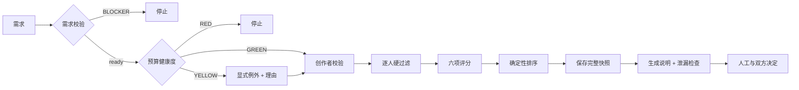

# 匹配、预算与决策

> 当前 MVP 实现使用确定性规则，不使用大模型、向量检索或机器学习。算法的职责是缩小候选范围并暴露理由，最终选择仍属于参与者。目标平台的规则发布、输入冻结、运行租约、业务邀请、选择、RLS与跨 Context 原子协议以 [MatchingAttempt、MatchRun、业务 Invitation 与 Selection](/architecture/matching-invitation-selection.md)为准；本页公式本身不构成平台写模型。

## 处理管线



## 预算健康度

配置给出地区日基线、技能系数、领域历史中位数、风险率与阈值。当前公式为：

```text
labor_baseline = estimated_days × regional_daily_baseline × skill_multiplier
risk_rate = min(uncertainty_rate + urgency_rate + dependency_rate, 0.50)
base = max(labor_baseline, historical_domain_median) + direct_cost
recommended_minimum = base × (1 + risk_rate)
health_ratio = demand.budget.maximum / recommended_minimum
```

健康度映射：

| 状态 | 条件 | 命令行为 |
| --- | --- | --- |
| `GREEN` | `health_ratio >= 1.0` | 可继续 |
| `YELLOW` | `0.8 <= health_ratio < 1.0` | 默认停止；需 `--allow-yellow --reason` |
| `RED` | `health_ratio < 0.8` | 强制停止 |

地区日基线和技能系数是首轮研究假设，不是市场报价或强制定价。预算检查用于暴露明显不合理范围，最终报酬仍需结合价值、责任、风险与创作者底线协商。真实证据应在批次后形成新配置版本。

## 硬过滤

硬过滤表达“不能匹配”，不参与分数补偿。只要命中一项，候选就进入 `excluded` 并保存全部原因。

| 代码 | 条件 |
| --- | --- |
| `CREATOR_INACTIVE` | 创作者状态不是 `active` |
| `BOUNDARY_DOMAIN` | 需求领域在禁止领域中 |
| `BOUNDARY_TASK` | 任一任务触及禁止任务 |
| `MISSING_MUST_HAVE_SKILL` | 缺少熟练度和证据可信度都大于 0 的必需技能 |
| `DATE_CONFLICT` | 可开始日期晚于需求截止日 |
| `CAPACITY_CONFLICT` | 每周可用小时少于要求 |
| `DURATION_CONFLICT` | 可持续周数少于要求 |
| `CURRENCY_MISMATCH` | 需求币种与报酬边界币种不同 |
| `BELOW_PRIVATE_FLOOR` | 预算上限低于私密项目底线 |
| `DATA_POLICY_CONFLICT` | 数据敏感度不在创作者允许范围 |
| `AI_POLICY_CONFLICT` | 项目与创作者的 AI 必需/禁止规则冲突 |
| `LANGUAGE_MISMATCH` | 没有满足要求的共同工作语言 |
| `WORK_MODE_CONFLICT` | 必需工作方式不一致 |
| `LOCATION_RESTRICTION` | 创作者地区不在允许范围 |
| `CONFLICT_OF_INTEREST` | 创作者声明与需求组织有利益冲突 |

配置中的 `hard_filter_order` 是沿用旧名的完整代码清单，不是执行顺序；当前实现会按代码中的确定顺序计算并返回所有命中原因，不按该数组驱动或短路。新增硬过滤时需要同步实现、配置、原因说明、测试和本页文档。

## 六项评分

每项归一到 `0..100`，再按配置权重求和。

| 分项 | 权重 | 当前计算要点 |
| --- | ---: | --- |
| `interest` | 30% | 问题类型、领域、任务三个集合覆盖率的平均值，再乘意愿强度系数 |
| `capability` | 25% | 必需技能 85%，可选技能 15%；熟练度结合证据可信度 |
| `availability` | 15% | 每周容量 70%，可开始时间 30% |
| `compensation` | 15% | 预算是否在私密底线之上；达到后封顶，不因更高预算无限增长 |
| `collaboration` | 10% | 共同语言、工作方式、反馈频率、团队偏好 |
| `evidence_trust` | 5% | 全部技能证据可信度平均值 |

### 意愿

对问题类型、领域、任务分别计算 `|目标 ∩ 偏好| / |目标|`。目标集合为空时给中性值 50。三个分数平均后乘：

```text
0.6 + 0.1 × interest_intensity
```

强度限制在 `0..4`，所以系数为 `0.6..1.0`。这使“明确愿意”能得到满额覆盖，同时避免仅靠标签重合替代本人意愿。

### 能力

单个技能分数为：

```text
(proficiency / 4) × (0.7 + 0.3 × evidence_trust / 4) × 100
```

必需技能先经过硬过滤，因此排序只区分能力和证据强弱。没有可选技能时，可选分沿用必需分，避免因需求未写可选项而降低候选。

### 可用性

容量分按 `available_hours / required_hours` 计算并封顶 100。若创作者在计划开始日前可用，开始分为 100；否则按其延迟占项目时间窗的比例线性降低。硬过滤已确保其最迟不晚于截止日。

### 报酬

若需求预算下限已经高于创作者私密底线，分数为 100；若底线落在预算区间内，分数在 80～100 之间；低于预算上限是进入排序的前置条件。对外证据只暴露 `within_budget` 布尔值，不暴露金额。

### 协作与证据

共同语言必须先通过硬过滤。工作方式、反馈频率和团队偏好完全一致得 100，未指定得 100，不一致得 40。证据信任分是技能 `evidence_trust` 的平均值除以 4。

## 排序确定性

```text
total = Σ(component_score × configured_weight)
```

分项和总分保留两位小数。候选先按总分降序，再按字符串 `creator_id` 升序；输入创作者的顺序不会改变结果。权重加载测试要求总和为 1.0。

## 解释边界

匹配说明只包含：

- 兴趣重合、必需/可选技能覆盖和报酬范围满足；
- 尚待确认的领域经验、语言或协作节奏；
- 容量、证据和需求不确定性风险；
- 针对首个里程碑、数据和输入的沟通问题。

说明函数不读取私密报酬金额。输出后还会把已知私密值与序列化文本比对，发现相同值即中止。说明是短沟通材料，不是录用承诺、自动决策或能力事实认证。

## 人工决定与覆盖

允许的标准原因包括采用算法顶部、上下文缺失、词表不适用、权重问题、非结构化信任信号、参与者选择、利益冲突、无匹配和其他。覆盖时应记录最小必要事实，不能把歧视性偏好、身份信息或私密反馈写入通用数据库。

算法顶部与最终选择不同并不自动说明算法失败。需要区分：

- 候选本人拒绝；
- 需求方在短沟通后的合理选择；
- 输入遗漏或过期；
- 词表/权重无法表达真实情况；
- 运营者越过规则或产生偏见。

批次复盘应把这些原因与结果联合分析，而不是只看 `top-1 hit`。

## 公平性与校准

首轮至少观察：邀请集中度、各创作者被推荐/邀请/选中次数、覆盖建议比例、候选反馈原因、不同需求类型的完成情况、报酬健康度、再次合作意愿和安全事件。样本很小时不做统计显著性宣称，应结合反例和访谈原始证据。

禁止在项目中途为了让某个候选通过而修改标签或权重。校准步骤应是：

1. 记录反例与覆盖原因；
2. 完成整个五项目批次；
3. 判断问题来自数据、词表、过滤、权重还是运营；
4. 创建新配置版本并补充回归样例；
5. 用旧批次做离线对比，不重写历史推荐；
6. 在下一批次启用新版本。
