# 跨平台 Outbox delivery worker 设计

> 状态：`TEST-OUTBOX-DELIVERY-001` application orchestration 与 PostgreSQL 18 delivery repository/durable consumer inbox 已完成 RED→GREEN；forward-only `0008`、在线角色/RLS、固定 SQL、lease fence、retry/dead-letter 与 inbox 幂等均已有真实数据库证据。broker 本轮仍只使用本地严格 fake 的 ack/nack 协议，不绑定外部厂商；生产 broker、部署装配与厂商 E2E 尚未 GREEN。

## 1. 目标、边界与完成定义

本页定义所有目标平台 Context 共用的本地 outbox 投递协议。业务命令仍只在自己的数据库事务中写业务事实、审计和 outbox；worker 在事务提交后读取安全事件 envelope 并投递到 broker。通知、搜索、分析、webhook 和 process manager 都是消费者，不能因投递失败回滚已经提交的业务决定。

本切片完成时必须证明：

- 两个或更多 worker 真并发 claim 时，一次 lease 只有一个 owner；
- `PENDING` 与到期 `LEASED` 可被 claim，未到期 lease 不可被窃取，deadline 等号视为到期；
- 每次 publish 使用原始、不可变的 `event_id` 和同一份已验证 envelope；
- broker ack 成功后以 fenced update 标为 `PUBLISHED`；任何不确定路径保留至少一次重试能力；
- 失败按关闭错误代码、有上限 backoff 和最大次数进入 `PENDING` 或 `DEAD`；
- 不支持的 schema/event、损坏 envelope 和秘密 sentinel 不会进入 broker、日志、指标或 dead-letter metadata；
- 消费者以 `(consumer_name,event_id)` 做持久幂等，并显式处理乱序，不把 worker 误称为 exactly-once；
- `iam_outbox_worker` 只能读安全 envelope、claim 和更新传输列，不能读取 IAM、receipt 或 Audit 正文，也不能修改 envelope/payload。

本切片建立跨平台 application contract 与 worker orchestration，以严格、线程安全的 Memory ports证明 claim/lease、逐次schema验证、publish、retry/dead、shutdown与隐私语义。它不修改 IAM Accept/Issue/Publish，不修改 PostgreSQL migration artifact，也不声称真实 SQL、broker、持久consumer inbox或多进程行为已经 GREEN。

## 2. 稳定要求与术语

| ID | 要求 |
| --- | --- |
| `REQ-OUTBOX-001` | 本地事务提交的安全事件由 outbox worker 至少一次投递；并发、崩溃和 ack unknown 不得丢事件或伪造 exactly-once |
| `REQ-OUTBOX-002` | worker 只发布 schema registry 支持且逐次验证通过的关闭 envelope；未知 schema 或损坏事件 fail closed |
| `REQ-OUTBOX-003` | 消费者按 event_id 持久去重，并按自身 aggregate/version 规则处理乱序、gap 和重复 |
| `REQ-OUTBOX-PRIVACY-001` | payload、异常、dead letter、日志、trace 和指标遵守源 Context 的最小事件 allowlist，任何 secret sentinel 不扩散 |

术语固定如下：

- **claim**：数据库在短事务中把一个 eligible row 原子转换为本 worker 的 `LEASED`；
- **lease**：由 `event_id + lease_owner + lease_until + attempt_count` 组成的 fencing identity；
- **publish ack**：broker 明确确认接受同一 `event_id` 消息；不是消费者已处理证明；
- **outcome unknown**：provider 可能已经接受消息，但调用方没有可靠 ack，或 ack 后本地状态提交结果未知；
- **dead letter**：原 outbox row 的终态 `DEAD` 与关闭 `last_error_code`，不是复制 payload/异常正文到另一张宽表；
- **inbox**：消费者事务内以 `(consumer_name,event_id)` 唯一 claim 的持久去重事实。

## 3. 事件 envelope 与 schema registry

worker 只发布业务命令已经提交的机器 envelope，不从 IAM、Organization、Membership、Policy、receipt 或 Audit 表补齐字段。首版 envelope 恰含：

```text
event_id, event_type, schema_version, occurred_at,
aggregate_type, aggregate_id, aggregate_version,
actor_kind, actor_id, original_actor_id,
correlation_id, causation_id, trace_id, organization_id, payload
```

传输列绝不进入消息。对 IAM，registry 中 `(event_type, schema_version=1)` 唯一解析到仓库的 `platform/contracts/events/iam-v1.schema.json` Draft 2020-12 contract；其他 Context 后续登记自己的 immutable schema。全局 registry 不允许同一 `(event_type,schema_version)` 指向两份不同 schema；需要同名但不同语义时必须先发布 namespaced event type，而不是依赖数据库 schema 猜 Context。

每次 publish 前，worker 都把结构列和 payload 重组为完整 envelope并执行：

1. registry lookup；未知 event type/version 得到终态 `OUTBOX_SCHEMA_UNSUPPORTED`；
2. 关闭 schema验证；缺字段、未知字段、类型/enum/UTC/ID/payload错误得到终态 `OUTBOX_EVENT_INVALID`；
3. 生成唯一 UTF-8 canonical JSON bytes；重试不得改变字段、array顺序或 timestamp；
4. registry 返回受控 `topic`、schema identity 和 partition key。首版 partition key 为 `aggregate_type + ":" + aggregate_id`；caller不能从 payload、Organization或联系人自由选择 route；
5. broker message ID 恰为 `event_id`，header 只允许受控 schema identity/version、event type、correlation ID；不复制 actor/contact/token或自由异常信息。

registry 文件加载、checksum 或配置不可用属于 worker readiness/运行依赖故障：暂停 claim 并告警，不能把一批本来合法的事件批量标成 `DEAD`。只有 registry 明确认出“不支持”或“事件不符合已加载 schema”才是 row 级终态。

## 4. 传输状态机与行约束

`infra.outbox_events` 的业务 envelope 列插入后永久不可变。传输状态固定为：

```mermaid
stateDiagram-v2
    [*] --> PENDING
    PENDING --> LEASED: "claim; attempt_count += 1"
    LEASED --> PUBLISHED: "broker ack + fenced local commit"
    LEASED --> PENDING: "definite/unknown failure + retry due"
    LEASED --> LEASED: "lease expires; another claim fences old owner"
    LEASED --> DEAD: "terminal contract failure or attempts exhausted"
    PENDING --> DEAD: "exhausted row sweep"
```



关闭 shape：

| 状态 | 必需 | 必须为 NULL / 禁止 |
| --- | --- | --- |
| `PENDING` | `available_at`、`attempt_count >= 0` | `lease_owner`、`lease_until`、`published_at` |
| `LEASED` | 非空合法 `lease_owner`、`lease_until > leased transaction time`、`attempt_count >= 1` | `published_at` |
| `PUBLISHED` | `published_at` | `lease_owner`、`lease_until`；后续状态转换 |
| `DEAD` | `attempt_count >= 0`、关闭 `last_error_code` | `lease_owner`、`lease_until`、`published_at`；自动重投 |

现有首批表没有独立 `dead_at`，本切片不挪用 `published_at` 或 `available_at` 伪造该语义；终态时间由受控 worker telemetry 记录，未来若需要持久 SLA 证据必须走 expand migration 新增列。`PUBLISHED` 和 `DEAD` 都是 transport 终态，业务 envelope仍按源事件保留/删除策略处理。

`lease_until <= transaction_timestamp()` 恰为过期；等号时旧 owner 已失去更新权。worker 不能延长一个正在进行的 provider调用来永久占用 row；lease TTL 必须覆盖正常 publish p99 并小于恢复目标。首版默认 lease 30 秒、batch 上限 100、最大 publish attempts 8；配置只能收紧 batch，不得把 attempts/TTL设为无界。

## 5. 一次 delivery cycle

`OutboxDeliveryWorker.deliver_once(batch_size)` 的顺序固定为：

1. 检查 shutdown token、worker ID、batch、UTC clock 与 registry/publisher/repository readiness；无效配置零 claim；
2. 在一个短 READ COMMITTED transaction中把 attempts已耗尽的 due/expired rows标为 `DEAD`，再 claim eligible rows；claim commit结果未知时丢弃返回值、不发布，等待 lease到期；
3. transaction 完成并释放连接/锁后，逐 lease 做 registry lookup、schema验证和 canonical bytes；禁止持数据库事务调用 registry网络端点或 broker；
4. 调用 publisher，message ID固定为 `event_id`；
5. 明确 ack 时，用另一个短 transaction执行 fenced `mark published`；影响行不是恰一条表示 lease已过期/损坏，本次不得覆盖新 owner；
6. 明确未接受、provider unavailable或 ack unknown时，按 attempt计算 due并 fenced reschedule；达到最大次数则 fenced `DEAD`；
7. row 级失败不阻止同 batch 其他 lease；repository/registry整体不可用则停止本 cycle，不继续 claim；
8. 返回只含 counts/关闭结果代码的安全 summary，不返回 payload、broker正文或异常 repr。

一个 worker process 的多个 delivery task也必须通过数据库 fencing竞争，不能依赖进程内 set。实现不得在 broker调用外再包一个数据库 transaction，也不得在 provider错误时修改 envelope以便“兼容重试”。

## 6. PostgreSQL 固定 statements 与角色

真实 adapter 只登记下列参数化 statements；名称和结果 shape进入 contract test：

| Statement | 作用 |
| --- | --- |
| `dead_letter_exhausted_outbox_v1` | 把 due `PENDING` 或到期 `LEASED` 且 `attempt_count >= max_attempts` 的 row fenced为 `DEAD/DELIVERY_ATTEMPTS_EXHAUSTED` |
| `claim_outbox_batch_v1` | `FOR UPDATE SKIP LOCKED` 按 `(available_at,created_at,event_id)` claim；attempt加1并返回安全 envelope与完整 fencing identity |
| `mark_outbox_published_v1` | exact owner/until/attempt且 lease仍有效时写 `PUBLISHED/published_at`，清 lease |
| `reschedule_outbox_v1` | exact fencing写 `PENDING/available_at/last_error_code`，清 lease |
| `dead_letter_outbox_v1` | exact fencing写 `DEAD/last_error_code`，清 lease |
| `release_unstarted_outbox_lease_v1` | graceful shutdown时只释放尚未开始 broker调用的 exact lease；已开始或 outcome unknown的 lease等待自然到期 |

claim eligibility 等价于：

```sql
(
  delivery_status = 'PENDING'
  AND available_at <= transaction_timestamp()
)
OR (
  delivery_status = 'LEASED'
  AND lease_until <= transaction_timestamp()
)
```

并要求 `attempt_count < max_attempts`。claim 使用 CTE `SELECT ... FOR UPDATE SKIP LOCKED LIMIT :batch_size` 后单条 `UPDATE ... RETURNING`；不能先 SELECT ID 再在另一个 transaction更新，也不能用 process-local mutex冒充数据库并发。mark/reschedule/dead均比较 `event_id,delivery_status='LEASED',lease_owner,lease_until,attempt_count`，mark还要求 `transaction_timestamp() < lease_until`；零行属于 stale lease，不可重试覆盖。

`iam_outbox_worker`：

- `NOSUPERUSER NOBYPASSRLS`、不是 owner、不能 `SET ROLE` runtime/owner；
- 只取得 outbox安全 envelope/传输列的 SELECT，以及 transport列的 UPDATE；无 INSERT/DELETE/TRUNCATE；
- envelope列没有 UPDATE grant，`trg_outbox_envelope_immutable` 仍作第二道防线；
- 无 IAM、Organization、Membership、Policy、contact、Session、receipt、Audit、key-policy或migration ledger权限；
- 每个 transaction以部署产生的关闭 worker ID设置 transaction-local `app.outbox_worker_id`，RLS只允许 eligible row或该 worker当前 exact lease；请求/payload不能设置它；
- repository只暴露上表固定 statements，关闭 bind-value SQL日志。pool按 IAM UoW同等标准检查 IDLE/current role，commit outcome unknown连接立即discard。

本页不修改已发布的 v0–v7 migration bytes。forward-only `0008` 已按第13节追加并受 catalog/manifest/review pin 约束，补齐状态 CHECK、显式 fencing token、列级 grant、FORCE RLS、worker policy、索引 `(delivery_status,available_at,created_at,event_id)` 与到期 lease索引；相关语义已由真实 PostgreSQL 18连接验证。

## 7. 至少一次、ack unknown 与故障矩阵

平台明确承诺 **at-least-once**，不承诺 exactly-once 或全局顺序：

| 故障点 | 本地动作 | 可见结果 |
| --- | --- | --- |
| claim COMMIT 前失败 | rollback；不发布 | row仍 eligible |
| claim COMMIT 已发送但结果未知 | discard connection和返回 leases；不发布 | 若 commit成功，lease到期后恢复；若失败，仍 PENDING |
| broker 明确在接受前拒绝/不可用 | fenced retry/dead，代码 `BROKER_UNAVAILABLE` | 未产生外部消息或稍后重试 |
| broker 可能接受但 ack丢失 | fenced retry/dead，代码 `BROKER_ACK_UNKNOWN` | 同 event_id可能再次发布 |
| broker ack后 worker崩溃 | 不可能标 published；lease到期重投 | duplicate允许，event_id不变 |
| broker ack后 mark COMMIT结果未知 | discard connection，不查询猜测 | row可能 PUBLISHED或稍后重投 |
| mark 发现 lease已过期 | 不覆盖新owner | 已ack消息与新owner重投可能重复 |
| schema不支持/事件无效 | 不调用broker；fenced DEAD | `OUTBOX_SCHEMA_UNSUPPORTED` / `OUTBOX_EVENT_INVALID` |
| process收到shutdown | 停止claim；完成已开始调用；释放未开始lease | outcome unknown lease自然到期 |

broker明确 ack 只证明它接受消息，不证明消费者事务完成。provider返回的任意自由文本、payload echo、request ID或 stack trace不得写 `last_error_code`、dead letter、日志 label或指标。

## 8. Retry、backoff 与 dead letter

`attempt_count` 在成功 claim 时递增，表示实际或可能发生的一次 publish attempt。首版 retry delay：

```text
raw = min(2 ** (attempt_count - 1) seconds, 300 seconds)
delay = raw + bounded_jitter(event_id, attempt_count, 0..20% raw)
```

jitter port在测试中确定；生产使用进程安全随机源或稳定 keyed derivation，但不得使用 payload/PII。`available_at = database_now + delay`。deadline等号可 claim。

关闭错误代码首版为：

```text
BROKER_UNAVAILABLE
BROKER_ACK_UNKNOWN
SCHEMA_REGISTRY_UNAVAILABLE
OUTBOX_SCHEMA_UNSUPPORTED
OUTBOX_EVENT_INVALID
DELIVERY_ATTEMPTS_EXHAUSTED
DELIVERY_STORAGE_OUTCOME_UNKNOWN
OUTBOX_CLOCK_INVALID
OUTBOX_CONFIGURATION_INVALID
```

`OUTBOX_CLOCK_INVALID` 与 `OUTBOX_CONFIGURATION_INVALID` 是 claim 前或本地调度计算的 cycle-level 拒绝，不能写入 row；后者也用于 backoff port 返回公式范围外 deadline。`OUTBOX_DELIVERY_NOT_AVAILABLE` 仅是已删除的 RED scaffold 启动拒绝 sentinel，不是可部署 worker 的 row/telemetry 结果。

不支持 schema、无效 envelope为立即 `DEAD`；broker暂时故障/ack unknown在attempt未耗尽时重试，耗尽后最终 `DEAD/DELIVERY_ATTEMPTS_EXHAUSTED`。dead row不自动 redrive。人工 redrive必须是后续受审计命令：选择 exact event ID、原因/工单、修复后的兼容性证明，并创建新 delivery attempt或受控恢复状态；禁止直接改 payload、清 attempt或批量 `UPDATE DEAD SET PENDING`。

## 9. 重复、乱序与消费者 inbox

并发、retry和broker都可能造成重复与乱序。数据库 claim排序只改善公平性，不是消息顺序承诺。partition key为 aggregate identity可利用 broker的同分区顺序，但 v1 retry时 v2仍可能先到；同一 command的多个不同 aggregate事件也没有总序。

每个消费者必须：

1. 在与其本地副作用相同的 transaction 中插入唯一 `(consumer_name,event_id)` inbox；冲突表示已处理，安全 ack且不重复副作用；
2. 不以 `(aggregate_id,aggregate_version)` 代替 event_id，因为同一 version可以有多个不同事件；
3. 对投影使用 aggregate version：旧版本忽略，下一版本应用，gap进入有界 pending/reconciliation而不是猜测缺失事件；
4. 对 process manager在执行外部副作用前再使用自己的 idempotency key/source event ID；inbox不自动使第三方调用 exactly-once；
5. schema未知时不 ack为成功，进入消费者隔离/告警；不得用宽松 JSON读取已知字段后忽略其余内容。

worker的 `PUBLISHED` 不等待或查询 consumer inbox。消费者失败不能把 outbox row从 `PUBLISHED`改回去。

## 10. 隐私、日志、指标与告警

worker只处理已经通过源 Context allowlist的 envelope，但仍须在 registry和publisher边界运行统一 sentinel检测。下列值禁止进入消息扩展 header、错误、日志、trace、metric label、dead letter与测试 failure repr：token、contact/locator、provider subject/claim、Session/cookie/CSRF、recipient binding、政策/consent正文或证据、私密业务正文、完整provider response。

安全 telemetry字段关闭为：`worker_component`、event type、schema version、delivery outcome、稳定错误代码、attempt bucket、lease-reclaimed布尔值和耗时 bucket。metric label不含 event/aggregate/organization/correlation/trace ID。受控结构日志最多含 event ID的短期 pseudonymous fingerprint，不含原始业务 ID；异常只记录稳定类，不调用可能包含 payload的自由 `repr`。

最低指标：

- `outbox_due_events`、`outbox_oldest_due_age_seconds`；
- `outbox_claim_total{outcome}`、`outbox_publish_total{event_type,schema_version,outcome}`；
- `outbox_lease_reclaimed_total`、`outbox_ack_unknown_total`；
- `outbox_retry_total{error_code,attempt_bucket}`、`outbox_dead_total{error_code,event_type}`；
- publish/claim/mark latency histogram。

告警至少覆盖 oldest due age超SLO、持续claim失败、ack unknown突增、任何 unsupported schema、dead增长、lease reclaim风暴和registry checksum/readiness失败。dead-letter运营投影只显示受控 fingerprint、event type/version、attempt/error code和时间，不显示 payload。

## 11. Clock、生命周期与 graceful shutdown

所有应用 clock必须是 aware UTC；naive或非UTC在claim前以 `OUTBOX_CLOCK_INVALID` 停止。真实 eligibility、lease、published/retry timestamps只使用 PostgreSQL `transaction_timestamp()`；进程 clock用于本地deadline、provider timeout与测试，不覆盖数据库时间。

worker ID来自部署实例身份，NFC、1–128字符、关闭字符集，不能来自请求或事件。启动 readiness验证数据库role/schema、registry checksum、publisher配置、batch/TTL/attempt边界和UTC clock。任一失败不监听/claim。

收到停止信号后：

1. 原子设置 stopping，新的 `deliver_once` 不 claim；
2. 等待已开始的publish至有界grace deadline；
3. 明确尚未开始provider调用的lease可用fixed release statement归还；
4. 已开始、被取消或outcome unknown的lease不提前归还，等待lease expiry；
5. 不在shutdown时把row猜成 `PUBLISHED/DEAD`，也不无限等待provider。

## 12. TDD 切片与追踪

| TEST | 层次 | 当前切片验收 |
| --- | --- | --- |
| `TEST-OUTBOX-DELIVERY-001.C01` | Application/Concurrency | 两worker并发claim互斥；lease等号到期可回收，未到期不可窃取 |
| `TEST-OUTBOX-DELIVERY-001.C02` | Application/Fault | success、before-ack、after-ack/mark unknown保持至少一次与同event ID |
| `TEST-OUTBOX-DELIVERY-001.C03` | Contract | registry逐次验证；unsupported/invalid不调用broker并DEAD |
| `TEST-OUTBOX-DELIVERY-001.C04` | Consumer | duplicate event ID只一次副作用；乱序version有界等待/协调 |
| `TEST-OUTBOX-DELIVERY-001.C05` | Retry/Operations | backoff、attempt上限、DEAD关闭shape、无自动redrive |
| `TEST-OUTBOX-DELIVERY-001.C06` | Security | provider异常、telemetry、dead metadata和broker message全路径secret sentinel |
| `TEST-OUTBOX-DELIVERY-001.DB01` | PostgreSQL 18 | fixed SQL、真实连接SKIP LOCKED/fencing、RLS/列权/immutable、durable inbox；核心持久化已GREEN，socket级COMMIT断链继续作为故障注入门禁 |
| `TEST-OUTBOX-DELIVERY-001.E2E01` | Broker/Consumer | 当前锁定broker的真实ack/重投/partition及消费者inbox恢复 |

RED阶段曾新增 `desire_platform.outbox.delivery` 的不可变 contracts、关闭错误与默认拒绝 worker；独立测试可导入且只因 `OUTBOX_DELIVERY_NOT_AVAILABLE` 未实现语义而失败，没有 ImportError、线程泄漏、真实sleep、网络或坏fixture。application GREEN 已删除该 sentinel 路径，并实现关闭 readiness、claim结果校验、逐row故障隔离、ack unknown、fenced terminal/retry、backoff边界、safe telemetry与graceful shutdown。随后 `0008` 与真实 PostgreSQL adapters使DB核心语义GREEN；下一纵切片是生产broker adapter、socket级故障注入、具体consumer projection与厂商E2E，不能用本地fake把E2E01标为完成。

2026-08-08 RED 证据：

```bash
PYTHONDONTWRITEBYTECODE=1 PYTHONPATH=platform/src:platform \
python3 -m unittest tests.application.test_outbox_delivery_worker_red -v
```

结果为 `Ran 11 tests`、`FAILED (failures=10)`：唯一通过项是合同可导入、冻结枚举和默认拒绝；10项失败分别保留并发claim、lease边界、success、before/after ack、duplicate/out-of-order、unsupported schema、attempt dead、privacy sentinel及shutdown/clock的待实现语义。结果为 `0 errors`、`0 ImportError`，并发线程均在测试时限内退出；该证据是预期RED，不能作为delivery已启用依据。

同日 application GREEN 证据：

```bash
PYTHONDONTWRITEBYTECODE=1 PYTHONPATH=platform/src:platform \
python3 -m unittest \
  tests.application.test_outbox_delivery_worker_red \
  tests.application.test_outbox_delivery_worker_faults -v
```

结果为 `Ran 18 tests`、全部 `OK`：原目标 `11/11` GREEN；另有 `7/7` 故障护栏覆盖错绑ack、claim/mark outcome unknown、registry错绑、非法backoff、telemetry故障与batch中途shutdown。它只把 application orchestration 标为 GREEN；DB01/E2E01、真实权限/fixed SQL、broker ack及durable consumer inbox仍为 planned。

同一最终快照的受影响旧回归为 `152/152 OK`：domain + authorization `21/21`、IAM machine contracts `22/22`、既有 Accept/Issue/Publish application `82/82`、migration catalog/runner protocol `27/27`。`PYTHONPYCACHEPREFIX=/private/tmp/desire-outbox-pyc python3 -m py_compile ...` 与 `git diff --check` 均退出 `0`；`python3 scripts/verify_docs.py` 返回 `Documentation verification succeeded: 31 navigable pages.`。

## 13. PostgreSQL 18 forward migration 冻结设计

### 13.1 为什么必须是 `0008`，以及兼容部署

已发布 v0–v7 的 raw bytes、manifest entry 与 review pin 永久不改。`0004` 已有 envelope、四态传输列与 immutable trigger，`0005` 已对表启用 `FORCE RLS`，但 `iam_outbox_worker` 只有 `infra` schema `USAGE`，没有 relation/column privilege或 worker policy；表也没有持久 `leased_at`、不可复用 fencing token、`dead_at` 和 durable consumer inbox。直接在 adapter 中借 owner连接、关闭 RLS或用 `lease_owner + attempt_count` 猜 fence 都不合法。

已追加 migration 名称为 `0008_expand__outbox_delivery_and_consumer_inbox.sql`。在 worker仍停止且数据库不存在 `LEASED` row 的部署门禁下，它：

1. 对 `infra.outbox_events` 新增 `leased_at timestamptz NULL`、`lease_token uuid NULL`、`dead_at timestamptz NULL`；已有 `PENDING/PUBLISHED/DEAD` row按各自终态补齐，发现任何已有 `LEASED` row立即失败并要求先完成恢复，而不是猜 owner；
2. 用新约束 `ck_outbox_delivery_shape_v2` 冻结四态完整 shape；`LEASED` 要求 `attempt_count >= 1`、owner/leased-at/token/until全非空且 `leased_at < lease_until`，`DEAD`要求 `dead_at`与关闭 error code，其他状态的 `dead_at`为空；`PENDING`可保存上次关闭 retry error，claim时清空；
3. 增加 queue索引 `(delivery_status,available_at,created_at,event_id)`，以及 partial expiry索引 `(lease_until,created_at,event_id) WHERE delivery_status='LEASED'`；旧 queue索引只在新索引已建立后删除；
4. 建立第13.5节 consumer inbox表、约束、索引、`ENABLE/FORCE RLS`；
5. 只授予第13.3节列权和policy。不得授予表级宽 `UPDATE`、`INSERT/DELETE/TRUNCATE`、sequence权限、owner membership或 `BYPASSRLS`；
6. 将runner schema head、关闭catalog、canonical manifest与review pin同步登记为v8，同时保持 `0007` 的 SQL、ledger与已登记digest逐字不变；adapter不运行任何未受检loose SQL。

expand兼容窗口内旧 producer仍只插入 `PENDING`，新列均有兼容 default/NULL shape；新 worker只有在 migration、role、statement checksum与registry readiness全部通过后才启用。回滚应用版本只停止 worker，不删除列/表或执行 down migration。

### 13.2 lease identity、数据库时间与固定排序

每次 batch claim由应用 CSPRNG/UUIDv7 IdSource生成一个不可推测 `claim_token`；同 batch可共享 token，但每行 fence恒为 `(event_id,lease_token,lease_owner,attempt_count,lease_until)`，因此跨 batch、跨 owner和 lease reclaim均不可复用。`claim_token`只进入 transaction-local `app.outbox_claim_token`和 bind parameter，不进入 broker message、日志或metric label。

claim在一个 READ COMMITTED短事务内使用数据库时钟：eligible为 due `PENDING`或 `lease_until <= transaction_timestamp()` 的 `LEASED`，且 `attempt_count < max_attempts`。CTE严格按 `(available_at,created_at,event_id)` 排序，`FOR UPDATE SKIP LOCKED LIMIT %(batch_size)s`，随后一条 `UPDATE ... FROM candidates ... RETURNING`：attempt加一、写 owner/leased-at/token/until、清 `published_at/dead_at/last_error_code`。返回顺序必须在外层再次按同一 tuple排序；不能依赖 `UPDATE RETURNING` 的偶然顺序。deadline等号已经过期，旧 token从这一刻起无写权。

worker在 claim COMMIT获确认并释放连接后才调用registry/broker。`leased_at`及所有 transport timestamp只取同 transaction的 `transaction_timestamp()`；进程 UTC clock不写数据库。lease duration固定部署范围 `1 second..5 minutes`，默认30秒；SQL bind为interval，adapter在打开事务前再次验证范围。

### 13.3 online role、RLS 与列权

`iam_outbox_worker`继续为 `LOGIN NOINHERIT NOSUPERUSER NOCREATEDB NOCREATEROLE NOBYPASSRLS`，不是任何 schema/table/function owner，也没有 `SET ROLE schema_owner`。每个短事务只设置：

```text
app.scope_kind=OUTBOX_DELIVERY
app.operation=<固定 statement 对应 operation>
app.outbox_worker_id=<部署实例 ID>
app.outbox_claim_token=<canonical UUID>
```

全部用 `set_config(...,true)`；请求、payload、event metadata和broker response不能提供这些值。worker对 `infra.outbox_events` 的 SELECT列恰为完整安全 envelope、transport列与 `created_at`；UPDATE列恰为 `delivery_status,attempt_count,available_at,lease_owner,leased_at,lease_token,lease_until,published_at,dead_at,last_error_code`。它没有 envelope UPDATE、INSERT、DELETE、TRUNCATE。`trg_outbox_envelope_immutable`继续作为第二道防线。

RLS按 operation关闭：claim/dead-exhausted只可见 eligible row，mark/reschedule/dead/release只可见与GUC owner/token一致的 `LEASED` row；所有 fenced写还在 SQL中逐字比较 attempt和lease-until。无scope、未知operation、空/非canonical token、另一worker当前lease、未到期 reclaim均零行。worker对 `iam.*`、`audit.audit_events`、`infra.command_receipts`、`infra.iam_receipt_key_policy`、consumer业务projection和migration ledger全部无权限；也不能调用 self-summary、cookie或replay函数。

RLS是凭据误用的row边界，固定statement allowlist仍是应用边界。repository禁止 caller提交 SQL片段、列名、ORDER BY、topic或table；bind-value logging关闭。

### 13.4 固定 producer delivery SQL v1

生产 adapter只登记以下 statement identity；源码中的 SQL必须是reviewed常量，contract test逐字验证名称、参数集合、首关键字、`SKIP LOCKED`、排序与 fence predicates：

| 名称 | operation | 参数 / 单行结果 |
| --- | --- | --- |
| `dead_letter_exhausted_outbox_v1` | `DEAD_EXHAUSTED` | `max_attempts`；返回 affected count；仅due/expired且耗尽row，写 `DEAD/dead_at/DELIVERY_ATTEMPTS_EXHAUSTED` |
| `claim_outbox_batch_v1` | `CLAIM` | `worker_id,claim_token,batch_size,lease_duration,max_attempts`；返回安全 envelope、`leased_at/token/until/attempt/reclaimed` |
| `mark_outbox_published_v1` | `MARK_PUBLISHED` | exact完整 fence；仅 `transaction_timestamp() < lease_until` 时写 `PUBLISHED/published_at`并清lease |
| `reschedule_outbox_v1` | `RESCHEDULE` | exact完整 fence、关闭 error code、受界 retry interval；写 `PENDING/available_at`并清lease |
| `dead_letter_outbox_v1` | `DEAD` | exact完整 fence、关闭 terminal error；写 `DEAD/dead_at`并清lease |
| `release_unstarted_outbox_lease_v1` | `RELEASE_UNSTARTED` | exact完整 fence；只在provider尚未调用且lease仍有效时恢复 `PENDING` |

每个statement都必须影响预期的恰0或1行；claim/dead-exhausted除外但仍校验返回count与batch bound。零行只能映射 `STALE_LEASE`，不能用非fenced二次UPDATE“修复”。error code由关闭enum映射，provider文本不能作为bind值。

producer写事件仍由源业务UoW在业务事实、receipt和audit同一transaction插入；`uq_outbox_command_event`提供命令内幂等，`event_id`为跨broker/consumer幂等identity。delivery adapter永远不生成/修补producer envelope，也不读取源业务表。

### 13.5 durable consumer inbox v1

新增 `infra.consumer_inbox_events`，列关闭为：

```text
consumer_name varchar(96), event_id uuid,
event_type varchar(96), schema_version integer,
aggregate_type varchar(64), aggregate_id uuid, aggregate_version bigint,
message_sha256 bytea(32), received_at timestamptz, processed_at timestamptz
```

主键为 `(consumer_name,event_id)`；另有 `aggregate_version >= 1`、32-byte hash、`processed_at >= received_at`与关闭name/type shape CHECK，以及 `(consumer_name,aggregate_type,aggregate_id,aggregate_version,event_id)` 索引。表不保存payload、canonical bytes、headers、contact、token或provider response。`message_sha256`是registry验证后的canonical bytes的unkeyed内容完整性hash；它不能用于授权或暴露给API。

每个消费者有独立LOGIN role和部署登记的唯一 `consumer_name`；首个测试角色/名字为 `iam_projection_consumer` / `iam-policy-projection-v1`。角色非owner、无BYPASS且不能SET ROLE其他runtime身份。transaction-local `app.consumer_name`必须与离线受审计 mapping中的 `session_user`精确匹配；仅凭caller可写GUC不能冒充另一消费者。角色只对inbox取得本消费者row的SELECT/INSERT，没有UPDATE/DELETE/list其他consumer；业务projection权限由其Context另行最小授予。

固定 consumer transaction只有两个infra statements：

| 名称 | 语义 |
| --- | --- |
| `claim_consumer_inbox_v1` | `INSERT ... ON CONFLICT DO NOTHING RETURNING` exact metadata/hash；新row与业务副作用处于同一transaction |
| `read_consumer_inbox_duplicate_v1` | insert零行后按 `(consumer_name,event_id)` 读取exact metadata/hash；同hash为duplicate，异hash为identity collision并隔离/nack |

新claim时consumer handler只能通过同一显式UoW写自己的projection；handler成功后才设置同一命令常量的 `processed_at`并COMMIT。任何handler异常或进程崩溃使inbox insert与副作用共同rollback。COMMIT已发送后异常为outcome unknown：physical connection永久discard且broker不ack；redelivery若前次已提交则same-hash duplicate直接ack，若未提交则重新取得claim并执行一次。不得先提交inbox再做副作用、先ack再commit或用内存set去重。

乱序/gap仍由各消费者按aggregate version处理；inbox只解决同一event重复。需要外部副作用的consumer还必须把event ID传作下游idempotency key；这不改变至少一次承诺。

## 14. 严格本地 broker delivery 协议

本轮不选择Kafka、NATS、SQS或云厂商。测试 fake只实现与厂商无关的关闭协议：producer `publish(message)`结果只有 `ACK(event_id,accepted_at)`、`NACK_BEFORE_ACCEPT`或 `ACK_OUTCOME_UNKNOWN`；consumer delivery只允许在durable transaction得到已确认COMMIT后调用 `ack()`，明确pre-COMMIT rollback可 `nack(requeue=true)`，COMMIT outcome unknown不ack且不声称nack一定送达。

fake必须记录调用顺序但不保存provider自由异常正文；同一delivery最多settle一次，ack/nack错绑event ID、双settle或未知结果均fail closed。它用于证明adapter的connection/broker顺序，不作为真实broker partition、retention、认证、TLS或运维GREEN。绑定真实厂商前需新增ADR、adapter contract与E2E，不修改本文的event ID、partition key、at-least-once或inbox语义。

## 15. connection disposition、故障恢复与隐私门禁

PostgreSQL repository每个operation显式维护 `NEW → BEGUN → COMMIT_SENT → COMMITTED`。COMMIT前且rollback获确认可 `REUSE_AFTER_RESET`；COMMIT_SENT后的任何异常一律 `OUTCOME_UNKNOWN_DISCARD`，不ROLLBACK/RESET/SELECT猜测。claim unknown不返回lease且不发布；mark/reschedule/dead unknown向worker返回 `DELIVERY_STORAGE_OUTCOME_UNKNOWN`。下一cycle只在新连接按lease expiry/terminal事实恢复。

当前adapter每个操作取得一个IDLE、精确在线角色、PostgreSQL major18的新physical connection，并在成功、失败或outcome unknown后统一关闭，因此不会把transaction-local `app.*`带入下一操作。将来接入pool时，checkout还必须验证current role/schema/statement readiness，checkin必须执行并验证 `RESET ROLE,RESET ALL,CLOSE ALL,DISCARD TEMP`；dirty、错误role、非IDLE、reset失败和outcome-unknown connection全部close/discard。DSN、password、bind values和server异常detail不进入exception repr/telemetry。

真实 PostgreSQL 18语义门禁必须不skip，并至少覆盖：

- 两个连接barrier并发claim无交集，排序稳定；
- lease deadline等号reclaim，旧 token/owner/attempt/until fence全部拒绝；
- broker接受前失败可安全retry，接受后/ack丢失和mark COMMIT unknown以同event ID恢复；
- restart后到期lease恢复、attempt上限进入带`dead_at`的DEAD且不会自动redrive；
- inbox duplicate只一次副作用，consumer pre-COMMIT crash零inbox/零副作用，post-COMMIT ack丢失只duplicate ack；
- online worker/consumer非owner无BYPASS，无IAM/Audit/receipt或其他consumer旁路；
- claim/mark/inbox的COMMIT_SENT断链connection全部discard，下一次使用新physical connection；
- hostile broker/DB/handler secret sentinel不出现在row metadata、broker settlement、异常repr、日志或低基数telemetry。

首轮RED production surface可导入、冻结statement names/enums并默认拒绝；RED只因 `OUTBOX_POSTGRES_NOT_AVAILABLE` / `CONSUMER_INBOX_POSTGRES_NOT_AVAILABLE` 与缺少受检0008语义失败，没有用Docker、PostgreSQL major、psycopg、migration、ImportError、线程泄漏、sleep或坏fixture制造假RED。GREEN也未授owner、临时disable RLS、在test里创建旁路function/table或把原始SQL算法实现成fake冒充DB行为。

2026-08-08 的首个持久化 RED 证据为：

```bash
PYTHONPYCACHEPREFIX=/private/tmp/desire-outbox-pg-red-pyc \
PYTHONPATH=src:tests uv run python -m unittest \
  storage.postgres.test_outbox_postgres_persistence_red -q
```

结果为 `Ran 12 tests`、`FAILED (failures=10)`、`errors=0`。两个通过项只证明关闭的fixed-statement/connection-disposition/default-deny合同可导入，以及consumer message hash确定；10个语义失败精确保留真实双连接claim、lease reclaim/stale fence、broker接受前/后故障、restart recovery、attempt DEAD、consumer duplicate/crash原子性、worker role/RLS和secret sentinel。suite实际启动PostgreSQL 18、以生产runner clean执行v0–v7并构造合法outbox row；无skip、ImportError、SQL syntax、坏fixture、线程或真实sleep故障。

随后以最小 `0008` 与生产 `PostgresOutboxRepository` / `PostgresDurableConsumerInbox` 实现取得：

```bash
PYTHONPYCACHEPREFIX=/private/tmp/desire-outbox-green-pyc \
PYTHONPATH=src:tests uv run python -m unittest \
  storage.postgres.test_migration_catalog \
  storage.postgres.test_migration_repository_artifacts_red \
  storage.postgres.test_migration_runner \
  storage.postgres.test_psycopg_migration_adapter_red \
  storage.postgres.test_real_postgres_migration_dependency_red \
  storage.postgres.test_iam_schema_rls_semantics_red \
  storage.postgres.test_outbox_postgres_persistence_red -q
```

结果为 `Ran 68 tests ... OK`：新增持久化12/12与既有storage 56/56同时GREEN。12项证明adapter readiness、真实多连接claim不重叠、到期reclaim与stale fence拒绝、broker接受前/ack unknown重试、重启恢复、attempt DEAD、inbox duplicate与pre-COMMIT crash rollback、在线角色隔离和secret sentinel。RED scaffold中“真实adapter永久不可用”的临时断言已按目标语义修正为v8 readiness/空inbox；secret sentinel settings仅参与安全repr断言，真实repository始终使用harness DSN；retry测试先以数据库时钟断言 `available_at` 严格在未来，再由admin只把该synthetic exact event调整为due，不让生产repository信任process fake clock。

同一快照 application Outbox为`18/18 OK`，完整application为`100/100 OK`，machine contracts为`22/22 OK`。这把DB核心delivery/inbox标为GREEN，但仍不把本地broker fake、具体consumer业务projection、socket级COMMIT断链或厂商E2E冒充已部署能力。

## 16. 与现有设计的关系

- [目标平台架构](/architecture/target-platform.md)定义至少一次与消费者幂等；本页给出可执行协议；
- [身份、租户、政策同意与会话](/architecture/identity-tenancy-consent.md)定义事件最小字段、隐私与 `TEST-EVENT-AUDIT-IAM-001`；
- [IAM PostgreSQL 首个持久化切片](/architecture/iam-postgresql-implementation.md)定义 `infra.outbox_events` 列、immutable envelope与 `iam_outbox_worker` 最小角色；本页不改其已发布 migration artifact；
- `platform/contracts/events/iam-v1.schema.json` 是 IAM v1消息的机器权威，本文不能增加 schema不可表示的 payload/header；
- 源命令的本地 outbox原子性仍由各 Context测试证明；本页只负责已提交 row之后的 delivery，不重开业务事务。
