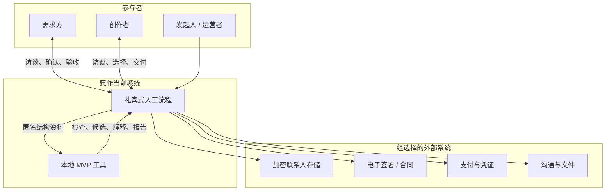
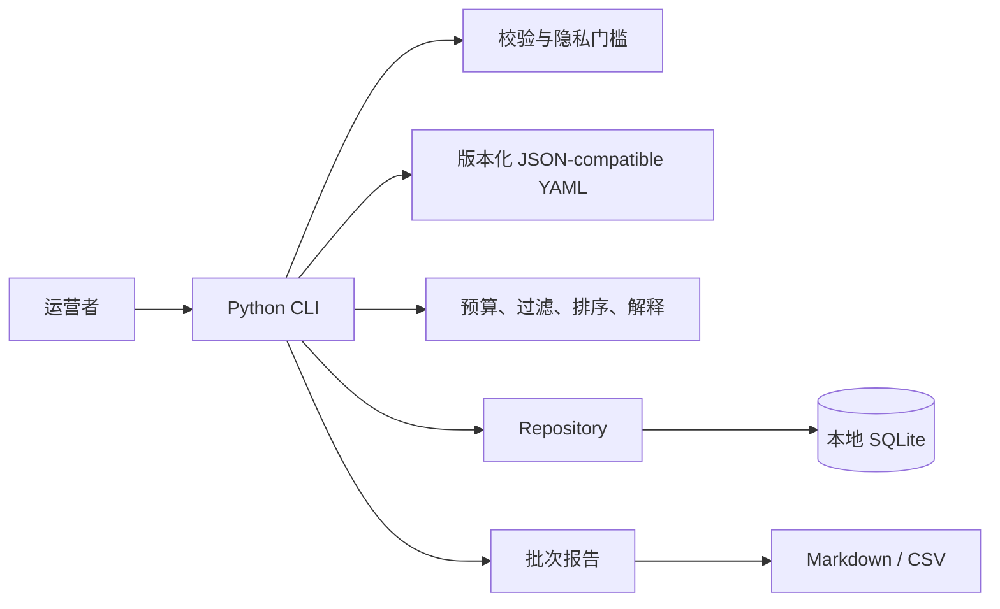

# 系统总览

## 架构判断

愿作当前最重要的架构决定是：**先把可解释、可审计的业务规则做成单机工具，把仍不稳定且高责任的环节保留为人工流程。** 这使系统能用很低的技术复杂度验证市场和运营假设，同时避免把未经验证的流程固化成平台。

文档中的“系统”因此包含人、软件和外部工具，而不只包含仓库代码。

## 系统上下文

信任边界位于“身份/交易材料”和“匿名匹配数据”之间。联系人、合同、付款凭据、原始能力证据不得进入 MVP 数据库；数据库只保存随机 ID、结构信号和受控引用。

## 当前软件容器

所有业务计算均为进程内纯 Python，运行时零第三方依赖。SQLite 是单机操作记录，不是多人协作数据库；CLI 是唯一受支持的应用入口。

## 端到端主链路

1. 运营者在外部安全工具中获得参与同意并创建随机 ID。
2. 使用访谈模板形成需求卡和创作者卡，只把匿名结构字段转成 JSON。
3. `import` 拦截常见身份字段并写入当前资料。
4. `validate` 检查进入门槛；`BLOCKER` 未清除时停止。
5. `budget` 依据冻结的预算配置计算建议最低预算和健康度。
6. `match` 先执行硬过滤，再对合格者计算分项和总分，保存完整输入快照。
7. `explain` 从快照生成对外说明，并做私密值泄漏检查。
8. 运营者分别征得披露同意，组织有目的的短沟通。
9. `decision` 记录实际邀请、反馈、选择和覆盖原因。
10. 外部工具承载协议、付款、文件、交付和验收。
11. `outcome` 记录完成、退出或失败事实；`report` 形成批次证据。

详细调用关系见[当前 MVP 架构](/architecture/current-mvp.md)，运营动作见[首批项目流程](/operations/pilot.md)。

## 架构状态矩阵

| 能力 | 当前承载者 | 状态 | 目标承载者 |
| --- | --- | --- | --- |
| 需求访谈与澄清 | 发起人 + 模板 | 人工流程 | 需求工作台 + 人工复核 |
| 身份和组织核实 | 外部服务 + 发起人 | 人工流程 | 身份供应商 + Trust 模块 |
| 资料完整性 | Python 校验器 | 已实现 | Profile/Demand 模块 |
| 预算健康度 | Python 规则 | 已实现 | Pricing Policy 模块 |
| 候选过滤与排序 | Python 规则 | 已实现 | Matching 模块 |
| 匹配解释 | Python 模板 | 已实现 | Matching Explain API |
| 最终选择 | 参与者 + 发起人 | 人工流程 | 双方确认工作流 |
| 协议、付款、交付 | 外部工具 | 人工流程 | Agreement/Payment/Workspace 模块 |
| 项目结果与批次报告 | SQLite + 文件 | 已实现 | Analytics 读模型 |
| 社区与治理 | 无 | 目标设计 | Governance 模块 |

## 关键质量属性

### 可解释与可复现

给定相同的需求、创作者集合和配置版本，排序必须确定；同分按 `creator_id` 升序。每次推荐保存完整输入快照与复合规则版本，使历史结果不受后续资料更新影响。

### 隐私

导入边界拒绝常见身份字段；对外解释不能读取私密报酬金额，并在序列化后检查私密值是否泄漏。它们是纵深防御，不替代运营者的资料隔离和人工披露确认。

### 公平

硬边界优先于分数；预算达到私密底线后不会因金额更高而无限加分；拒绝不形成负面排名信号；人工覆盖必须使用标准原因。批次报告观察邀请集中度和结果差异，不用单一“公平分”掩盖问题。

### 可恢复

SQLite 与受控外部材料需要分别备份。推荐和决定是证据记录，应以追加为主；当前资料和结果允许纠正或补齐。真实运行前必须完成一次恢复演练。

### 最小复杂度

当前不引入 Web 服务器、账户系统、队列或分布式服务。目标平台也应先采用模块化单体和后台任务，只有在团队边界、吞吐或隔离需求有证据时才拆服务。

## 事实来源优先级

出现不一致时按以下顺序判断：

1. 生效的法律、协议和参与同意；
2. 对某次项目冻结的规则版本与推荐快照；
3. 当前自动化测试和实现代码；
4. 版本化配置与数据字典；
5. 本文档与概念设计。

文档不是绕过规则的依据。实现偏离设计时，需要修复实现、更新设计，或用明确的决策记录解释偏离。
