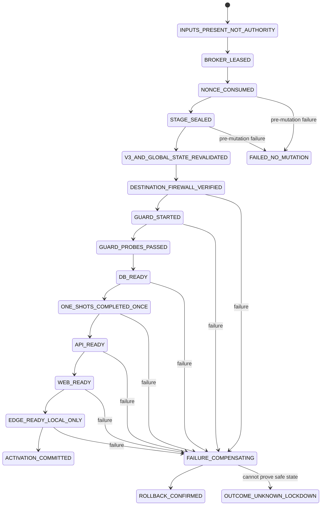

# 私有服务器真实 OIDC trusted executor

状态：`PROPOSED DESIGN · CREATE-INTENT V1 INPUT CONTRACT FROZEN · EXECUTOR UNIMPLEMENTED · EXECUTION DISABLED · INACTIVE`。

本文定义未来把一份已封存的真实 OIDC 私有服务器快照安全推进为一次启动尝试时，trusted executor
必须满足的信任边界、证据合同与关闭状态机。它不是运行手册，不包含可执行命令，也不授权连接 Docker
daemon、修改防火墙、启动容器或部署服务器。当前可用的静态配置、snapshot、preflight、计划和只读
collector 边界仍以[私有服务器真实 OIDC 静态配置](/operations/private-server-real-oidc.md)为准。

除下文明确列出的 create-intent v1 输入合同外，本文中的格式名、broker 名、字段和状态均为
**proposed**，尚未成为仓库机器合同。实现阶段必须先以关闭 schema、解析器和负向测试冻结它们；
不得把本文描述、未来同名 JSON 或人工制作的样本解释为 authority。

## 1. 不可跨越的版本边界

现有 `desire-real-oidc-activation-authorization-v1`、
`desire-real-oidc-start-authorization-v1`、`desire-real-oidc-create-plan-v1`、
`desire-real-oidc-start-plan-v1` 与 `desire-real-oidc-execution-stage-v1` 永久不可执行。
未来 broker 必须在解析入口显式拒绝这些格式，不能通过补字段、包装、迁移、人工签字或配置开关把
它们升级为可执行输入。现有 `execute` 分支必须继续关闭；新实现也不得复用该分支。

同样，`desire-real-oidc-post-create-evidence-v1` 和当前 baseline collector 形成的 v2 evidence 只是一份
历史 observation。它们缺少独立 broker provenance；能读取普通操作者文件的同 owner 进程可以离线
构造内部一致的文档，所以无论内容看起来多完整，都只能是 `NOT_AUTHORITY`。v1/v2 可以作为人工审查
材料或新采集的输入提示，但不能被 future executor 直接签名、背书或转换为 v3。

当前唯一冻结的 future-executor 输入合同是
`deploy/private-server-real-oidc-broker-create-intent-v1.schema.json` 及其纯离线 canonical parser。它固定
`status=VALIDATED_REQUEST_NOT_AUTHORITY`、`authority=NOT_AUTHORITY`、五个排序且互异的 image
reference/ID、十个 container、四个 network、一个 PostgreSQL volume 的 `ABSENT` 前置状态，以及
`CREATED_ZERO_START`、零 started container 和 `PRESERVE_POSTGRES_VOLUME` 后置约束。operation
template ID 由合同固定；输入不能携带 command、argv、environment、path、socket 或 cwd。parser 不读取
文件、不连接 daemon、不创建资源，也没有 execute API；它只是让未来 broker 有一个不可由调用者扩权的
请求形状。

该输入合同不等于 create-only 协议，更不提供 resource-origin attestation。现有 v1 create plan、
authorization、stage 与 evidence 在同一入口仍被永久拒绝；
`TRUSTED_CREATE_ONLY_PROTOCOL_UNIMPLEMENTED` 和 `RESOURCE_ORIGIN_ATTESTATION_UNIMPLEMENTED` 必须继续
出现在 create/start 阻断列表中。只有未来唯一 broker 在 lease 与 event fence 内重新验证 absent
prestate、执行固定 create template，并为本次创建结果形成可信 origin attestation 后，才能解除这两项。

未来执行链只接受由新 broker 在同一次受控会话内重新采集、重新投影并证明 provenance 的 proposed
v3 receipt，以及独立签发的 proposed v2 plan、authorization 和 stage。版本关系是拒绝式替换，不是
向后兼容：

| 制品 | 格式 | 权限边界 |
| --- | --- | --- |
| create 请求 | `desire-real-oidc-broker-create-intent-v1` | **已冻结**的请求输入；`NOT_AUTHORITY`，无执行能力 |
| broker 采集回执 | `desire-real-oidc-attested-collector-receipt-v3` | 可信来源的一次观察；仍为 `NOT_AUTHORITY` |
| 执行计划 | `desire-real-oidc-execution-plan-v2` | 固定顺序和 exact ID；不是批准 |
| 执行批准 | `desire-real-oidc-execution-authorization-v2` | 短时、一次性、关闭 scopes；不能单独运行 |
| 执行 stage | `desire-real-oidc-execution-stage-v2` | descriptor-sealed 的三者交集；默认不可执行 |

表中四种 v3/v2 provenance/plan/authorization/stage 格式全部尚未实现、未冻结。特别地，本文没有提出
可执行的 `compose create`、资源删除、镜像拉取、
网络连接变更或通用 `docker exec` scope。当前 v1 create plan 又永久不可执行，因此在未来另行设计并
验收 create-only 协议前，仓库仍不存在端到端激活路径。

## 2. TCB 与唯一 broker

未来唯一特权进程暂称 `desire-real-oidc-executor-broker`。它是每台目标主机上唯一能同时读取 Docker
socket、验证 broker attestation key、检查宿主 destination firewall 并调用关闭生命周期操作的组件。
计划生成器、Web/API、collector CLI、操作者 shell、Compose 容器和业务账号都不得得到 Docker socket、
broker key 或等价 root capability。

最小 TCB 包含：

- 宿主 kernel、文件系统 descriptor/locking 语义、可信时钟与启动身份；
- Docker daemon 及其持久 state；daemon、containerd 或 root 被攻破时不能声称隔离仍成立；
- broker 的 exact executable/build digest、关闭策略、system service 配置与私有 attestation key；
- 宿主 destination firewall 实现，以及 guard 镜像中已审核的规则检查/deny-probe 程序；
- 签发 v2 authorization 的独立审批根和 verifier key。

业务容器、计划文件作者、普通 collector 和 authorization 请求者不属于 TCB。授权签发者不能直接操作
Docker，broker 也不能自行扩大 authorization scopes；两者分离后才形成执行权。

broker 启动时必须取得 root-owned、不可跟随链接的全局 exclusive lock，锁定 host identity、boot
identity、broker build/policy digest 和单调 instance ID。另一个 broker、锁文件被替换、Docker socket
owner/mode 漂移、存在未审核的 socket proxy，或 broker 不是主机上唯一允许的 lifecycle client 时均
保持关闭。每个 project 再取得独立 lease；全局 inventory 与防火墙变更期间仍由 host lock 串行化，
不能只依赖 Compose project label。

“唯一”是部署与 TCB 假设，不是 Docker API 本身提供的事务保证。root 或其他 Docker-socket actor 可以
在 inspect 与 start 之间制造竞争；若不能通过宿主访问控制排除这些 actor，broker 无权宣称 TOCTOU
已关闭。broker 还必须在操作前建立 daemon event fence，并在每个状态边界验证没有意外事件；事件流
断开、游标丢失或无法解释的 daemon restart 都进入不可继续状态。

broker 只实现编译进制品的 command template 和状态迁移，不接受 shell 字符串、任意 Docker 参数、
插件、动态 import、调用方 PATH/proxy/locale/cwd 或环境覆盖。每个外部调用都使用绝对 binary/socket、
关闭环境、固定上限和一次调用语义。错误只返回稳定 code，不回显 daemon stderr、inspect JSON、路径、
secret 或调用方输入。

## 3. v3 provenance：可信观察仍不是批准

proposed `desire-real-oidc-attested-collector-receipt-v3` 必须由 broker 自己在 project lease 和 daemon
event fence 内采集，不能接收调用方提交的 safe projection 后“代签”。它包含关闭的安全投影和以下
provenance 绑定：

- project、snapshot/Compose/attempt manifest、reviewed image lock、exact container/network/volume ID，以及
  未来独立 create-only 协议提供的 resource-origin attestation；v1 create plan 不能充当该 attestation；
- broker build、policy、system-service 配置、host、boot、Docker daemon 与 broker instance 的
  purpose-separated digest，不保存可枚举的原始主机标识；
- attestation key ID、严格递增 sequence、会话 nonce、采集起止时刻和 daemon event-fence 边界；
- 固定 command-template set 的 digest、每个模板恰一次的成功结果与最终 safe projection digest；
- bound state 与全局 foreign discovery 结果，以及采集前后 exact inventory 相等的事实；
- canonical envelope 的 broker attestation。算法、key lifecycle 与字段 shape 要在第一阶段冻结；
  未冻结前不得默认选择或接受任何算法。

attestation key 必须由 root-owned broker 独占，和 authorization signing key、应用 key、OIDC secret、
session key 做用途隔离。未来采用 signature 还是只由同机 broker 验证的 MAC，必须在 threat model 与
恢复需求明确后一次冻结；不能提供 `alg=none`、调用方指定算法或 unknown-key fallback。receipt 必须
绑定当前 boot/daemon/broker instance，重启后只能重新采集，不能把旧 v3 带入新会话。

v3 的 `authority` 仍固定为 `NOT_AUTHORITY`，建议状态为
`ATTESTED_BOUND_AND_GLOBAL_STATE_NOT_AUTHORITY`。它只解决“谁在何种受控环境观察了什么”，不解决
“是否批准修改”。broker 只有在 v3、v2 plan、v2 authorization 和 v2 stage 四者逐字段相等，且当前
重查仍与 v3 一致时，才可能进入 mutation state。

raw Docker inspect、Env、label 原文、bind source、volume Mountpoint、daemon stderr 和 raw-object
digest 都不得进入 receipt、stage、日志或 attestation transcript。transcript 只承诺固定 template ID、
安全结果 code、bounded length 分类、safe projection 和 purpose-separated digest；不能用 raw digest
留下对低熵秘密的离线猜测 oracle。

当前 create-before-start 安全投影还把 mount observation 与 create transport 分层关闭。top-level
`.Mounts` 必须是 sealed destination 的 exact、顺序无关集合：staged bind 的 Source/Destination、空
Mode、只读位与 `rprivate` propagation 逐字相等且不能带 Name/Driver；DB named volume 的 Name、
Destination、`Driver=local`、`Mode=rw`、RW 与空 propagation 逐字相等，Source 必须匹配同次 volume
inspect 中只在内存使用的 Mountpoint。`HostConfig.Mounts` 精确区分 config 的四字段 bind 与
secret/identity 的额外空 `BindOptions={}`；DB 只允许一个 legacy
`HostConfig.Binds=<physical-volume>:/var/lib/postgresql/data:rw`，其他服务必须是 null。receipt 只保留
match 布尔与计数，不泄露上述 Source、Mountpoint 或 legacy bind string。

create-state runtime config 也必须在 broker 内按 same-inspect image defaults 与 sealed Compose 5.3.1
逐项重算。Linux Env 采用 Compose 同名覆盖、其余 image key 继承的 exact map；image、Compose、container
任一层出现重复/NUL/非法 key 或大小写任意组合的标准 proxy key 都拒绝。Healthcheck 对
`Test/Interval/Timeout/Retries/StartPeriod/StartInterval` 六字段执行 Moby 零值逐字段继承，完整 reviewed
probe argv 与 timing matrix 都必须相等；DB/API `StopTimeout` 分别只能是 60/20，其他服务必须保持
`omitempty` 缺失。v3 及现有非权威 v2 都不得保存 Env key/value、hostname、URL、probe command 或
整张 Env map 的 digest，只能保留安全计数、字段来源与 exact-match/proxy-absent 布尔。

## 4. v2 plan、authorization 与 stage

### 4.1 关闭 authorization envelope

proposed `desire-real-oidc-execution-authorization-v2` 是 canonical、duplicate-key-free、unknown-field
rejecting 的短时批准 envelope。至少关闭绑定：

- `status=APPROVED`、exact `project`、host/boot/broker policy digest；
- snapshot、Compose、v3 receipt、execution-plan digest 与 intended stage nonce；stage manifest 随后单向
  绑定 authorization digest，不能制造 authorization↔stage manifest 的循环摘要；
- exact container/network/volume/image binding 和 guard/firewall/readiness policy digest；
- 有序且无重复的 `scopes`、UUIDv4 nonce、`one_time=true`、`max_attempts=1`；
- UTC `issued_at/not_before/expires_at`，且有效窗足够短、不能跨 boot 或 broker instance；
- `rollback_policy=PRESERVE_POSTGRES_VOLUME` 和独立 authorization signature/key ID。

任何 optional/wildcard scope、unknown enum、重复 scope、过期/未来签发、跨 project/host/boot、digest
漂移、nonce 已 claim、key 已撤销或字段缺失均在建立 mutation lease 前拒绝。authorization claim 必须
由 broker 通过 root-owned `0700` parent、`O_EXCL`、单链接 `0400` receipt 原子消费；无论后续是在
pre-mutation 检查失败还是完成启动，该 nonce 都不能重放。

### 4.2 唯一允许的 proposed scopes

scope 必须逐字来自下表，不能把多个动作压成 `ADMIN`、`DOCKER` 或 `EXECUTE`：

| scope | 允许的最窄动作 | 明确禁止 |
| --- | --- | --- |
| `READ_BOUND_AND_GLOBAL_DOCKER_STATE_V1` | 对 stage 绑定对象和全局 inventory 执行固定只读模板、建立 event fence | 任意 mutation、只查 project label 后宣称全局安全 |
| `ARM_AND_VERIFY_BOUND_DESTINATION_FIREWALL_V1` | 从 deny-all 原子切换到 exact pinned IPv4/TCP/443 规则、复读 ruleset；失败时恢复 deny-all | CIDR/wildcard、DNS 动态目的地、IPv6、额外端口或改写无关规则 |
| `EXEC_FIXED_GUARD_CHECK_AND_DENY_PROBES_V1` | 仅调用审核镜像内固定 checker/probe entrypoint 和 exact args | 通用 `docker exec`、shell、任意命令或携带 secret 的探测 |
| `START_BOUND_CONTAINER_IDS_ONCE_V1` | 按 v2 plan 对 exact ID 各发出至多一次 start | Compose、名称寻址、restart、create、pull、connect/disconnect、删除 |
| `WAIT_BOUND_ONE_SHOT_IDS_ONCE_V1` | 对五个 exact one-shot ID 各 wait 一次并复验 closed exit state | retry、第二次 start/wait、接受非零/OOM/unknown outcome |
| `STOP_STARTED_BOUND_IDS_ON_FAILURE_V1` | 仅对本会话已证明 started 的 bound ID 按固定逆序 stop | stop foreign/未启动对象、remove/down、删除 network/image/volume |

一次 activation authorization 必须列出计划实际需要的每项 scope，plan 不得隐式取得缺失 scope。
`STOP_STARTED_BOUND_IDS_ON_FAILURE_V1` 是启动失败时的受限补偿能力，不是日常 manager 权限；成功进入
运行态后，普通 stop/maintenance 仍需要另一份独立、尚未设计的协议。

`ARM_AND_VERIFY_BOUND_DESTINATION_FIREWALL_V1` 的补偿语义只允许把本会话拥有的 exact allow rule
恢复为 deny-all，并证明其他宿主规则未改变。它不授权开放 ingress。外部 TCP/443 allowlist 必须保持
关闭，直到 Edge 本地 readiness 成功且另一个独立 ingress 批准协议存在；本文未定义该协议。

### 4.3 plan 与 stage 的交集

proposed `desire-real-oidc-execution-plan-v2` 只保存 exact ID、固定状态顺序、每步 template ID、deadline、
期望状态、failure transition 和证据 digest；不保存任意命令。plan 必须声明
`execution_permitted=false`，直到 broker 内部完成 stage 验证；成功解析 plan 也不等于授权。

proposed `desire-real-oidc-execution-stage-v2` 只能由 broker 在取得 lease、验证输入并原子消费 nonce 后，
在新的 exclusive `0700` root 中写入 v3 receipt、v2 plan、v2 authorization、nonce claim、broker policy
reference 和每个文件的 descriptor/inode/mode/size/digest，随后把 root 封为 `0500`。stage manifest 本身
为单链接 `0400` canonical file，并固定
`status=SEALED_PENDING_BROKER_VALIDATION`。broker 必须在持有 root descriptor 与 flock 的整个会话中
重开、复验所有 inode；任何 symlink/hardlink、替换、extra file、mode/owner 漂移或 stage 已用都拒绝。

stage 不能复制旧 v1 文件并改变 format，也不能由操作者把 `execution_permitted` 改成 true。允许进入
下一状态的是 broker 的内存判定，不是 stage 中可编辑的布尔值。

## 5. 全局 foreign discovery 与紧前重查

只复查十个已知名称或 project-label inventory 不足以证明安全。broker 每次至少检查 Docker daemon
的全部 container、network 和 volume，并把以下 foreign 关系投影为关闭的 safe facts：

- 任意 container（包括 stopped、无 Compose label 和其他 project）是否共享 exact guard netns；
- 任意 endpoint 是否接入 bound `ingress/app/data/oidc-egress` network，network ID/name/driver/IPAM 是否
  漂移，是否出现额外 alias 或地址占用；
- 任意 container 是否消费 bound PostgreSQL volume，或 bind/mount 指向受保护 staged tree；
- 任意 container 是否占用 Edge 的 host IP/TCP/443，或发布其他 bound container port；
- bound volume/network 是否有额外 consumer、endpoint、label/options，bound ID 是否被同名对象替换；
- Docker daemon 是否处于未审核的 Swarm/context/plugin/socket-proxy 模式，以及全局 object count 是否
  在采集后改变。

foreign 事实不是“忽略不相关对象”：合法的无关对象可以按 policy 留存，但任何能消费 bound volume、
加入 bound network、共享 guard netns、冲突端口、替换 bound name/ID 或影响 daemon event fence 的对象
都必须 fail closed。只有 allowlist 化的宿主基础对象才能存在；allowlist 也绑定 exact ID/digest，不能用
名称前缀或 label 通配。

v3 baseline 后仍须在**每一个 mutation 紧前**重查 bound 与 global state，检查 event fence，并逐字匹配
stage safe projection。对 exact container start，检查必须和调用处于同一 broker lease/进程，不把检查
结果返回调用方后稍晚再 start。Docker API 没有 inspect-hash 条件启动，所以独占 socket actor、紧前
重查和 event fence 三者缺一即不可执行。

若 start 请求的响应丢失，broker 不得盲目重试。它只可利用预先建立的 event fence、exact ID 的
`StartedAt/FinishedAt/ExitCode/RestartCount` 和本会话 journal 判定“未发生”或“恰发生一次”；无法唯一
判定时进入 `OUTCOME_UNKNOWN_LOCKDOWN`，停止后续启动并执行能够证明安全的受限补偿，绝不把 unknown
当作成功或未执行。

## 6. destination firewall 与 guard 证明

宿主 destination firewall 和 guard netns rules 是两层独立控制，任一层成功不能替代另一层。

在启动任何 container 前，broker 先从宿主 deny-all 基线原子安装仅允许 exact reviewed public IPv4、
TCP/443 的 purpose-bound rule，复读 canonical ruleset/counter binding，并确认无 DNS name、CIDR、IPv6、
redirect target、proxy 或额外端口。规则所有权必须绑定 stage nonce；已存在的同形规则也不能被直接
接管。

启动 exact guard ID 后、DB 和其他 dependent ID 前，broker 必须同时证明：

1. guard 仍是 v3 绑定的 ID/image/netns，`Running=true` 且 health 为 `healthy`；
2. 容器内 canonical ruleset 与 sealed egress projection 完全一致，无额外 table/chain/rule；
3. 固定 checker 只读复验 SNI/Host/pinned transport 所需事实，不读取 OIDC client secret；
4. 固定 deny probes 覆盖 loopback、RFC1918、link-local/metadata、未批准公网 IPv4、IPv6 与 DNS 路径，
   每项均由本地规则的明确拒绝和对应 counter delta 证明；
5. exact pinned IPv4/TCP/443 的 positive transport/readiness 检查维持 issuer hostname 的 TLS SNI、证书
   hostname 与 HTTP Host 校验，不接受 redirect 或新解析目的地。

probe 必须发送固定、无秘密、无用户数据的最小字节，使用单调 deadline 且不重试。测试目标与网络
副作用要在 contract 冻结时明确；在无法安全提供 live negative target 前，不能以静态 ruleset hash
冒充 deny-probe 通过。probe stdout/stderr 不进入 evidence，只保存 closed result code、ruleset digest 和
受控 counter delta。

guard health、ruleset 或 event fence 在后续任一点漂移，都先关闭 ingress、停止继续启动，并进入失败
补偿；不能等到 API readiness 超时才处理。

## 7. one-shot、readiness 与 rollback 状态机

proposed broker 状态机如下；状态名同样尚未冻结：

完整成功顺序固定为 `guard → DB readiness → migrate → taxonomy-seed →
online-credentials-reconcile → online-credentials-verify → identity-bootstrap → API readiness → Web readiness
→ Edge local readiness`。每个 start 前都执行上一节的紧前重查。

五个 one-shot 必须在 baseline 中证明从未启动、restart policy 关闭、`RestartCount=0`，并按 exact ID
各 start 一次、wait 一次。wait 结果必须是 closed integer 0；随后 inspect 还要证明 exit 0、非 OOM、
无 daemon error、恰一个 start/die event。非零、signal、OOM、timeout、event 缺失或状态矛盾均不重试，
也不得跳过后续 verify/bootstrap 顺序。

readiness runner 只能执行固定的只读检查并使用单调总 deadline：DB 可接受连接/精确 schema 与 role；
API 包含真实 discovery/JWKS、pinned transport 与应用 health；Web 验证 BFF/API dependency；Edge 从本机
验证 exact TLS hostname、route 和 upstream health。readiness 可以有固定间隔的只读 polling，但不能
因此重复 lifecycle、one-shot 或 provider mutation。Edge ready 前 ingress 继续关闭。

任一 mutation 后失败，broker 只可使用 `STOP_STARTED_BOUND_IDS_ON_FAILURE_V1`，按
`Edge → Web → API → guard → DB` 的安全逆序停止本会话实际 started 且仍为 exact bound ID 的长期服务；
如 one-shot 正在运行，先按专门的有界失败策略停止该 exact ID，再继续长期服务顺序。每次 stop 前仍复验
ID/state，绝不名称寻址。随后把本会话 destination allow rule 恢复为 deny-all并复验，保全 PostgreSQL
volume、container、network、stage、receipts 和 event journal。

rollback 永不调用 `down`、`rm`、`--volumes`、network disconnect、image remove，不重跑 one-shot，也不
宣称恢复旧版本。任何 stop/outcome/firewall 状态无法证明时进入 `OUTCOME_UNKNOWN_LOCKDOWN`：保持 ingress
关闭、尽可能收紧 egress、停止新增动作并要求人工取证，不能为了得到整洁状态扩大权限。

## 8. 证据最小化与 outcome receipt

broker 的私有 evidence 根必须为 root-owned `0700`，文件使用 no-follow/O_EXCL、单链接 `0400`、descriptor
identity、fsync 与 canonical bytes。只保留安全决策所必需的：

- v3 provenance envelope、safe bound/global projection 与 attestation；
- v2 plan/authorization/stage digest、nonce claim 和 policy/build/key ID；
- 每个状态的 closed result code、exact bound object ID、event sequence、ruleset/safe readiness digest；
- started-set、one-shot exit fact、rollback stop fact，以及最终状态和时间边界。

不得保留 raw inspect、环境变量、Docker labels 原文、bind source、Mountpoint、OIDC subject/email/client
ID/secret、token/code/cookie、TLS private key、DB secret、HTTP body、provider response、probe payload、
daemon stderr 或 host path。错误 telemetry 只显示稳定 code、stage/receipt 的 purpose-separated digest 和
非枚举 trace ID；成功 stdout 也只返回一个稳定状态和私有 outcome receipt digest。

outcome receipt 仍不是 G1/G2、生产或真人试点批准。它只能陈述一个 broker 会话的终态，例如 proposed
`ACTIVATION_COMMITTED_LOCAL_INGRESS_CLOSED`、`FAILED_NO_MUTATION`、`ROLLBACK_CONFIRMED` 或
`OUTCOME_UNKNOWN_LOCKDOWN`。只有独立运维与治理门禁可以决定下一步是否开放 ingress。

## 9. 三阶段实现顺序

### 阶段 A：冻结合同与无副作用 broker 核心

- 已完成的最小切片只有 create-intent v1 closed schema、canonical parser、冻结 dataclass、旧格式永久
  拒绝与零宿主副作用负向测试；它保持 `NOT_AUTHORITY`，没有 broker、lease、origin attestation 或执行路径；
- 先增加 v3/v2 closed schemas、canonical parser、artifact dataclass、状态转移表和永远拒绝 v1 的
  compatibility guard；
- 实现 fake ports 下的唯一 broker lease、nonce claim、attestation/key rotation 验证、event-fence model、
  evidence minimizer 和 outcome journal；
- 所有 production ports 仍使用 default-deny sentinel，CLI 不出现可成功的 `execute`，测试证明零 Docker/
  firewall 调用。

### 阶段 B：只读 live discovery 与隔离 probe 演练

- 在专用合成主机接入唯一 broker 的只读 Docker/global discovery、daemon event stream、firewall
  readback/dry-run 和固定 guard checker；
- 生成真实 broker v3 provenance，但仍固定 `NOT_AUTHORITY`，不启动真实 OIDC project；
- 用隔离、无秘密的测试 netns 验证 firewall/deny-probe 语义、daemon restart、事件丢失与 foreign race，
  不把 fixture 或静态 ruleset hash当作 live 证据。

### 阶段 C：一次性受限 activation 与失败补偿

- 只有 A/B 全部 GREEN 后才实现 v2 authorization verifier、stage validator 和六项 exact scope；首次只在
  fresh synthetic project/volume、关闭 ingress 的隔离主机演练；
- 逐步启用 exact-ID start、one-shot wait、readiness 和 failure stop；每一步先有故障注入与
  outcome-unknown 证明，再允许下一步 mutation；
- 真实 provider 尝试仍需独立 create-only 协议、provider/TLS/DNS/firewall 输入、双人批准、备份/PITR
  与全部角色浏览器验收。本文完成本身不解除这些 blocker。

每阶段必须单独提交设计复核、threat-model 差异、机器合同 digest 与负向测试结果；不能在同一个变更中
一边发明 schema、一边打开 production execute。

## 10. 必须先 GREEN 的负向测试

至少覆盖下列类别；任何一项缺失都保持 execution disabled：

1. **永久版本拒绝**：所有 v1 authorization/plan/stage、v1/v2 post-create evidence、改名包装和补字段迁移
   均不能进入 broker mutation state；现有 activator `execute` 始终失败。
2. **canonical 与授权**：重复/未知字段、非 canonical JSON、wildcard/重复/错序 scope、缺 scope、过期窗、
   跨 host/boot/project/stage、nonce replay、wrong key/撤销 key、同 nonce 并发只有一个 claim。
3. **provenance 伪造**：普通 owner 自制 v3、复制旧 boot receipt、broker build/policy/key substitution、
   sequence 回退、attestation bit flip、raw inspect 或 secret sentinel 泄漏均关闭。
4. **唯一 broker/TOCTOU**：第二 broker、锁/descriptor/inode 替换、socket proxy、未审核 root actor、daemon
   restart、event stream 断开，以及 inspect 后 mutation 前插入 foreign event全部不能继续。
5. **global foreign state**：无 label 的 guard-netns sharer、stopped volume consumer、额外 network endpoint、
   host 443 冲突、同名错 ID、额外 alias/IP、foreign staged-tree mount、采集后新增 object均被发现。
6. **firewall/guard**：额外 IPv4/CIDR/port、IPv6、DNS/redirect/proxy、ruleset reorder/drift、counter 不变化、
   health 假阳性、checker image/entrypoint/args 替换、probe timeout 或 stdout 注入均 fail closed。
7. **exact-ID 与 one-shot**：名称替换、已启动/restarted one-shot、restart policy 非关闭、第二次 start/wait、
   非零/signal/OOM、response-loss outcome unknown、错误顺序和 wait 后状态矛盾均不能重试或前进。
8. **readiness**：DB 错 schema/role、API discovery/JWKS/issuer/TLS/SNI 漂移、Web upstream 失败、Edge 错证书/
   route、deadline 超时和 readiness 期间 foreign event均进入补偿且 ingress 保持关闭。
9. **rollback**：只能 stop 本会话 started-set，严格逆序；foreign/未启动 ID 不受影响；任何生成
   `down/rm/-v/remove/disconnect/restart`、删除 PostgreSQL volume、重跑 one-shot、保留 ingress/宽 egress
   或把不完整补偿标成成功的路径都必须失败。
10. **最小证据**：成功、每个失败点、异常 repr、日志、stdout/stderr、v3/stage/outcome receipt 做递归
    secret/path/raw-object sentinel 扫描，并证明写入 race、symlink、hardlink、mode/owner/extra-file 替换不
    覆盖或删除 foreign inode。

最终还要在真实目标 Docker Engine 版本上捕获兼容 fixture，验证 never-started network
inspect `.Containers={}`、container desired network keys/aliases/IPAM null-object matrix 与 `NetworkID=""`，
create-state top-level Mounts、HostConfig.Mounts/Binds、volume Mountpoint linkage，以及 DNSNames、
effective Env、六字段 healthcheck merge、StopTimeout omitempty、启动后 actual membership、tmpfs、health、
wait、event ordering 与 firewall backend 的实际形状。离线 fake、单元
测试或静态 Compose 校验不能替代该证据。

## 11. 当前结论

这个 proposed 设计把“可信观察”“人工批准”“受限执行”拆成不同制品，并把唯一 broker、global foreign
discovery、destination firewall、guard probes、one-shot、readiness 和 failure compensation 放进同一个
关闭状态机。当前仓库只有一个无副作用、`NOT_AUTHORITY` 的 create-intent v1 输入合同；没有该 broker、
可信 create-only 协议、resource-origin attestation、v3 attestation、v2 contracts 或任一可执行 scope。
现有 v1 永久不可执行，当前 collector 仍是 `NOT_AUTHORITY`，真实 OIDC 私有服务器继续保持 inactive。
