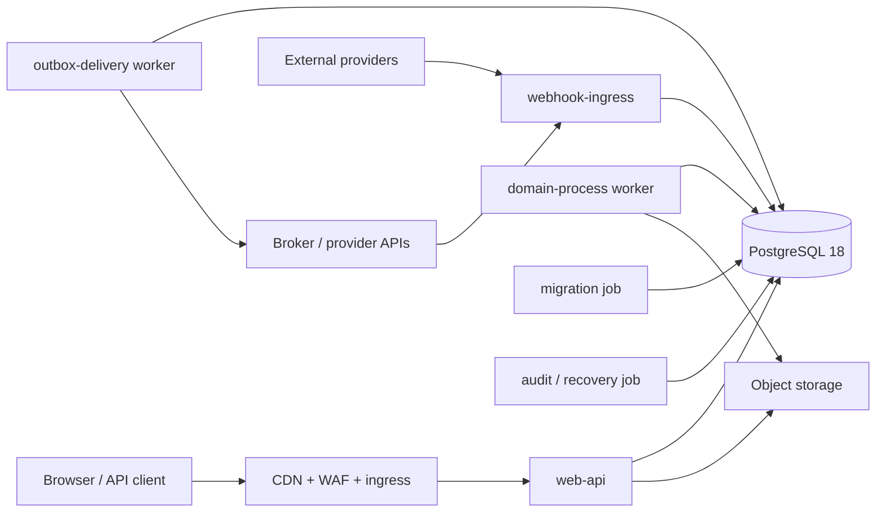

# 生产组合根、部署与运行控制

> 本页是目标平台的生产运行权威设计。它冻结进程边界、组合根、配置、数据库身份、发布兼容、健康探针、降级和恢复协议；领域业务事实仍以各 Context 的设计页和机器契约为准。

## 1. 状态与范围

当前仓库已经用真实 PostgreSQL 18 验证 IAM migration、RLS、部分 command/read adapter 与 durable outbox persistence，并已完成关闭配置、十一个role-bound pool、OIDC/session/editor concrete API composition 与Docker初始化链。该入口严格限定为 `INTERNAL_SANDBOX / SYNTHETIC ONLY`；外部HTTPS ingress/OIDC、告警、备份/PITR与灾备演练仍为 **planned/外部前置**，不能把本地Docker成功当作一般生产批准。

本页解决以下横切问题：

- 哪些可执行进程可以持有哪些能力；
- 进程如何从关闭配置构造 application port，如何在依赖缺失或配置损坏时失败关闭；
- HTTP、worker、webhook、migration、审计与恢复如何隔离；
- PostgreSQL role、连接池、事务 GUC 与 RLS scope 如何建立和清理；
- 应用发布、forward-only migration、事件 schema 和 worker 如何保持兼容；
- readiness、降级、关停、备份和恢复如何给出机器可验证的结果。

本页不重新定义 IAM 权限、领域状态机、事件 payload、资金供应商事实或文件扫描事实。

## 2. 进程拓扑

生产部署由同一版本化代码制品构造不同的最小权限进程，不以一个“万能应用角色”承载所有路径。

| 进程 | 输入 | 允许的核心能力 | 明确禁止 |
| --- | --- | --- | --- |
| `web-api` | HTTPS/ASGI | 关闭路由、认证、query/command handler、短事务 | migration DDL、broker ack、任意 provider 管理凭据 |
| `webhook-ingress` | provider 签名请求 | 原始字节校验、durable inbox claim、快速应答 | 直接推进付款/通知/身份领域状态 |
| `outbox-delivery` | 已提交 outbox | lease/fencing、schema validation、发布、ack/retry | 读取私密业务表补齐 payload |
| `domain-process` | inbox/timer/outbox notification | process manager、定时命令、受控 provider operation | HTTP Session 冒充、任意租户遍历 |
| `migration` | reviewed artifact | advisory lock、v0..head forward migration、ledger/contract gate | 对外服务、使用在线 role |
| `audit-recovery` | 受控工单/计划 | 签名 checkpoint、备份校验、恢复演练、对账 | 绕过双人批准修改业务事实 |

一个部署可以暂时把多个 worker 装在同一容器镜像中，但进程入口、数据库 role、凭据、网络策略和扩缩容单位仍必须分开。不得因为物理共址而合并授权。

## 3. 组合根

每个入口只有一个显式 composition root。领域/application 模块不得读取环境变量、打开 socket、创建全局连接池或在 import 时注册后台线程。

启动顺序固定为：

1. 读取关闭的非秘密配置并拒绝未知键；
2. 从受信 secret provider 取得带 `key_id` 的用途隔离密钥和最小 provider credential；
3. 校验制品版本、机器契约 digest、migration compatibility window 与 feature gate；
4. 构造时钟、ID source、canonicalizer、keyring、policy/safety/provider ports；
5. 为本进程允许的数据库 role 创建独立连接池；
6. 执行只读 readiness preflight，不迁移、不修复数据；
7. 构造 application handlers、presenters、router 或 worker loop；
8. 成功后才宣告 ready，并安装有界优雅关停。

任一步失败都不得留下“半 ready”进程。已经创建的池、线程和 provider client 逆序关闭；错误输出只包含稳定配置路径、component code、trace ID 和安全摘要，不打印 DSN、token、cookie、原始密钥、recipient reference 或 webhook 正文。

依赖注入必须关闭：production root 明确列出 concrete adapter；测试可以传 fake，但 production 不得在缺少 adapter 时自动退回 Memory store、allow-all policy、固定密钥或 no-op outbox。

## 4. 配置与秘密

### 4.1 关闭配置

配置按版本化 schema 解析，至少包含：

- `environment_id`、`deployment_id`、`release_id`、`region`；
- 每个进程允许启用的入口与 feature gate；
- PostgreSQL endpoint/pool 预算/statement timeout；
- public origin、trusted proxy hop、body/header/time budgets；
- broker、object storage 和 provider 的非秘密标识；
- keyring 中每个用途的 active key ID 与 retained verification key IDs；
- SLO、lease、retry、shutdown 和 recovery 参数。

未知键、重复键、隐式类型转换、naive datetime、无界 duration、生产中的 debug/allow-all 开关都使启动失败。配置合并优先级必须是显式且可审计的；不允许任意环境变量覆盖嵌套字段。

### 4.2 秘密与 keyring

秘密只通过窄 secret provider 读取，返回 `(purpose, key_id, material, not_before, not_after, status)`。用途至少隔离：Session handle、CSRF、idempotency receipt、cursor、invitation token、OIDC state、provider webhook、artifact signing verification。

- active signing/derivation key 缺失：相关写路径 `SERVICE_UNAVAILABLE`，进程可按影响范围 not-ready；
- retained verification key 缺失：不能伪装为凭据无效，必须安全不可用并告警；
- 未知 key ID：不枚举 keyring，不回退到 active key；
- key material、DSN password 和 provider secret 不进入 dataclass `repr`、日志、trace、receipt、audit 或 outbox；
- 轮换先发布 verification material，再切 active key，最后在所有存量 TTL 和恢复窗口结束后撤旧 key。

配置快照只记录安全 fingerprint 和 key ID；不得记录原始秘密。

### 4.3 `runtime-config-v1` 机器输入

production root 只接受 UTF-8 JSON 的机器契约
`platform/contracts/config/runtime-config-v1.schema.json`。
输入上限为 256 KiB；重复键、未知键、JSON 浮点/`NaN`、布尔冒充整数、非法
Unicode、非 NFC 标识、空白包围值或 schema 之外的环境变量插值都在取得秘密、创建
连接池或调用 provider 之前拒绝。解析器只接收显式字节，不读取进程环境、当前目录或
默认配置文件。

顶层关闭事实为：

- `schema_name=desire-runtime-config-v1`；
- `identity`：`environment_id/deployment_id/release_id/region/instance_id`，均为
  1..64 字符的 NFC opaque code；
- `process`：一个关闭的 `kind` 与有序、非空、无重复 `capability_ids`；
- `artifacts[]`：有序唯一的 `artifact_id` 和 32-byte lowercase hex digest；
- `database_profiles[]`：每个 capability 恰一个 role-bound profile，保存非秘密
  `credential_ref`、`application_name` 和四个有界 timeout/pool budget；
- `key_requirements[]`：用途、active key ID、非空且无重复的 retained verification
  key IDs。active 必须也在 retained 集合中；配置只保存 ID，不保存 key bytes；
- `budgets`：启动、readiness、关停的毫秒预算。

JSON Schema 能关闭字段和基础 shape，但不是完整授权。发布制品还携带不可变
`RuntimeBuildContract`，逐 process 冻结允许的 capability、每个 capability 的 exact
PostgreSQL role、必需 artifact、必需 key purpose 以及 concrete component factory ID。
配置与 build contract 任一多、少、错 role/digest/key 都使启动失败；不能把配置中的
字符串当作动态 import、SQL role 或 provider class。数组顺序只用于确定性构建/清理，
身份比较使用集合和 exact tuple，不接受重复项覆盖。

不同database profile的`credential_ref`和`application_name`也必须各自唯一；一个login
credential不能在配置层被两个online role复用，一个pool identity也不能让监控与reset
归属产生歧义。

`credential_ref` 是 secret provider 中的非秘密逻辑 locator，格式关闭为
`secret://<namespace>/<name>#<version>`；它不能含 query、userinfo、空 version 或原始
DSN。数据库秘密解析结果与 key material 都用 `repr=False` 的可销毁 carrier 持有，
只交给对应 pool/factory。错误、健康结果和配置摘要最多包含 locator 的不可逆 fingerprint，
不含 locator 全文。

### 4.4 组合状态机与清理

纯组合内核的状态固定为
`NEW -> BUILDING -> READY -> STOPPING -> CLOSED`，任一启动失败走
`BUILDING -> FAILED`。单个 handle 不能重复 build；`close()` 幂等。构建调用序为：

1. config 与 build contract exact 比对；
2. 逐 artifact 本地验证 digest/签名；
3. 按配置顺序解析 credential/key，但不记录原文；
4. 按 capability 顺序创建 role-bound pool/client；
5. 对每个 component 执行有界只读 readiness；
6. 用 build contract 中的显式 factory 构造入口；
7. 入口自身 preflight 成功后才原子发布 `READY`。

当前Python port把readiness成功关闭为“正常返回且返回值恰为`None`”；`False`、任意开放
object或异常都不是成功，必须进入失败清理。未来若要返回结构化readiness facts，必须先
发布新的关闭dataclass和build-contract版本，不能让truthy/falsy对象隐式扩展协议。

失败与关停均按“入口 -> component -> pool/client -> secret carrier”的严格逆序清理。
某次 close 失败不能阻止后续资源清理；所有安全 close failure 只汇总为关闭的 component
code。启动失败从不返回可服务 handle，也不复用半构造资源。liveness/readiness 不由
调用者布尔值设置：`READY` 只来自上述状态机，开始关停即永久 not-ready。

首个 `TEST-OPS-COMPOSITION-001` 切片只实现这个 framework-neutral 解析/组合内核与
test double。它不建立 socket、不读取环境、不声称 concrete web/worker 已接线；每个真实
进程仍须在后续 composition module 中发布自己的 build contract 和 adapter registry。

secret provider 的关闭返回事实分两类。数据库 credential carrier 必须携带
`purpose=DATABASE_CREDENTIAL:<capability_id>`、locator fragment中的 `key_id`、
`binding_sha256`、UTC `not_before/not_after`、`status=ACTIVE`和可销毁material；其中
`binding_sha256 = SHA256("runtime-db-credential-v1\0" || capability_id || "\0" ||
online_role || "\0" || credential_ref)`。key carrier携带配置中的exact `purpose/key_id`、
同样的有效窗/status/material。active key必须为`ACTIVE`；其他retained key可为
`ACTIVE | VERIFY_ONLY`。所有有效窗使用`not_before <= now < not_after`；naive、非UTC、
倒置或等号到期均使启动失败。不同credential binding或不同`(purpose,key_id)`不得返回
同一carrier对象，防止用途隔离在provider错误配置下静默塌缩。

pool、component与entrypoint同样不得让两个capability ID共享同一managed-resource对象。
共享底层基础设施若确有必要，必须由一个显式component内部管理，不能让组合根误以为
两个授权边界可独立readiness/close。component context及handle的`repr`始终隐藏pool、
credential、key和concrete adapter。

组合根注入同时提供UTC时钟和monotonic时钟。`startup_timeout_ms`是从第一次artifact
验证前开始的exclusive总deadline；每次受控调用前后检查，超时即失败清理。传给
readiness port的预算是`min(readiness_timeout_ms, remaining_startup_ms)`。纯同步内核不能
抢占一个不合作的阻塞调用，因此每个网络/数据库provider还必须把该remaining deadline
落实到自己的socket/statement timeout；调用返回后超时检测只是第二道防线。UTC或
monotonic时钟回退、非finite值或类型错误均fail closed。

## 5. PostgreSQL 连接与权限

### 5.1 池与 role

每种在线能力使用独立 pool 和 `NOLOGIN` role，由一个仅能 `SET ROLE` 到目标 role 的 login identity 建连。`web-api` 不共享 migration/owner 连接；background worker 不借用浏览器 Session scope；read model 与 command adapter可以进一步按 Context 分池。

池在 checkout 时验证 server major、database identity、TLS/channel binding（远程部署）、application name 和允许 role。在 release 前执行固定 reset program；reset、rollback 或连接状态无法证明干净时直接 discard，不能把可能残留的 GUC/事务交给下一请求。

### 5.2 每事务 scope

在线 adapter 的固定序列是：

1. checkout；
2. `BEGIN`，按操作声明 `READ ONLY` 或 `READ WRITE`；
3. `SET LOCAL ROLE` 到精确在线 role；
4. 用参数化固定 SQL 设置 action、actor、Session、organization、command、bundle 等 allowlist GUC；
5. 设置 UTC、lock/statement/idle-in-transaction timeout；
6. 执行固定 query program 或锁序；
7. 对写事务执行 receipt/audit/outbox 与领域事实的原子提交；
8. `COMMIT` 后才生成外部成功响应；
9. reset/release 或 discard。

GUC 的存在不是授权事实。RLS/SECURITY DEFINER 函数还必须把它与持久 Session、actor、membership、role、target 和 command graph 精确绑定。不得接受任意 SQL、动态 identifier、调用者提供 role 或调用者提供 organization 作为唯一授权来源。

### 5.3 结果未知

连接在发送 `COMMIT` 后断开属于 `COMMIT_SENT`。adapter不能重放业务写或直接返回成功；它丢弃连接，使用新连接按 keyed receipt/唯一业务标识解析 exact committed、exact absent 或 corrupt：

- exact completed：返回安全重放结果；
- exact absent：按命令契约返回可重试的 `RESULT_UNKNOWN` 或安全不可用；
- partial/corrupt：`SERVICE_UNAVAILABLE`、告警并停止自动重试。

每条 command 设计必须明确这个解析程序；没有 resolver 的写路径不得上线。

## 6. HTTP、BFF 与 webhook 运行边界

HTTP 协议内核必须先完成 framing、header、Origin/CSRF、认证和关闭 schema 校验，再调用 handler。deadline 覆盖同步与异步 handler，client disconnect 和 response send failure进入可观测结果，但不能改变已经提交的业务事实。详细浏览器/BFF边界由独立 Web 设计页冻结。

webhook ingress 读取原始有界字节，先验证 provider route、content type、timestamp/replay window 和签名 key ID，再以 provider event identity 写 durable inbox。只有 inbox commit 成功才能返回 provider 成功；业务处理由 worker claim inbox 后执行。重复、乱序、延迟和未知 provider outcome 必须由各 provider aggregate 协议解析。

## 7. Worker 生命周期

worker loop 不直接执行无界轮询：

- 每次 claim 有上限、稳定顺序、lease owner/token 和 fencing；
- handler deadline 小于 lease，续租是显式受测操作；
- 成功、可重试、永久失败和结果未知分别持久化；
- retry 使用数据库时间、指数退避、确定性 jitter seed 和最大尝试/年龄；
- shutdown 先停止 claim，再等待当前任务到 deadline，最后释放或让 lease 自然过期；
- poison message 进入可审计 dead-letter 状态，不能静默丢弃或无限热循环。

outbox 和 inbox 至少一次；消费者依靠 durable inbox/业务唯一约束幂等。进程内 set、缓存或 broker exactly-once 声明都不是业务去重证据。

## 8. 健康、就绪与降级

### 8.1 Liveness

Liveness 只证明 event loop/worker supervisor 能响应，不访问外部依赖，避免依赖抖动造成重启风暴。检测到不可恢复的内部 invariant、线程死亡或配置后置篡改时，进程主动退出而不是继续报 live。

### 8.2 Readiness

Readiness 使用有界、只读、无租户数据的检查，至少验证：

- schema compatibility row 位于该制品支持窗口；
- 目标数据库 role 与固定函数/contract parameters 匹配；
- 必需 active/retained key IDs 可取得；
- 本进程关键 provider endpoint、broker 或 object storage 的本地配置完整；
- worker 的数据库时间偏差、lease 配置和队列表可安全读取。

readiness 不写 migration ledger、不自动修复 current pointer、不发布测试消息，也不打印秘密。

### 8.3 功能级降级

依赖故障按 capability 隔离：

- SafetyHold unavailable 阻断受保护写，不阻断无关安全读取；
- 通知 provider unavailable 不回滚已提交业务事实，由 outbox 重试；
- analytics/AI unavailable 不影响交易命令；
- object scanner unavailable 时文件保持 quarantined；
- payment provider unknown 时 Funding 保持结果未知并进入对账，绝不推断成功/失败；
- keyring 或持久授权事实损坏使相关路径 503，不回退弱验证。

每项降级必须有稳定错误码、告警、runbook 和恢复条件。

## 9. 发布与 migration

数据库 migration 仅 forward-only reviewed artifact 执行。发布顺序采用 expand / migrate / contract：

1. expand migration先加入新表、可空列、函数或兼容 view；
2. 部署能同时读旧/新形态的应用，但写入事实只有一个权威路径；
3. 有 checkpoint 的受控 backfill/migrate job 迁移存量；
4. 验证行数、hash、约束、RLS、事件消费和恢复点；
5. 切换 feature gate；
6. 等待所有旧制品、outbox、inbox、receipt、cursor 和 retained key compatibility window 结束；
7. 后续 contract migration删除旧面。

同一次应用发布不得假设数据库 downgrade。应用回滚只能回到仍支持当前 schema head 的制品。migration runner 必须检查 reviewed manifest pin、advisory lock、逐文件事务、ledger exactness、compatibility readback 和连接丢失；不能自动跳过未知版本或修改已发布 migration bytes。

事件演进遵守消费者先行：reader 接受明确列出的旧/新 schema version，writer 最后切换；关闭 schema 不接受额外字段。跨版本不能依赖删字段、改含义或复用枚举值。

## 10. 关停、扩缩容与容量

收到终止信号后，入口立即变为 not-ready：

- HTTP 停止接收新请求并给在途请求有界 drain；
- worker 停止新 claim，当前 lease按协议完成或超时；
- provider client、pool、telemetry exporter 逆序 flush/close；
- 超时后进程退出，不能无限等待；
- SIGKILL 后的安全性依赖数据库事务、lease/fencing和receipt，而非 finally block。

扩缩容以数据库连接、lock contention、队列 oldest age、provider quota 和业务延迟预算共同约束。每个实例连接池上限必须满足全局 `max_connections` 预算并预留 migration/recovery 通道；不能用无限线程或无限 pool 隐藏背压。

首版目标和告警至少覆盖 p50/p95/p99 latency、错误码、pool wait、transaction age、lock wait/deadlock、outbox/inbox oldest age、retry/dead-letter、provider unknown、object quarantine age、replication/backup lag 与恢复校验。

## 11. 安全与网络

- ingress 只到 `web-api`/`webhook-ingress`；数据库、broker 管理面、object storage 管理面不公网暴露；
- egress 按进程 allowlist，领域进程不能任意联网；
- workload identity 与人类运营身份分离，短期凭据优先；
- migration/owner role 只在受控 job 中使用，线上服务无继承/BYPASSRLS；
- image digest、SBOM、依赖锁、机器契约和 migration manifest 随 release 签名；
- 时间同步、证书、DNS、secret provider 和审计出口均纳入 readiness/告警；
- production 数据不得复制到开发；恢复/排障导出必须最小化、加密、有时限并审计。

## 12. 备份、恢复与运行手册

恢复目标必须由演练证明，不由供应商宣传推断。至少维护：

- PostgreSQL base backup + continuous WAL/PITR，按环境/region 隔离；
- object versioning/retention 与数据库 FileVersion 的一致性审计；
- key metadata、签名 trust、policy artifact 和 migration artifact 的独立备份；
- broker/outbox/inbox gap 重建程序；
- provider 余额/事件的只读对账和人工升级路径；
- schema corruption、receipt corrupt、key loss、RLS contract mismatch、队列堆积、provider outage、region loss 的 runbook。

恢复演练使用隔离账户和新数据库，验证 schema head、ledger hash、约束/RLS、receipt/outbox/inbox exactness、对象引用、关键 read model、对账和审计 checkpoint。恢复环境通过全部 gate 前不能接收生产流量。

## 13. TDD 与验收追踪

| ID | 必须先出现的 RED | GREEN 证据 |
| --- | --- | --- |
| TEST-OPS-COMPOSITION-001 | 未知配置、缺 adapter、缺 key、错误 role 时进程仍 ready | 配置/纯组合内核14/14 GREEN；INTERNAL_SANDBOX concrete API、Docker最小权限与初始化链GREEN |
| TEST-OPS-DB-RUNTIME-001 | pool scope 泄漏、错误 role、dirty connection 重用、COMMIT_SENT 误重试 | 真实 PostgreSQL 18 连接池/reset/discard/resolver 测试 |
| TEST-OPS-WORKER-001 | 双 worker 重复副作用、lease 过期仍 ack、poison 热循环 | 真实 DB + broker fault harness，fencing/inbox/dead-letter 证据 |
| TEST-OPS-DEPLOY-001 | 新旧应用/schema/event 组合不兼容 | expand/migrate/contract 双版本矩阵与 artifact pin |
| TEST-OPS-HEALTH-001 | 探针写数据、泄密、故障时错误 ready/liveness | 依赖矩阵、预算、字段 allowlist 与降级测试 |
| TEST-OPS-DR-001 | 备份存在但隔离恢复失败或遗漏对象/事件 | 定期可重复的 PITR + 对象 + 对账恢复演练 |
| TEST-OPS-SECURITY-001 | 在线进程可取得 owner/provider 管理能力或任意 egress | workload identity、DB privilege、network policy 负例 |
| TEST-OPS-SLO-001 | 无背压导致 pool/队列失控，或日志包含敏感载荷 | 容量/故障注入、telemetry schema 与 secret sentinel |

测试顺序必须是：文档裁决 → 关闭配置/port contract → default-deny 可导入 scaffold → 单元/脚本化 RED → 真实 PostgreSQL/provider/broker fault RED → 最小 GREEN → 跨版本与恢复 E2E。没有真实故障证据时，只能标记相应层级 planned。

`TEST-OPS-COMPOSITION-001`按该顺序先得到`8 methods / 36 semantic failures / 0 errors`：
结构schema已可读，但合法配置、关闭拒绝、build-contract exactness、逆序清理与READY
状态都仍由default-deny阻断。首轮实现后增加key用途/有效窗、credential binding、carrier
与resource别名、UTC/monotonic deadline及remaining readiness budget攻击，得到
`12 methods / 19 failures / 0 errors`再转绿。最后以手工构造dataclass绕过parser和
`False` readiness取得`2 methods / 5 failures / 0 errors`，补上二次验证后完整目标为
`14/14 OK`。测试使用raw secret sentinel并验证config/error/context/handle repr、失败清理
和close failure summary均不含material或locator全文。

## 14. 当前实施边界

截至当前切片，仓库除上述内核外，已经实现关闭的
`desire-internal-sandbox-deployment-v1` pointer、package-resource artifact校验、文件
secret provider、十九个独立在线PostgreSQL credential（API 与 Matching runtime 之间只有
`trust_decision` 是受审共享 capability）、OIDC/session/editor ASGI mux、
schema/seed/provider readiness和有界关停。Docker image安装`server` extra并以真实
`api_server`为CMD；Compose一支严格运行migration→taxonomy seed→online credential
reconcile/verify→identity manifest/bootstrap，另一支运行synthetic OIDC→TLS edge；API 和独立
`matching-runtime` 都只在初始化成功后启动，Web 再等待 API。API只持三份应用配置、只读
sandbox root CA和43份 runtime secret（十五个数据库 credential 与二十八个 purpose key）；
`matching-runtime` 只持三份 Matching 配置和11份 runtime secret（五个数据库 credential 与
六个 purpose key）。去重后的 bundle 精确为十九个 credential 与三十四个 key，共53份
runtime material。两者都不持superuser且不发布host port。当前 INTERNAL_SANDBOX artifact 的关闭 schema 边界是
IAM head `38`、Profile head `3`、Demand head `10` 与 Trust head `8`；readiness 必须
精确读回这四个版本及其受审 contract，不能把旧迁移或历史回归切片当作
当前 head。Trust 报告、案件、保护措施、裁决与 Appeal 复核的 INTERNAL_SANDBOX
handler 已接入受审数据库能力。当前页面可以把同一 Demand Owner Session 中 fresh-read、
party-safe、仍在期限内的 Trust outcome 以内存交接给 Appeal，并先按 exact source GET 查重；
刷新、重新 bootstrap 或重新登录后，申诉人从已有裁决中重新发现可申诉目标的后续
边界仍为 `DEFERRED_NOT_IMPLEMENTED`；Trust8 只做 IAM38 / Demand10 metadata dependency
repin，不把这项延期伪装为业务实现。IAM38 已把只读“我的会话”扩展为 exact owned-Session
撤销：current target 才清当前 cookie，other target 保持当前 Session ACTIVE；跨 User 统一404，
终态新 key 只追加最小 receipt/audit，deadline 到期物化 EXPIRED 且不伪造 SessionRevoked。
该路径使用独立固定数据库程序，不能复用 family replay 或扩大为全部会话撤销。
这些证据只关闭合成 INTERNAL_SANDBOX 流程，
仍不代表真人参与、broker/worker、一般 provider、生产 TLS ingress、PITR、监控告警或
灾备演练已完成，也不能据此宣称 production E2E 已完成。

后续实现不能通过一个通用 service locator、通用 SQL repository 或万能 worker 绕过本页的能力分离。若部署模型改变，必须先更新本页、威胁模型和 TEST-OPS 追踪，再写 RED。
