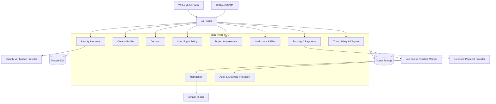

# 目标平台架构

> 状态：目标设计并分切片实现。当前 MVP 不依赖这些能力；IAM 机器契约、领域/授权规则、Memory application 与 framework-neutral HTTP/ASGI kernel 已有分层测试证据，真实 server/composition root、完整 production presenters/provider 与 E2E 仍未完成。精确边界以 [IAM 追踪表](/architecture/identity-tenancy-consent.md#req--design--test--code-追踪)为准；任何真实启用仍须满足[演进门槛](/development/roadmap.md)。

## 架构目标

目标平台把已经稳定的人工流程产品化，同时保留三条边界：关键决定有人负责、资金由持牌服务商处理、敏感披露遵循最小权限。早期采用**模块化单体 + 后台任务 + 托管基础设施**，避免先拆微服务再寻找业务边界。

## 逻辑上下文



## 模块边界

| 模块 | 拥有的数据与规则 | 不得直接做的事 |
| --- | --- | --- |
| Identity & Access | 用户、组织、角色、会话、同意版本 | 不拥有匹配分或支付状态 |
| Creator Profile | 意愿、能力证据、边界、容量、字段可见性 | 不决定是否邀请 |
| Demand | 问题、范围、验收、预算、成熟度状态 | 不直接修改资金事实 |
| Matching & Policy | 规则版本、MatchingAttempt、MatchRun、资格、Invitation、Selection 和解释；开放 Invitation 按 attempt/creator 唯一 | 不自动选人或绕过边界 |
| Project & Agreement | Project、Agreement 聚合根、AgreementVersion、Milestone、Delivery、Acceptance、ChangeOrder | 不伪造资金事实或直接调用支付密钥 |
| Workspace & Files | 项目讨论、输入请求、文件引用和扫描投影 | 不拥有 Delivery/Acceptance 状态，不修改已确认协议历史 |
| Funding & Payments | FundingTarget、供应商引用、Payment、Refund、Payout 和对账例外 | 不创建协议、不判断验收、不自行托管资金 |
| Trust, Safety & Dispute | 举报、风险审查、调解、处罚、申诉 | AI 不可独立作最终裁决 |
| Notification | 模板、发送偏好、投递状态 | 不作为业务状态事实来源 |
| Audit & Analytics | 追加审计、脱敏事件、读模型 | 不反向修改交易聚合 |

模块通过应用服务和领域事件协作。初期共享一个 PostgreSQL 集群，但每个模块拥有明确 schema/表和写入口；禁止跨模块随意更新表。

## 核心写入模型

规范术语、状态转换与并发边界见[目标平台领域模型与状态协议](/architecture/platform-domain-model.md)。

### Demand

`Demand` 是聚合根，状态转换通过命令执行。匹配前资金的 target 是不可变 `DemandVersion`，不引用尚不存在的 `AgreementVersion`；`funding_secured` 只能由验证通过的支付 webhook 或运营双人核实产生。`matching_opened` 要求当前需求版本、对应 Demand Funding 和规则版本均就绪。

### MatchRun

一个 `Demand` 可有多个不可变 `MatchingAttempt`，每次 attempt 有独立递增编号、Invitation 和可选的 Selection；同一时刻最多一个 attempt 开放。零合格候选时无需伪造 Selection，attempt 可直接关闭并由 process manager 把 Demand 推进 `NO_MATCH`。`NO_MATCH` 后重新匹配创建新 attempt，旧 attempt 与 Selection 保持终态。每个 attempt 可因 worker 失败或等价输入重试包含多个 `MatchRun`；输入版本、资金资格或规则基线改变时旧 attempt 必须失效。开放 Invitation 使用 `matching_attempt_id/creator_id` 部分唯一约束，即使来源 MatchRun 不同也不能重复。

每次运行创建不可变 `MatchRun`：

- `demand_version_id`、候选档案版本列表；
- taxonomy、budget、matching、reason codes 复合版本；
- 硬过滤与分项证据；
- 公平分配输入、操作者和运行时间；
- 面向不同接收者的解释投影。

算法升级不能重算并覆盖旧记录，只能创建新的 MatchRun。

### Project / Agreement

需求方只能在当前 attempt 已接受的 Invitation 中执行 Selection。外部命令 `ChooseCreator` 的 actor 必须是 DEMAND_OWNER；内部 `CompleteSelection` 由 SYSTEM 协调并保留 original_actor_id。平台不提供公开 CreateProject 命令；该事务锁定 Selection、MatchingAttempt 和 Demand，以 `selection_id` 唯一约束创建 `Project` 与其唯一 `Agreement` 根，并把 Demand 标记为已匹配。

每个 Project 只有一个 `Agreement` 聚合根；所有版本命令都携带 Agreement 的 `If-Match`，而不是直接并发写 AgreementVersion。`AgreementVersion` 只追加，version_no 在 Agreement 内唯一。每个 `ChangeOrder` 最多生成一个 resulting AgreementVersion，`source_change_order_id` 与 `resulting_agreement_version_id` 双向唯一；ApplyChangeOrder 同时比较 ChangeOrder 与 Agreement 的 expected_version。里程碑引用具体协议版本。已接受和结算的里程碑不可因后续争议被静默重写。

Project party、Agreement关闭内容与多方确认、Milestone、Workspace/File扫描、Delivery/Acceptance、更正与ChangeOrder、SafetyHold、幂等、事件及PostgreSQL/RLS义务，以 [Project、Agreement、Milestone 与 Delivery/Acceptance](/architecture/project-agreement-delivery.md)为权威细化。测试中的业务确认不等于真实司法辖区的合格电子签署。

项目讨论、InputRequest、MessageVersion、FileVersion、上传/下载能力、对象存储与恶意文件扫描、隐私与RLS义务，以 [Workspace、消息、输入请求与 FileVersion](/architecture/workspace-and-files.md)为权威细化。消息与文件投递结果不能改变Agreement/Delivery/Acceptance事实。

### Funding / Payment

`FundingTarget` 只允许两种形态：

- 匹配前的 `DEMAND_VERSION` target：绑定需求版本、金额、币种、失效时间和预协议退款规则，不含协议或创作者收款人，不能直接释放给创作者；
- 协议生效后的 `MILESTONE` target：绑定 `Project`、`AgreementVersion`、`Milestone`、金额、币种和收付款主体。

target 不可原地修改。失败重试创建相同 target 的 replacement Funding；要复用匹配前预授权，也必须在供应商确认后创建新的 Milestone Funding，并以 `FundingAllocation` 连接 Demand Funding 与 Milestone Funding。Funding 失败且重试耗尽时，process manager 把 Demand 恢复为待重新申请资金，或把 Milestone 恢复为草稿。

FundingTarget判别联合、人工双人核实、provider PaymentOperation、webhook durable inbox、replacement/allocation、release/refund/settlement、结果未知、对账、职责分离与RLS义务，以 [Funding、Payment、Webhook 与对账投影](/architecture/funding-and-payment-projection.md)为权威细化。任何本地状态都不是供应商余额或托管账户。

SafetyHold rich decision、Report/证据访问、Dispute/调解/Ruling/Appeal、双盲Review、职责分离、执行计划、隐私与RLS义务，以 [Trust、SafetyHold、Dispute、Appeal 与 Review](/architecture/trust-safety-dispute-review.md)为权威细化。AI不得拥有裁决、申诉决定或永久处罚命令。

领域事件到NotificationIntent、受审模板、接收者contact解析、偏好/suppression、provider回执、频率、隐私与RLS义务，以 [Notification、模板、偏好与投递回执](/architecture/notification-and-communications.md)为权威细化。通知投递永远不是业务状态事实。

业务/敏感读取Audit、签名checkpoint、事件gap、Outcome投影、日志/trace/metric隐私、数据导出与恢复义务，以 [Audit、Analytics、Outcome 与可观测性](/architecture/audit-analytics-observability.md)为权威细化。Analytics、BI和可观测性不能反向修改交易事实。

数据主体访问/导出、更正、限制处理、反对、删除、法律保留、跨Context任务、provider/object清除与恢复watermark，以 [数据权利、保留、法律保留与清除编排](/architecture/data-rights-retention-and-erasure.md)为权威细化。删除请求不能靠删User row完成，恢复旧备份也不得复活已清除或受限事实。

模型策略/Prompt发布、AIJob输入最小化、provider结果未知、关闭输出、人工采用、评测与RLS义务，以 [Controlled AI Gateway、模型策略与人工确认](/architecture/controlled-ai-gateway.md)为权威细化。AI Gateway在权限上无法调用选择、付款、处罚、裁决或签署命令。

Profile、Demand、Matching等Context共同引用的受控代码、TaxonomyBundle发布、兼容/弃用、crosswalk与consumer marker，以 [Taxonomy、受控代码与规则目录](/architecture/taxonomy-and-rule-catalog.md)为权威细化。业务版本永久固化exact bundle，Catalog不得用current重写历史；首版OpenAPI、事件与五份领域机器契约已11/11 GREEN，domain/application/PG行为仍按该页追踪。

领域Group、Contribution/同行评议、RuleProposal、投票/决议、公共知识与业务规则发布隔离，以 [Community、Contribution 与规则治理](/architecture/community-governance.md)为权威细化。社区决议只产生候选artifact，不能直接激活交易规则。

进程拆分、composition root、关闭配置、用途隔离keyring、PostgreSQL连接身份、健康/降级、worker生命周期、发布兼容与恢复演练，以 [生产组合根、部署与运行控制](/architecture/production-composition-and-operations.md)为权威细化。除各切片明确列出的GREEN证据外，生产编排与外部依赖仍是planned。

同源BFF、浏览器Session/CSRF启动、页面capability、表单ETag/Idempotency-Key、结果未知恢复、文件能力、CSP、可访问性与前端供应链，以 [Web BFF、浏览器会话与前端产品壳](/architecture/web-bff-and-frontend.md)为权威细化。前端只能消费服务端关闭投影，不能用客户端隐藏实现授权或字段披露。

## API 设计草案

外部 API 使用 HTTPS JSON，写操作接受 `Idempotency-Key`，资源更新使用版本号或 `If-Match`。示例命令边界：

IAM-01 的 OpenAPI 到可执行协议内核、Origin/CSRF、关闭解析、错误映射、ASGI 读取/断线和 Session rotation header 语义见 [IAM HTTP transport 与 ASGI 边界](/architecture/iam-http-transport.md)。该边界只把已验证请求映射到应用命令，不从请求重算租户、角色或政策事实。

IAM-01 九个公开读取 operation 的权威来源、接收者字段 allowlist、非披露、状态过滤、policy current/hash、稳定 cursor、ETag/cache 与只读查询预算见 [IAM read model 与 application query 边界](/architecture/iam-read-models.md)。读取 presenter 只能序列化该边界返回的关闭结果，不能直接暴露 repository row 或用 Session/请求重建授权事实。

IAM-01 的两个独立 SELF 写入口 `AcceptCurrentPolicies` 与 `GrantConsent` 必须以 `/me.policy_requirements[]` 发布的 exact `(selector_digest,scope_type,scope_id)` 引用选择持久 authority，并同时提交 exact current bundle；Consent scope 只可由受信 immutable offer派生。完整请求、User If-Match、Session evidence、receipt/current race、锁序、事件与隐私边界见 [IAM 当前政策接受与 Consent 授予命令](/architecture/iam-policy-consent-commands.md)。

OIDC identity新增/移除、contact变更、失去provider后的账户恢复、账号关闭及其Session/authority/Data Rights后果，以 [IAM 身份绑定、账户恢复与关闭](/architecture/iam-identity-linking-recovery-and-closure.md)为权威后续设计。当前这些入口默认关闭，禁止用email自动合并或支持人员直接改IAM表替代。

首个非 IAM 切片的个人档案根、不可变 `ProfileVersion`、逐项字段可见性、能力证据、IAM/SafetyHold、Matching冻结输入、幂等事务与 PostgreSQL/RLS义务见 [Creator Profile、版本与字段披露设计](/architecture/creator-profile.md)。机器契约与domain/application Memory已GREEN，真实PG18已取得独立semantic RED并在后续切片实现；这些证据仍不能把当前MVP creator JSON当作平台已发布档案或声称HTTP/E2E已完成。

Organization 拥有的 `Demand`、不可变 `DemandVersion`、提交与职责分离审核、资金资格镜像、发起Matching、接收者投影、幂等事务及PostgreSQL/RLS义务见 [Demand、不可变版本与审核/资金/匹配边界](/architecture/demand-lifecycle.md)。机器契约与domain/application Memory已GREEN，PostgreSQL/RLS正在独立设计和取RED；在真实资金与跨层门禁GREEN前，MVP demand JSON与人工 `status=funded` 都不是平台资金或可匹配事实。

`MatchingAttempt/MatchRun/MatchCandidate`、确定性算法、业务Invitation、Creator响应、Selection、规则包、接收者投影以及唯一跨Context `CompleteSelection` 的实现边界见 [MatchingAttempt、MatchRun、业务 Invitation 与 Selection](/architecture/matching-invitation-selection.md)。机器契约、domain与Memory application已GREEN，PostgreSQL/RLS/HTTP与CompleteSelection composition仍planned；算法输出只形成可解释候选，不能替参与者选择。

```text
POST   /v1/demands
POST   /v1/demands/{id}/submit
POST   /v1/demands/{id}/verify
POST   /v1/demands/{id}/open-matching
GET    /v1/demands/{id}/matching-attempts
POST   /v1/match-runs/{id}/invitations
POST   /v1/invitations/{id}/respond
POST   /v1/selections/{id}/choose
POST   /v1/agreements/{id}/versions
POST   /v1/projects/{id}/change-orders
POST   /v1/milestones/{id}/deliveries
POST   /v1/deliveries/{id}/accept
POST   /v1/projects/{id}/disputes
GET    /v1/audit-events?resource_type=&resource_id=
```

`POST /v1/selections/{id}/choose` 是 DEMAND_OWNER 的业务命令入口，成功响应可以返回内部创建的 `project_id`；SYSTEM 只负责协调 CompleteSelection，不替代外部 actor。不存在独立的公开 `POST /v1/projects`。同一 Selection 的并发或重试最多创建一个 Project。`POST /v1/agreements/{id}/versions` 和版本确认命令必须使用 Agreement ETag；ChangeOrder 应用同时校验 ChangeOrder 与 Agreement 版本。

读取 DTO 按接收者生成，不能把数据库对象直接序列化。创作者的私密底线只进入资格计算；需求方 DTO 只看到“预算兼容”，运营者也只在确有职责时获得字段级授权。

## 异步事件

同一数据库事务写业务状态和 outbox，worker 至少一次投递。消费者必须幂等。claim/lease fencing、ack unknown、backoff/dead letter、schema registry、固定 SQL、隐私与消费者 inbox 的关闭协议见[跨平台 Outbox delivery worker 设计](/architecture/outbox-delivery.md)；未完成该协议的真实数据库与 broker 证据前，不能把 Memory 行为描述为可靠投递已完成。

```text
DemandVerified
FundingSecured
MatchingRequested
MatchingAttemptOpened
MatchRunCompleted
InvitationSent
InvitationResponded
SelectionMade
MatchingAttemptSelected
ProjectCreated
AgreementCreated
DemandMatched
AgreementVersionAccepted
MilestoneFunded
DeliverySubmitted
DeliveryAccepted
ChangeOrderAccepted
DisputeOpened
ProjectCompleted
```

通知、搜索索引、分析读模型和外部 webhook 由事件驱动。强一致只覆盖 owning context 内的聚合与审计/outbox，以及 `CompleteSelection` 这一项明确列出的跨 Context 原子事务；Matching 只发 SelectionMade/MatchingAttemptSelected，Project & Agreement 只发 ProjectCreated/AgreementCreated，Demand 只发 DemandMatched，各事件使用独立 event_id 和共同 correlation_id。Funding 推进 Demand/Milestone、争议 hold、项目就绪和支付结算均由幂等 process manager 协调。任何通知失败都不能回滚已成功的业务决定，应进入重试和人工死信队列。

## 支付集成

平台只保存供应商、外部对象 ID、金额、币种、状态、对账时间和 webhook 事件摘要。要求：

- webhook 验签、时间窗检查和事件 ID 去重；
- Demand Funding 的金额与 DemandVersion 绑定；Milestone Funding 的金额与 AgreementVersion/Milestone 绑定，服务费和创作者净额透明；
- 状态机不允许从 `settled` 任意回退；退款和争议使用独立事件；
- `PARTIALLY_REFUNDED` 仍是 active Funding，继续占用 target/purpose 唯一约束，直至达到明确终态；
- 每日对账比较平台投影与供应商事实；
- 开工前验证首个里程碑资金保障；
- 供应商故障时停止新开工，不猜测付款成功。

## 数据与搜索

- PostgreSQL：交易与审计主数据；
- 对象存储：交付文件、协议导出和证据，使用加密、版本、恶意文件扫描和短期签名 URL；
- 搜索：早期用 PostgreSQL 全文/结构索引；只有数据量和语义需求证明必要时才引入专用搜索或向量库；
- 分析：通过脱敏事件或只读副本构建，不让 BI 直接读取私密字段；
- 缓存：只缓存公开或接收者无关数据，私密匹配 DTO 默认不共享缓存。

## 授权模型

采用 RBAC + 关系/属性约束：

```text
allow(user, action, resource, field)
  if role permits action
  and user is related to project/organization
  and resource state permits action
  and field visibility permits disclosure
  and no safety hold blocks action
```

运营后台不是“超级用户直通数据库”。高风险动作要求理由、工单、必要时双人批准，并生成独立审计事件。支持人员默认看不到私密报酬和安全反馈正文。

## 可靠性与可观测性

首个生产版本建议目标：

- 核心 API 月可用性目标 99.9%，支付 webhook 可延迟但不可丢失；
- 数据库每日全量 + 持续增量备份，定期恢复演练；
- 所有写请求带 trace ID、actor ID、resource ID 和规则版本；
- 指标覆盖请求延迟/错误、队列积压、webhook 重试、状态停留时间、通知失败和对账差异；
- 业务 SLI 覆盖从提交到验证、从注资到候选、验收响应和结算时间；
- 日志禁止记录 access token、联系人正文、私密底线、文件内容和完整 webhook payload。

## 部署拓扑

早期可使用同一镜像的独立 `web-api`、`webhook-ingress` 与 worker 进程、托管 PostgreSQL 和对象存储，前面放 CDN/WAF；进程即使物理共址也使用不同入口、数据库 role、凭据和扩缩容单位。生产、预发布、开发使用独立账户/项目、数据库、密钥和支付沙箱。迁移采用向前兼容的 expand/migrate/contract，部署可以回滚到仍兼容当前 schema head 的应用，但不能假设数据库自动回滚。完整运行协议见[生产组合根、部署与运行控制](/architecture/production-composition-and-operations.md)。

## 从 MVP 迁移

1. 先定义正式 schema、字段可见性和数据处理协议；
2. 为现有 JSON 建立版本与迁移器，拒绝无版本输入；
3. 导入 taxonomy、budget、matching、reason codes，保持历史复合版本；
4. 迁移当前实体与推荐/决定/结果，保留原始本地 ID 作为外部引用；
5. 用固定样例做新旧引擎差分测试；
6. 先让平台生成建议，人工流程仍作为事实来源；
7. 经一个完整批次验证后，再把单个工作流切为平台主写；
8. 为每次切换准备数据导出、人工降级和回退标准。

不得一次性把所有人工流程搬入平台。每次只产品化一个反复出现、规则稳定、能定义成功指标和人工降级路径的瓶颈。
