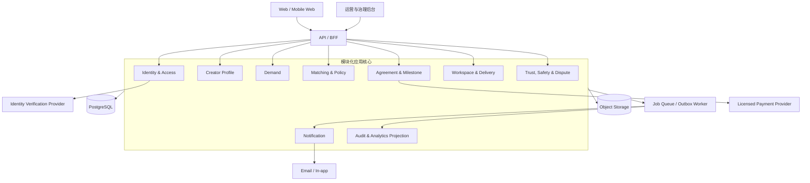

# 目标平台架构

> 状态：目标设计。以下能力尚未在当前 MVP 中实现，只能在真实项目证据满足[演进门槛](/development/roadmap.md)后逐步建设。

## 架构目标

目标平台把已经稳定的人工流程产品化，同时保留三条边界：关键决定有人负责、资金由持牌服务商处理、敏感披露遵循最小权限。早期采用**模块化单体 + 后台任务 + 托管基础设施**，避免先拆微服务再寻找业务边界。

## 逻辑上下文



## 模块边界

| 模块 | 拥有的数据与规则 | 不得直接做的事 |
| --- | --- | --- |
| Identity & Access | 用户、组织、角色、会话、同意版本 | 不拥有匹配分或支付状态 |
| Creator Profile | 意愿、能力证据、边界、容量、字段可见性 | 不决定是否邀请 |
| Demand | 问题、范围、验收、预算、成熟度状态 | 不直接修改资金事实 |
| Matching & Policy | 规则版本、资格、分项、推荐、解释 | 不自动选人或绕过边界 |
| Agreement & Milestone | 协议版本、双方确认、里程碑、变更单、付款引用 | 不保存支付密钥或自行托管资金 |
| Workspace & Delivery | 项目讨论、输入、文件引用、提交、验收 | 不修改已确认协议历史 |
| Trust, Safety & Dispute | 举报、风险审查、调解、处罚、申诉 | AI 不可独立作最终裁决 |
| Notification | 模板、发送偏好、投递状态 | 不作为业务状态事实来源 |
| Audit & Analytics | 追加审计、脱敏事件、读模型 | 不反向修改交易聚合 |

模块通过应用服务和领域事件协作。初期共享一个 PostgreSQL 集群，但每个模块拥有明确 schema/表和写入口；禁止跨模块随意更新表。

## 核心写入模型

### Demand

`Demand` 是聚合根，状态转换通过命令执行。`funding_secured` 只能由验证通过的支付 webhook 或运营双人核实产生；`matching_opened` 要求需求验证、资金和规则版本均就绪。

### MatchRun

每次运行创建不可变 `MatchRun`：

- `demand_version_id`、候选档案版本列表；
- taxonomy、budget、matching、reason codes 复合版本；
- 硬过滤与分项证据；
- 公平分配输入、操作者和运行时间；
- 面向不同接收者的解释投影。

算法升级不能重算并覆盖旧记录，只能创建新的 MatchRun。

### Project / Agreement

双方选择后创建 `Project`。`AgreementVersion` 只追加，每次变更生成新版本并由受影响方确认；里程碑引用具体协议版本。已接受和结算的里程碑不可因后续争议被静默重写。

## API 设计草案

外部 API 使用 HTTPS JSON，写操作接受 `Idempotency-Key`，资源更新使用版本号或 `If-Match`。示例命令边界：

```text
POST   /v1/demands
POST   /v1/demands/{id}/submit
POST   /v1/demands/{id}/verify
POST   /v1/demands/{id}/open-matching
GET    /v1/demands/{id}/matches
POST   /v1/match-runs/{id}/invitations
POST   /v1/invitations/{id}/respond
POST   /v1/projects
POST   /v1/projects/{id}/agreement-versions
POST   /v1/milestones/{id}/deliveries
POST   /v1/deliveries/{id}/accept
POST   /v1/projects/{id}/disputes
GET    /v1/audit-events?resource_type=&resource_id=
```

读取 DTO 按接收者生成，不能把数据库对象直接序列化。创作者的私密底线只进入资格计算；需求方 DTO 只看到“预算兼容”，运营者也只在确有职责时获得字段级授权。

## 异步事件

同一数据库事务写业务状态和 outbox，worker 至少一次投递。消费者必须幂等。

```text
DemandVerified
FundingSecured
MatchingOpened
MatchRunCompleted
InvitationSent
InvitationResponded
AgreementAccepted
MilestoneFunded
DeliverySubmitted
DeliveryAccepted
ScopeChangeAccepted
DisputeOpened
ProjectCompleted
```

通知、搜索索引、分析读模型和外部 webhook 由事件驱动；资金、协议确认和验收等强一致状态仍在主事务内完成。任何通知失败都不能回滚已成功的业务决定，应进入重试和人工死信队列。

## 支付集成

平台只保存供应商、外部对象 ID、金额、币种、状态、对账时间和 webhook 事件摘要。要求：

- webhook 验签、时间窗检查和事件 ID 去重；
- 金额与协议版本绑定，服务费和创作者净额透明；
- 状态机不允许从 `settled` 任意回退；退款和争议使用独立事件；
- 每日对账比较平台投影与供应商事实；
- 开工前验证首个里程碑资金保障；
- 供应商故障时停止新开工，不猜测付款成功。

## 数据与搜索

- PostgreSQL：交易与审计主数据；
- 对象存储：交付文件、协议导出和证据，使用加密、版本、恶意文件扫描和短期签名 URL；
- 搜索：早期用 PostgreSQL 全文/结构索引；只有数据量和语义需求证明必要时才引入专用搜索或向量库；
- 分析：通过脱敏事件或只读副本构建，不让 BI 直接读取私密字段；
- 缓存：只缓存公开或接收者无关数据，私密匹配 DTO 默认不共享缓存。

## 授权模型

采用 RBAC + 关系/属性约束：

```text
allow(user, action, resource, field)
  if role permits action
  and user is related to project/organization
  and resource state permits action
  and field visibility permits disclosure
  and no safety hold blocks action
```

运营后台不是“超级用户直通数据库”。高风险动作要求理由、工单、必要时双人批准，并生成独立审计事件。支持人员默认看不到私密报酬和安全反馈正文。

## 可靠性与可观测性

首个生产版本建议目标：

- 核心 API 月可用性目标 99.9%，支付 webhook 可延迟但不可丢失；
- 数据库每日全量 + 持续增量备份，定期恢复演练；
- 所有写请求带 trace ID、actor ID、resource ID 和规则版本；
- 指标覆盖请求延迟/错误、队列积压、webhook 重试、状态停留时间、通知失败和对账差异；
- 业务 SLI 覆盖从提交到验证、从注资到候选、验收响应和结算时间；
- 日志禁止记录 access token、联系人正文、私密底线、文件内容和完整 webhook payload。

## 部署拓扑

早期可使用一个应用服务、一个 worker、托管 PostgreSQL 和对象存储，前面放 CDN/WAF。生产、预发布、开发使用独立账户/项目、数据库、密钥和支付沙箱。迁移采用向前兼容的 expand/migrate/contract，部署可以回滚应用但不能假设数据库自动回滚。

## 从 MVP 迁移

1. 先定义正式 schema、字段可见性和数据处理协议；
2. 为现有 JSON 建立版本与迁移器，拒绝无版本输入；
3. 导入 taxonomy、budget、matching、reason codes，保持历史复合版本；
4. 迁移当前实体与推荐/决定/结果，保留原始本地 ID 作为外部引用；
5. 用固定样例做新旧引擎差分测试；
6. 先让平台生成建议，人工流程仍作为事实来源；
7. 经一个完整批次验证后，再把单个工作流切为平台主写；
8. 为每次切换准备数据导出、人工降级和回退标准。

不得一次性把所有人工流程搬入平台。每次只产品化一个反复出现、规则稳定、能定义成功指标和人工降级路径的瓶颈。
