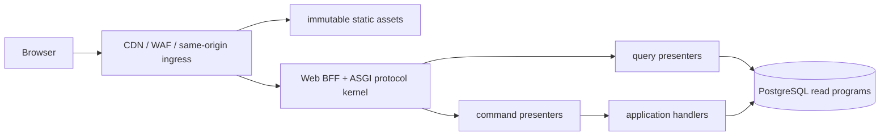

# Web BFF、浏览器会话与前端产品壳

> 状态：目标设计；INTERNAL_SANDBOX 已有同源 Web/BFF、角色工作台、关闭 DTO 解析与构建/契约测试，尚无生产发布或真实参与者 E2E GREEN 证据。
> 适用范围：平台登录后的浏览器产品、同源 BFF、页面路由、读取/写入交互、可访问性和前端安全。
> 前置设计：[IAM HTTP transport](/architecture/iam-http-transport.md)、[生产组合根、部署与运行控制](/architecture/production-composition-and-operations.md)与各领域机器契约。

## 1. 产品边界

首版 Web 产品服务五类受控工作区：

- Creator：个人 Profile、收到的业务 Invitation、Project、Workspace、交付和 Consent；
- Demand Owner：Organization、Demand、Funding、Matching、Selection、Project、验收，以及本人举报/处理结果发现与申诉；
- Organization Admin：同组织成员/邀请生命周期与组织公开名称更正；不提供组织 type/status/jurisdiction、平台角色、项目/案件角色或任意权限编辑；
- Reviewer/Mediator：只显示明确分配的审核、Trust/Appeal 案件、争议或双盲 Review；
- Operator：只显示受职责分离、理由和工单约束的运营任务，不提供数据库“超级后台”。

公开文档/政策页面和登录后的产品壳分开构建。首版不提供匿名人才目录、任意跨租户搜索、客户端离线业务写、浏览器直连 provider、浏览器保存访问 token，或由 UI 隐藏字段充当授权。

服务端 read model/presenter 是字段披露的唯一权威来源。前端不能取得完整 row 后按角色删字段，也不能因为按钮隐藏就假定命令被授权。

## 2. 同源架构



浏览器只访问一个规范 HTTPS origin：

| URL 空间 | 用途 | 缓存 |
| --- | --- | --- |
| `/app/*` | 登录后 HTML shell；未知客户端 route仍返回 shell | `no-store`，不嵌入用户数据 |
| `/assets/<content-digest>/*` | JS/CSS/font/image构建制品 | `public, max-age=31536000, immutable` |
| `/v1/*` | 关闭 JSON API | 由各 OpenAPI operation 精确规定 |
| `/health/live`、`/health/ready` | 基础设施探针 | 不对公网暴露依赖细节 |
| `/docs/*` | 公开静态文档，可独立 host | 不带 Session，不与产品数据共享脚本 |

BFF 不是第二套领域服务。它只执行 HTTP 安全、认证 Session、CSRF、关闭解析、operation presenter、response/cookie策略和静态制品服务；事务、授权、幂等、SafetyHold 和状态机仍在 application/adapter。

首版前端采用严格 TypeScript 的组件化单页产品壳，构建输出为纯静态 content-addressed assets；具体 UI framework 和版本在实现 ADR 中选择并由 lockfile 固定。框架不得引入运行时 schema/授权反射或把任意服务端 HTML 注入 DOM。若框架选择改变，不得改变本页的请求、Session、可访问性和状态恢复协议。

## 3. 浏览器 Session 启动

Session cookie 固定为 `__Host-ds_session`、`Secure`、`HttpOnly`、`SameSite=Lax`、`Path=/`、无 `Domain`。JavaScript 永远读不到 raw handle。应用 shell 启动固定执行：

1. 加载本地静态 assets，不从 URL、storage 或 HTML data attribute恢复身份；
2. `GET /v1/auth/session`，浏览器自动附带 cookie；
3. 服务端返回关闭 bootstrap：当前 User 安全摘要、Session ID/到期提示、CSRF token、允许的顶级 navigation capabilities、trace ID；
4. CSRF 只保存在当前页面进程内存，不写 cookie、DOM、URL、localStorage、sessionStorage、IndexedDB、service worker cache、日志或 analytics；
5. 再按已返回 capability请求 `/v1/me` 和当前页面 read model；
6. 401 清空内存状态并进入登录；503 显示不可用而不把用户当匿名；网络错误进入“连接未知”状态。

CSRF 是 Session generation 绑定值。任一响应带 Session rotation 时，旧页面停止发新写请求、清空旧 CSRF，并重新 bootstrap。completed receipt replay不会重发 raw Session/CSRF；如果首次成功 response 丢失，用户重新登录后用原 Idempotency-Key 恢复安全结果。

多 tab 不共享 CSRF 的持久副本。每个 tab独立 bootstrap；Session 被另一 tab撤销或旋转后，下一次请求按服务端错误统一收口。`BroadcastChannel` 最多广播“需要重新 bootstrap”这一无身份布尔信号，不能广播 token、User、Organization、业务正文或错误细节。

## 4. 登录与邀请旅程

### 4.1 OIDC

登录按钮调用 `POST /v1/auth/oidc/authorizations`，只传关闭的 `return_to` 和可选 access invitation token。服务端设置 OIDC browser cookie并返回受控 authorization URL；前端用整页导航，不把 URL 发给 analytics或写入 storage。

callback 页面本身不解析 `code/state/error`，由 BFF callback operation读取原始 query、完成 durable claim/exchange/final transaction并清理 URL。成功后使用服务端 allowlist 的相对 `return_to` 做 `history.replaceState`/redirect；失败只显示稳定 error code 与 trace ID，不显示 provider description。

### 4.2 Access Invitation

邀请 token只能来自用户显式打开的 URL，并立即 POST 到 anonymous inspect operation；页面随后用 `history.replaceState` 删除 query/fragment中的 token。token不进入错误、截图 telemetry、referrer、clipboard helper、DOM dataset或本地缓存。

接受页面只渲染 inspect DTO 的最小角色、组织预览、policy requirements与 consent offers。接受命令使用服务端返回的 invitation ID/ETag/current bundle；用户必须逐项作出 required policy/consent选择。若 current bundle变化，UI重新获取并要求重新确认，不能复用旧勾选。

## 5. 页面与 capability 路由

顶级 route 不等于授权。router可注册所有页面，但导航和数据加载只使用 bootstrap/read model 返回的 capability；直接输入 URL仍调用同一服务端 operation并接受404/403。

| route | 首要用途 | 权威读取 |
| --- | --- | --- |
| `/app` | 角色相关任务概览 | `/me` + Context任务投影 |
| `/app/profile` | Creator Profile草稿/发布/暂停 | Profile owner read model |
| `/app/demands`、`/app/demands/:id` | Demand列表、版本、审核/资金/匹配准备 | Organization-scoped Demand read models |
| `/app/matching/:attemptId` | 候选解释、业务Invitation与Selection | frozen Attempt/Run投影 |
| `/app/projects/:id` | Agreement、Milestone、Funding、Delivery | Project party projection |
| `/app/projects/:id/workspace` | Message/InputRequest/FileVersion | Workspace recipient projection |
| `/app/reviews` | 被分配的审核/双盲Review | assignment-bound projection |
| `/app` 的 Trust 工作台 | 待处理、本人活动分配、Hold 释放与本人已完成案件 | actor-bound Trust queue/assignment/history projections |
| `/app/disputes/:id` | party/mediator可见争议事实 | closed Dispute projection |
| `/app/settings/security` | Session、政策要求与Consent | IAM SELF read models |
| `/app/org/:id/settings` | public name、membership/invitation与受控管理 | Organization IAM read models + Organization ETag |
| `/app/ops/*` | 运营任务/对账/恢复请求 | duty + work-item projection |

页面 loader 不做泛化 GraphQL 或任意 include。每页由一个或少量固定 read operation组成，返回关闭、already-redacted DTO。跨 Context 汇总使用专门 projection，不在浏览器 join 多个私密全集。

## 6. 客户端状态模型

状态分四类并禁止混用：

| 类别 | 保存位置 | 示例 |
| --- | --- | --- |
| server facts | query cache内存，随 ETag/version标记 | ProfileVersion、Demand、Project摘要 |
| route state | URL中无秘密的ID、tab、cursor | `project_id`、当前公开子页 |
| ephemeral input | 当前组件内存；必要时明确的非敏感草稿缓存 | 表单未提交值 |
| protocol carrier | 专用敏感内存容器 | CSRF、Idempotency-Key、upload capability |

禁止把 User DTO、联系人、compensation、边界、争议、消息、文件locator、provider响应、邀请token、Session/CSRF或任意 raw receipt写到 localStorage/IndexedDB/service worker。浏览器 back/forward cache 恢复后必须重新验证 Session generation和页面数据 freshness。

查询 cache key 包含 operation ID、canonical params、actor/session generation和安全 organization scope；退出、rotation、authority change时整体丢弃。不同 User 不能复用同一个持久 cache。服务端返回404时删除对应 cached实体，不能用旧数据维持页面。

## 7. 写操作状态机

每个表单使用独立 mutation controller：

```text
EDITING -> SUBMITTING -> SUCCEEDED
                  |-> REJECTED
                  |-> OUTCOME_UNKNOWN -> RECOVERING -> SUCCEEDED/REJECTED/STILL_UNKNOWN
```

### 7.1 ETag 与关闭 payload

编辑页从 read DTO取得强 ETag/aggregate version。写请求 body只含 operation contract允许的字段；target ID来自 canonical route，actor/org/role/Session不进入 body。提交时冻结一份 canonical UI intent，禁止用户双击创建新 key。

412 时先重新读取并绑定 current 完整版本与 ETag，再按 Profile 的 9 个或 Demand 的 13 个顶层
分区做三方归因。仅服务器修改、仅用户修改或双方结果相同的分区可以自动组合；双方都修改且
结果不同的分区必须逐项选择整份服务器分区或用户分区，不能在同一分区内猜测深层合并。选择
完成后只把结果载入结构化编辑器并标记本地草稿，不自动发送写请求；用户复核并显式保存时才
产生新命令、新 Idempotency-Key 和 fresh If-Match。冲突未应用或放弃前，离页、底层编辑、
提交和生命周期动作全部关闭。客户端不能把旧输入整包套到新版本，也不能把 412 当成功。

### 7.2 Idempotency-Key

每次逻辑 mutation生成128 bit以上CSPRNG base64url key。key放在 `repr`/telemetry黑名单的内存对象中；为支持同一 tab在网络未知后的恢复，可临时保存到 `sessionStorage` 的专用、版本化 pending-mutation记录，内容只允许 `{operation_id, canonical_target, key, payload_digest, started_at}`，不保存body、User或响应。终态即删除；TTL到期或User/session generation变化也删除。不得同步到 cloud/browser extension或跨 tab广播。

从 pending record恢复前重新 bootstrap并重建同一 payload；本地 digest不匹配则停止并要求人工确认，不能用同key发不同payload。503 `COMMAND_OUTCOME_UNKNOWN`、response body丢失或网络断线进入恢复；普通4xx不自动重试。GET可按operation budget安全重试，写请求只由该controller以同key明确重放。

### 7.3 错误展示

UI按 stable code映射固定、可本地化文案，保留 trace ID供支持。不得直接展示服务端 `message`中的任意动态正文；字段问题只定位到contract允许的field path。404不区分“不存在/不是owner/状态不可披露”；503不建议用户创建新key；SafetyHold BLOCK和UNAVAILABLE使用不同可操作文案但不披露规则内部原因。

## 8. 复杂工作流

### 8.1 Profile 与 Demand 编辑

编辑器只操作不可变版本草稿。autosave首版关闭，避免隐式频繁命令和结果未知；用户显式保存产生新版本。离开有未保存更改时使用页面内确认，不能依赖浏览器 unload 发写请求。发布页面显示 canonical server preview、policy/taxonomy版本、expiry和SafetyHold可能性；确认后内容在本次版本不可修改。

任何保存、发布、提交或未知结果恢复一旦占有当前写入门闩，编辑器必须用一个原生 `fieldset` 同时锁住 taxonomy、全部结构化字段和写入按钮，并通过 live status 说明原因。锁持续到 fresh 服务端事实已验证或未知结果被显式处理，不能只禁用被点击的按钮。这样迟到响应不会覆盖用户在请求期间继续输入的新值，也不会让字段看似可编辑却最终被服务端快照静默替换。

Demand审核、资金确认与开启匹配分别是独立步骤/命令，UI不能做“保存并自动完成全部”。审核 assignment、四眼资金 duty和matching rule bundle由服务端返回；前端不推断下一状态。

### 8.2 Matching 与 Selection

候选页只显示当前 MatchRun 的冻结recipient projection和解释码。排序由服务端给出；客户端筛选只改变展示，不能改变Selection事实。业务 Invitation逐个发送且可追踪；Selection只允许accepted candidate，必须明确显示采用的DemandVersion、ProfileVersion和Funding状态。

### 8.3 Agreement、Delivery 与付款

Agreement显示逐版本差异和每方确认状态。确认、变更、交付、验收、争议、release/refund均为独立操作和独立ETag；UI不得把provider pending当作付款完成。金额始终由整数minor units + currency格式化，计算/校验仍由服务端完成。

provider redirect使用整页导航和服务端创建的短期capability；return页面只触发read/reconciliation，不用query声称成功。结果未知时显示“正在核对”，不提供重复扣款按钮。

### 8.4 Workspace 与文件

上传先向服务端申请single-purpose capability，再直接上传对象存储；capability只在内存，绑定actor/workspace/file version/content length/type/hash/expiry。上传成功不等于文件可见：页面轮询安全FileVersion状态，只有扫描 `CLEAN` 才允许受控下载。下载同样用短期capability，禁止把永久对象URL放入DOM、消息或日志。

消息正文按服务器返回的已过滤projection显示。Markdown首版使用安全受限子集并先转义；不支持原始HTML、任意iframe、远程图片或脚本URL。

### 8.5 Organization public name

组织设置页只在已发布 workspace capability 指向 exact Organization、返回角色含 `ORG_ADMIN`，且 Organization summary、邀请页与成员页三个服务端投影完整绑定时才解锁公开名称表单。这个 capability 只是 UI gate；写入时服务端仍重新证明 same-org ACTIVE Membership/ORG_ADMIN、ACTIVE Organization 与 recent MFA。

表单精确展示 NFC、trim、1..160 Unicode code point 和禁止 `Cc`/`Cf` 的边界，并拒绝与当前名称相同的本地 intent。用户必须另行确认“新名称会立即显示在现有未接受邀请的匿名预览中”，才能以当前 Organization ETag、CSRF 和新 Idempotency-Key 发送 exact `{public_name, reason_code:"PUBLIC_NAME_CORRECTION"}`。更名不改 Invitation ID/version/ETag/token 或 policy binding；inspect 每次从 Organization live join 得到名称。

公开名称一旦 dirty，同一工作台的邀请/成员写入、重新发现工作区和离页都必须先更新或明确放弃；刷新不得静默丢草稿。一次性邀请 capability 尚在当前页面内存中等待安全交付时，所有其他组织写入继续冻结。

邀请到期输入使用 `datetime-local` 时，默认值必须先把当前 instant 精确增加 14×24 小时，再格式化为当前浏览器的本地墙钟；不得把 UTC ISO 字符串直接截断成“本地”值。提交时按本地墙钟严格解析并转换为 UTC ISO，非法日期、DST 不存在时间或解析失败均关闭写入。跨时区或跨 DST 时，界面墙钟可以变化，但默认到期与创建 instant 的绝对间隔必须保持 336 小时。

412 恢复必须清除旧 pending intent，fresh GET 当前 Organization/ETag，保留拟提交名称用于人工比较；若服务端已等于该值则不重发，否则用户重新确认后必须生成新 key/If-Match。`MFA_STEP_UP_REQUIRED` 保留完全冻结的原 intent，完成同账号通用 STEP_UP 后只能原样重试；网络/5xx `COMMAND_OUTCOME_UNKNOWN` 也只能用同 key/payload/ETag 恢复。明确非 MFA 失败才清理 pending，不能把未知结果当作失败发新 key。

### 8.6 Trust Officer 终态工作台

Trust 工作台的首次加载和手动刷新是一个原子快照：案件队列、本人活动 assignment、Hold 释放队列与
`GET /v1/app/trust/history` 四项全部通过关闭 DTO 校验后才替换旧画面。history 必须拒绝未知字段、重复 Case、非 UTC
时间、未知 outcome 以及服务端排序倒退；`has_more=true` 时明确提示还有更早记录，不得把固定 100 条窗口包装成完整历史。

发布案件终态后，客户端 fresh GET 四项并要求该 exact Case 已从活动区消失且在本人 history 中出现，才展示提交成功后的
稳定状态。任务卡进入 Trust history 时，不信任 `resource_path` 进行任意导航；客户端重新验证 Session、工作区和当前任务
投影，再以任务中的 exact Case ID 聚焦历史行。换账号后目标不存在必须清除焦点，绝不能从旧页面缓存或另一名 Officer 的
历史中恢复。终态行只显示决定时间和 party-safe outcome label，不提供已经失效的活动案件详情入口。

### 8.7 Finance task 精确详情入口

`CLAIM_FINANCE_REVIEW` 任务只把键盘焦点移到资金确认队列，绝不自动领取。只有
`CONTINUE_FINANCE_REVIEW` 与 `WAIT_FOR_FINANCE_CONFIRMATION` 可以打开 exact 详情；点击后客户端必须重新读取
Session、workspace discovery、workspace objects 和 task discovery，证明同一 Session、同一 PLATFORM workspace、
当前 `FINANCE_OPERATOR` duty、同一 task kind/review ID/action，以及恰好一条仍分配给本人的 PENDING queue row。

详情 GET 只能由 fresh task 的 `resource_id` 构造，不能信任 `resource_path`。响应提交到画面前还要绑定 review ID、
Demand ID/version、revision、status、queue/review ETag、确认计数、expiry、available actions 与 `can_confirm`；任一漂移
都返回“任务已不可用”且零写入。该入口只读，不得隐式 claim、confirm、finding 或 release；最终聚焦时再用 DOM 上的
review ID 复核一次，避免旧的 animation frame 把焦点放到后来加载的另一条记录。

## 9. 可访问性与本地化

首版验收目标为 WCAG 2.2 AA：

- 全功能键盘可达，焦点顺序/可见焦点稳定，modal正确trap并恢复焦点；
- landmarks、heading、label、description、error summary和live region语义完整；
- 不仅靠颜色/动画表达状态，遵循reduced motion/high contrast；
- 点击目标、对比度、缩放到200%、窄屏重排和超时提醒满足标准；
- 异步成功/失败、Session即将到期、结果未知都可被辅助技术获知但不重复轰炸；
- destructive/high-risk操作使用明确动作名称，不用模糊“确定”；
- 语言、日期、时区、货币和复数使用受控locale；业务code和金额不经浮点转换。

服务端保存UTC instant和IANA timezone；前端展示明确时区，在截止/到期前同时给absolute时间。locale只影响展示，不进入policy selector、hash、Idempotency payload或授权事实，除非operation contract明确接受它。

翻译catalog是版本化构建制品；缺key在CI失败，生产不静默展示内部code以外的任意fallback。法律/政策正文不由普通UI翻译catalog替代，必须展示已发布PolicyDocument的exact locale/hash。

## 10. 浏览器安全

响应至少设置：

- `Content-Security-Policy`：默认拒绝；脚本/style使用self + build hash/nonce，禁 `unsafe-inline/eval`；`connect-src`、`img-src`、`font-src`、`frame-src`按部署allowlist；
- `frame-ancestors 'none'`、`base-uri 'none'`、`object-src 'none'`、`form-action 'self'`；
- `Strict-Transport-Security`、`X-Content-Type-Options: nosniff`、受控 `Referrer-Policy`、最小 `Permissions-Policy`；
- cross-origin opener/resource政策在OIDC/provider跳转矩阵中实测，不能破坏必要回调后随意放宽。

所有外链显式标记并防opener劫持。URL不放秘密；页面title、breadcrumb和toast不包含联系人/争议/私密报酬。第三方analytics、chat widget、session replay、远程字体和任意tag manager默认禁用；如以后引入，先完成数据处理设计、Consent目的、字段allowlist和网络测试。

DOM渲染只使用text节点或已审计serializer。禁止任意 `innerHTML`、动态脚本、字符串事件handler和不受控URL scheme。构建产物生成SBOM、完整性digest与source map访问策略；生产source map不公开暴露私密路径/注释。

## 11. 性能、连接与降级

产品壳以可交互关键路径而非“下载全部功能”为目标：按route拆包，首屏不加载编辑器、图表、文件或运营模块。构建CI设置JS/CSS/字体预算；超预算需要显式审查。

首版不依赖WebSocket保持正确性。状态更新使用有界cursor polling/用户刷新；未来SSE/WebSocket必须先设计Session reauth、backpressure、resume cursor、RLS和消息schema。浏览器离线只显示最后一次进程内数据和“可能过期”，不允许离线提交或把cache作为事实。

网络慢/断线时：

- skeleton保留页面结构与可访问名称，不展示伪数据；
- GET超时可有界重试并提供手动重试；
- write遵循第7节同key恢复；
- 503 capability级降级不登出整个User；401/Session rotation才重新bootstrap；
- stale read用明显标记且禁用依赖新鲜权威的操作。

## 12. 前端可观测性与隐私

允许的浏览器telemetry仅为受控operation/page code、release ID、粗粒度duration bucket、HTTP status/stable error code、retry/unknown状态、Web Vitals和随机trace linkage。禁止：

- URL完整query/fragment、path中的未归类ID；
- raw header/cookie/CSRF/Idempotency-Key/capability；
- request/response body、form value、DOM/screenshot/session replay；
- User/Organization/Profile/Demand/Project/Dispute/File/Message ID作为metric label；
- 联系人、compensation、boundaries、policy选择、provider文本。

前端异常在上报前按关闭schema转换，stack只允许本构建制品frame与source-map symbol；任意异常object、network request或component props不直接序列化。用户可复制trace ID与稳定code给支持。

## 13. 构建、依赖与供应链

计划目录：

```text
web/
  package.json
  lockfile
  src/app/              # composition/router/session bootstrap
  src/api/              # 每operation手写/生成后审计的关闭client
  src/features/         # 按Context切分；不可跨层读raw response
  src/components/       # 无领域授权的可访问组件
  src/security/         # sensitive carriers、URL/CSP helpers
  tests/unit/
  tests/contract/
  tests/browser/
```

API type/code generation只可读取reviewed OpenAPI并产生deterministic artifact；生成器输出必须由contract test证明关闭字段、status/header和sensitive标记，不能生成通用 `Record<string, any>` client。运行时仍校验不受信response，错误时fail closed。

依赖遵循最小化：每个runtime依赖记录用途、license、维护/供应链风险、bundle成本和替代方案；版本由lockfile精确固定，安装脚本不得任意联网执行。CI从clean环境构建两次并比较关键artifact digest，扫描已知漏洞和秘密，签名发布制品。

## 14. TDD 与完成定义

| ID | RED | GREEN 必须证明 |
| --- | --- | --- |
| TEST-WEB-SESSION-001 | cookie/CSRF进入JS持久存储、rotation后旧请求继续、503被当匿名 | 真实浏览器Session bootstrap/rotation/多tab矩阵 |
| TEST-WEB-MUTATION-001 | 双击生成两命令、未知结果换key、412自动覆盖 | mutation controller同key恢复、显式merge与terminal清理 |
| TEST-WEB-EDITOR-LOCK-001 | 写请求期间继续编辑后被迟到响应覆盖 | in-flight/unknown outcome 对 taxonomy、字段和 actions 的同一原生 fieldset 锁 |
| TEST-WEB-DISCLOSURE-001 | client收到完整row后隐藏、跨User cache复用、404保留旧数据 | server projection exact字段与cache scope负例 |
| TEST-WEB-INVITATION-001 | token留在URL/referrer/storage/telemetry | inspect后URL清理与递归secret sentinel |
| TEST-WEB-INVITATION-TIME-001 | UTC ISO 截断为本地输入、跨 DST 少/多一小时 | 多时区 local wall-clock roundtrip 与精确 336 小时绝对间隔 |
| TEST-WEB-ORGANIZATION-NAME-001 | 无权工作区解锁、自动 trim/NFC、忽略邀请影响、412/MFA/未知结果换 key | capability/projection fail closed、显式影响确认、dirty guard、fresh-ETag 冲突处理与 frozen-intent 恢复 |
| TEST-WEB-FINANCE-TASK-001 | continue/wait 只定位泛化队列、信任 resource_path、点击即写入 | fresh session/workspace/duty/task/assignment/detail exact 绑定与只读聚焦 |
| TEST-WEB-DEMAND-REVIEW-RELEASE-001 | 误领后只能伪造整改/验证、释放后本地假装成功、冲突 Reviewer 立即重领 | 关闭原因、ETag/CSRF/同 key 恢复、200 完整资源核对、服务端队列刷新与冲突禁重领 |
| TEST-WEB-FILE-001 | 未扫描文件可见、永久对象URL泄漏、capability错绑 | upload/scan/download真实对象存储fault矩阵 |
| TEST-WEB-A11Y-001 | 键盘、焦点、错误summary、缩放、对比度失败 | 自动axe类检查 + 人工键盘/读屏验收清单 |
| TEST-WEB-CSP-001 | inline/eval/外域连接/第三方脚本可执行 | production headers + 浏览器CSP违规测试 |
| TEST-WEB-I18N-001 | locale改变业务hash/金额浮点/政策正文错版本 | locale/timezone/currency/property与policy exact doc测试 |
| TEST-WEB-E2E-001 | fake-only流程成功 | 真实ASGI + PostgreSQL 18 + browser的邀请→Profile/Demand→Project关键旅程 |

实施顺序：设计与route/DTO contract → 静态HTML/CSP/Session bootstrap RED → 只读壳 → mutation controller → IAM旅程 → Profile/Demand纵向切片 → Project/File/Payment旅程 → accessibility/security/断线E2E。每一阶段必须保留真实服务端授权负例；截图或手工点击不能替代机器证据。

## 15. 当前实施边界

仓库当前已有 `web/` 产品壳、同源 BFF proxy、角色工作台与关闭 contract/build 测试；Organization Admin 工作台已实现本节公开名称表单及 412/MFA/未知结果恢复，编辑器全域写入锁、Finance exact task 详情入口、邀请时区转换、Profile/Demand 顶层分区三方合并，以及 Operations Reviewer 的冲突/工作量原因分配释放均已进入 Web production build 和契约测试。释放成功只接受 `SUBMITTED`、新 ETag、`review_assignment=null` 的完整服务端资源，并重新读取队列；412 保留 fresh ETag，未知结果只允许原 key 重试。当前 checkout 的真实 PostgreSQL 18/API 合成角色旅程与保留式重启已 GREEN，但该动态证据早于本轮三方合并、审核释放与 Dev Container UID 兼容修复；应用内 Browser 也无法桥接宿主机 loopback，因此新 UI 的容器动态验收及桌面/移动视觉 QA 仍明确未完成。这些仍是 `INTERNAL_SANDBOX`、synthetic-only 实现，不等于生产发布或真实参与者浏览器 E2E GREEN；不得把 docs 站、Memory handler 或测试 dispatcher 当作产品 UI 后端。
