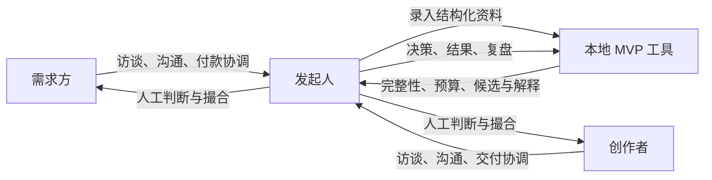

# 愿作礼宾式 MVP 开发方案

> 文档状态：v1.0 · 适用阶段：首批真实项目验证 · 前置设计：[愿作平台设计](./desire-supply-platform-design.md)

## 0. 决策摘要

首轮 MVP **不实现平台**，也不向创作者或需求方提供账户、页面、消息、支付或项目管理功能。

MVP 的实际产品是由发起人亲自提供的一项“礼宾式撮合与协作服务”：

- 发起人寻找需求方与创作者；
- 所有访谈、资料收集、沟通、匹配解释和项目协调都经过发起人；
- 协议、支付、会议和文件使用已有工具完成；
- 只开发一套发起人本地使用的最小工具，用于结构化信息、执行可解释规则、生成候选建议和记录验证结果；
- 算法只提供建议，发起人保留最终判断，但必须记录覆盖建议的原因。

这个 MVP 的目标不是证明“可以做出一个平台”，而是用少量真实付费项目回答三个问题：

1. 是否存在稳定的、愿意为这种撮合方式付费的真实需求？
2. “意愿 + 能力 + 边界 + 公平报酬”的匹配是否比普通技能匹配更有效？
3. 哪些环节重复、耗时且规则已经稳定，真正值得在下一阶段产品化？



---

## 1. 首轮验证范围

### 1.1 验证单位

首轮以 **5 个进入付费阶段的真实项目**为一个验证批次，不以注册人数、页面访问或意向问卷作为主要证据。

每个项目应尽量满足：

- 数字化交付，可通过文件、链接或代码验收；
- 周期约 3 天至 4 周；
- 由 1～3 名创作者完成；
- 有明确的付款人、决策人和真实预算；
- 可以拆出至少一个金额和验收标准明确的里程碑；
- 不属于医疗、法律、金融建议、安全攻防等高风险专业领域；
- 不涉及跨境复杂结算、线下人身安全或大量敏感个人信息。

### 1.2 优先验证的假设

| 编号 | 假设 | 证据 |
| --- | --- | --- |
| H1 | 需求方愿意先澄清需求并作出真实付款承诺 | 支付订金或首个里程碑，而非口头表示感兴趣 |
| H2 | 创作者愿意表达兴趣、边界和私密报酬底线 | 完成访谈，并认为匹配结果符合自己的真实偏好 |
| H3 | 少量候选人足够完成双向选择 | 每个需求只提供 1～3 名候选人仍能形成合作 |
| H4 | 结构化需求和里程碑能减少返工与争议 | 范围变更、验收轮次和争议原因可控 |
| H5 | 可解释规则能产生有用的候选建议 | 最终入选者经常出现在规则给出的前三名中 |
| H6 | 发起人的服务能创造可感知价值 | 双方愿意再次使用或主动推荐，并接受合理服务费 |

### 1.3 首轮方向性成功标准

5 个项目不足以做统计推断，以下标准只用于决定下一步：

- 至少 3 个项目完成付费交付；
- 至少 4 个项目的双方都认为需求比合作前更清晰；
- 完成项目中，至少 80% 的已验收里程碑按约付款；
- 至少 4 次最终选择位于算法建议的前三名，或人工覆盖原因形成了可复用新规则；
- 完成项目中，至少 80% 的参与方表示愿意再次与对方或通过该服务合作；
- 没有出现因发起人信息管理不当造成的隐私或保密事件；
- 每个失败项目都能归因于具体假设，而不是只记录“没有匹配上”。

不应把这些阈值包装成平台已获得市场验证；它们只说明是否值得继续第二批礼宾式试验。

---

## 2. 人工服务与软件的边界

### 2.1 必须由发起人完成

- 寻找、邀请和筛选首批需求方与创作者；
- 告知参与者这是人工运行的研究型试验，并取得资料处理同意；
- 访谈需求、确认决策权、判断需求是否真实；
- 访谈创作者、核实作品和理解实际意愿；
- 判断模糊表达、价值观、沟通感受和潜在冲突；
- 解释候选建议，组织双方交流并促成最终选择；
- 协调协议、签署、收付款和项目节奏；
- 处理范围变化、交付反馈、异常和争议；
- 完成项目复盘，并判断下一步是否调整规则。

### 2.2 必须由最小软件完成

- 对需求和创作者资料做结构校验，指出缺失与矛盾；
- 执行预算健康检查，识别明显无法覆盖劳动成本的需求；
- 应用硬性过滤条件，避免向不合适的人发出邀请；
- 使用版本化权重生成候选排序；
- 为每个候选生成“匹配原因、未知信息、风险和待确认问题”；
- 记录算法结果、发起人决定、覆盖原因、最终选择和项目结果；
- 汇总一个批次的核心指标和失败原因；
- 保证相同输入和相同规则版本得到相同结果。

### 2.3 直接使用现成工具

| 工作 | 首轮做法 |
| --- | --- |
| 访谈与即时沟通 | 参与者已经习惯的电话、邮件或聊天工具 |
| 预约 | 现有日历或预约服务 |
| 文件交付 | 权限受控的云盘或代码托管服务 |
| 合同签署 | 当地有效的电子签名或纸质协议 |
| 收付款 | 持牌支付机构、银行转账或合规的第三方担保方式 |
| 项目跟踪 | 每个项目一份共享文档或轻量任务清单 |
| 发起人的联系人资料 | 密码管理器或单独加密的联系人存储 |

不要为了“体验完整”而复制这些成熟能力。只有现成工具连续造成已记录的问题时，才考虑替换。

---

## 3. MVP 交付物

首轮开发交付物分为三类。

### 3.1 运营模板

这些模板是算法输入的来源，也是验证能否稳定运营的前提：

1. 需求方访谈提纲；
2. 结构化需求卡；
3. 创作者访谈提纲；
4. 创作者意愿与能力卡；
5. 候选匹配说明；
6. 里程碑协议模板；
7. 范围变更单；
8. 交付与验收记录；
9. 双方完成/退出访谈提纲；
10. 项目复盘和假设更新记录。

模板优先使用 Markdown 或现有文档工具。它们必须先经人工项目验证，不能一开始做成固定页面。

### 3.2 本地运营工具

建议实现一个仅供发起人使用的命令行工具，不运行公开服务器。最小命令如下：

```text
mvp validate creator <creator-id>
mvp validate demand <demand-id>
mvp budget <demand-id>
mvp match <demand-id> --top 3
mvp explain <demand-id> <creator-id>
mvp decision <demand-id> --selected <creator-id> --reason <reason-code>
mvp outcome <project-id>
mvp report <pilot-id>
```

命令名只是接口建议，重点是形成稳定的输入和输出契约。首轮不开发图形后台；如果命令行明显妨碍发起人录入，再增加一个本地表单界面。

### 3.3 配置与研究记录

- 领域和技能词表；
- 匹配权重及版本；
- 预算基准、技能系数和风险系数；
- 硬性排除规则；
- 人工覆盖原因代码；
- 项目失败原因代码；
- 每次规则修改的假设、日期和影响说明。

算法规则必须存放在配置中，不能散落在代码里。项目开始后不得静默修改当时使用的规则版本。

---

## 4. 最小数据设计

### 4.1 数据分层原则

数据分为三层：

1. **联系人层**：姓名、电话、邮箱和真实身份，只由发起人掌握，不进入匹配算法；
2. **匹配层**：使用随机 ID 的结构化偏好、能力、预算和可用性；
3. **研究层**：决策、结果和聚合指标，不包含可直接识别身份的信息。

联系人层和匹配层必须分开存放。向候选人发送任何另一方的资料前，须再次确认披露范围。

### 4.2 创作者记录

| 字段组 | 最小字段 |
| --- | --- |
| 标识与状态 | 随机 ID、资料状态、同意版本、录入/更新时间 |
| 意愿 | 想做的问题类型、偏好领域、偏好任务、兴趣强度 0～4 |
| 边界 | 禁止领域、禁止任务、不可接受协作方式、数据限制 |
| 能力 | 技能标签、熟练度 0～4、证据类型、证据可信度 0～4 |
| 可用性 | 可开始日期、每周容量、预计持续时间、时区 |
| 协作 | 语言、同步/异步偏好、反馈频率、个人/团队偏好 |
| 报酬 | 私密最低项目金额或日费、直接成本、币种 |
| AI | 常用方式、人工复核方式、不能使用 AI 的情形 |

不要收集与匹配无关的敏感属性。若为了公平审计确需收集，应单独征得同意、隔离存储，并禁止用于个体排序。

### 4.3 需求记录

| 字段组 | 最小字段 |
| --- | --- |
| 标识与状态 | 随机 ID、草稿/已验证/已承诺资金/匹配中/结束 |
| 真实性 | 付款主体、决策权是否确认、资金承诺证据 |
| 问题 | 背景、目标用户、期望结果、明确非范围 |
| 验收 | 交付物、成功标准、验收人、响应期限 |
| 能力 | 必需技能、可选技能、领域经验、语言 |
| 约束 | 起止时间、预计投入、依赖、沟通方式、所在地 |
| 预算 | 预算下限/上限、币种、直接成本、付款计划 |
| 风险 | 不确定性、紧急程度、数据敏感度、版权与合规风险 |
| AI | 是否允许、允许范围、数据能否发送给模型 |

### 4.4 决策记录

每次匹配必须保存：

- 输入快照及规则版本；
- 被硬过滤的人及原因；
- 所有合格候选的分项分数和排序；
- 算法建议的前三名；
- 发起人实际邀请的人；
- 覆盖算法建议的标准原因代码和补充说明；
- 需求方与创作者各自的接受或拒绝原因；
- 最终选择和未成交原因。

只有保存“算法当时看到了什么”，后续复盘才不会被结果倒推所污染。

### 4.5 结果记录

- 是否签约、是否产生真实付款；
- 约定与实际开始/完成时间；
- 每个里程碑金额、验收和付款状态；
- 范围变更次数及原因；
- 双方满意度、需求清晰度、再次合作意愿；
- 发起人投入时间，按招募、访谈、匹配、协调和争议分类；
- 退出或失败的首要和次要原因；
- 安全、隐私或利益冲突事件。

发起人的时间必须记录；否则无法判断未来应该开发什么，也无法估算服务费是否可持续。

---

## 5. 必要算法

### 5.1 资料完整性检查

**目的**：在运行匹配前发现缺失、矛盾和无法验证的输入。

**输出等级**：

- `BLOCKER`：不得进入匹配，如无预算、无决策人、未给出验收方式；
- `WARNING`：可以继续，但必须人工确认，如周期异常短、范围过大；
- `QUESTION`：下一次访谈需要追问；
- `READY`：满足规则要求。

检查规则应是确定性的。例如：

```text
如果 funding_commitment = false，则 BLOCKER: 资金承诺未验证
如果 acceptance_criteria 为空，则 BLOCKER: 无法判断完成
如果 due_date 早于最早可开始日期，则 BLOCKER: 时间冲突
如果 data_sensitivity >= high 且 data_handling_plan 为空，则 BLOCKER
如果 must_have_skills 超过 5 个，则 WARNING: 需求可能尚未合理拆分
```

### 5.2 预算健康检查

预算检查分为需求级预检和候选人级检查。

**需求级建议最低预算**

```text
劳动基准 = 预计投入天数 × 地区日基准 × 技能系数
基础成本 = max(劳动基准, 领域历史中位数) + 直接成本
风险缓冲率 = 不确定性系数 + 紧急系数 + 外部依赖系数
建议最低预算 = 基础成本 × (1 + min(风险缓冲率, 0.5))
预算健康比 = 预算上限 / 建议最低预算
```

建议初始判断：

- `RED`：健康比小于 0.8，不进入匹配；
- `YELLOW`：0.8～1.0，缩小范围或由发起人说明例外；
- `GREEN`：不小于 1.0，可以进入候选人匹配。

首批没有“领域历史中位数”时，该项不参与计算，只保留地区基准和实际候选人的私密底线。所有系数都必须显示来源，不能伪装成精确市场价格。

**候选人级检查**

候选人的私密最低报酬是硬条件。工具只向发起人显示“满足/不满足/需要澄清”，输出给需求方的解释不得泄露具体底线。

### 5.3 硬性过滤

在计算分数前依次排除：

1. 任务或行业触及创作者明确边界；
2. 必需技能没有任何可验证证据；
3. 时间、容量或时区存在不可协调冲突；
4. 预算低于创作者私密底线；
5. 数据、AI 使用或保密要求不兼容；
6. 所在地、语言或合规条件不满足；
7. 存在未解决的利益冲突。

每次排除必须生成原因代码。发起人不能把被硬过滤的人恢复到候选名单，除非先修正输入或记录带理由的规则例外。

### 5.4 候选排序

首轮使用简单、透明、可手工复算的加权模型，不使用机器学习或向量相似度作为主排序。

```text
总分 = 意愿契合 × 30%
     + 能力证据 × 25%
     + 时间容量 × 15%
     + 报酬适配 × 15%
     + 协作方式 × 10%
     + 证据可信度 × 5%
```

每一项先归一到 0～100：

- **意愿契合**：问题、领域和任务偏好的重合度，并对“主动想做”高于“可以做”；
- **能力证据**：必需技能覆盖、相似成果和领域经验；
- **时间容量**：可开始日期、每周容量和项目周期的适配；
- **报酬适配**：预算足够时记为适配，不因预算越高就无限增加排序；
- **协作方式**：同步频率、语言、反馈节奏和个人/团队方式；
- **证据可信度**：成果是否可验证，不能用来重复计算技能强度。

首轮不加入“平台活跃度”“历史成交金额”“发起人个人熟悉度”等权重。新成员探索和机会公平先作为报表观察项，不在样本很小时加入复杂排序。

### 5.5 匹配解释

工具为每个候选生成固定结构，不直接把一个总分发给需求方：

```text
推荐理由
- 此人主动希望参与：小型组织自动化、研究工具
- 有可验证证据：完成过两个相似规模项目
- 时间与预算：满足当前约束

需要确认
- 尚无该具体行业经验
- 每周只能参加一次同步会议

风险
- 交付周期几乎占满其当前可用容量

建议沟通问题
- 如何在第一周验证最关键的自动化流程？
- 哪些客户数据可以不进入模型？
```

初版解释由模板生成。可以把访谈笔记交给大模型辅助提取结构化信息，但必须由发起人逐项确认；大模型不能静默修改分数或规则。

### 5.6 校准与覆盖记录

发起人可以不采用算法前三名，但必须选择原因代码：

- `MISSING_CONTEXT`：算法缺少重要上下文；
- `BAD_TAXONOMY`：技能或意愿词表不能表达真实情况；
- `WEIGHT_PROBLEM`：分项正确但权重不合理；
- `TRUST_SIGNAL`：访谈出现尚未结构化的可信或风险信号；
- `PARTICIPANT_CHOICE`：候选人或需求方主动拒绝；
- `CONFLICT`：发现新的利益冲突；
- `OTHER`：必须补充文字说明。

每完成一个项目再讨论改规则，不因单个候选结果临时调权重。任何更新创建新版本，并保留旧项目使用的版本。

### 5.7 批次报告

工具至少计算：

- 需求从访谈到资金承诺、匹配、签约和完成的漏斗；
- 候选前三名命中最终选择的比例；
- 发起人覆盖建议的次数和原因分布；
- 邀请接受/拒绝原因；
- 预算红黄绿分布及调整后结果；
- 范围变更、验收、按约付款和争议情况；
- 双方再次合作意愿；
- 发起人在各环节投入的时间；
- 按创作者和需求方计算的机会与收入集中度；
- 每项核心假设得到的支持、反例和未知项。

报告以 Markdown 和 CSV 输出即可，不开发仪表盘。

---

## 6. 推荐技术实现

### 6.1 实现形态

- Python 命令行程序；
- SQLite 保存匿名化的结构化记录和不可变决策快照；
- YAML 保存词表、规则、权重和预算系数；
- Markdown 生成需求卡、候选说明和批次报告；
- JSON 用于可移植的导入导出；
- 测试覆盖所有硬过滤、预算边界和分数计算。

该方案不需要服务器、域名、账号系统或部署流程，能在本地运行、完整导出，也便于以后把稳定模块迁移到真正的平台后端。

### 6.2 建议目录

```text
mvp/
├── README.md
├── pyproject.toml
├── src/desire_mvp/
│   ├── cli.py
│   ├── models.py
│   ├── repository.py
│   ├── validation.py
│   ├── budget.py
│   ├── matching.py
│   ├── explanations.py
│   ├── decisions.py
│   └── reports.py
├── config/
│   ├── taxonomy-v1.yaml
│   ├── matching-v1.yaml
│   ├── budget-v1.yaml
│   └── reason-codes.yaml
├── templates/
│   ├── demand-card.md
│   ├── creator-card.md
│   ├── match-brief.md
│   ├── milestone-agreement.md
│   └── retrospective.md
├── tests/
│   ├── fixtures/
│   ├── test_validation.py
│   ├── test_budget.py
│   ├── test_matching.py
│   ├── test_privacy.py
│   └── test_reports.py
└── local-data/            # 整个目录不进入版本控制
```

### 6.3 核心函数边界

```python
validate_creator(profile, rules) -> ValidationResult
validate_demand(demand, rules) -> ValidationResult
assess_budget(demand, budget_config) -> BudgetAssessment
filter_candidate(demand, creator, rules) -> EligibilityResult
score_candidate(demand, creator, weights) -> MatchScore
explain_candidate(demand, creator, result) -> MatchBrief
record_decision(input_snapshot, recommendation, decision) -> DecisionRecord
build_pilot_report(pilot_id) -> PilotReport
```

这些函数应保持无网络依赖和确定性。若以后增加大模型，只作为单独适配器生成“建议提取结果”，核心函数仍只接受发起人确认后的结构化数据。

### 6.4 隐私与安全要求

- `local-data/`、导出报告和真实项目资料默认加入 `.gitignore`；
- 联系方式和身份证明不写入项目仓库，也不传给大模型；
- 使用操作系统全盘加密，并对本地数据库和备份设置访问控制；
- 每位参与者获得简短易懂的资料使用说明、保存期限和删除方式；
- 默认只保留完成本轮验证所需的数据，验证结束后按约定删除身份和原始访谈材料；
- 发送匹配说明前执行私密字段泄漏测试，尤其是最低报酬、内部风险标签和第三方评价；
- 研究报告只使用随机 ID 和聚合结果；
- 发起人若与任一方存在利益关系，应向双方披露。

由于所有信息集中经过发起人，人工 MVP 的隐私风险并不比平台更低，只是技术面更小。因此数据分层和参与者同意属于 P0，不应等到平台化再补。

---

## 7. 开发优先级

### P0：无代码试运行后、首批项目正式运行前

1. 定义需求、创作者、决策和结果数据模型；
2. 完成运营模板；
3. 实现资料校验；
4. 实现预算健康检查；
5. 实现硬过滤和透明加权排序；
6. 生成候选匹配说明；
7. 记录规则版本、输入快照和人工决定；
8. 实现项目结果录入和 Markdown 批次报告；
9. 完成私密字段泄漏、边界值和确定性测试；
10. 写明数据保存、备份与删除流程。

### P1：完成 2～3 个项目后，确有证据再做

- 从访谈笔记辅助提取结构化字段，但每项需要人工确认；
- 从常用表格或表单批量导入；
- 为重复追问生成访谈问题建议；
- 比较不同规则版本在历史输入上的结果；
- 生成发起人工作耗时分析；
- 增加本地只读结果页面，前提是命令行确实造成操作错误。

### P2：首轮明确不开发

- 用户注册、登录、身份验证系统；
- 创作者或需求方门户；
- 公开项目列表、搜索和申请；
- 站内消息、通知和日历；
- 合同签署、托管、支付和发票系统；
- 项目管理、文件托管和实时协作；
- 社区、评价展示和声誉页面；
- 自动处罚、争议处理和申诉系统；
- 推荐模型训练、向量数据库或实时特征系统；
- 多租户、微服务、云部署和移动应用；
- 为尚未出现的规模问题预先设计复杂架构。

---

## 8. 开发顺序与验收条件

### 阶段 A：无代码走通一次

先用文档和表格完成 1 次完整模拟或真实项目，确认字段能够被访谈获得。若发起人自己都无法稳定判断某个字段，就不应把它写进算法。

**完成条件**：可以从原始访谈手工生成需求卡、创作者卡、候选说明和结果记录。

### 阶段 B：实现确定性核心

开发数据模型、校验、预算、过滤、排序和解释输出。

**完成条件**：

- 相同输入和规则版本重复运行结果完全一致；
- 任一硬条件不满足的人不会进入排序；
- 每一分都能追溯到输入字段和规则；
- 私密最低报酬不会出现在对外说明中；
- 缺失关键字段时工具拒绝匹配并说明原因；
- 至少用 3 组虚构需求和 8 组虚构创作者完成端到端测试。

### 阶段 C：建立学习闭环

开发决策快照、覆盖原因、项目结果和批次报告。

**完成条件**：

- 可以还原任一项目当时的输入、规则和候选顺序；
- 可以区分算法问题、资料问题和参与者主动选择；
- 报告能显示假设证据和发起人时间成本；
- 修改规则不会改变已完成项目的历史记录。

### 阶段 D：运行首批项目

工具保持稳定，只有发现阻塞性错误才修复；规则调整进入下一版本，不在项目中途为了“命中结果”而改分。

**完成条件**：完成一个 5 个付费项目的批次复盘，并做出“继续人工验证、产品化某个环节、调整方向或停止”的明确决定。

---

## 9. 人工运营流程

每个需求按以下步骤运行：

1. 发起人访谈需求方，说明试验性质和数据规则；
2. 录入需求卡，运行完整性和预算检查；
3. 与需求方解决阻塞项，并取得真实资金承诺；
4. 从已访谈创作者中运行硬过滤和候选排序；
5. 发起人复核前三名，记录保留或覆盖原因；
6. 分别征得双方同意后再交换必要资料；
7. 发起人向双方解释匹配理由、未知项和风险；
8. 组织一次有明确问题的短沟通，不要求无偿方案；
9. 双方确认后，用现成工具完成协议和首笔付款；
10. 发起人按里程碑检查范围、输入、验收和付款状态；
11. 完成或退出后分别访谈双方，避免相互影响反馈；
12. 录入结果和发起人耗时；
13. 每个项目只记录观察，每完成一个批次再统一修改规则。

发起人应尽量使用一致的访谈问题和解释模板，防止不同参与者因为私人熟悉度而得到完全不同的服务。

---

## 10. 何时才值得开发平台功能

产品化由已观察到的运营瓶颈触发，而不是由想象中的未来规模触发。

| 候选功能 | 开发触发条件示例 |
| --- | --- |
| 创作者自助档案 | 资料更新已连续两批占用超过 20% 的运营时间，且字段稳定 |
| 需求方自助录入 | 同一澄清问题重复出现，80% 需求方无需人工解释就能正确填写 |
| 站内消息 | 外部沟通在 10 个项目中至少造成 2 次关键决定丢失或版本争议 |
| 里程碑工作台 | 手工状态维护持续导致遗漏，且项目流程已基本一致 |
| 支付集成 | 现有支付方式频繁造成延迟、对账或信任问题，且合规路径明确 |
| 自动匹配入口 | 至少两个批次中，算法前三名与人工最终短名单的重合率稳定达到约 80% |
| 评价与声誉 | 已有足够重复合作，能验证哪些评价维度真正预测合作质量 |
| 社区功能 | 参与者已经在外部渠道自发持续开展评议、复盘或互助 |

即使触发条件满足，也只产品化一个瓶颈，继续保留其余人工服务。首轮不设“多少用户后必须做平台”的单一阈值。

---

## 11. 首轮开发完成定义

当以下条件全部满足，礼宾式 MVP 的开发工作才算完成：

- 发起人能在不修改代码的情况下录入新的需求和创作者；
- 工具能阻止资料或预算不合格的需求进入匹配；
- 工具能给出 1～3 名带分项依据的候选人；
- 发起人能记录人工判断，而不是被迫服从算法；
- 任何一次推荐都能用当时的输入和规则版本重现；
- 对外说明不会泄露候选人的私密字段；
- 项目完成、退出和失败都能形成结构化结果；
- 一个批次结束后能生成可阅读的假设验证报告；
- 不需要运行公开服务器，也不需要参与者学习新产品；
- 软件之外的运营模板、同意说明和数据删除流程已经可用。

首轮 MVP 最重要的产物不是代码，而是三类经过真实项目检验的知识：**哪些需求值得进入、什么信息能预测好匹配、哪些协作规则真的减少了风险**。只有这些知识稳定后，平台开发才有可靠依据。
