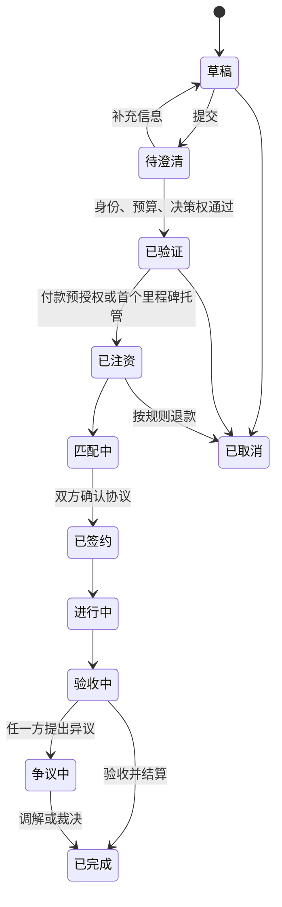
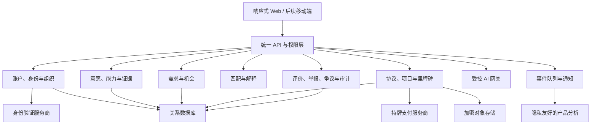

# 愿作（Desire Supply）平台设计

> 文档状态：概念设计 v1.0 · 输入来源：`idea.md` · 设计目标：让拥有 AI 增强生产力的人，更容易找到自己愿意从事、且能获得合理报酬的真实劳动机会。

## 0. 执行摘要

愿作不是一个以“更多订单、更低价格、更快成交”为目标的外包市场，而是一套围绕**真实需求、个人意愿、公平报酬和可信协作**建立的互联网基础设施。

平台的核心闭环是：

与常见自由职业平台相比，它有四个根本差异：

1. **需求先被验证，再进入匹配。** 身份、预算、决策权和交付预期不明确的需求不能公开招募。
2. **不采用低价竞标。** 平台给出少量、可解释的双向匹配，报酬按价值、工作量和风险协商，而不是让劳动者互相压价。
3. **匹配“愿意做什么”，不只匹配“会做什么”。** 个人的兴趣、边界、工作方式和成长方向是一等信息。
4. **平台不依赖注意力和广告变现。** 不出售排名，不用停留时长作为成功标准，收入主要来自需求方服务费和组织订阅。

建议先以邀请制、人工辅助匹配的方式，在一个司法辖区内验证“数字化、可分阶段验收、1～5 人可完成”的项目协作；在供需质量和争议处理机制得到验证后，再逐步开放。

---

## 1. 问题定义

### 1.1 背景判断

大模型降低了研究、写作、设计、编程、运营等知识工作的生产门槛，使个人或小团队能够完成过去需要更大组织才能完成的工作。但生产能力提高并不自动带来体面的生活，原因包括：

- 真实且有支付意愿的需求依然分散，发现成本高；
- 需求常以模糊想法出现，劳动者承担了大量免费的澄清和试错；
- 传统平台用竞价和评分放大供给竞争，导致价格下探；
- 简历、粉丝数和平台等级难以表达一个人真正愿意投入的方向；
- 付款、验收、知识产权和范围变更缺少可信保障；
- AI 提高交付速度后，按工时计价反而可能惩罚高生产力的人。

### 1.2 要解决的核心问题

> 如何让一个人持续找到“我愿意做、我有能力做好、对方确实需要、报酬足够体面”的机会，并能低风险地完成协作？

### 1.3 目标与非目标

**目标**

- 降低高质量需求和合适创作者彼此发现的成本；
- 把模糊需求转化为可承诺、可交付、可验收的合作；
- 提高创作者的自主性、收入确定性和长期议价能力；
- 形成不依赖粉丝量和低价竞争的可信声誉体系；
- 让社区共同维护公平协作所需的规则和公共知识。

**非目标**

- 不承诺消除所有生计压力或劳动异化；
- 不做无限品类、即时抢单的“万能零工市场”；
- 不把社区建设成以流量、粉丝和情绪互动为核心的内容平台；
- 不为投机性项目提供融资，也不发行平台代币；
- 不以 AI 自动化替代合同、支付、申诉等关键的人类判断。

---

## 2. 产品定位与原则

### 2.1 一句话定位

愿作是一个将**已验证的付费需求**与**有意愿、有能力的个人及小团队**进行公平匹配，并为全过程提供协议、支付、协作和治理保障的平台。

### 2.2 设计原则

| 原则 | 产品含义 |
| --- | --- |
| 真实需求优先 | 预算、决策权、问题背景未验证的内容只能讨论，不能招募 |
| 意愿是一等信号 | 匹配同时考虑兴趣、价值观、边界、节奏和成长目标 |
| 对结果付费 | 以交付物和里程碑为主，工时只用于估算成本与防止不合理预算 |
| 不让劳动者互相压价 | 不公开最低价排序，不进行无限投标，不要求无偿方案或样稿 |
| 双向选择 | 需求方可以选择创作者，创作者也能拒绝且无需损害排名 |
| 过程可追溯 | 范围、变更、验收、付款和规则执行均留下版本与审计记录 |
| 解释优于黑箱 | 匹配、风控和处罚必须给出可理解的理由，并允许申诉 |
| 社区是公共制度 | 社区的价值是互助、同行评议和共治，不是制造停留时长 |
| AI 增强人而非裁决人 | AI 可辅助澄清和总结，但不能独立决定付款、封禁或争议结果 |

### 2.3 品牌承诺

- 对创作者：你的时间、意愿和边界会被认真对待。
- 对需求方：你将更快找到真正理解问题、能够负责交付的人。
- 对社区：重要规则公开、可质疑、可申诉、可迭代。

---

## 3. 用户与参与角色

同一账户可以拥有多个角色，但在每次交易中必须明确其身份。

### 3.1 创作者

借助自身专业能力和 AI 完成交付的个人或小团队。其核心诉求是找到契合意愿的工作、获得体面报酬、减少获客和坏账风险、积累可迁移的能力证据。

创作者档案不只是简历，应包括：

- 想解决的问题、偏好的领域和希望成长的方向；
- 已验证技能与代表性成果；
- 不接受的行业、任务和协作方式；
- 可投入时间、期望节奏、时区和沟通偏好；
- 私密的最低报酬边界，供匹配过滤但不向需求方展示；
- AI 使用方式、人工复核方式和可提供的过程证据；
- 合作评价、按时交付率、复购情况及争议结论。

### 3.2 需求方

拥有真实问题、预算和决策权的个人、企业、非营利组织或社区。其核心诉求是澄清问题、找到可信执行者、控制交付风险，并获得可维护的成果。

需求方必须说明：

- 问题背景与期望结果，而不只是指定解决方案；
- 目标用户、使用场景和成功标准；
- 预算范围、付款主体和决策人；
- 时间约束、依赖条件和可提供资源；
- 数据敏感度、知识产权和公开限制；
- 验收人、验收方式及变更流程。

### 3.3 协作者

由主创作者邀请、参与特定里程碑的人。其工作范围、报酬比例、署名权和保密责任必须在加入前确认，避免不透明分包。

### 3.4 社区维护者

由信誉良好的成员担任，包括领域向导、同行评审员、调解员和规则委员。他们必须经过培训、披露利益冲突，并按固定标准获得报酬或社区额度，不能依靠随意执法获得权力。

### 3.5 平台运营者

负责产品、支付、安全、法务和规则执行。平台运营者受同一套公开程序约束，重大处罚需要审计记录，不能秘密修改交易证据或声誉数据。

---

## 4. 平台中的核心对象

### 4.1 机会类型

| 类型 | 适用场景 | 资金与协作方式 |
| --- | --- | --- |
| 委托项目 | 目标明确、一次性交付 | 按里程碑托管和结算；MVP 首选 |
| 持续合作 | 长期运营、维护、顾问 | 月度保底额度 + 超出范围的变更单 |
| 共同需求池 | 多个需求方有相似需求 | 达到承诺金额后立项，参与方共享约定成果 |
| 付费探索 | 问题尚不清晰，需要先研究 | 所有入选者获得固定探索费，禁止赢家通吃式无偿提案 |
| 公共悬赏 | 开源、公益或公共知识成果 | 资金预先锁定，规则、评审人与分配方式预先公开 |

MVP 只实现“委托项目”和“持续合作”的简化版本，避免过早引入复杂的多人资金与知识产权关系。

### 4.2 需求成熟度

只有“已注资”的需求会被主动推荐给创作者。“已验证但未注资”的需求可以获得咨询和关注，但不能要求提交方案。

### 4.3 合作协议

协议是每次协作的唯一事实来源，至少包含：

- 项目范围和明确的非范围；
- 每个里程碑的交付物、截止时间、价格与验收标准；
- 需求方必须提供的输入与响应时限；
- 修改次数或修改预算；
- 范围变更、暂停、取消和超时规则；
- 知识产权归属、第三方素材与开源许可；
- 保密、数据处理和 AI 使用约定；
- 署名权、作品集展示权与公开时间；
- 争议处理流程和适用司法辖区。

协议每次修改都生成新版本，并需要受影响各方重新确认。

---

## 5. 核心产品功能

### 5.1 需求工作台

需求方先用自然语言描述问题，平台再通过结构化问答和 AI 辅助澄清，生成“需求卡”。功能包括：

- 问题陈述、成功标准和约束的引导式编辑；
- 相似案例、常见遗漏项和风险提示；
- 工作量与预算健康检查；
- 数据、版权、合规和潜在伤害检查；
- 验收清单和里程碑建议；
- 组织身份、付款能力和决策权验证；
- 发布前由人工或合格社区维护者复核。

AI 生成的内容必须由需求方确认。平台不把“写得像专业需求”当成需求真实的证明。

### 5.2 意愿与能力档案

创作者通过三类证据建立档案：

1. **自我声明**：兴趣、边界、可用性和期望；
2. **可验证成果**：作品、代码、文档、客户确认或同行评审；
3. **平台行为**：实际交付、合作质量、复购和争议记录。

平台展示证据及其来源，不把复杂的人压缩成单一总分。个人可以选择哪些信息公开、只在匹配时使用或完全私密。

### 5.3 双向匹配

匹配分为两步：

**硬过滤**

- 法律、地域、语言和行业限制；
- 预算是否高于创作者私密底线；
- 时间、可用性和必要技能；
- 利益冲突、制裁或安全风险；
- 双方明确设置的合作边界。

**适配排序**

初始建议权重为：意愿契合 30%、能力证据 25%、时间与节奏 20%、协作方式 10%、工作机会公平分配 10%、新成员探索 5%。权重应通过真实结果校准，并向用户解释“为什么推荐”。

每个需求默认只邀请 3～5 位创作者进行**有报酬或低成本的短沟通**，不开放海量投标。创作者拒绝邀请不会降低曝光；需求方也不能看到创作者的私密最低报价。

### 5.4 合作空间

签约后自动创建项目空间，包括：

- 协议、里程碑、文件和决策记录；
- 讨论串与结构化的“请求确认”；
- 需求方输入项和双方待办；
- 交付提交、版本差异和验收记录；
- 范围变更单及对价格、周期的影响；
- 风险提示和定期状态摘要；
- 可导出的项目档案。

平台鼓励异步、可追溯沟通，但不强迫所有创作过程被监控。屏幕录像、键鼠追踪等侵入式监督默认禁止。

### 5.5 资金托管与结算

- 使用持牌支付服务商完成托管或等价的付款保障，平台不自行沉淀客户资金；
- 首个里程碑在开工前必须完成资金锁定；
- 交付后进入协议约定的验收期，需求方须“接受、提出具体修改或发起争议”；
- 无响应时按协议自动视为接受，但平台会提前多次提醒；
- 已接受的里程碑不可因后续里程碑争议而追回；
- 范围增加必须先确认变更单和追加资金；
- 向各方提供费用、税务信息和结算状态的透明记录。

### 5.6 评价与声誉

每次合作采用双盲、双向评价，在双方提交或评价期结束后同时公开，降低报复性评价。评价分成：

- 事实指标：是否按期、是否按约付款、范围变更次数、响应情况；
- 体验指标：沟通清晰度、专业判断、尊重程度、再次合作意愿；
- 私密安全反馈：歧视、骚扰、施压、绕过平台等，仅供风控使用；
- 可展示成果：经双方确认的案例、角色和贡献范围。

不设单一“五星总分”。匹配时展示与当前机会相关的证据，并对样本量、新用户和历史时间做清楚说明。

---

## 6. 关键用户流程

### 6.1 需求方发布并完成合作

1. 注册并完成个人或组织身份验证；
2. 描述问题，回答平台的澄清问题；
3. 提交预算、决策权和验收人信息；
4. 平台进行预算健康检查和需求复核；
5. 锁定首个里程碑资金，需求进入匹配；
6. 查看 3～5 个匹配及推荐理由，与候选人短聊；
7. 选定创作者，共同确认里程碑协议；
8. 在合作空间中提供输入、确认决策和处理变更；
9. 按标准验收，资金结算；
10. 完成双向评价，可发起持续合作。

### 6.2 创作者从加入到交付

1. 创建意愿、能力、边界与可用性档案；
2. 提供至少一项能力证据，并设置私密报酬底线；
3. 接收符合硬条件的邀请及可解释推荐；
4. 接受、拒绝或要求澄清；拒绝不影响声誉；
5. 与需求方确认范围、价格、AI 使用和验收方式；
6. 看到资金已锁定后开始工作；
7. 按里程碑提交交付物，必要时提出变更单；
8. 收款并完成双盲评价；
9. 将经确认的成果转化为能力证据；
10. 调整自己的偏好，使后续匹配更贴近意愿。

### 6.3 需求不清晰时

若平台判断需求无法可靠估价或验收，不直接进入项目匹配，而是转为一个独立的“付费探索”里程碑。探索成果是问题定义、选项、风险和后续估算，不要求免费产出完整方案。

---

## 7. 公平报酬机制

### 7.1 预算健康检查

平台用以下模型检查预算是否明显不合理，但不强制把最终报价改成按小时付费：

> 建议最低预算 = 直接成本 + 预计投入 × 地区体面劳动基准 × 技能系数 + 风险缓冲

其中：

- “地区体面劳动基准”按当地生活成本、税费和非计费时间定期更新；
- “技能系数”反映稀缺性和责任，不由学历单独决定；
- “风险缓冲”覆盖需求不确定性、紧急程度和外部依赖；
- 个人私密底线始终优先于平台估算。

该模型只用于预警、教育和过滤，不能成为需求方压价的锚点。若预算过低，平台建议缩小范围、延后周期或先做付费探索；拒绝修改的需求不能发布。

### 7.2 禁止的压价行为

- 按最低报价排序候选人；
- 公开显示其他候选人的报价；
- 要求大量无偿试稿、方案或测试；
- 以“未来曝光、分成或入职机会”替代已约定报酬；
- 签约后通过模糊验收标准迫使无止境修改；
- 用站外付款威胁迫使创作者放弃保障。

### 7.3 收入可预期性

平台逐步提供：

- 持续合作的月度保底额度；
- 可选择的分阶段自动开票与结算；
- 取消项目时按通知期支付的占用补偿；
- 经验证创作者的快速结算；
- 由平台收入拨备的小额争议与坏账保障基金。

这些机制需要根据所在司法辖区评估劳动关系认定、支付许可、税务和保险要求。

---

## 8. AI 的角色与边界

### 8.1 允许且鼓励的用途

- 帮助需求方澄清目标、范围和验收标准；
- 帮助创作者梳理档案和成果证据；
- 总结项目上下文、会议和决策；
- 检查遗漏、依赖、范围漂移和潜在风险；
- 生成匹配解释，但不替用户作出选择；
- 辅助检测欺诈、骚扰和违规内容，供人工复核。

### 8.2 不允许由 AI 独立执行的决定

- 冻结或释放争议资金；
- 永久封禁、重大降权或公开定性用户；
- 判断作品版权最终归属；
- 判定交付是否达到带有主观性的验收标准；
- 根据敏感属性推断一个人的能力或可信度。

### 8.3 数据与披露规则

- 默认不使用私密项目内容训练公共模型；
- 用户可选择不启用项目级 AI 功能；
- 涉及客户数据、商业秘密或个人信息时，必须使用获批准的模型和数据处理方式；
- 创作者应披露对结果质量、授权或安全有实质影响的 AI 使用；
- 平台不要求逐条披露无关紧要的工具使用，也不以“纯人工”制造身份优越；
- AI 输出由提交者负责复核，引用、版权、事实和安全责任不转移给模型。

---

## 9. 社区设计

### 9.1 社区的目的

社区不是交易之外的社交附属物，而是降低协作风险、积累公共知识和培养互信的制度层。它服务于四件事：

1. 帮助需求方学会提出更好的问题；
2. 帮助创作者提升判断、报价和协作能力；
3. 通过同行评议验证能力而非追逐粉丝；
4. 为规则制定、调解和公共项目提供合格参与者。

### 9.2 社区结构

- **领域小组**：围绕具体问题域建立，如无障碍设计、教育工具、小型企业自动化；
- **需求诊所**：定期帮助需求方澄清问题，参与者获得固定报酬或社区贡献记录；
- **作品评议**：使用公开量表进行同行反馈，评价意见本身也可被评价；
- **项目复盘**：隐去敏感信息后分享范围估算、失败原因和协作经验；
- **导师与搭档**：新成员通过小型付费合作积累第一份可信证据；
- **规则议事**：讨论规则提案、公开影响评估和试运行结果。

### 9.3 社区激励

社区贡献包括高质量评审、调解、模板维护、帮助新成员和揭示系统性问题。激励方式为：

- 明确的贡献记录和角色资格；
- 对耗时公共工作的固定报酬；
- 参与规则试验和陪审小组的机会；
- 更丰富的匹配解释和社区工具，而非购买式曝光。

不使用连续签到、无限信息流、粉丝榜或可交易积分。社区贡献不能抵扣违规，也不能购买治理权。

### 9.4 新成员冷启动

- 允许用站外成果、推荐和同行评议建立初始证据；
- 为新成员保留一小部分探索性匹配；
- 提供范围较小、风险可控且正常付费的起步项目；
- 对需求方清楚标注证据来源与样本量，而不是隐瞒新成员身份；
- 禁止以“积累评分”为由要求新成员降价或免费劳动。

---

## 10. 规则、执行与申诉

### 10.1 基础规则

所有成员加入时同意一份简明的社区与交易公约：

1. 如实表达身份、能力、需求、预算和利益关系；
2. 尊重他人的时间、边界、署名和劳动成果；
3. 不歧视、不骚扰、不威胁，不进行报复性评价；
4. 不发布违法、有重大伤害风险或以欺骗为目的的需求；
5. 不抄袭，不隐瞒会影响授权或安全的素材来源；
6. 不绕过已生效的付款、变更和争议流程；
7. 维护保密信息，只为约定目的处理数据；
8. 接受可审计、可申诉且与行为相称的规则执行。

明确禁止的项目包括但不限于：诈骗、恶意软件、未经授权的入侵或监控、身份冒充、剥削性成人内容、操纵舆论或评价、规避合法监管，以及对现实人群产生不可接受伤害的自动化系统。具体清单应按地区法律和安全评估持续更新。

### 10.2 分级执行

| 等级 | 典型情况 | 可采取措施 |
| --- | --- | --- |
| 提醒 | 首次、轻微、可立即纠正 | 教育提示、限期修正 |
| 限制 | 重复失约、低强度骚扰、未披露冲突 | 暂停发布、匹配或社区权限 |
| 暂停 | 严重违约、证据造假、规避支付 | 暂停账户与在途交易审查 |
| 永久移除 | 诈骗、严重伤害、持续恶意行为 | 终止账户、依法保全证据并通知相关方 |

紧急安全风险可先临时限制，但必须在规定时间内完成人工复核并告知理由。处罚不应秘密改变历史评价；被纠正的记录要显示纠正状态。

### 10.3 项目争议流程

1. **直接协商**：提出具体争议点和期望补救，通常保留 48 小时响应；
2. **平台调解**：受训调解员依据协议、提交记录和变更记录提出方案；
3. **小组裁决**：金额或影响较大的争议由无利益冲突的三人小组审理；
4. **结果执行**：已验收里程碑正常支付，未完成部分退款，部分完成按证据和协议分配；
5. **独立申诉**：围绕程序错误、新证据或规则误用提出一次申诉；
6. **外部救济**：不剥夺任何一方依法寻求仲裁、诉讼或监管救济的权利。

裁决必须引用具体协议条款和证据。AI 可以整理材料，但不能投票或作出最终决定。

### 10.4 规则治理

平台规则采用版本管理，公开生效时间、修改原因和影响范围。治理分阶段进行：

- **早期**：平台团队负责并发布变更说明，社区可公开反馈；
- **成长期**：由创作者、需求方、维护者和平台组成咨询委员会；
- **成熟期**：领域规则可由经验证成员提案和表决，平台保留法律、安全与隐私底线责任。

治理不按消费金额加权，原则上采用“一名已验证自然人一票”；组织通过授权代表参与。陪审和专业规则可要求相应经验，但必须公开资格标准和利益冲突。

---

## 11. 信任、安全、隐私与合规

### 11.1 信任基础

- 对收款人、付款主体和高风险组织进行分级身份验证；
- 验证不是公开实名，前台可使用稳定昵称；
- 作品、资质和客户推荐标明验证来源；
- 新账户、异常付款、批量招募和站外引流触发风险复核；
- 重要操作采用多因素认证，付款账户变更设置冷静期；
- 项目关键事件写入不可由普通运营人员修改的审计日志。

### 11.2 最小化数据

- 只收集完成匹配、交易和法定义务所必需的数据；
- 公开档案、匹配专用信息和平台合规信息分层存储与授权；
- 用户可导出项目与档案，可删除非强制保留的数据；
- 法定保留期结束后自动删除身份材料和交易附件；
- 不出售个人数据，不将敏感信息用于广告画像；
- 对内部人员访问私密项目实行最小权限和留痕。

### 11.3 上线前必须本地化确认的事项

- 平台是否构成劳动派遣、中介、雇主或共同雇主；
- 托管、分账、退款和保障基金的支付牌照要求；
- 发票、代扣代缴、跨境支付与税务申报；
- 消费者保护、自动续费和数字产品退款；
- 知识产权转让、开源许可和生成式 AI 产物的可保护性；
- 数据跨境、隐私请求、未成年人和敏感个人信息处理；
- 争议解决条款的有效性和平台责任边界。

MVP 应限定单一司法辖区，并由当地法律顾问完成条款和流程审查。

---

## 12. 商业模式与平台经济

### 12.1 推荐收入结构

- **需求方服务费**：建议为项目金额的 8%，创作者收到协议中约定的完整报酬；
- **支付成本**：按支付服务商实际成本透明列示，不隐藏在汇率或结算周期中；
- **组织订阅**：提供团队权限、采购审批、合规档案、人才池和项目分析；
- **付费服务**：复杂需求澄清、专业调解、合规支持和项目托管；
- **公共资金**：对公益或开源需求池接受透明的基金会、政府或企业赞助。

费率需要通过单位经济模型验证。早期可以设最低服务费，但不得通过创作者付费排名、广告或出售数据补贴低价交易。

### 12.2 资金分配原则

平台每笔收入应透明覆盖：支付与身份验证、客户支持和争议处理、社区公共劳动、坏账保障、产品研发及合理利润。建议从平台服务费中固定拨出一部分建立争议保障和社区公共事务预算，并定期公布使用摘要。

### 12.3 不采用的模式

- 创作者为提高曝光购买排名；
- 从创作者收入中设置随等级变化的不透明抽成；
- 依赖广告、数据出售或无限信息流；
- 用平台代币替代法定货币报酬；
- 通过人为制造候选人竞争来提高成交率。

---

## 13. 信息架构与概念技术架构

> 本章描述产品方向得到验证后的长期平台形态，不属于首轮 MVP 的开发范围。

### 13.1 前台信息架构

- 首页：使命、运行方式、公开规则和加入入口；
- 机会：收到的匹配、已保存方向、邀请与状态；
- 工作台：需求卡、协议、项目、里程碑和资金；
- 档案：意愿、能力证据、边界、可用性和展示设置；
- 社区：领域小组、需求诊所、作品评议、复盘与议事；
- 信任中心：身份、评价证据、安全提醒、举报和申诉；
- 设置：通知、隐私、AI、付款、税务和数据导出。

### 13.2 主要系统模块

早期宜采用模块化单体而不是多个独立微服务，以便保持交易一致性和快速迭代；支付回调、通知、文件处理和 AI 任务通过事件队列异步执行。

### 13.3 核心数据实体

- `User`、`Organization`、`Membership`、`IdentityVerification`；
- `CreatorProfile`、`Preference`、`Boundary`、`CapabilityEvidence`；
- `Demand`、`DemandRevision`、`Opportunity`、`Match`、`Invitation`；
- `Proposal`、`Agreement`、`Milestone`、`ChangeOrder`；
- `FundingAuthorization`、`Payment`、`Refund`、`Payout`；
- `ProjectMessage`、`Decision`、`Deliverable`、`Acceptance`；
- `Review`、`Report`、`Dispute`、`Ruling`、`Appeal`；
- `CommunityGroup`、`Contribution`、`RuleVersion`、`AuditEvent`。

支付、协议、规则和处罚对象必须使用不可变事件记录关键状态迁移；普通内容允许编辑，但要保留与交易相关的版本。

### 13.4 权限与可靠性要求

- 组织采用基于角色的权限，区分需求编辑、签约、验收和付款；
- 任何人不能单独修改资金状态，状态以支付服务商回执为准；
- 私密最低报酬、身份证件和风控信息与普通档案隔离；
- 争议期间冻结相关删除操作，但不扩大无关数据访问；
- 支付和协议操作具备幂等性、重试、对账与告警；
- 对账户接管、内部越权和提示注入进行专门威胁建模；
- 定期备份并演练恢复，明确恢复点和恢复时间目标。

---

## 14. MVP 方案

### 14.1 首批市场选择

先聚焦满足以下条件的项目：

- 可数字化交付和在线验收；
- 预计周期为 3 天至 4 周；
- 由 1～3 人完成；
- 预算能够覆盖专业劳动，不依赖投机性分成；
- 风险和监管复杂度较低；
- 需求方能够提供明确决策人。

可从研究整理、产品原型、网站与轻量软件、内容系统、数据处理和小型组织自动化中选择一个更窄的垂直领域。最终领域不应只看市场规模，还要看需求是否重复、结果能否验收、创作者是否真心愿意长期参与。

### 14.2 MVP 的运行形态

首轮采用**礼宾式人工运营**，参与者不直接使用软件：

- 发起人亲自招募和访谈需求方与创作者；
- 用户资料、匹配解释、沟通和项目协调统一经过发起人；
- 合同、付款、文件、会议和日常沟通使用已有工具；
- 发起人是所有服务的人工界面，并负责最后判断；
- 软件仅作为发起人的本地研究工具，不运行公开服务器。

首轮以 5 个进入付费阶段的真实项目为一个验证批次。重点验证真实支付意愿、意愿信息的匹配价值、公平预算、少量候选和结构化里程碑，而不是验证注册、页面或流量。

### 14.3 MVP 只开发的内容

- 需求卡、创作者卡、候选说明、里程碑和复盘模板；
- 匿名化的需求、创作者、决策和项目结果数据模型；
- 资料完整性与矛盾检查；
- 预算健康检查和私密报酬底线过滤；
- 硬条件过滤与透明、可配置的候选排序；
- 匹配理由、未知项、风险和待确认问题生成；
- 算法输入快照、规则版本、人工覆盖原因和最终决定记录；
- 真实付款、交付、变更、满意度和发起人耗时统计；
- 按批次生成 Markdown/CSV 假设验证报告；
- 隐私字段泄漏、算法边界和结果确定性测试。

推荐实现为 Python 命令行程序，使用 SQLite 保存匿名化记录、YAML 保存版本化规则、Markdown 生成说明和报告。完整的字段、算法、开发优先级和验收条件见[礼宾式 MVP 开发方案](./concierge-mvp-development-plan.md)。

### 14.4 MVP 明确不开发

- 用户注册、登录、组织账户或身份验证系统；
- 创作者/需求方门户和公开项目列表；
- 站内消息、通知、日历和文件托管；
- 合同签署、托管、支付、发票和分账系统；
- 项目管理、评价展示、社区和治理后台；
- 自动争议裁决、处罚和申诉系统；
- 推荐模型训练、向量数据库或实时特征系统；
- 云端多租户、微服务、移动应用和跨境能力。

现有工具只有连续造成可记录的实际问题时，才进入产品化候选列表。

### 14.5 验证与产品化顺序

**阶段 0：无代码走通**

- 用文档和表格完成至少一个完整项目；
- 确认需要采集的字段能从正常访谈获得；
- 先暴露人工判断中的不确定性，不急于编码。

**阶段 1：最小算法工具**

- 实现校验、预算、硬过滤、候选排序和解释；
- 记录输入快照、人工覆盖和项目结果；
- 运行 5 个真实付费项目，统一进行批次复盘。

**阶段 2：继续人工验证**

- 根据实际覆盖原因调整词表和规则；
- 再运行一个批次，检查结果能否重复；
- 找出发起人持续耗时、容易出错且流程稳定的环节。

**阶段 3：逐项产品化**

- 只开发已被真实瓶颈触发的一个功能；
- 保留其他人工环节，继续观察产品化是否改善结果；
- 在匹配规则和运营流程稳定前，不建设完整平台。

---

## 15. 成功指标

### 15.1 北极星指标

**体面且自愿的协作月（Dignified Voluntary Work Month）**：一个自然月内，创作者通过平台获得达到当地体面收入基准一定比例的已结算收入，同时对“我愿意继续做这类工作”的评分不低于 4/5。

早期交易量较小时，可使用“完成并愿意再次合作的公平付费项目数”作为代理指标。

### 15.2 核心健康指标

- 已注资需求占已验证需求的比例；
- 首次发布到签约、签约到首次交付的时间；
- 邀请接受率、短名单转化率和匹配理由认可度；
- 实际有效报酬相对地区体面劳动基准的分布；
- 按期交付、按期验收和按期付款比例；
- 范围变更率、争议率、争议处理时间和申诉改判率；
- 创作者与需求方的 90 天复购/复合作率；
- 收入在创作者、品类和大客户之间的集中度；
- 新成员获得第一次正常付费合作所需时间；
- 安全举报率、确认违规率和误判率。

### 15.3 反指标

以下指标可以观察，但不能单独作为团队目标：

- GMV；
- 日活、停留时长或信息流浏览量；
- 每个项目收到的申请数量；
- AI 生成内容数量；
- 用户“忙碌”时长。

若 GMV 上升但有效报酬下降、争议增加或少数大客户控制机会，产品应被视为偏离使命。

---

## 16. 主要风险与应对

| 风险 | 可能表现 | 设计应对 |
| --- | --- | --- |
| 退化为低价零工平台 | 需求方只看价格，创作者大量投标 | 预算门槛、少量匹配、禁止低价排序、私密底线 |
| 需求供给失衡 | 大量创作者却缺少付费需求 | 先发展需求方、邀请制控制供给、只把已注资需求计入机会 |
| AI 使成果同质化 | 大量低质量快速交付 | 强调问题理解、证据、人工复核和结果责任 |
| 需求范围持续膨胀 | 无限修改、延期和争议 | 明确非范围、变更单、输入责任、自动提醒 |
| 声誉固化 | 老用户垄断，新用户无法获得机会 | 相关证据而非总分、探索配额、证据可迁移 |
| 社区权力集中 | 维护者形成小圈子或报复 | 任期、培训、利益冲突、审计与独立申诉 |
| 站外绕单 | 双方为省费用离开平台 | 提供真实付款与争议价值、合理透明费率、限制只针对活跃协议 |
| 欺诈与洗钱 | 假需求、盗用身份、异常退款 | 分级验证、支付风控、延迟高风险结算、人工复核 |
| 平台成为事实雇主 | 过度控制工作方式与价格 | 聚焦结果和双方协议，避免过程监控，并做地区法律评估 |
| 理念与盈利冲突 | 为增长开放广告和付费排名 | 写入公开商业原则，定期披露收入结构和使命健康指标 |

---

## 17. 上线前需要验证的关键假设

1. 需求方愿意为高质量澄清、少量精准匹配和付款保障支付约 8% 服务费；
2. 创作者愿意认真填写意愿和边界，且这些信息能提高匹配质量；
3. 预算先验证会减少需求数量，但提高签约率和合作质量；
4. 没有公开项目广场和海量投标时，双方仍感觉拥有足够选择；
5. “不从创作者约定报酬中抽成”能显著增强信任和留存；
6. 交付物与里程碑能够覆盖首个垂直领域的大部分验收需求；
7. 社区成员愿意参与有标准、有补偿的评议和调解；
8. 用户接受 AI 辅助澄清，但要求关键交易决定由人作出。

每项假设都应设计可证伪的试验。例如，不问“你是否愿意付费”，而是邀请需求方为一次真实的需求澄清和匹配支付可退款订金。

---

## 18. 推荐的首轮决策

为了从理念进入实施，建议创始团队先确认以下默认选择：

| 决策项 | 推荐默认值 | 原因 |
| --- | --- | --- |
| 工作名称 | 愿作 / Desire Supply | 同时表达意愿与供给，保留当前仓库语义 |
| 首批范围 | 单一司法辖区、中文、数字化项目 | 降低支付、税务和规则复杂度 |
| 供给方式 | 邀请制创作者 | 控制冷启动质量与供需比 |
| 需求门槛 | 身份与预算验证，首里程碑注资 | 把真实支付意愿置于口头兴趣之上 |
| 匹配方式 | 运营辅助的 3～5 人双向匹配 | 先学习再自动化，避免黑箱和海投 |
| 定价机制 | 结果/里程碑报价 + 预算健康检查 | 奖励 AI 提升后的生产力，同时守住报酬底线 |
| 平台收费 | 需求方约 8%，创作者 0 平台费 | 收入来源与服务对象、使命保持一致 |
| 社区形态 | 领域小组、诊所、评议、复盘 | 直接服务于协作质量，不制造注意力消费 |
| AI 边界 | 可辅助，不裁决 | 保留效率优势与人类问责 |
| 最重要指标 | 体面且自愿的协作，而非 GMV | 防止平台在增长压力下偏离初衷 |

---

## 19. 结语

愿作真正要设计的不是一个更高效的“人力交易市场”，而是一种新的协作关系：需求方以真实承诺和公平预算进入，创作者以意愿、能力和边界参与，平台用可信规则降低双方风险，社区则共同维护这套关系。

它是否成功，不取决于平台让人生产了多少，而取决于是否有越来越多的人能够诚实地说：

> 我正在做自己愿意做、对他人确有价值的事情，并因此获得足以体面生活的回报。
