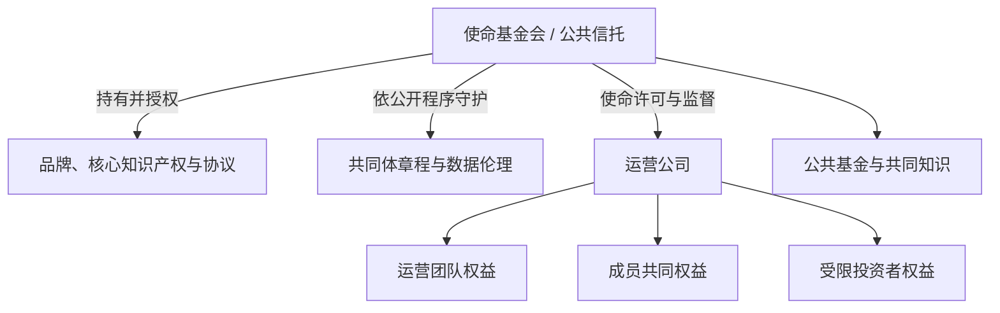

# 愿作的经济宪法与治理结构

> 文档状态：制度假设草案 v0.1。本文把对话中的经济、所有权和治理设想整理为可讨论的框架，所有比例、机构名称和表决门槛均为候选方案，不是当前承诺。当前产品范围见[平台概念设计](/desire-supply-platform-design.md)，当前可执行治理边界见[Community、Contribution 与规则治理](/architecture/community-governance.md)。

## 0. 两个不能分开的问题

愿作若要避免成为一个更温和的传统平台，必须同时回答：

1. **经济宪法：谁拥有什么？**
2. **治理宪法：谁决定什么？**

收费模式只回答收入从哪里来，不能回答权力和剩余价值归谁。即使平台不从创作者的约定报酬中抽成，只要它仍单方面控制机会入口、算法、声誉、数据、规则和退出条件，创作者仍可能处于平台依附关系。

数字时代的关键生产资料不仅是服务器和代码，还包括：

- 需求与协作网络；
- 数据、规则和匹配算法；
- 身份、声誉和能力证明；
- 品牌、协议和共同知识；
- 争议处理与信任基础设施。

真正的制度问题因此是：参与者能否影响这些生产条件，能否分享网络长期价值，并在平台变质时带着自己的记录离开。

## 1. 基本经济哲学：让市场重新嵌入共同体

愿作不需要否定市场。市场可以分散信息、发现需求并协调具体资源。问题在于市场成为唯一评价体系，并把财富、声誉和政治权力连成一条可以无限积累的链条。

愿作应坚持：

> 市场可以协调服务，但不能定义人的价值；资本可以购买服务，但不能购买共同体。

这要求将经济系统分成三个相互关联、又不能混为一谈的层次。

## 2. 三层经济模型

### 2.1 交易经济

交易经济解决“谁为具体劳动付钱”。需求方为项目结果、里程碑、持续服务或付费探索支付报酬，创作者按协议获得收入，愿作对需求澄清、验证、匹配、支付保障、协作和合规服务收费。

对话提出优先由需求方支付平台服务费，目的在于不从创作者已经协商好的报酬中再次扣减。但这只是较公平的收费选择，不是消除剥削的充分条件。费率、支付方和服务边界仍需通过真实批次验证。

交易层必须保持以下约束：

- 不公开低价竞标，不出售排名；
- 不把模糊需求的澄清成本免费转嫁给创作者；
- 不因 AI 提高效率而用工时定价惩罚高生产力；
- 大客户可以买到更多约定服务，不能因此获得更多治理权；
- 需求方与创作者都拥有清晰权利、责任和申诉路径。

### 2.2 公共经济

共同体会产生无法由单次交易充分支付的公共价值，例如需求模板、案例库、方法论、同行评议、新人指导、争议调解、规则维护和公共项目。

因此需要独立、透明的公共资金机制。资金可能来自平台收入的一定比例、成员会费、基金资助、公共采购、捐赠或专项合作。用途至少包括：

- 为社区维护、评议和调解支付报酬；
- 为新人提供正常付费、风险可控的证明机会；
- 支持教育、环境、照护和社区建设等支付能力不足的公共需求；
- 建设开放知识、公共工具和制度研究；
- 建立争议、安全和紧急风险储备。

具体比例不应在缺乏真实成本数据时写死，但预算、受益人、利益冲突和结果必须公开可审计。

### 2.3 成员所有经济

如果平台成功后，品牌、网络、数据和制度资产全部归投资者或创始团队，愿作仍会回到传统平台资本主义。因此成熟期需要某种成员和公共利益能够真实持有、而非象征性咨询的所有权结构。

成员权益不宜直接设计成可交易代币。贡献一旦可以自由买卖，资本便可以购买历史贡献并重新获得政治权力。更适合的方式可能是不可转让的成员权益、合作社份额、受使命约束的受益权或公共信托安排。成员共同权益首先表达经济受益和长期资产关系，不当然等于普通公司股份，也不自动按比例产生表决权。

### 2.4 成果形态与资产归宿保持中立

三层经济不能默认把所有创造推向成立公司、外部融资和无限增长。项目可以形成一次性有偿交付、长期个人实践、共同工具、开放知识、研究或教育成果、社区行动、合作组织、公益项目、商业企业，也可以在完成目的或证据不足时有理由地结束。

项目开始前应说明候选成果路径，结束或转型时记录实际归宿。平台不应以注册公司、估值、融资额、GMV 或持续运营作为统一成功指标，也不因提供孵化、场地、导师或资金而默认取得股权、知识产权、排他许可或治理权。

如果公共资金、社区知识、受益者经验或多人公共劳动形成的成果后来商业化，需要另行公开决定：

- 哪些部分可以被商业实体承接，哪些继续作为公共资产；
- 贡献者、受益者、资源提供者和维护者分别拥有什么权利；
- 知识产权、署名、许可、收益和数据如何处理；
- 公共资助是否要求开放许可、收益回流、可负担使用或其他条件；
- 项目结束、机构退出或节点关闭后，谁负责维护、迁移和善后。

这些决定应依据“权利影响矩阵”识别并取得必要授权：合同当事人与签字方确认协议变化，贡献者或知识产权权利人确认许可和承接，受益者代表确认公共目的变化，公共资金或公共资产的守护主体确认附带条件与回流。普通 Project owner、孵化方或出资方不能单方改写全部权利。

大学、社区、园区、企业、基金会和公共服务主体贡献的空间、设备、知识、信任、转介和时间都是有价值的非货币资源，但资源贡献只能产生事先公开的使用、补偿或成果权利，不能自动购买成员资格、候选选择权或共同体主权。

## 3. 候选所有权结构

对话提出“公共基金会 + 运营公司 + 成员权益 + 公共资产”的混合结构：

各部分的职责应清晰分离：

| 主体或资产 | 主要职责 | 不应拥有的权力 |
| --- | --- | --- |
| 使命基金会或公共信托 | 持有不可轻易出售的品牌、核心知识产权和使命资产；依共同体程序守护章程与数据伦理；监督重大偏离 | 不把章程和伦理规则当作自己的私产，不介入全部日常经营，不成为不可问责的创始人委员会 |
| 运营公司 | 产品、技术、市场、雇佣、合规和日常预算执行 | 不得单方面出售公共资产、改变数据伦理或取消成员基本权利 |
| 成员共同权益 | 让长期参与者分享网络价值并拥有实质治理地位 | 不得按交易额、财富或早期身份无限集中 |
| 运营团队权益 | 承认长期建设、专业执行和经营风险 | 不得因执行职责而永久垄断使命解释权 |
| 受限投资者权益 | 为建设提供资本并按契约获得回报 | 不得自动控制成员资格、匹配原则、公共基金和共同体章程 |
| 公共资产库 | 保存开放知识、规则历史、公共基金和可迁移协议 | 不得被运营公司私有化或作为收购附属品出售 |

对话曾用基金会 20%、成员 35%、团队 25%、投资者 20% 等数字演示多方平衡，也曾出现其他比例。它们只能作为说明，不能在缺乏法律、融资、税务和成员责任设计时当作结论。真正重要的不是表面比例，而是控制权、受益权、否决权、转让限制和退出权如何组合。

## 4. 资本的制度边界

完全拒绝资本可能让愿作缺乏建设资源，并在危机中更容易被收购。更稳健的原则是把资本视为有边界的工具，而不是组织主权的来源。

可以进一步评估：

- 有期限或有上限的收益权；
- 可赎回优先股；
- 与特定业务挂钩的收入分成；
- 不携带共同体章程修改权的非治理权益；
- 对单一投资者、客户、资助方和公共采购来源设置集中度预警；
- 所有重大资助和利益冲突公开披露。

投资者可以要求财务透明、合法经营、风险控制和对重大浪费的保护，但不能因出资最多而决定谁能成为成员、哪些问题值得解决、是否出售成员数据或是否取消新人保障。

### 4.1 成熟结构之前的临时护栏

具体实体、成员权益和使命资产结构可以等到 P5 证据成熟后决定，但资本与控制约束不能等到 P5 才第一次出现。P0 起至少应：登记当前品牌、代码、协议、域名、数据和资金的真实持有人/控制人；披露融资、债务、大客户、资助、采购、伙伴和关键供应商附带的治理、数据、IP、品牌与终止条件；禁止用这些条件购买成员资格、候选选择、章程权、私密数据或核心资产单方处置；为应付报酬、退款、数据和停止试点预留现实善后能力。

这些是创始期限制，不代表已经实现成员共同所有。具体专业工作和签字门槛见[法律、合规与合同准备计划](/foundations/legal-compliance-and-contract-plan.md)与[商业、财务与进入市场计划](/foundations/business-finance-and-go-to-market.md)。

## 5. 候选治理结构

两个极端都不可取：传统公司将最终权力集中于资本和董事会；所有成员对所有事项直接投票，则容易低效、信息不足并被少数高活跃者控制。候选方案是按事项分权的多中心治理。

### 5.1 运营委员会

负责产品路线、人员、供应商、日常预算和经授权的业务规则执行。它需要专业能力和明确问责，不应把每个运营决定交给全体成员投票。

### 5.2 成员议会

代表创作者、需求方和公共贡献者，负责讨论费用原则、匹配原则、声誉制度、公共基金、成员权利和重大规则。代表应有有限任期、利益冲突披露、可撤回或轮换机制。

### 5.3 使命与公共利益委员会

类似有限权限的宪法守护机构，审查重大决定是否违反社会契约、数据权利和不可出售的公共资产边界。它可以要求重新审议或在明确范围内暂缓决定，但不能成为永久凌驾于成员之上的不可问责机构。

### 5.4 决策权限矩阵

| 事项层级 | 例子 | 候选决定程序 |
| --- | --- | --- |
| 日常经营 | UI、普通供应商、已批准预算内执行 | 运营团队决定并承担责任 |
| 重要业务规则 | 服务费原则、匹配权重范围、声誉展示、新人计划 | 运营提出或评估，成员议会审议；必要时独立安全与法律审查 |
| 重大公共事项 | 公共基金年度方向、成员基本权利、重要数据用途 | 成员议会与使命机构共同批准 |
| 宪法事项 | 出售核心资产、修改社会契约、改变所有权控制、取消数据携带权 | 多方超多数、公开影响分析、冷静期和退出/分支保护 |

现实系统中，社区投票不能直接修改交易规则、资金、处罚、身份权限或生产配置。即使提案被成员接受，也应先形成候选规则，再经过目标业务领域独立验证和发布。当前详细边界以[Community、Contribution 与规则治理](/architecture/community-governance.md)为准。

## 6. 成员参与不只是投票

有效治理至少需要六种能力：

1. **信息权**：获得足以理解财务、规则影响、集中度和主要风险的信息；
2. **提案权**：提出规则修改、公共项目和预算方向；
3. **审议权**：看到反对意见、影响分析和替代方案，而不是只进行点赞；
4. **代表权**：在无法持续亲自参与时，授权有限任期的代表；
5. **监督与申诉权**：检查程序、利益冲突和规则执行，并挑战错误决定；
6. **退出权**：在治理失败时携带自己的数据、证明和关系离开。

投票权是否采用完全一人一票，或在严格上限内考虑持续公共贡献，对话中尚无定论。贡献加权可能承认经验，也可能制造道德贵族和可被游戏化的权力积累。因此当前更稳健的默认是：**每个符合资格的成员一票；专业经验通过提案、审议、代表席位和评审资格表达，而不是直接放大票数。**未来若验证其他机制，必须另行定义上限、衰减、冲突规则和可证伪试验。

## 7. 剩余价值与公共预算

成熟期的收入分配至少应透明呈现：

- 运营与人员成本；
- 技术、安全、法务和风险成本；
- 公共基金；
- 成员长期权益；
- 研发与制度实验；
- 储备和资本回报。

具体比例应由真实单位经济、法律结构和成员责任决定。制度目标不是保证每年平均分红，而是避免平台利用成员共同创造的网络价值，只为单一股东积累可出售资产。

## 8. 防止出售使命

核心原则是区分“可以商业化的外围”和“不可由单一主体出售的核心”。企业解决方案、软件服务、咨询、培训和地区运营可以商业化；共同体章程、核心协议、成员数据伦理、公共知识和成员治理权不应作为普通商业资产出售。

涉及核心资产的重大变更可以考虑以下程序：

1. 运营、成员代表和使命守护机构分别批准；
2. 按受影响群体分别计算超多数，而不是只计算总票数；
3. 完整披露收购方、资助方、利益关联、估值和替代方案；
4. 设置足够长的公开审议与冷静期；
5. 为反对成员提供数据迁移、权益处理和合法分支路径；
6. 保留历史章程、决策理由和公共资产来源的制度记忆。

## 9. 分阶段采用

这些结构不应在尚无真实协作证据时一次性建成。更合理的顺序是：

1. 在礼宾式 MVP 中验证真实需求、体面报酬和双向选择；
2. 公开收入来源、人工覆盖、集中度和使命健康指标；
3. 为真实发生的公共劳动建立透明补偿；
4. 形成小规模成员小组和受限提案机制；
5. 在稳定参与和可承担成本出现后，再选择具体法律所有权结构；
6. 任何扩大治理范围的决定都与明确能力、测试、申诉和退出路径一起交付。

成员如何形成，以及这些制度怎样避免演变为封闭行会，见[成员制度、动态开放与反收编](/foundations/membership-and-open-community.md)。
