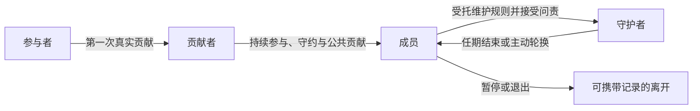

# 愿作的成员制度、动态开放与反收编

> 文档状态：制度假设草案 v0.1。本文整理成员成长、公共贡献、反行会化和外部收编防线。身份层级、配额、任期和程序均需真实运行验证；当前 Community 领域的可执行状态与权限以[Community、Contribution 与规则治理](/architecture/community-governance.md)为准。

## 0. 成员制度要解决什么

数字共同体没有家庭、地域、学校或雇佣关系提供的天然成员形成机制。注册只产生账户，购买服务只产生客户，都不能回答：

> 一个陌生人为什么会逐渐成为愿意维护这个共同体的人？

愿作的候选答案是：成员资格不是购买或注册获得的，而是在真实协作、持续守约、公共贡献和共同治理中逐渐形成的。身份变化不是消费等级升级，而是责任递进。

## 1. 从参与者到守护者

| 身份 | 形成方式 | 主要权利 | 主要责任 |
| --- | --- | --- | --- |
| 参与者 | 开放进入并完成必要同意 | 浏览公开资源、创建基础档案、参加开放讨论 | 遵守安全和基本协作规则 |
| 贡献者 | 完成真实项目、同行评议或公共贡献 | 获得更完整的协作与复盘权限，参与领域讨论 | 真实表达、守约、接受反馈 |
| 成员 | 在一定时间内持续参与、守约并得到同行认可 | 提案、治理参与、公共基金申请和成员资源 | 参与必要公共事务，维护公平并帮助新人 |
| 守护者 | 经培训、利益冲突审查和有限任期委任 | 在明确范围内评议、调解、维护流程并获得报酬 | 更高透明度、回避、自我约束、接受复核和轮换 |

身份不应形成不可逆的贵族序列。成员可以暂停，守护者任期结束后回到普通成员，长期不参与时相关治理资格可以按公开规则重新确认。历史贡献保留为事实，但不保证永久权力。

在技术模型中，这条成长路径需要拆成两个相连但不同的生命周期：参与者、贡献者与正式成员属于公民资格；守护者、代表和评审者属于合资格成员可以承担的 `PublicOfficeTerm`。后者由任期、培训、补偿、回避和轮换管理，不是成员状态机中的永久第四级。

## 2. 什么算贡献

贡献不能简化为交易额或可兑换积分。候选模型包含三个维度：

### 2.1 生产贡献

完成项目、解决问题、创造作品，并对结果承担责任。它证明一个人可以参与真实协作，但收入高低本身不等于公共贡献更大。

### 2.2 共同体贡献

整理教程、分享案例、帮助新人、参与同行评议、改进工具和维护公共知识。这些劳动需要被记录，也应在可持续时获得报酬，不能只靠道德号召。

### 2.3 文化与制度贡献

发现系统性问题、提出规则改进、参与审议、调解冲突、保护弱势参与者和保存制度记忆。它反映维护共同体的能力，但尤其需要利益冲突和权力边界。

贡献记录应保存证据、时间、领域、角色和影响，不生成一个可以交易的“贡献币”。贡献可以影响是否符合某项责任资格，却不应直接按线性比例兑换金钱、曝光或票数。

## 3. 声誉是叙事资产，不是数字货币

单一声誉分数会把复杂的人重新变成可以排序和定价的商品，也容易形成“老成员—更多机会—更多声誉”的自我强化循环。

更适合愿作的声誉表达是：

- 在什么领域完成过哪些可验证项目；
- 擅长澄清、交付、协作或维护的哪些部分；
- 适合和不适合什么场景；
- 证据来自谁、何时产生、是否仍然相关；
- 发生过什么争议，经过什么程序得出什么结论；
- 对新人、公共知识和共同体规则有何贡献。

“声誉衰减”不应删除历史，而是降低陈旧证据对当前匹配和治理资格的自动影响。十年前的成就仍值得尊重，但不能保证今天的优先机会或永久席位。

## 4. 治理参与的层次

十万人对所有问题实时投票不会产生有效民主。更合理的结构是让决定发生在最接近问题、又具备必要信息和问责能力的层级。

### 4.1 领域或地方小组

由规模可管理的成员讨论专业标准、实践知识、新人培养和本领域问题。小组自治不能绕过平台安全、资金、身份和申诉边界。

### 4.2 跨领域成员议会

处理费用原则、匹配制度、公共基金、成员权利和跨领域影响。代表来源、任期、撤回、轮换和利益冲突应公开。

### 4.3 全体或宪法级程序

只处理社会契约、核心资产、控制权和重大使命变化。它需要充分信息、长审议期和高于日常事项的门槛。

成员参与还需要真实的信息、提案、审议、监督、申诉和退出能力。只提供一个投票按钮，会让治理退化为仪式。

## 5. 归属如何形成

人不会仅为了“治理权限”长期留下。共同体还需要让参与、成长和公共贡献具有情感意义，但仪式不能取代真实权利。

可以逐步形成：

- 第一次真实贡献后的成员欢迎与公开确认；
- 对项目成功和失败都进行不羞辱参与者的复盘；
- 年度大会不只报告收入，还呈现共同解决的问题和未履行的承诺；
- 荣誉关注问题解决、导师、公共知识和制度改进，而不是销售冠军；
- 保存规则为何出现、曾经纠正过什么错误的共同体记忆；
- 让新人能够公开质疑创始人、运营者和老成员。

需要同时警惕“我们比市场参与者更高尚”的道德精英主义。需求方不是天然的资本敌人，投资者也不是天然恶人。愿作的目标不是筛选好人，而是让不同利益的人在清晰约束下公平协作。

## 6. 动态开放：防止数字行会贵族

行会化通常经历同一循环：成员建立规则保护彼此，积累能力与机会，随后把质量标准变成阻止后来者进入的利益壁垒。愿作必须区分两种保护：

- **错误的保护**：保护现有成员免受合理竞争；
- **健康的保护**：保护所有参与者免受欺诈、恶意压价、骚扰和不透明权力。

共同体保护的是比赛规则，不是永久冠军。候选的反行会化机制包括：

### 6.1 成员资格意味着持续责任

更高权限应伴随导师、评议、知识开放或制度维护责任。未持续履行职责时，特定权限应按公开程序到期，而不是作为终身奖章保留。

### 6.2 新人拥有正常证明机会

可以设立小规模、正常报酬、有导师且风险可控的成长项目池。其目的不是降低质量标准，而是避免所有机会都要求已经拥有平台历史。

### 6.3 评审来源多元

专业人员、需求方、实际用户和不同背景成员可以从不同维度评价成果。单一资深群体不应垄断对“好”的解释，也不能评审与自己存在直接竞争或利益冲突的对象。

### 6.4 新成员有制度性表达渠道

新成员委员会、定期准入审计或新人席位可以专门暴露成长路径中的障碍。其意见不自动推翻质量与安全规则，但必须得到公开回应。

### 6.5 市场成功与政治权力分离

赚钱最多的创作者和采购最多的需求方都很重要，但不能据此获得更大章程修改权。经济身份和共同体公民身份必须分开。

### 6.6 持续扩大生态容量

老成员排斥新人经常不是因为道德败坏，而是因为高质量机会有限。愿作不能只重新分配现有订单，还需要帮助组织发现真实问题、支持社会组织采购、汇集共同需求并创造公共项目。没有新的生态容量，开放最终会退化为零和争夺。

## 7. 开放边界不等于没有边界

愿作不应以“资本家不能进”“企业不能进”或某种意识形态纯洁性来保护自己。更稳健的边界针对行为：

- 不以资金、采购额或赞助购买治理权；
- 不利用评审、排名和信息优势排斥合理竞争；
- 不把公共知识、关系或成员数据据为排他资产；
- 不以赞助为条件控制讨论、案例和研究结论；
- 不要求共同体或成员建立不必要的排他依赖；
- 公开资金来源、利益冲突和可能影响规则的关系。

企业、基金会和政府都可以采购服务、资助公共项目、提供专业知识或依法监管，但不能因资源贡献而垄断共同体的制度解释权。

## 8. 抵抗外部收编

共同体形成有价值的文化后，资本、企业、政府和品牌可能尝试购买它。真正需要保护的不是口号和审美，而是成员共同解释、修改和拒绝规则的能力。

### 8.1 核心与外围分离

软件服务、企业方案、培训、咨询和特定地区运营可以商业化。社会契约、核心协议、数据伦理、成员治理权、公共知识和可迁移贡献记录不能由运营公司单方面出售。

### 8.2 避免单一资源依赖

法律上的无控制权不能消除事实上的影响力。应持续观察单一投资者、客户、采购项目、资助机构和平台供应商的收入或基础设施集中度，并在超过公开阈值前建立替代方案。

### 8.3 保留退出、迁移与合法分支能力

成员应能导出自己的作品、合作和贡献证明，但不得因此带走合作方隐私、受合同限制的材料或第三方数据。核心协议应尽可能支持领域或地方分支。当中央组织严重偏离使命时，成员应有现实可用的重建路径，而不是只有删除账户的形式自由。

### 8.4 文化必须持续再生产

组织被收编往往不是一次明确政变，而是“不出售排名”逐渐变成“适度商业推荐”，“不制造注意力竞争”逐渐变成“提高活跃度”。新成员教育、公开争议记录、定期章程讨论、付费守护工作、权力轮换和历史错误记忆，是文化不被营销化的实际防线。

### 8.5 核心改变采用高门槛程序

如果成员自己希望出售核心资产，也不能简单禁止或简单多数通过。候选程序包括多方分别批准、超多数、完整披露、影响分析、冷静期，以及反对成员的数据迁移和合法分支权。守护机构可以延迟并要求重新审议，但不能永久替代后来成员作决定。

## 9. 反异化与反收编指标

最危险的收编可能发生在内部指标改变时。建议把以下信号与财务指标并列审查：

| 观察面 | 健康信号 | 偏离信号 |
| --- | --- | --- |
| 自主性 | 拒绝不受惩罚，成员能表达边界 | 为提高成交率持续压缩拒绝空间 |
| 报酬 | 有效报酬稳定，变更得到重新协商 | GMV 上升但报酬下降、无偿劳动增加 |
| 机会 | 新人可获得正常付费合作 | 少数历史成员长期垄断邀请与收入 |
| 需求 | 注资、决策权和验收清晰 | 为扩大供给放入大量模糊或虚假需求 |
| 治理 | 提案来源多元，反对意见有回应 | 只有运营者或少数高活跃者能改变规则 |
| 资金 | 收入来源多元，公共预算透明 | 单一客户、投资者或资助方形成事实否决权 |
| 数据与退出 | 可导出、可更正、可迁移 | 声誉、关系和作品成为平台锁定工具 |
| 文化 | 复盘问题和公共贡献 | 排名、曝光、活跃和品牌传播主导荣誉 |

## 10. 分阶段验证

成员与治理制度应在真实关系出现之后逐步形成：

1. 首批项目先验证参与者是否愿意再次合作，以及规则是否让人更有能力拒绝不公平条件；
2. 记录实际发生的评议、调解、指导和知识整理，识别需要补偿的公共劳动；
3. 建立小规模领域小组、明确任期的维护者和受限提案流程；
4. 观察新人获得第一份正常付费合作的时间、机会集中度和利益冲突；
5. 在成员形成稳定责任关系后，再扩大公共基金、代表治理和资产所有权；
6. 每次扩权都同时提供培训、审计、申诉、到期和退出机制。

最终目标不是让所有用户都成为高强度治理者，而是让愿意承担责任的人有真实权力，让只想完成公平交易的人也得到尊重，让任何一方都不能把共同体变成自己的资产。
