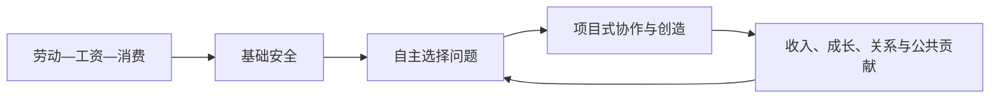

# 从异世界幻想到愿作

> 文档状态：思想与制度基础草案 v0.1。整理自《资本主义与异世界幻想》对话，并结合当前愿作设计重新编排。本文讨论“为什么做”和“希望形成什么社会关系”，不代表已实现功能，也不替代法律、产品或技术决策。当前事实请以[项目介绍](/guide/introduction.md)、[平台概念设计](/desire-supply-platform-design.md)和实现代码为准。

## 0. 核心判断

剑与魔法、异世界和升级叙事的吸引力，不能只用逃避现实解释。它们也可能表达了现代生活中几种被压缩的需要：行动能够产生可见结果，成长能够被理解，劳动与意义重新相连，人能够拥有多重身份，并在一个真实共同体中被需要。

愿作与这种想象的关联，不在于复制“冒险者公会”的外观，而在于尝试把其中值得保留的社会关系转译为现实制度：

- 人不是待出售的人力资源，而是有意愿、有边界、有方向的行动主体；
- 市场可以协调具体协作，但不能垄断对人的价值判断；
- 技术应降低协作成本，不能替代人的责任和裁决；
- 共同体应保护公平规则和成长路径，而不是保护既有成员的优势；
- 资本可以购买服务并获得有限回报，但不能购买共同体主权；
- 平台的成功应由体面、自愿且有意义的协作衡量，而不是只由交易规模衡量。

愿作因此不是完整的替代社会，而是一项范围有限的制度实验：在现有社会条件下，验证个人能否不依附固定公司职位，也能围绕真实问题形成可信、公平、可持续的协作。

## 1. 异世界幻想揭示了什么

幻想作品有叙事快感、神话传统、审美偏好等多种来源。从资本主义批判的角度观察，只是其中一条解释路径。这条路径关注的是：现代人创造了庞大的组织、市场和技术系统，却经常感到自己无法理解、更无法改变这些系统。

| 现实经验 | 幻想中的补偿结构 | 对制度设计的启发 |
| --- | --- | --- |
| 劳动被切成细小环节，结果难以看见 | 打败敌人、治愈病人、建成城镇，行动和结果直接相连 | 让项目目标、受益者、交付结果和社会影响可见 |
| 努力与回报关系模糊 | 等级、技能和任务奖励清晰 | 让成长证据和规则可解释，但避免把人压缩成总分 |
| 人被单一职位定义 | 角色由多种技能、经历和关系组成 | 用能力组合、意愿和方向代替固定职业标签 |
| 人际关系功能化、临时化 | 小队、公会和村庄提供归属 | 让长期成员关系超越一次交易 |
| 权力对象抽象，个人缺少行动感 | 敌人有名字、边界和弱点 | 让规则、责任主体、申诉路径和改变程序可理解 |
| 生存压力驱动大量无意义辛苦 | 困难具有明确目的并推动成长 | 追求“值得面对的困难”，而不是没有挑战的生活 |

“升级系统”尤其值得警惕。它一方面回应了现实中成长反馈不透明的问题；另一方面也可能把市场竞争和绩效逻辑搬进幻想世界。很多作品表面上逃离现代劳动，最后仍以成为富豪、领主或统治者作为成功终点。这暴露出一个更深的想象缺口：人们容易想象个人获得超常力量，却不容易想象一个没有支配关系、同时仍有活力的共同体。

> 我们已经很擅长想象如何逃离旧世界，却还不太会想象如何共同建造新世界。

## 2. 缺失的社会想象

对话中形成的未来图景可以称为“后职业社会”或“创造者共同体社会”。它不是取消劳动、市场和困难，而是改变它们在人生中的位置。

在这种社会中，一个人不必终身回答“我是哪家公司的什么职位”，而可以同时是研究者、程序员、照护者、艺术创作者和社区成员。工作不再是一段固定出售的时间，而可能是围绕不同问题形成、完成后重新组合的项目网络。

它追求的不是无条件舒适，而是四种更实质的自由：

1. **生存安全**：一次失败、转型或探索不会摧毁基本生活；
2. **方向自主**：人能够拒绝不认同的劳动，并选择愿意承担的问题；
3. **可见贡献**：人能够理解自己的行动对谁产生了什么影响；
4. **共同塑造制度**：普通参与者可以理解、质疑和改变影响自己的规则。

现实中的自由职业、独立创作、开源社区、合作社、数字社群和艺术家生活，已经展示了其中一部分可能性。它们同时暴露了共同限制：收入不稳定、平台依赖、自我剥削、公共劳动缺乏报酬、声誉固化和社群权力集中。它们是未来社会的胚芽，但目前仍主要生活在现有制度的缝隙中。

## 3. 支撑这种生活所需的制度

单靠更好的匹配软件无法形成上述社会。至少需要五层相互配合的制度条件：

| 制度层 | 需要解决的问题 | 可能方向 |
| --- | --- | --- |
| 基础安全层 | 人是否能承受拒绝、学习、失败和转型 | 医疗、教育、住房等公共服务；社会保障、社会分红或基本收入 |
| 协作层 | 独立个体如何发现问题、建立信任并获得报酬 | 项目网络、合作社、数字公会、合同与支付基础设施 |
| 所有权层 | 自动化和网络产生的长期价值归谁 | 成员所有、公共基金、使命锁定资产、多利益相关方治理 |
| 教育层 | 人是否只被训练成合格雇员 | 学习能力、创造、协作、审美、批判思考和公共参与 |
| 评价层 | 金钱是否是唯一价值尺度 | 经济回报、社会贡献、可信声誉和个人成长并存 |

技术距离相对较近。AI、互联网和自动化已经让个人或小团队获得过去只有大型组织才有的生产能力。经济制度距离更远，因为生产资料的形态虽从工厂扩展为平台、数据、算法、关系网络和声誉系统，所有权集中问题并未消失。文化距离可能最远：许多人仍主要用收入、职位和消费能力理解成功，也很难回答“不用工作证明自己时，我是谁”。

## 4. 愿作在其中的位置

愿作抓住了一个重要矛盾：**生产能力正在个人化，而机会发现、信任建立、公平分配和风险承担仍然高度组织化。**

它最有价值的设计不是“更准确地匹配简历”，而是改变匹配的对象：

- 把模糊愿望澄清为有预算、有决策人、有验收方式的真实问题；
- 把“我愿意做什么、拒绝什么、想成为什么”作为一等信息；
- 用少量、可解释的双向邀请代替海量投标和低价竞赛；
- 用协议、里程碑、付款保障和申诉降低独立协作风险；
- 把案例、评议、调解和新人培养视为需要维护的公共资源。

这使愿作更接近“问题解决网络”或“个人生产者联盟”，而不是传统自由职业市场。它帮助验证的不是一个页面或算法是否受欢迎，而是“愿作式协作关系是否成立”：

1. 创作者是否愿意继续解决同类问题；
2. 需求方是否感到对方在共同理解问题，而不是只执行指令；
3. 双方是否愿意形成可持续关系；
4. 公共规则是否让弱势一方更有能力说“不”；
5. 组织能否在不退化为流量和低价平台的前提下生存。

愿作的边界也必须明确。它不能单独提供全民基础保障，不能消除所有生存焦虑，也不能仅凭产品设计改变整个社会的生产关系。它最多先成为一种局部替代机制和制度实验场。

## 5. 从平台走向共同体的四份基础文本

本目录将对话中的制度讨论整理为四个相互连接、但职责不同的文本：

- 本文回答愿作源于什么社会问题，以及它在更大社会想象中的位置；
- [愿作社会契约](/foundations/social-contract.md)说明共同体承诺保护什么；
- [经济宪法与治理结构](/foundations/economic-constitution.md)说明谁拥有什么、谁决定什么；
- [成员制度、动态开放与反收编](/foundations/membership-and-open-community.md)说明陌生人如何成为成员，以及共同体如何避免固化和被外部力量购买。

这些文本属于理念和制度假设。现阶段的 Community、投票和规则发布边界仍以[Community、Contribution 与规则治理](/architecture/community-governance.md)为权威技术设计。

## 6. 理论线索与研究边界

这场对话借用了几条已有思想传统作为分析线索：马克思关于劳动异化的讨论，马克·费舍关于“资本主义现实主义”与想象边界的批判，本尼迪克特·安德森关于想象共同体的研究，以及合作社、公共资源治理和平台合作主义对数字所有权的探索。

这些概念帮助提出问题，但本文不是文献综述，也不把单一理论当作异世界文化流行的完整解释。若用于学术、政策或对外研究，应另行核验原始文献、补充不同理论视角，并区分文化解释、规范主张和已经得到经验支持的制度结论。

幻想也具有双重性：它可以保存对主体性、共同体和另一种生活的欲望，也可以把不满转化为可消费、但不改变现实的逃逸产品。愿作希望做的不是反对幻想，而是把其中仍有生命力的愿望转化为可检验的现实关系。

## 7. 尚未解决的核心矛盾

这套想象只有承认自身矛盾，才可能成为可运行的制度：

- **开放与质量**：如何建立可信门槛，而不把门槛变成既得利益壁垒；
- **民主与效率**：哪些事项由成员决定，哪些事项应授权专业团队；
- **使命与生存**：如何获得稳定收入，又不让收入来源反向控制使命；
- **贡献与权力**：如何承认长期维护者的经验，又不形成道德或声誉贵族；
- **市场与公共价值**：如何服务有支付能力的需求，同时支持重要但无力支付的问题；
- **稳定与变化**：如何保护不可轻易出售的原则，又不让创始一代永久统治后来成员；
- **共同体与退出**：如何形成真实归属，同时保证数据、声誉和关系不成为锁链。

因此，愿作真正要回答的不是“怎样让人生产更多”，而是：

> 怎样让越来越多的人能够诚实地说：我正在做自己愿意做、对他人确有价值的事情，并因此获得足以体面生活的回报；同时，我也有能力参与维护这套协作关系。
