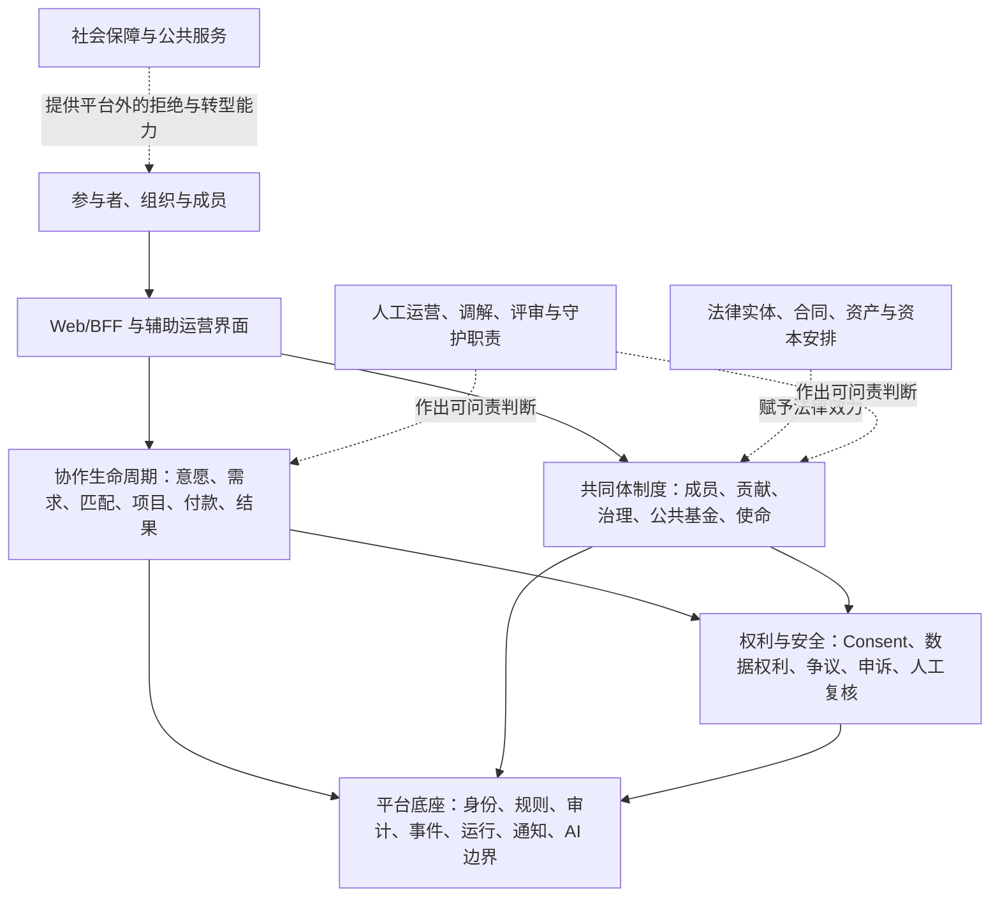

# Foundations 技术能力地图

> 文档状态：目标能力设计 v0.1。本文把 foundations 的规范要求拆成未来系统必须具备的技术、运营、法律和外部条件；它不是当前实现清单，也不承诺一次性建设全部能力。当前差距见[Foundations 实现差距审计](/foundations/implementation-gap-assessment.md)，实施顺序见[Foundations 落地路线图](/foundations/realization-roadmap.md)。

## 0. 这张地图解决什么问题

愿作不能只被设计成“匹配网站”，也不能把所有制度要求塞进一个 Community 模块。它至少同时是一套协作基础设施、权利保障系统、公共资源系统和受使命约束的组织工具。

本地图回答四个问题：

1. 为实现 foundations，系统到底需要哪些能力；
2. 每项能力拥有哪类事实，又明确不拥有哪类权力；
3. 哪些要求可以由软件强制，哪些必须由人、法律实体或外部制度完成；
4. 什么证据足以证明能力从“设计过”走到了“现实有效”。

所有能力都应追踪[Foundations 要求目录中的稳定 `FND-*` 要求](/foundations/foundation-requirements.md)。当前 foundations 范围的原子映射和 P1 处置由[要求与能力登记册](/foundations/requirements-capability-registry.md)维护；一个能力可以服务多个基础要求，但不能用“间接相关”冒充完整覆盖。

## 1. 目标系统不是单层软件

图中的虚线关系非常重要：软件可以记录成员权利，却不能自行创造法律上的共同所有；可以允许拒绝，却不能单独消除生存压力；可以提供表决程序，却不能保证参与者掌握信息或免受非正式权力影响。

## 2. 能力登记册的最小格式

每项能力在设计、开发和运营中都必须有同一条登记记录：

| 字段 | 必须回答的内容 |
| --- | --- |
| Capability ID | 稳定标识，不随模块改名而改变 |
| Foundation refs | 服务哪些 `FND-*` 要求 |
| Owner | 哪个边界上下文拥有最终写入事实 |
| Subjects | 哪些人、组织、成员或公共机构受影响 |
| Commands / decisions | 谁以什么权限发起，谁承担决定责任 |
| Invariants | 无论故障、并发或人工覆盖都不能破坏什么 |
| Policy refs | 决定使用了哪个已发布规则、章程和 Consent 版本 |
| Evidence | 原始输入、理由、异议、复核、输出和审计如何连接 |
| Data rights | 访问、更正、限制、删除、导出和第三方权利如何处理 |
| Failure semantics | 拒绝、冲突、超时、未知结果、降级和补偿是什么 |
| Activation gate | 达到哪些代码、运营、法律和效果条件后才能打开 |
| Status layers | `DESIGN` 到 `EFFECTIVE` 各层分别处于什么状态 |

这份登记格式已经在[要求与能力登记册](/foundations/requirements-capability-registry.md)建立 foundations 范围基线。由于 2026-08-10 本轮没有检查代码和现实证据，其 Delivery/Reality 状态仍为 `UNVERIFIED`；后续架构页面、测试和运行手册应引用并用固定 revision/现实文件升级它，而不是各自写一条容易过期的“当前 GREEN”。

Capability 是责任和验收边界，不等于部署单元；多个 Capability 可以先由同一模块承载。只有在数据所有权、团队责任、扩缩容或故障隔离确有需要时，才考虑拆成独立服务。Capability ID 一经分配应保持稳定，编号不表示章节顺序、优先级或成熟度。

### 2.1 要求族到能力的方向摘要

下表只用于阅读导航，不是原子、可查询的追踪 registry；斜杠、范围和通配符都不应进入未来机器登记。每个 Capability 在 P0 仍需枚举精确 `FND-*` 与 architecture/code/test/ops/effect 证据。

| Foundation family | 主要 Capability | 验证中心 |
| --- | --- | --- |
| `FND-HUM-*` | `CAP-C01/02/04/09`, `CAP-I01/03/11/12` | 意愿与边界表达、拒绝无报复、多重角色和归属、关系与质性结果 |
| `FND-COL-*` | `CAP-C02..09`, `CAP-S03/07`, `CAP-I12` | 真实需求、双向接受、协议/变更、可核验付款、多元成果、争议与再次合作 |
| `FND-RGT-*` | `CAP-S01/03/04`, `CAP-C07`, `CAP-I03/09` | 知情、访问/更正/删除、第三方权利、可验证导出和接收演练 |
| `FND-REP-*` | `CAP-C01/09`, `CAP-I02/03` | 带来源与时间的叙事证据、纠错/撤销、选择性披露、无总分 |
| `FND-AI-*` | `CAP-S08`, `CAP-S03`, `CAP-C08` | 目的限定、关闭默认、人工确认、禁用决定和申诉 |
| `FND-RUL-*`, `FND-SEP-001` | `CAP-S02/03`, `CAP-I04/07` | 版本、影响分析、候选到独立发布、职责分离和历史可复现 |
| `FND-MEM-*` | `CAP-I01..03`, `CAP-I06/11` | 公民成员生命周期、公共职务、贡献证据、新人路径和反固化效果 |
| `FND-DEP-*`, `FND-NOD-*` | `CAP-S01/03/04/06`, `CAP-C02/05/06/08/09`, `CAP-I01/06/08/09/11/12` | 状态隔离、非排他归属、伙伴授权、跨机构角色、关系性强迫、线下资源、辅助办理与节点连续性 |
| `FND-SAF-*`, `FND-EQU-*` | `CAP-S02..07`, `CAP-C01/02/04/08`, `CAP-I06/11/12` | 举报、反报复、临时保护、正当程序、独立申诉、事件响应、非歧视、敏感公平数据和可访问权利 |
| `FND-CTR-*`, `FND-OPS-*`, `FND-EVD-*` | `CAP-S01..07`, `CAP-C03/05/06/08`, `CAP-I06/08/09/11/12` | 法律/合同/付款现实、运营责任、供应商、连续性、批次上限、研究伦理、证据等级和宣称控制 |
| `FND-GOV-*` | `CAP-S02/03`, `CAP-I01/04..07` | 事项分层、代表、审议、表决、执行、复议、冷静期与真实授权 |
| `FND-ECO-*` | `CAP-C03/06`, `CAP-I05..08/10/11` | 公共金库、公共劳动、职责分离、成员经济权益法律证据、剩余分配与集中度 |
| `FND-MIS-*`, `FND-EXIT-*` | `CAP-S03..05`, `CAP-I03/07..11` | 使命指标触发、退出摩擦、成员权益、核心资产、依赖风险和合法分支 |

## 3. 平台底座能力

### 3.1 身份、政策与运行底座

| ID | 能力与所有者 | 必须包含的技术实现 | 核心边界 | 当前基础 |
| --- | --- | --- | --- | --- |
| `CAP-S01` | Identity、Organization & Access | OIDC 身份绑定、组织租户、邀请、角色作用域、政策接受、目的限定 Consent、会话轮换/撤销/恢复/关闭、RLS、权限审计 | 账户身份不等于正式成员身份；组织角色不产生政治权利 | IAM 已有较深契约/领域/PG 切片，持久 Session 和完整组合仍有 RED |
| `CAP-S02` | Rule & Charter Publication | 规则包、章程、费率、资格、匹配和评审政策的版本、草案、影响分析、批准、生效、废止、兼容与历史查询 | 规则目录负责“什么版本有效”，不替代业务上下文判断个案 | Taxonomy 可复用；尚未覆盖 foundations 规则族和治理发布链 |
| `CAP-S03` | Audit, Decision & Event Evidence | 不可变审计事件、敏感读取、决定记录、理由码、负责的人、政策引用、outbox/inbox、完整性 checkpoint、跨域 correlation | 审计不能存储不必要的敏感正文；日志不是真相源 | Outbox 与部分审计约束存在；统一 Decision/Audit 尚为设计 |
| `CAP-S04` | Data Rights & Information Governance | 数据清单、保留规则、访问/更正/删除/限制/反对/携带请求、legal hold、第三方权利筛选、外部 provider 清除、备份水位 | 各业务域拥有事实；Data Rights 编排请求，不可越权直接改库 | Consent 有局部基础；完整能力仅有设计 |
| `CAP-S05` | Runtime & Production Composition | 配置 Schema、secret/keyring、数据库池与事务 scope、生产 broker、worker 进程装配、迁移、健康/就绪、功能降级、发布/回滚、备份/恢复、灾备演练 | 测试中的手工组装不算生产组合；未知结果必须可收敛 | 纯组合内核、Outbox worker 和 PG repository/inbox 存在；生产 broker、具体 consumer 与真实进程绑定缺失 |
| `CAP-S06` | Web BFF & Accessible Product Shell | 浏览器会话、CSRF、输入契约、权限化导航、无障碍、国际化、错误恢复、运营/成员不同视图、线下/纸面/电话辅助办理、范围化代理授权和端到端测试 | 前端不得重新实现授权或隐藏失败；代理不能共享密码或替人默示重大同意；重要决定不能只用通知表达 | 尚无实际产品壳 |
| `CAP-S07` | Notification & Communication Delivery | 模板版本、偏好、强制事务通知、收件路由、重试、回执、敏感内容最小化、站内与外部通道 | 通知是投影，不是资金、处罚或治理结果的真相源 | 仅有设计 |
| `CAP-S08` | Controlled AI Gateway | 目的和数据类别许可、模型/提示版本、最小化输入、输出 Schema、成本与保留策略、人工确认、禁用/降级、评测与审计 | AI 不得最终决定付款、资格、处罚、争议和宪法事项 | 仅有设计；MVP 当前不依赖模型是安全优势 |

### 3.2 底座必须共同遵守的不变量

- 每个影响重大利益的决定都能回答：使用了什么事实、哪个规则版本、谁或哪个受控自动过程作出、如何复核和申诉。
- 身份、租户、业务主体、正式成员、公共职务和经济权益使用不同标识与生命周期，不用一个 `role` 字段混合。
- 任何跨域流程都通过明确命令和事件连接；消费方不能直接写入来源域数据库。
- 敏感数据默认不进入事件、日志、指标、通知和 AI；需要时使用受控引用和目的限定读取。
- 生产组合必须失败关闭；测试 double、内存仓库和开发密钥不能被误接入生产。
- 每项权利都有现实的时限、责任队列、失败状态、人工升级和审计，而不只是一个 API 路由。

## 4. 协作生命周期能力

### 4.1 从意愿到结果的核心上下文

| ID | 能力与所有者 | 关键事实和工作流 | 必须强制或证明的事项 | 当前基础 |
| --- | --- | --- | --- | --- |
| `CAP-C01` | Creator Profile | 意愿、边界、方向、技能证据、可用性、报酬底线、合作偏好、披露授权与版本 | 私密底线不泄漏；撤回披露后新流程不可读取；陈旧证据不自动变成永久优势 | MVP 可运行；平台 Domain/PG 局部存在，HTTP/组合缺失 |
| `CAP-C02` | Demand & Public-Value Intake | 问题来源、实际受益者、受益者代表授权、出资/采购者、资源方、决策者、候选选择者及授权、验收者、协调者、问题、范围、候选成果路径、预算、付款计划、风险、AI/数据边界、商业或公共价值轨道、审核与版本 | 允许一方兼任多个角色，但必须逐角色声明和检查冲突；不能把机构客户默认当作全部受益者与代表；没有真实决策权、资金路径或可验收范围不得进入匹配；支付能力不等于公共价值 | MVP 有部分字段；平台 Domain/PG 局部存在，角色拆分与后续状态链未闭合 |
| `CAP-C03` | Budget, Compensation & Fee Policy | 报酬底线检查、币种与税费口径、付款计划、费率政策、例外、公共补贴资格、影响模拟 | 不公开私人底线；无偿大样稿和无限修改被阻断；例外有人负责且可审计 | MVP 有预算闸门；平台尚无独立完整边界 |
| `CAP-C04` | Matching, Invitation & Selection | 输入快照、硬过滤、可解释候选、有限邀请、双方接受/拒绝、冲突排除、人工覆盖、机会公平投影 | 拒绝不被隐性惩罚；硬边界不可被覆盖；规则版本固定；选择不越过资金/安全闸门 | MVP 匹配与记录可运行但不强制双方接受；平台为领域/内存切片，无 PG/HTTP/完整选择组合 |
| `CAP-C05` | Project, Agreement & Delivery | 项目建立、AgreementVersion 与所有必要合同当事人或获授权签字方接受、里程碑、输入请求、交付、合同验收、受益者成果确认、拒收、范围变更、成果路径、权利影响矩阵、IP/许可、资产承接、维护/移交、终止、完成与 end-of-life | 修改范围同时重新确认时间/报酬；合同验收不替代受益者成果确认；公司化、专有化或公共用途改变须由受影响的合同当事人、贡献者/权利人、受益者代表和公共资产守护主体按权利范围另行授权；历史协议不可静默改写 | 仅有设计 |
| `CAP-C06` | Funding, Payment & Reconciliation | 匹配前 `DEMAND_VERSION` Funding、开工前 `MILESTONE` Funding allocation、付款操作、provider 幂等、webhook inbox、双人核实、退款/冲正、对账、未知结果收敛 | 未 `SECURED` 的 Demand 不进入匹配，未获所需保障的 Milestone 不开工；平台不把“已请求”写成“已支付”；付款授权与核实职责分离；Safety Hold 可阻断但需复核 | 仅有设计；不包含公共金库治理 |
| `CAP-C07` | Workspace, Messages & Files | 项目成员、消息、输入请求、文件版本、病毒/内容检查、细粒度共享、保留与导出 | 文件不作为状态真相源；撤权即时生效；导出尊重合同和第三方权利 | 仅有设计 |
| `CAP-C08` | Trust, Safety, Dispute & Appeal | 举报、临时 Safety Hold、证据清单、调查、争议、裁决、补救、申诉、独立复核、冲突回避 | 紧急限制有最小范围和期限；原决定人与申诉复核人分离；重大决定不能由 AI 独立作出 | 仅有设计 |
| `CAP-C09` | Outcome, Review & Relationship | 已对账付款/时效、范围变化、争议、安全事件、双方评价、需求清晰度、再次合作意愿、实际成果路径、公共回流、维护/移交、公共影响、运营成本 | 按项目声明的成果路径评价，不用公司化或增长统一打分；财务事实与参与者自报观察分开；评价有回应/纠错权和时间背景；不生成全局人格分 | MVP 有自报 Outcome/Report；平台 Audit/Analytics/Review 尚为设计 |

### 4.2 一条协作必须形成的证据链

```mermaid
flowchart LR
    D["DemandVersion"] --> B["Review + budget gate"]
    B --> DF["DEMAND_VERSION Funding SECURED"]
    P["ProfileVersion + disclosure"] --> M["MatchRun snapshot"]
    DF --> M
    M --> I["Invitation + two-sided decisions"]
    I --> S["CompleteSelection"]
    S --> J["Project shell + Agreement root"]
    J --> A["AgreementVersion accepted by required parties"]
    A --> K["Milestones materialized"]
    K --> MF["MILESTONE Funding SECURED"]
    MF --> V["Delivery + acceptance/change"]
    V --> Y["Payment operation + reconciliation"]
    Y --> O["Outcome + contextual review"]
    O --> E["Contribution evidence / mission metrics"]
```

链上每个节点都要保留来源版本、资格结果、人工责任和失败语义。后续节点不能回写或重解释前一节点的历史。例如，新的匹配规则不能改变旧 `MatchRun` 的理由，协议修改不能覆盖原协议，provider webhook 不能直接把不确定付款变成最终成功。

## 5. 共同体与制度能力

### 5.1 成员、贡献和声誉

| ID | 能力与所有者 | 必须包含的技术实现 | 关键约束 | 当前基础 |
| --- | --- | --- | --- | --- |
| `CAP-I01` | Civic Membership | 参与者、贡献者、正式成员的候选、证据包、审查、决定、有效期、续期、暂停、恢复、退出、撤销和申诉 | 只拥有公民资格事实；账户、付费等级、小组角色和成员身份彼此分离；守护者/代表/评审职务由 `CAP-I06` 拥有 | 当前 Community 设计只有组内 Membership，不足以承载 |
| `CAP-I02` | Contribution & Peer Review | 项目、公共知识、指导、评审、调解和制度维护贡献；证据来源、领域、角色、时间、影响、同行评议、冲突、纠错 | 收入/消费不自动等于贡献；不可线性兑换票数、曝光或金钱；评审人回避利益冲突 | Community 有初步设计，无实现 |
| `CAP-I03` | Contextual Reputation & Credentials | 从经确认事实生成叙事证明；选择性披露、签发、验证、撤销、更正、时间相关性、便携导出 | 不建立全局总分、可交易代币或永久排名；第三方评价和项目数据不能被任意搬走 | 当前没有专门设计与实现 |

成员资格流程的默认形态应是“证据辅助、人员决定、可复核”，而不是自动升级：

1. 系统汇集符合公开规则的候选证据；
2. 候选人确认用途和披露范围；
3. 无利益冲突的审查者依据当时有效规则作出带理由决定；
4. 决定具有有效期、责任和申诉路径；
5. IAM 只消费资格投影来授予最小权限；
6. 资格到期或暂停不删除历史贡献，也不剥夺交易参与者的基本权利。

### 5.2 治理与公共经济

| ID | 能力与所有者 | 必须包含的技术实现 | 关键约束 | 当前基础 |
| --- | --- | --- | --- | --- |
| `CAP-I04` | Deliberation & Governance | 事项分类、提案、发起资格、共同起草、证据、影响分析、审议、修正案、代表/席位、资格快照、公开或秘密表决、法定人数、决定、复核/重计、执行跟踪、异议与申诉 | 日常、业务规则、公共预算和宪法事项使用不同程序；通过提案只产生候选规则，业务域独立验证后发布 | Community 只设计组内普通提案和一人一票 |
| `CAP-I05` | Commons & Public Fund | 资金来源、限制条件、分账投影、年度预算、拨款轮次、申请、评审、冲突披露、集体决定、付款授权、成果、回收、对账和公开报告 | 公共预算与交易 Funding 分开；法定会计账簿保持权威；资源贡献不购买治理权；申请、批准、付款和审计职责分离 | 当前没有独立上下文 |
| `CAP-I06` | Stewardship Operations | 守护岗位、公开职责、任期、排班、工作记录、补偿、培训、轮换、请假、回避、绩效复盘和罢免/退出 | 公共劳动不能长期依赖无偿热情；补偿不自动扩大票权；专业职务受成员程序约束 | 当前没有完整设计 |

治理系统必须能表达至少四类事项：

| 事项层级 | 例子 | 候选程序 |
| --- | --- | --- |
| 日常执行 | 人员排班、既定预算内采购、常规运营 | 授权负责人决定，公开结果与审计 |
| 业务规则 | 费率原则、匹配权重范围、新人机会政策、评审标准 | 运营影响分析、相关成员审议、目标业务域验证与版本发布 |
| 公共事项 | 公共基金方向、成员权利、重大数据用途 | 跨群体代表、利益冲突披露、成员议会与独立审查 |
| 宪法事项 | 核心资产出售、控制权改变、取消携带权、修改社会契约 | 多机构分别批准、跨群体超多数、长审议/冷静期、外部法律审查和退出/分支保护 |

系统不预先决定最终门槛，但必须阻止把宪法事项伪装成普通配置更新。

### 5.3 使命、核心资产与退出重建

| ID | 能力与所有者 | 必须包含的技术实现 | 关键约束 | 当前基础 |
| --- | --- | --- | --- | --- |
| `CAP-I07` | Charter & Core Asset Registry | 章程版本、解释记录、核心/外围资产分类、托管主体、许可、转让限制、重大变更 case、批准、冷静期和法律文件引用 | 软件登记是法律事实的投影，不自行创造资产权利；守护机构只能在章程范围内延迟/复议，不能成为永久主权者 | 当前没有目标上下文 |
| `CAP-I08` | Capital, Partner & Dependency Transparency | 投资者/客户/资助/采购/托管伙伴来源投影、权利类别、债务/附带条件、平台资源集中度、个人对单一节点的收入/机会/材料/凭证/支持依赖、事实否决风险、阈值预警和公开摘要 | 不在产品库复制完整法定 cap table，也不为测量依赖收集完整站外关系图；敏感财务、个人调查与公开透明需分层 | 当前仅 foundations 原则和少量运营指标设想 |
| `CAP-I09` | Portability, Federation & Legitimate Fork | 标准导出包、可验证贡献凭证、协议/规则包、公共知识许可、接收验证、地方/领域节点标识、兼容与分支登记 | 不携带第三方隐私或受限材料；fork 权需要代码、数据、许可、品牌和法律安排共同支持 | Data Rights 设计只覆盖个体请求；合法分支基本未设计 |
| `CAP-I10` | Member Economic Rights Projection | 从法定股权/受益权与会计系统读取成员资格、不可转让权益、分配依据、剩余分配决定、应计/支付、税务引用、退出处理和成员对账单 | 法律与财务系统是权威来源；经济受益权、表决权和业务权限强制分离；贡献记录不得自动线性换算权益 | 当前没有法律决定、目标上下文或实现 |

真实的退出需要区分三层：

1. **个人退出**：关闭参与、撤销非必要 Consent、导出自己的数据与凭证；
2. **关系迁移**：在合作方同意和合同允许下迁移项目关系及共享材料；
3. **共同体重建**：在使命严重偏离时，依许可和章程复制开放协议、公共知识与合格成员凭证，建立可互操作分支。

只实现第一层的 JSON 下载，不能声称已经实现 foundations 的“退出与重建权”。

### 5.4 生态伙伴与协作节点

| ID | 能力与所有者 | 必须包含的技术实现 | 关键约束 | 当前基础 |
| --- | --- | --- | --- | --- |
| `CAP-I12` | Ecosystem Partnership & Collaboration Nodes | `CollaborationNode`、`PartnerAgreementVersion`、`NodeAffiliation`、`ResourceOfferVersion`、`Handoff`、独立生命周期、容量/使用条件、问题与受益者授权、候选选择授权、伙伴资金/品牌/报告条件、数据角色、冲突、期限/终止、节点安全与结果 | Capability 不等于独立服务；外部机构仍拥有资格、场地和服务交付事实；资源贡献不授予成员/票权/候选选择或默认数据访问；地方协作节点不等于 P5 的宪法 fork 节点 | 当前没有一等模型；Organization tenant、地方小组和 Federation 设计均不能替代 |

这项能力分层激活：P0/P1 只能在人工责任矩阵和外部协议保护下运行“伙伴提供支持的项目”，不能因此创建正式 `CollaborationNode`、授予 `NodeAffiliation` 或宣称节点自治；P2 可以先激活伙伴协议、资源条件和 Handoff 的窄切片；只有达到 P4 的成员、公共经济和治理门槛后，才试行具有有限地方自治的正式协作节点。

各事实必须有独立生命周期，不能用一个 Node 状态级联撤销其他权利。至少应表达：`CollaborationNode` 的 `PROPOSED/ACTIVE/PAUSED/CLOSING/CLOSED`；`NodeAffiliation` 的 `INVITED/ACTIVE/PAUSED/LEFT/EXPIRED`；`PartnerAgreementVersion` 的 `DRAFT/EFFECTIVE/SUPERSEDED/TERMINATED`；`ResourceOfferVersion` 的 `DRAFT/AVAILABLE/PAUSED/WITHDRAWN/EXPIRED`。具体命名可在契约设计中调整，但暂停节点不能自动终止 Project、删除凭证或取消已取得报酬。

`Handoff` 至少区分 `PROPOSED → CONSENTED → SUBMITTED → ACCEPTED/REJECTED`，并能表达 `WITHDRAWN`、`EXPIRED`、`FAILED` 和 `CLOSED`。`ACCEPTED` 与 `CLOSED` 只描述转介流程，均不等于外部服务已交付；真实交付只能保存由外部权威来源提供的受控 `ExternalServiceEvidenceRef`。节点停摆时，Project、报酬、凭证、数据权和申诉应由预定责任人继续承接；个人不能因一个节点停摆而失去全部平台身份。

跨组织项目的访问权也不能天然隶属于单一主办机构租户。节点只保存完成本次协作所需的伙伴授权、资源条件和受控外部引用；项目成员仍按自己的 Participant、Organization 和目的限定 Consent 获权。

## 6. 使命健康与反异化能力

| ID | 能力与所有者 | 必须包含的技术实现 | 关键约束 | 当前基础 |
| --- | --- | --- | --- | --- |
| `CAP-I11` | Mission Health | 版本化指标目录、权威事件/财务/研究事实、分母与时间窗、隐私阈值、质性反例、阈值触发、批次预注册和纠正记录 | 由 Audit/Analytics 提供可信数据，由独立复盘和治理程序解释；不得形成个人总分或以指标自动处罚、撤权 | foundations 已有指标与激活设计；现有实现及现实运行均未复核，旧审计提示指标事实源可能误导 |

该能力不能成为自动总分，也不能因已经设计了指标就被视为 `OPERATED/EFFECTIVE`。

P0/P1 的具体指标 ID、事实源、口径字段、隐私边界和触发动作由[使命衡量与学习计划](/foundations/mission-measurement-and-learning-plan.md)维护；下表是完整目标方向，不替代批次预注册。

| 指标族 | 必须回答的问题 | 候选可量化信号 | 必须配套的质性证据 |
| --- | --- | --- | --- |
| 自主与边界 | 人能否真实拒绝、不因拒绝被惩罚 | 拒绝后邀请变化、边界违规率、被迫例外率 | 拒绝原因访谈、隐性压力和运营覆盖复盘 |
| 劳动尊严 | 范围、验收和付款是否公平 | 有资金需求率、按期付款率、范围变更补偿率、无偿试作事件 | 争议叙事、弱势一方体验、协议可理解性 |
| 机会开放 | 新人和不同背景成员能否获得正常机会 | 首次付费合作时间、邀请/收入集中度、评审来源分布 | 被门槛排除的原因、专业标准合理性审查 |
| 关系与成长 | 协作是否形成可信关系而非消耗 | 双方再次合作意愿、复用、能力证据更新 | 成长叙事、失败项目复盘、关系质量 |
| 公共价值 | 非交易劳动与公共问题是否得到支持 | 公共劳动补偿、公共项目资金/完成、知识复用 | 受益人反馈、未被计量的照护和维护劳动 |
| 治理健康 | 权力是否可见、分散并可挑战 | 提案来源、参与/弃权、反对意见回应、职务轮换、申诉时效 | 沉默原因、非正式权力、少数群体体验 |
| 资源独立 | 单一资本或客户能否改写使命 | 收入/资金集中度、附带条件数量、储备覆盖 | 谈判压力、被放弃的使命事项、董事/成员判断 |
| 数据与退出 | 权利是否现实可用 | 请求完成率/时长、导出验证率、关闭失败、接收演练 | 导出可理解性、第三方权利冲突、离开成本 |
| 个人与节点依赖 | 一个节点争议或停摆会带走多少收入、机会、材料、凭证和支持 | 关键资源单节点可达比例、限制 blast radius、过渡/替代成功率、多节点参与分布 | 支持是否换取忠诚、低强度或站外参与是否受罚、参与者是否感到能真实离开 |
| 伙伴与受益者权力 | 出资、托管或资源提供者是否代替受益者和参与者决定 | 伙伴覆盖决定率、受益者参与验收率、跨角色冲突率、独立申诉可达率 | 关系性强迫、代表授权真实性、非机构附属者能否进入 |
| 成果路径多元 | 不公司化、不融资或按时结束的项目能否获得相称支持 | 实际成果路径分布、各路径资金可得性、公共成果回流/维护率 | 被默认或被迫公司化案例、停止是否被污名化、公共资产是否被承接方吞并 |

指标设计必须满足：口径版本化；小样本隐私保护；禁止把群体差异直接归因于个体；异常触发调查而非自动处罚；同时公开有利和不利结果；定期检查指标是否被运营团队游戏化。

## 7. 八条必须打通的端到端旅程

技术完整性最终要由旅程证明，而不是由模块数量证明。

### 7.1 真实有偿协作

组织完成身份和政策接受，创建有决策权与资金路径的 Demand；创作者按目的披露 Profile；Demand 在匹配前获得 `DEMAND_VERSION` Funding 保障；系统执行硬边界和可解释匹配；创作者接受且获授权候选选择者确认后创建 Project shell，随后由所有必要合同当事人或获授权签字方接受同一 AgreementVersion；Milestone 在需要时获得独立 Funding 后开工；交付、合同验收、受益者成果确认、付款、对账、结果和评价形成完整证据链。

### 7.2 边界被侵犯后的救济

参与者举报或提出争议；系统施加最小临时保护；无冲突人员查看最小必要证据；作出带理由、时限和补救的决定；另一人员处理申诉；资金、项目和权限投影最终收敛。

### 7.3 数据权利与个人退出

主体完成身份验证，查看跨域数据清单，提出更正/删除/携带请求；各域处理 legal hold、第三方权利和 provider 数据；主体收到可理解、可验证的结果，并能验证关闭后非必要处理已停止。

### 7.4 从贡献者到有任期守护者

系统汇集经确认的生产、公共和制度贡献；候选人同意披露；无冲突审查形成成员决定；培训与职责确认后获得最小职务权限和补偿；任期结束、暂停或申诉时权限及时收敛，历史贡献仍保留。

### 7.5 公共资金支持公共项目

受限制资金进入公共金库；成员决定预算方向；申请人披露冲突；评审和批准分离；Funding 执行付款；里程碑和受益结果被公开复盘；未用资金按规则处理。

### 7.6 重大章程或资产变化

提案被正确分类为宪法事项；披露法律、财务、数据和群体影响；各机构分别审议；反对意见可见；冷静期内不能执行；达到有效门槛后由法律主体完成文件，由业务域按新版本生效；反对成员获得退出或分支支持。

### 7.7 合法分支与互操作验证

获授权群体生成不含第三方私密数据的规则、公共知识和成员选择性凭证包；新节点验证签名和许可、建立独立治理；双方明确品牌、资产、历史和身份边界；旧节点不能因分支而删除或贬低个人合法贡献。

### 7.8 跨机构协作节点与非总体依赖

社区或其他主体提出问题并确认实际受益者及代表授权；大学、企业、园区或公共组织分别提供自愿参与的人、空间、知识、设备、资金或服务。每项资源公开条件，个人逐目的同意，托管机构不能替人入会或越权控制候选；项目选择、合同验收和受益者成果确认保留独立角色。成果按预先声明并可修订的多元路径交付、回流、维护或结束，路径变化依据权利影响矩阵取得必要授权。参与者拒绝自愿加入愿作、特定托管方或非必要披露，退出节点或遇到节点停摆时，外部身份和待遇不受影响，报酬、凭证、材料、数据权及独立申诉仍然可达；课程或岗位依法且事先明确的活动有不依赖愿作身份和额外数据共享的相称替代。

## 8. 跨域数据与接口原则

### 8.1 必须分开的核心标识

- `AccountId`：登录与个人安全主体；
- `OrganizationId`：交易和管理租户；
- `ParticipantId`：参与协作但不必是正式成员的人；
- `CivicMembershipId`：共同体政治身份及其有效期；
- `PublicOfficeTermId`：守护者、代表或评审等有任期职务；
- `EconomicInterestRef`：外部法律/财务权益的受控引用；
- `DataSubjectRef`：数据权利清单中的主体关联；
- `CredentialSubjectRef`：可验证凭证中可轮换、可选择披露的主体标识；
- `CollaborationNodeId`：达到激活门槛的地方或主题协作节点，不等于独立宪法共同体；
- `InstitutionalPartnerId`：大学、社区、园区、企业或公共/社会组织等伙伴；
- `PartnerAgreementId` / `PartnerAgreementVersionId`：特定伙伴关系及其授权、资源、数据、资金、品牌、期限与退出条件版本；
- `NodeAffiliationId`：个人或组织与节点的非排他、有限目的关联，不等于成员资格；
- `ResourceOfferId` / `ResourceOfferVersionId`：场地、设备、知识、导师时间、资金或服务转介及其版本化条件；
- `HandoffId`：一次由个人明确同意、以外部主体为交付事实源的转介流程。

把这些标识合并会造成危险的隐式推论，例如“能登录的人都能投票”“组织管理员拥有成员权”“成员被暂停就不能取回数据”或“有经济权益就拥有业务权限”。

### 8.2 事件与决定的共同信封

候选跨域信封至少包含：租户或公共作用域、actor 与 authority、发生/记录时间、correlation/causation、命令幂等键、源事实版本、政策/章程版本、数据分类、审计引用和 Schema 版本。敏感正文留在来源域，由目的限定的受控引用访问。

### 8.3 规则生效链

治理决定不能直接写生产表。正确链路是：提案决定 → 候选规则包 → 目标业务域静态验证与影响模拟 → 必要的安全/法律审批 → 发布为新版本 → 明确生效时间 → 新流程固定引用；旧流程仍按原版本可复现。

### 8.4 权限和资格投影

IAM 负责执行最小权限，但资格来源域负责资格事实。Membership、Governance、Safety 或 Organization 发出带版本和有效期的资格变化，IAM 消费后授予或撤销权限；关键操作可同步确认资格，避免陈旧投影扩大权力。

### 8.5 制度能力需要独立威胁模型

普通 Web 安全不足以覆盖共同体制度的滥用。至少要为以下威胁建立设计、监测、人工处置和申诉：

| 威胁 | 不能接受的简化 | 控制方向 |
| --- | --- | --- |
| 重复身份与资格借用 | 用侵入式 KYC 解决全部 Sybil 问题 | 风险分级身份保证、成员资格证据、资格快照、异常复核与隐私最小化 |
| 评审串谋和贡献刷取 | 直接用次数或互评平均分晋级 | 来源证明、关系/冲突图、抽样复核、撤销与质性评议 |
| 投票买卖、胁迫与重复票 | 记录 IP 就宣称选举安全 | 明确公开/秘密表决模型、资格快照、一次性能力、隐私审计、重计和争议程序 |
| 低参与与法定人数操纵 | 把未投票自动计为同意或反对 | 事项分级法定人数、弃权语义、延长/重新审议规则和参与障碍复盘 |
| 公共资金欺诈与关联交易 | 仅依赖社区投票通过 | 资金来源核验、受益所有人/冲突披露、职责分离、里程碑、对账与追回程序 |
| 运营者或守护者报复 | 只禁止显式处罚字段 | 权限与机会决定关联审计、匿名/保密举报、独立复核、轮换和结果趋势 |
| 关系性强迫 | 把师生、上下级或资助关系中的点击同意当作充分自愿 | 既有权力披露、独立确认、拒绝自愿加入/特定托管方/非必要披露不影响外部待遇、相称替代路径、替代联系人和绕开托管机构的申诉 |
| 托管伙伴俘获 | 因提供场地、人员、资金或品牌而默认控制候选、成果、数据或节点规则 | `PartnerAgreementVersion`、角色拆分、受益者确认、最小数据、期限、终止和独立监督 |
| 支持级联制裁 | 用一个账户或成员状态关闭报酬、凭证、申诉和外部转介 | 状态分离、限制 blast radius、余额/权利保留、过渡方案和恢复演练 |
| 代理或辅助办理滥权 | 工作人员共享密码、批量代入会或代替重大同意 | 范围化限时授权、真实 actor、双重确认、可撤销、敏感操作禁止代理和定期复核 |
| 规则俘获与配置偷改 | 把管理员权限当合法授权 | 签名规则包、事项分类、多人批准、冷静期、差异公开、回滚和旧决定可复现 |
| 导出或 fork 数据外泄 | 把全部数据库打包给离开者 | 主体/关系/公共资产分层、第三方权利过滤、选择性凭证、许可检查和接收方责任 |

异常检测只能触发调查，不能自动证明作弊或取消成员权利。反滥用系统本身也必须接受透明度、偏差评估、数据权利和申诉约束。

### 8.6 跨域真相源与投影边界

| 主题 | 权威真相源 | 其他能力的角色 |
| --- | --- | --- |
| 业务规则与章程 | `CAP-S02` 拥有已验证、已发布和生效的机器规则版本；`CAP-I07` 拥有章程、核心资产和法律文件投影 | `CAP-I04` 产生治理决定和候选规则，不能直接写任一真相源；I07 的章程变化经验证后由 S02 发布可执行版本 |
| 个体数据权与共同体迁移 | 各业务域拥有原始业务事实；`CAP-S04` 拥有数据权请求与跨域任务状态；`CAP-I09` 拥有经授权的迁移/fork package 和接收状态 | S04 不直接改业务库；I09 不绕过 S04、Consent、合同和第三方权利打包数据 |
| 决定与审计 | 各业务域拥有个案决定；`CAP-C08` 拥有争议、临时保护与申诉决定；`CAP-S03` 拥有不可变审计/证据索引 | S03 不重新裁决业务事实；分析投影不能成为付款、资格或处罚真相源 |
| 费用、交易资金与公共预算 | `CAP-C03` 拥有费率/预算资格规则；`CAP-C06` 拥有 Funding/Payment 执行事实；`CAP-I05` 拥有公共预算授权与拨款决定 | C06 只执行已授权资金；I05 不直接写 provider/payment；法定会计账簿保持财务权威 |
| 成员资格、职务与经济权益 | `CAP-I01` 拥有公民资格；`CAP-I06` 拥有 PublicOfficeTerm；`CAP-I10` 投影外部法定/财务经济权益 | IAM 只消费权限投影；贡献证据只作为决定输入，不能自行授予职务、票权或经济权益 |
| 伙伴、资源与外部服务 | `CAP-I12` 拥有伙伴协议、节点关联、资源条件和 Handoff 状态；外部伙伴拥有服务资格、场地状态与实际交付事实；Project 拥有项目访问和成果事实 | Organization Membership 不自动产生节点治理；I12 不能把提出转介写成服务已获得，也不能以伙伴身份越权读取 Project/Profile |

## 9. 软件之外的必要实现

| 领域 | 必须由现实制度完成 | 软件的正确角色 |
| --- | --- | --- |
| 所有权与使命锁 | 选择公司、合作社、基金会/信托等实体；章程、股权/受益权、董事责任、资产许可和转让限制 | 保存受控引用、执行获授权程序、投影权利与集中度、保留审计 |
| 资本与财务 | 融资文件、估值、税务、会计、储备、审计和受托责任 | 费率/预算规则、付款与对账、公开摘要和预警，不复制法定账簿 |
| 劳动与采购 | 劳动者分类、合同、最低标准、税费、消费者保护与辖区合规 | 协议模板、资格闸门、证据和流程控制，不作未经授权的法律判断 |
| 调解与治理 | 培训审查者、主持审议、处理非正式权力、翻译复杂信息和保护少数意见 | 议程、证据、回避、时限、决定和申诉工具 |
| 机构合作与线下节点 | 伙伴授权、场地责任、人身安全、无障碍、服务资格、代表授权、社区关系和地方问责 | 版本化伙伴协议、资源/Handoff 状态、最小数据、代理授权、连续性和审计，不取代外部机构事实 |
| 基础安全 | 医疗、住房、教育、福利和社会保障 | 不夸大能力；记录参与者是否因平台流程受到额外风险，并与外部服务合作 |

任何 `EFFECTIVE` 声明都必须把这些制度证据与软件证据一起审查。

## 10. 每项能力的完成证据

一项能力只有依次具备以下证据，才可以升级状态：

1. **规范证据**：对应 `FND-*`、目标、非目标、权利和威胁清楚；
2. **设计证据**：边界、状态机、不变量、失败语义、数据权利和事件责任清楚；
3. **代码证据**：契约、领域、应用、真实 PostgreSQL、HTTP 和适配器测试分别可定位；
4. **组合证据**：生产配置、真实依赖、密钥、迁移、回滚、降级和恢复可演练；
5. **旅程证据**：至少一条真实端到端旅程覆盖正常、拒绝、并发、故障和申诉路径；
6. **运营证据**：责任人、职责分离、SLO、队列、运行手册、事件响应和培训到位；
7. **法律证据**：需要法律效力的能力有正确实体、文件、辖区和专业审查；
8. **效果证据**：真实批次显示目标改善，并公开伤害、副作用、群体差异和未决问题。

没有最后两层时，可以说“技术启用”，不能说“成员共同所有”“民主治理有效”或“已经反异化”。

## 11. 需要新增或重构的架构设计

现有 `docs/architecture/` 应继续作为技术权威细节，但需要补齐或重构以下主题：

1. 将现有[Foundations 要求与能力登记册](/foundations/requirements-capability-registry.md)接入固定 revision 的架构、代码、测试、运营、法律和效果证据，补齐 owner/approver，并消除各页顶部状态漂移；
2. 为 Civic Membership、Contextual Reputation & Credentials 建立独立设计，不与 IAM 或组内 Membership 混合；
3. 为 Commons & Public Fund 建立独立设计，并明确它与交易 Funding/Payment 的资金执行接口；
4. 扩展 Community 为分层治理设计，覆盖代表、事项分类、执行追踪、利益冲突和宪法程序，但保持目标业务域独立发布；
5. 新增 Charter & Mission Stewardship、Core Asset Registry、Capital Dependency Transparency 与合法分支设计；
6. 扩展 Audit/Analytics，形成 foundations 指标目录、口径版本、隐私阈值和反游戏化复盘；
7. 为 Contribution Credential、选择性披露、撤销、更正、接收验证和第三方权利建立可携带协议；
8. 用一份端到端产品组合设计把 IAM、Profile、Demand、Matching、Project、Funding、Safety、Rights 和 Outcome 串为真实纵切；
9. 为 Ecosystem Partnership & Collaboration Nodes 建立伙伴授权、角色拆分、非货币资源、Handoff、辅助办理、关系性强迫和节点停摆连续性设计；
10. 把每个设计页的当前状态改为能力登记册引用，而不是独立维护的自然语言结论。

这张地图定义的是完整目标空间，不是一次性开发范围。任何阶段都应从[Foundations 落地路线图](/foundations/realization-roadmap.md)选择最小纵切，并明确尚未激活的制度能力。
