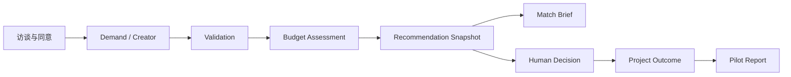

# 核心概念

## 三种范围

| 范围 | 负责内容 | 不负责内容 |
| --- | --- | --- |
| 礼宾服务 | 招募、访谈、核实、解释、协调、复盘 | 不以软件自动替代人类责任 |
| 本地 MVP 工具 | 匿名资料、确定性规则、快照、报告 | 不保存身份，不签约，不收付款，不发消息 |
| 目标平台 | 经验证后产品化的协作基础设施 | 不是当前已实现能力 |

## 参与角色

- **需求方**：拥有真实问题、预算和决策权的个人或组织；负责提供输入、确认范围和验收。
- **创作者**：借助专业能力和 AI 完成交付的个人或小团队；明确兴趣、证据、容量、边界和私密报酬底线。
- **发起人 / 运营者**：主持访谈、核实资料、运行工具、解释结果、协调项目并记录人工覆盖原因。
- **协作者**：由主创作者邀请参与特定里程碑的人；当前由外部协议管理。
- **社区维护者**：目标平台中的领域向导、评审员、调解员和规则委员；当前尚未建立。

## 核心业务对象

### Pilot（验证批次）

一组使用同一规则版本运行的真实项目。首轮批次以 5 个进入付费阶段的项目为单位。配置、词表和权重原则上在批次中冻结，批次结束后再复盘。

### Demand（需求）

经过结构化的真实问题，包括问题背景、目标用户、期望结果、范围、验收、技能、时间、预算、风险、AI 规则和协作偏好。只有决策权与资金承诺均确认，且没有 `BLOCKER`，才可进入预算检查。

### Creator（创作者）

匿名化的匹配档案，包括意愿、能力证据、可用性、协作偏好、报酬底线、边界、地域、利益冲突和 AI 工作方式。`status != active` 或资料不完整时不会进入候选排序。

### Recommendation（推荐快照）

每次运行 `match` 生成的只追加记录。它保存当时的需求、所有创作者资料、完整规则版本、预算结果、被过滤原因、分项得分和排序。后续资料修改不会重写历史。

### Decision（人工决定）

记录实际邀请名单、候选反馈、最终选择、标准原因和可选说明。人工可以不采用前三名，但不能恢复被硬过滤者；后者必须先修正输入并重新匹配。

### Outcome（项目结果）

记录签约、真实付款、里程碑、范围变更、争议、双方复用意愿、安全事件和运营耗时。完成、退出或失败都必须进入复盘，避免只观察成功案例。

## 一条完整证据链

这条链路的设计目的不是证明算法“正确”，而是让每个决定都能回答：当时输入是什么、使用了哪版规则、谁被什么条件排除、人工为何覆盖、最终发生了什么。

## 问题等级

- `BLOCKER`：必须修正，否则不能继续到下一阶段；
- `WARNING`：可以继续，但需要运营者关注；
- `QUESTION`：需要人工补充或确认，不自动阻断。

预算健康度另用 `GREEN / YELLOW / RED` 表示。`RED` 禁止匹配；`YELLOW` 默认禁止，只有书面理由和显式参数才能继续；`GREEN` 只代表预算假设通过，不代表项目必然合理。
