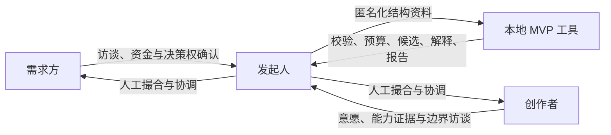

# 项目介绍

## 愿作要解决什么

大模型让个人和小团队能完成过去需要更大组织才能完成的知识工作，但生产能力提高并不自动带来体面的工作。高质量需求仍然分散，模糊需求把澄清成本转移给劳动者，公开竞价推动低价竞争，而简历和单一评分又很难表达一个人真正愿意投入的方向。

愿作关注的问题是：

> 如何让一个人持续找到“我愿意做、我有能力做好、对方确实需要、报酬足够体面”的机会，并能低风险地完成协作？

因此系统把四类信号放在同等重要的位置：真实且有资金承诺的需求、个人意愿、带证据的能力、合理报酬。匹配只是中间环节；需求澄清、协议、变更、验收、付款保障和复盘共同组成完整闭环。

## 核心原则

| 原则 | 在系统中的直接约束 |
| --- | --- |
| 真实需求优先 | 决策权、资金和验收方式未确认的需求不能进入匹配 |
| 意愿是一等信号 | 兴趣、边界、节奏和成长方向参与过滤与排序 |
| 不让劳动者互相压价 | 不公开竞标、不按最低报价排序、不要求无偿方案 |
| 双向选择 | 创作者可以拒绝；拒绝不降低其后续机会 |
| 解释优于黑箱 | 过滤、分项、规则版本和人工覆盖原因均可追溯 |
| 人类承担关键判断 | AI 和算法不能独立决定付款、处罚、争议或最终选择 |
| 最小化数据 | 匹配工具不保存联系人、合同、付款凭据或原始证据 |

## 现在是什么

当前交付是“人工服务 + 本地工具”，不是已上线平台。

已实现的软件能力包括：

- UTF-8 JSON 资料导入与身份字段拦截；
- 需求、创作者和项目结果的完整性校验；
- 版本化预算健康检查；
- 硬性边界过滤和确定性加权排序；
- 不泄露私密报酬底线的候选说明；
- 不可变推荐快照、实际邀请和人工决定留痕；
- 按批次生成漏斗、匹配、公平性、交付和人工耗时报告。

访谈、联系人管理、合同、支付、沟通、文件协作和争议处理仍由发起人使用经过选择的外部工具完成。

## 未来可能是什么

只有当真实批次证明某个重复瓶颈值得产品化时，系统才逐步演进为公开或半公开平台。目标设计包括需求工作台、意愿与能力档案、双向匹配、版本化合作协议、支付保障、项目空间、双向评价和社区治理。它们是设计方向，不是当前承诺。

## 明确不做什么

- 不做无限品类、即时抢单的零工市场；
- 不以粉丝、停留时长或广告作为核心增长机制；
- 不用机器学习黑箱替代可解释规则和人工判断；
- 不自建资金托管或在未经法律评估时处理资金；
- 不因 AI 提高效率而用工时定价惩罚高生产力；
- 不在首轮验证中提前建设账户、聊天、支付或社区系统。

下一步可阅读[核心概念](/guide/core-concepts.md)，或直接[运行演示](/guide/quick-start.md)。
