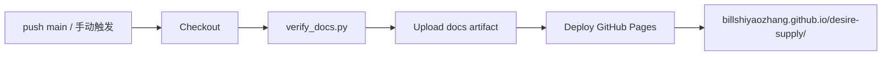

# GitHub Pages 发布

## 方案

本站参考 [ambient-agent 的 Pages 工作流](https://github.com/BillShiyaoZhang/ambient-agent/blob/main/.github/workflows/deploy-docs.yml)，采用 Docsify 纯静态站点：浏览器直接读取 `docs/*.md`，GitHub Actions 不需要 Node 构建，只校验后上传整个 `docs/` artifact。



相关文件：

- `.github/workflows/deploy-docs.yml`：Pages 权限、校验、上传与部署；
- `docs/index.html`：Docsify、搜索、Mermaid、主题切换；
- `docs/_sidebar.md` / `_navbar.md` / `_coverpage.md`：导航与封面；
- `scripts/verify_docs.py`：发布前质量门槛；
- `docs/.nojekyll`：明确不经过 Jekyll 处理。

## 首次启用

仓库管理员只需执行一次：

1. 打开 GitHub 仓库 `Settings → Pages`；
2. 在 `Build and deployment` 的 `Source` 选择 **GitHub Actions**；
3. 将配置提交到 `main`，或在 Actions 中手动运行 `Deploy Docsify site to Pages`；
4. 等待 `github-pages` environment 部署成功；
5. 访问 `https://billshiyaozhang.github.io/desire-supply/`。

如果组织策略要求 environment 审批，需要为 `github-pages` 配置允许的分支与审批者。workflow 使用 GitHub OIDC 和最小权限：`contents: read`、`pages: write`、`id-token: write`。

## 触发条件

workflow 在以下情况运行：

- `main` 分支的 `docs/**`、校验脚本或 workflow 自身发生变化；
- 在 Actions 页面手动触发 `workflow_dispatch`。

Pull request 不会直接发布。建议后续增加独立 CI，在 PR 上运行同一个文档校验。

## 本地验证

```bash
python3 scripts/verify_docs.py
python3 -m http.server 5174 --directory docs
```

打开 `http://localhost:5174`，至少检查封面、侧栏、搜索、Mermaid、移动宽度和明暗主题。CLI HTTP server 不会提供 Docsify 的文件监听，但足够验证静态部署形态。

## 为什么不用静态生成构建

当前文档以 Markdown 为主、规模较小，没有服务端搜索、国际化构建或组件编译需求。Docsify 使变更只需提交 Markdown，部署 artifact 就是源目录。代价是首次加载在浏览器渲染、依赖固定版本 CDN，且无法在构建阶段验证最终 DOM。

出现以下证据时再评估 VitePress/Docusaurus 等构建方案：需要版本化多语言、离线资产、复杂组件、SEO 预渲染，或 CDN/客户端渲染成为可测量问题。

## 常见故障

| 现象 | 检查 |
| --- | --- |
| workflow 无权限 | Pages Source 是否为 GitHub Actions；workflow 权限是否被组织覆盖 |
| 校验失败 | 输出会指出漏导航、断链、未闭合代码块或关键配置缺失 |
| 首页 404 | artifact 是否上传 `docs` 内容而不是把 `docs` 作为额外顶层目录 |
| 子页刷新异常 | Docsify 使用 hash 路由；链接应写 `/path/page.md` 并由 Docsify 接管 |
| 图表不显示 | Mermaid 围栏是否闭合；浏览器是否能访问固定版本 CDN |
| 样式或脚本被拦截 | 检查 CSP、网络和 jsDelivr；必要时把固定资产纳入仓库 |

部署不包含 `mvp/local-data` 或仓库其他目录，只有 `docs/` 会进入公开 artifact。任何真实项目资料都不得复制到文档目录。
